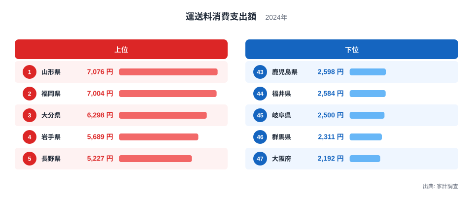
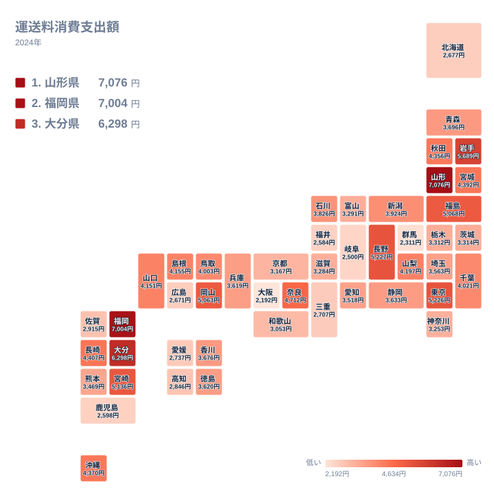

インターネット通販が生活に浸透するにつれて、家庭が支払う配送料も家計の一部として意識されるようになりました。この記事で扱う運送料消費支出額は、家計調査によって2024年に集計された値で、世帯が実際に配送業者へ支払った料金の年間支出額を都道府県別に示しています。

全国の値を並べると、最も高い山形県は7,076円、最も低い大阪府は2,192円となっており、上位と下位の間には3倍を超える開きがあります。この差は単なる通販利用の多寡だけでなく、地理条件と生活の習慣が積み重なって生まれています。

## 上位と下位の顔ぶれ

<source-link href="/ranking/delivery-fee-consumption-expenditure">運送料消費支出額ランキングをもっと見る</source-link>

上位を見ると、山形県が7,076円で1位、福岡県が7,004円で2位、大分県が6,298円で3位、岩手県が5,689円で4位、長野県が5,227円で5位と続きます。東北と九州、そして内陸の山間部にまたがる顔ぶれです。

山形県や岩手県、長野県は、店舗までの移動に時間がかかる地域を抱えています。日用品や衣料品を近隣店舗で手に入れにくい地域では、通信販売の利用が生活の選択肢として定着しやすくなります。福岡県と大分県は九州の中でも人口の多い県ですが、離れて暮らす家族との間で農産物や特産品を送り合う贈答文化が根強く残っている地域でもあります。

下位に目を移すと、大阪府が2,192円で47位、群馬県が2,311円で46位、岐阜県が2,500円で45位、福井県が2,584円で44位、鹿児島県が2,598円で43位となっています。大阪府は都市部の店舗密度が高く、生活圏の中で買い物が完結しやすい環境が整っています。群馬県や岐阜県、福井県は北陸から中部にかけての内陸県で、こちらは店舗までの距離だけでは説明がつかない別の要因が働いていると考えられます。

## 地理で見る分布

タイルマップで見渡すと、運送料の支出が高い地域は東北から関東の一部、そして九州の一部に集まっており、低い地域は近畿と北陸に偏りが見られます。単純に都市部と地方部で二分されるわけではなく、地域ごとの生活文化の違いが色濃く表れています。

この地図で注目したいのは、上位の県が一つの地方にまとまっていないことです。東北の山形県と九州の福岡県が並んで上位に入り、その間の関東・中部にはさまざまな水準の県が混在しています。距離の遠さだけが支出額を決めているなら、地方の県が一様に濃く染まるはずですが、実際にはそうなっていません。

もう一つ見えるのは、低い県の並び方です。近畿と北陸に低い県が集まる一方で、同じ地方の中でも県によって濃淡が分かれます。県境をまたいだ広い地域の傾向というより、県ごとの事情が数字を決めていることがうかがえます。

> [!NOTE]
> この指標は、世帯が宅配便などの運送業者へ実際に支払った配送料としての支出額であり、通販で購入した商品そのものの代金は含まれません。送料無料と表示される商品を購入した場合、その送料分は商品代金に含まれているため、この運送料支出額には計上されない点に注意してください。

## 通信販売の普及と地域の生活習慣

運送料の支出額を左右する最大の要因は、通信販売をどれだけ生活の中心に置いているかという点です。近隣に大型商業施設が少ない地域では、日用品から衣料品まで幅広い商品を通販に頼らざるを得ず、その結果として配送料の支出が積み重なっていきます。山形県や岩手県のような地方部で支出額が高い背景には、この店舗までの距離の問題があります。

もうひとつの大きな要因が、贈答文化の強さです。お中元やお歳暮、あるいは実家からの荷物のやり取りといった習慣は、地域によって濃淡があります。東北地方や九州の一部では、離れて暮らす家族への荷物の発送が生活の一部として定着しており、これが運送料の支出を押し上げています。

反対に、都市部では店舗までの距離が短く、日常の買い物を通販に頼る必要性が相対的に低くなります。また、都市部に住む人ほど親族が近くに住んでいる割合が高く、荷物を送るよりも直接会って渡す機会が多いことも、支出額を抑える方向に働いていると考えられます。

福井県や岐阜県のように、地方部でありながら支出額が低い県も見られます。こうした県では、持ち家率の高さや多世代同居の慣行によって、家族間で荷物を送り合う必要性そのものが少なくなっている可能性があります。近くに暮らす家族の間では、通販で購入した荷物を配送するよりも、直接受け渡す方が自然な選択になるためです。

> [!WARNING]
> この支出額は世帯単位の平均値であり、実際の通販利用頻度を直接示すものではありません。同じ通販利用頻度であっても、送料無料の商品を選ぶ世帯が多い地域では支出額が低く出ますし、まとめ買いによって配送回数を減らす工夫をしている世帯が多い地域でも数値は低くなります。単純に「通販をよく使う県」と読み替えることは避けてください。

## この指標を読み解くときの視点

運送料消費支出額は、通信販売の利用頻度だけでなく、贈答文化の強さや店舗までの距離、そして家族が近くに住んでいるかどうかという生活基盤全体を映し出す指標です。数字の高低だけを見るのではなく、その地域がどのような生活の仕組みを持っているかをあわせて考えることで、より深い理解につながります。

家計の中で通販や贈答にかかる費用を全体として捉えるには、関連する消費支出の指標もあわせて見ると理解が広がります。[同じカテゴリの統計一覧](/category/economy)から、他の家計消費の指標も確認してみてください。

> [!TIP]
> この指標を読むときは、贈答品としてよく利用される食品の消費支出額や、店舗までの距離に関わる商業施設の立地状況とあわせて見ると、なぜその地域で運送料の支出が高くなるのかがより具体的に見えてきます。

運送料支出額が1位の山形県と2位の福岡県は、地方と九州の中心という異なる性格を持ちながら、どちらも荷物を送り合う習慣が支出を押し上げています。[山形県のデータ](/areas/06000)と[福岡県のデータ](/areas/40000)で、それぞれの世帯構成と産業の姿を確認できます。

## データ出典

出典: 家計調査(2024年)
