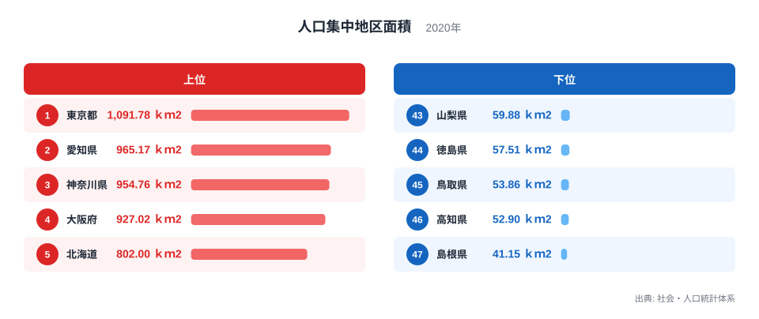
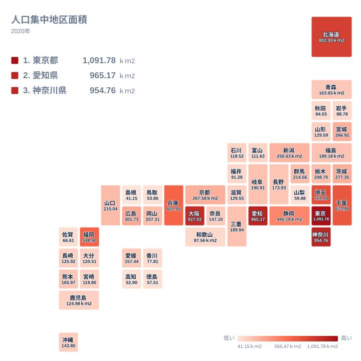

## 人口集中地区面積とは何か

人口集中地区は、国勢調査で人口密度がおおむね1平方キロメートルあたり4000人以上の調査区が互いに隣接し合い、合計の人口が5000人以上になる地域を指します。都道府県ごとにこの人口集中地区がどれだけの広さを持つかを集計した数値が、人口集中地区面積というランキングです。都道府県の総面積そのものとは異なり、都市的な土地利用がどれだけ広がっているかを表す指標です。

このランキングを都道府県別に見ていくと、上位には大都市を抱える都府県が並びます。一方で、意外な顔ぶれも見えてきます。特に注目したいのは、人口密度の高さではあまり語られない北海道が、人口集中地区面積では全国でも上位に入っている点です。この記事では、2020年の社会・人口統計体系のデータをもとに、人口集中地区面積の上位と下位がどのような地理的・産業的な背景から生まれているのかを見ていきます。

## 人口集中地区面積の上位と下位

人口集中地区面積の全国1位は東京都で、1,091.78平方キロメートルです。2位は愛知県で965.17平方キロメートル、3位は神奈川県で954.76平方キロメートルとなっています。4位の大阪府は927.02平方キロメートル、6位の埼玉県は717.04平方キロメートル、7位の千葉県は673.94平方キロメートルと続いており、東京を中心とした首都圏の各県が上位グループを占めていることが分かります。

一方で、5位には北海道が入ります。北海道の人口集中地区面積は802平方キロメートルで、大阪府に次ぐ広さです。それでも人口集中地区面積で上位に入るのは、札幌市を中心とする都市部に人口が極めて集中しており、その都市的な地域の広がり自体が大きいためです。北海道全体が人口密集地というわけではなく、都市部と郊外・農村部の差が非常に大きい構造が、この数字に表れています。

下位を見ると、47位は島根県で41.15平方キロメートル、46位は高知県で52.9平方キロメートル、45位は鳥取県で53.86平方キロメートル、44位は徳島県で57.51平方キロメートル、43位は山梨県で59.88平方キロメートルとなっています。これらの県は総人口自体が少なく、人口密度4000人以上という基準を満たす市街地がもともと限られているため、人口集中地区の面積も小さくとどまっています。

<source-link href="/ranking/densely-populated-area">人口集中地区面積ランキングをもっと見る</source-link>

> [!NOTE]
> 人口集中地区(DID)は、人口密度がおおむね1平方キロメートルあたり4000人以上の基本単位区が隣接し合い、合計人口が5000人以上になる地域として国勢調査で設定されます。この指標は都道府県の総面積でも総人口でもなく、都市的な土地利用の広がりそのものを面積で表している点に注意してください。

## なぜ北海道が上位に入るのか

北海道が人口集中地区面積で全国5位に入る背景には、道内の人口分布の偏りがあります。北海道は可住地の多くが農業や酪農、林業に利用されており、居住地は札幌市とその周辺、旭川市、函館市などの都市部に集中しています。特に札幌市は人口が集中する大都市で、その市街地の広がりが北海道全体の人口集中地区面積を押し上げる主要な要因になっています。北海道全体が人口密集地であるわけではなく、都市部への一極集中が数字に表れている点は、この指標を読むうえで欠かせない視点です。

同じ構造は大阪府や愛知県にも当てはまります。愛知県は名古屋市を中心とした中京圏を形成しており、神奈川県は横浜市・川崎市を含む京浜工業地帯の一角を担っています。これらの都府県はいずれも大都市圏の中核として発展してきた歴史を持ち、鉄道網や高速道路の整備とともに市街地が周辺自治体へと連続的に広がってきました。人口集中地区面積の上位県は、単に人口が多いだけでなく、都市機能が面的に拡大してきた地域といえます。

千葉県や埼玉県が上位に入っているのも、東京都心への通勤圏として住宅地が広範囲に開発されてきた経緯によるものです。首都圏では都心の地価上昇にともなって郊外へ住宅開発が進み、県境を越えて連続した市街地が形成されました。この結果、東京都だけでなく周辺の県でも人口集中地区面積が広くなっています。北海道が単独の都市への集中で上位に入ったのに対し、首都圏は複数の都県にまたがる連続的な広がりで上位に入っている点が対照的です。

## 人口集中地区面積が小さい県の共通点

タイルマップで都道府県別の人口集中地区面積を見ると、首都圏・中京圏・近畿圏・北海道の主要都市部が濃い色で示され、四国や山陰地方は薄い色にとどまっていることが視覚的に確認できます。

下位に位置する島根県、高知県、鳥取県、徳島県、山梨県には、いくつかの共通点があります。まず、いずれも県全体の総人口が少なく、人口密度4000人以上という人口集中地区の基準を満たす市街地が限られていることです。県庁所在地の場合でも中心市街地の規模が大都市圏ほど大きくなく、周辺部への市街地の連続的な広がりも起きにくい地理条件にあります。

また、これらの県は山地や中山間地域の割合が高く、可住地そのものが狭いという地形的な制約も抱えています。鳥取県や島根県は中国山地に、高知県や徳島県は四国山地に多くの面積を占められており、平野部に人口が集中しやすい一方でその平野部自体の面積が小さいため、人口集中地区として認定される範囲も限定的になります。山梨県は県土の大半を山地が占め、市街地が甲府盆地にほぼ限られるため、平野部の面積そのものが人口集中地区の広がりを制約していると考えられます。

> [!WARNING]
> 北海道の人口集中地区面積の順位は、道内の都市部(札幌市など)に人口が偏って集中していることに由来します。北海道全体が人口密集地というわけではなく、道内の大部分は人口密度が低い地域です。面積の順位だけを見て都道府県全体の過密度を判断すると、実態と異なる理解になるため、注意してください。

## 地理的分布から見える特徴

人口集中地区面積のランキングを地図で見渡すと、太平洋ベルトと呼ばれる東京から大阪にかけての帯状の地域に上位県が集中していることが分かります。東京都、神奈川県、大阪府、愛知県、埼玉県、千葉県、兵庫県、福岡県といった上位の顔ぶれは、いずれも高度経済成長期以降に工業化と都市化が進んだ地域と重なっています。静岡県が10位に入っているのも、東海道沿いに市街地が連続して発達してきた歴史を反映しています。

一方で、北海道のように単独の都市への人口集中が上位入りの理由になっている県もあれば、首都圏のように複数の都府県にまたがって連続的に市街地が広がっている地域もあります。同じ上位グループでも、人口集中地区が広がってきた経緯は一様ではなく、産業構造や交通網の発達の仕方によって形が異なっている点は、地図で確認する価値があります。

このような分布は、[同じカテゴリの統計一覧](/category/population)にある他の人口関連の指標と合わせて見ると、より立体的に理解できます。例えば[東京都のデータ](/areas/13000)や[愛知県のデータ](/areas/23000)を確認すると、人口集中地区面積の広さが人口そのものの多さや都市機能の集積とどのように結びついているかを具体的に知ることができます。

> [!TIP]
> 人口集中地区面積は、都道府県の総面積そのものとは別の指標です。面積の広い北海道が上位に入る一方で、面積の小さい県が必ず下位に集まるとは限りません。他の人口関連の指標と合わせて読むことで、その県の都市化の進み方をより立体的に把握できます。

## まとめ

- 人口集中地区面積の全国1位は東京都で、1,091.78平方キロメートルです。
- 2位は愛知県で965.17平方キロメートル、3位は神奈川県で954.76平方キロメートルとなっています。
- 5位には北海道が入り、面積は802平方キロメートルです。単独の都市部への人口集中が理由です。
- 最下位の47位は島根県で41.15平方キロメートルです。46位の高知県、45位の鳥取県、44位の徳島県、43位の山梨県も、総人口が少なく可住地が限られる地形的な条件を共有しています。
- 上位県の多くは、太平洋ベルトに沿った工業化・都市化の歴史や、首都圏における通勤圏の拡大といった産業構造・交通網の発達を背景に持っています。

## データ出典

社会・人口統計体系(2020年)のデータをもとに作成しています。
