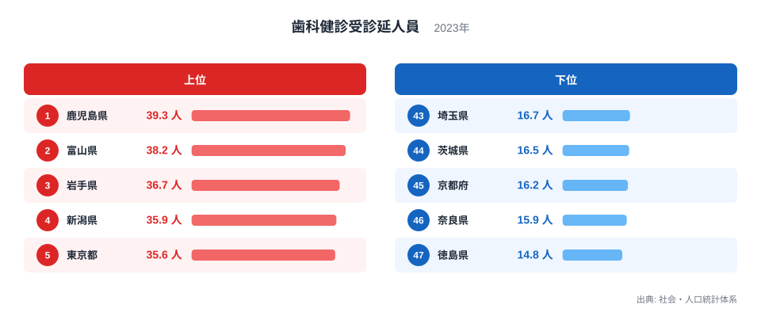
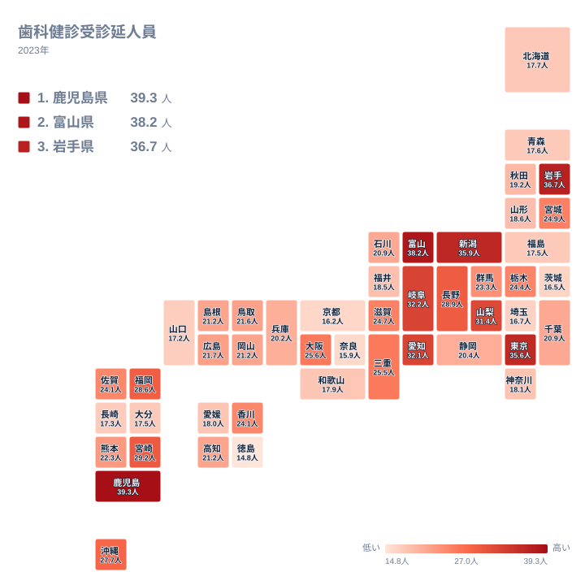

歯科健診は、虫歯や歯周病を早期に見つけて重症化を防ぐための取り組みで、自治体や学校、勤務先といった組織が実施主体となって行われます。この記事で扱う歯科健診受診延人員は、社会・人口統計体系によって2023年に集計された値で、人口千人当たりの受診人数として都道府県別に示されています。

全国の値を並べると、最も多い鹿児島県は39.3人、最も少ない徳島県は14.8人となっており、上位と下位の間には2.7倍近い開きがあります。この差は個人の健康意識の高低だけで説明できるものではなく、健診を受けられる機会そのものがどれだけ整えられているかという体制の違いを反映しています。

## 上位と下位の顔ぶれ

<source-link href="/ranking/dental-checkup-persons-per-1000">歯科健診受診延人員ランキングをもっと見る</source-link>

上位を見ると、鹿児島県が39.3人で1位、富山県が38.2人で2位、岩手県が36.7人で3位、新潟県が35.9人で4位、東京都が35.6人で5位と続きます。九州の南端から北陸、東北、そして首都圏まで、地理的にはばらけた顔ぶれです。

これらの県に共通するのは、自治体や職域による健診事業への取り組みの積極さです。富山県や新潟県は、県主導の健康づくり施策を長年にわたって展開してきた地域として知られています。東京都は歯科診療所の数そのものが全国でも多く、職場や地域での健診機会にアクセスしやすい環境が整っています。

下位に目を移すと、徳島県が14.8人で47位、奈良県が15.9人で46位、京都府が16.2人で45位、茨城県が16.5人で44位、埼玉県が16.7人で43位となっています。奈良県と京都府、埼玉県は、いずれも近隣の大都市への通勤者が多い地域という共通点があります。

## 地理で見る分布

タイルマップで見渡すと、受診率が高い地域は九州南部と北陸、東北にまたがり、低い地域は近畿と関東の一部に集まっています。単純な都市部と地方部の対比ではなく、健診事業をどれだけ地域内で完結させているかという構造の違いが表れています。

鹿児島県や岩手県のような受診率の高い地域では、市町村が主体となった集団健診の取り組みが根付いています。人口規模が大きすぎない自治体では、住民一人ひとりに健診の案内を届けやすく、地域ぐるみで受診を促す仕組みが機能しやすいという事情があります。

一方、奈良県や埼玉県のように大都市への通勤者が多い地域では、住民が居住地ではなく勤務先の近くで医療サービスを受ける傾向が強く、居住地の自治体が実施する健診の受診率としては低く出やすくなります。京都府についても、大阪府という巨大な雇用圏に隣接しているため、同じような構造が影響していると考えられます。

> [!NOTE]
> この指標は、自治体や学校、職域が実施する健診事業を通じて受診した人数を集計したものです。個人が自費で歯科医院を受診して検診や治療を受けた場合は、この数値には含まれません。

## 受診機会の提供体制という視点

歯科健診受診延人員の地域差を生む最も大きな要因は、健診を受けられる機会がどれだけ用意されているかという提供体制の違いです。市町村が主体となって集団健診を積極的に実施している地域では、住民が受診の案内を受け取る機会そのものが多くなります。鹿児島県や富山県のような受診率の高い県では、こうした自治体主導の取り組みが長年にわたって積み重ねられてきました。

歯科診療所の地域内での密度も影響します。診療所が身近にあるほど、健診を受けるための移動の負担が小さくなり、受診のハードルが下がります。東京都のように診療所の数が多い都市部では、この点が受診率を押し上げる要因になっていると考えられます。

年齢構成の違いも見逃せません。学校での健診対象となる子どもの人口比率が高い地域では、学校健診による受診者数が積み上がりやすくなります。逆に、高齢化が進んで子どもの人口比率が低い地域では、この学校健診による底上げの効果が相対的に小さくなります。

さらに、居住地と勤務地の関係も重要な要素です。大都市圏の周辺に位置し、多くの住民が都心部へ通勤している地域では、健診を含む医療サービスを勤務先の近くで受ける人が多くなります。この場合、居住地の自治体が実施する健診の受診率としては数字に表れにくく、実際の受診機会とは別の要因で数値が下がることになります。

> [!WARNING]
> この受診率は、自治体が実施する健診事業への参加人数を反映したものであり、個人の歯の健康状態そのものを直接示すものではありません。受診率が低い地域であっても、勤務先の健診や自費での歯科受診を通じて歯の健康管理を行っている住民が多く存在する可能性があります。受診率の高低だけで、その地域の歯科医療へのアクセスや健康意識を単純に評価することは避けてください。

## この指標を読み解くときの視点

歯科健診受診延人員は、住民の健康意識だけでなく、自治体がどれだけ積極的に健診事業を展開しているか、そして歯科診療所がどれだけ身近にあるかという地域の医療提供体制を映し出す指標です。数字の高低を見る際は、こうした背景をあわせて考えることが欠かせません。

社会保障や医療に関する他の指標とあわせて見ることで、地域ごとの健康づくりの取り組みがより立体的に見えてきます。[同じカテゴリの統計一覧](/category/socialsecurity)から関連する指標もご確認ください。

> [!TIP]
> この指標を読むときは、歯科診療所の人口当たりの数や、地域の年齢構成とあわせて見ると、なぜその県で受診率が高いのか低いのかの背景がより具体的につかめます。通勤圏の広さも受診率に影響するため、隣接する都市圏との関係も意識してみてください。

受診率が最も高い鹿児島県と、2位の富山県を見比べると、市町村主導の健診事業への取り組みという共通点が浮かび上がります。[鹿児島県のデータ](/areas/46000)と[富山県のデータ](/areas/16000)もあわせてご覧ください。

## データ出典

出典: 社会・人口統計体系(2023年)
