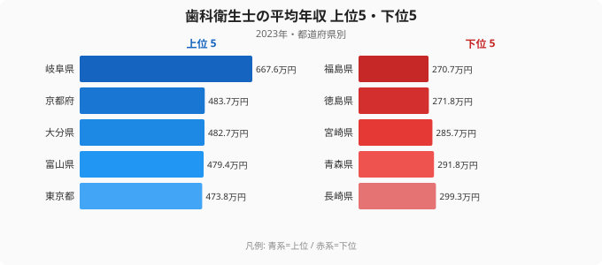
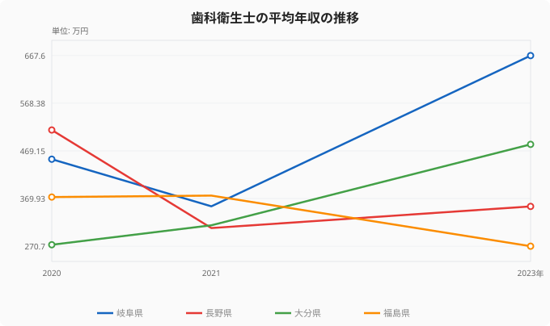

「歯科衛生士は国家資格だから、どこで働いても給料は同じ」——そう思っている方は少なくないかもしれません。ところが2023年の賃金構造基本統計調査で都道府県別の平均年収を並べてみると、1位の岐阜県は667.6万円、最下位の福島県は270.7万円。同じ資格でありながら、その差は**約2.5倍（2.47倍）**にまで開いていました。

歯科衛生士は女性比率が9割を超える職種で、結婚・出産を経た復職や、ライフステージに合わせた職場の選び直しが多いのも特徴です。だからこそ「どの県で働くと年収が高いのか」「その差は何で決まるのか」は、転職や復職を考えるときに無視できない論点になります。

この記事では、47都道府県（データのある44県）の平均年収を上位・下位で対比し、なぜ岐阜県が突出するのか、そしてこのランキングを読むときに**絶対に外せない注意点**——年ごとの数字の揺れ——まで踏み込んで解説します。

## 上位5と下位5──岐阜県だけが頭ひとつ抜けている

まず2023年の上位5県と下位5県を見てみましょう。

1位の[岐阜県](/areas/21000)（667.6万円）は2位の京都府（483.7万円）を**183万円以上**引き離しており、ランキングの中でただ一県だけ突出しています。3位は大分県（482.7万円）、4位は富山県（479.4万円）、5位は東京都（473.8万円）と続き、上位は京都・東京・愛知（6位471.3万円）といった大都市圏と、富山・大分のような地方県が混在しているのが特徴です。

一方で下位は[福島県](/areas/07000)（270.7万円）を最下位に、徳島県（271.8万円）、宮崎県（285.7万円）、青森県（291.8万円）、長崎県（299.3万円）と、300万円を下回る県が並びます。最下位の福島県は1位の岐阜県の**4割ほど**の水準にとどまり、全国平均（約384万円）と比べても100万円以上低い計算です。

> [!NOTE]
> ここでの「年収」は、賃金構造基本統計調査の「きまって支給する現金給与額×12＋年間賞与その他特別給与額」で算出した推計値です。常勤フルタイムを前提とした金額で、パート・非常勤の時給ベースの働き方はそのまま反映されません。歯科衛生士は短時間勤務の比率が高い職種のため、「実際に手取りでいくらか」は勤務形態によって大きく変わる点に注意してください。

<source-link href="/ranking/dental-hygienist-annual-income">歯科衛生士の平均年収ランキング（47都道府県）をもっと見る</source-link>

「都市部だから高い」という単純な構図では説明できないのがこのランキングの面白いところです。東京都は5位と上位ですが、最大の都市圏を抱える大阪府は10位（434.9万円）、神奈川県は15位（408.0万円）で、必ずしも大都市が上位を独占しているわけではありません。むしろ岐阜・富山・大分といった、歯科医院の経営や人材確保の事情が地域ごとに異なる県が上位に食い込んでいます。

## なぜ下位グループは300万円を割るのか

下位グループに共通するのは、**歯科医院の規模が小さく、求人の母数が限られる**地域だという点です。福島・徳島・宮崎・青森・長崎はいずれも、都市部に大規模な歯科クリニックや法人経営の医院が少なく、個人経営の小規模な歯科医院が中心になりがちな地域です。小規模医院では役職手当や賞与の原資が限られ、勤続を重ねても年収が伸びにくい構造があります。

加えて、これらの県では歯科衛生士の求人そのものが少ないため、求職者側に「条件を選んで交渉する」余地が生まれにくいことも、平均年収を押し下げる要因になります。同じ国家資格でも、需要と供給のバランスが地域でまったく違うのです。

> [!TIP]
> 年収の絶対額だけでなく、その県の家賃・物価とあわせて見ると印象が変わることがあります。下位県は年収が低い一方で生活コストも低い傾向があり、可処分所得で見ると差が縮まるケースもあります。転職を検討する際は「額面年収」と「手元に残るお金」を分けて考えるのがおすすめです。

## このランキングの最大の落とし穴──数字は年ごとに大きく揺れる

ここがこの記事でいちばん伝えたい点です。歯科衛生士の平均年収は、**同じ県でも年によって驚くほど大きく動きます**。

2023年に1位だった岐阜県は、2020年は451.8万円、2021年には353.7万円まで下がり、2023年に一気に667.6万円へ跳ね上がっています。逆に2020年に512.7万円で全国トップ級だった長野県は、2021年に308.5万円まで急落し、2023年も353.6万円にとどまりました。大分県も2020年は273.7万円と下位だったのが、2023年には482.7万円で3位へと様変わりしています。

> [!WARNING]
> なぜこれほど揺れるのか。賃金構造基本統計調査は、各県で抽出された一部の事業所・労働者を集計した**標本調査**です。歯科衛生士のように1県あたりの調査対象者が少ない職種では、たまたまその年に高給の常勤者が多くサンプルに入れば平均が跳ね上がり、逆もまた起こります。つまり**単年のランキング1位は「その県が構造的に高い」とは限らない**のです。「岐阜が最強」と決めつけず、複数年の傾向で読むのが正しい使い方です。

この揺れは下位県でも同じで、福島県は2020年・2021年は370万円台だったのが2023年に270.7万円へと落ち込み、最下位になっています。1〜2年の数字だけで「この県は稼げない／稼げる」と判断するのは危険だということが、この推移からはっきり読み取れます。

## 同じ「歯科」でも歯科医師の年収とは別物

歯科衛生士の年収を考えるとき、しばしば歯科医師の年収と混同されがちですが、両者はまったく別の水準・別の性質を持つ数字です。

> [!NOTE]
> 同じ賃金構造基本統計調査でも、[歯科医師（開業医・勤務医）の平均年収](/blog/dentist-income-prefecture-gap)は歯科衛生士の2〜3倍以上になる県が多く、しかも歯科医師はデータのある県が29県にとどまるなど、サンプルの偏りがさらに大きくなります。歯科衛生士のキャリアを年収面で考えるなら、歯科医師の数字を参照点にするのではなく、**歯科衛生士同士の地域差・勤続年数・勤務形態**で比較するのが現実的です。

歯科衛生士の年収を上げる現実的な道筋は、「年収の高い県へ移る」ことよりも、**法人経営の大規模医院や、賞与・昇給制度が整った職場を選ぶこと**にあります。ランキングの上位県でも小規模医院に勤めれば平均を下回りますし、下位県でも好条件の職場は存在します。地域差はあくまで「平均の話」であって、個々の職場選びがそれ以上に効いてくる、というのがデータの示す結論です。

## まとめ

- **1位は岐阜県（667.6万円）**で、2位の京都府（483.7万円）を183万円以上引き離し、ただ一県だけ突出しています。
- **最下位は福島県（270.7万円）**。徳島・宮崎・青森・長崎とともに300万円を下回り、上位との差は**約2.5倍（2.47倍）**に達します。
- 上位は大都市圏と地方県が混在し、「都市部だから高い」という単純な構図では説明できません。
- 下位県は**小規模な個人経営医院が中心で求人も少ない**ことが、平均年収を押し下げる要因と考えられます。
- 最大の注意点は**年ごとの揺れ**。標本調査ゆえに単年の順位は変動が大きく、複数年の傾向で読むべき指標です。

歯科衛生士として「どこで働くか」を年収で考えるなら、ランキングの順位だけを鵜呑みにせず、複数年の傾向と、何より**個々の職場の規模・待遇**を確かめることが、後悔しない職場選びの近道になります。同じ医療・福祉系の職種でどう年収差が出るかは、[社会保障・福祉カテゴリのランキング一覧](/category/socialsecurity)からまとめて比較できます。

## データ出典

厚生労働省「賃金構造基本統計調査」（2023年）をもとに、e-Stat（政府統計の総合窓口）経由で整備したデータを使用しています。年収は「きまって支給する現金給与額×12＋年間賞与その他特別給与額」で算出した推計値で、常勤フルタイムを前提としています。データのある44都道府県を集計対象とし、調査対象者数が少ない年・県は数値の変動が大きい点にご留意ください。
