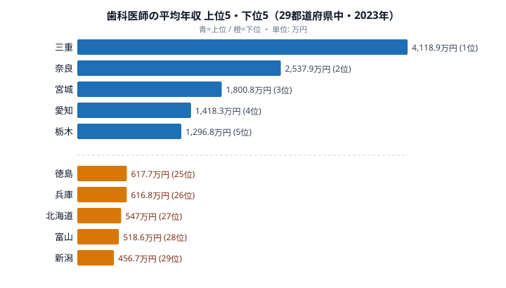

「歯科医師は高収入」というイメージは根強いものです。けれども同じ国家資格を持っていても、開業しているか勤務医か、そして「どの県で働くか」によって、手にする金額は驚くほど変わります。

賃金構造基本統計調査の2023年データ（きまって支給する現金給与額×12＋年間賞与で算出した平均年収）を見ると、最も高い[三重県](/areas/24000)は4118.9万円でした。一方で最も低い[新潟県](/areas/15000)は456.7万円にとどまり、その差はおよそ**9倍**にもなります。年収の桁が一つ違うと言ってもいい開きです。

ただし、**この9倍という数字は2023年に値が判明した29都道府県のみのデータに基づいています（47都道府県の約62%）**。標本調査の性質上、回答した事業所の構成によって県平均が大きく振れることがあります。この9倍差を読むときは、このサンプル限定という前提を常に意識することが重要です。

「同じ歯科医師の資格なのに、なぜここまで差がつくのか」──この記事では、上位と下位の顔ぶれ、そして9倍という極端な格差が生まれる構造を、29県のサンプルデータに即して読み解いていきます。先に結論の芯だけ言えば、この9倍は「三重の歯科医が新潟の9倍稼げる」話ではなく、サンプルの偏りを多分に含んだ数字だ、という点が読みどころです。

## 歯科医師の平均年収 上位・下位（29都道府県・2023年）

2023年データで判明している29都道府県のうち、上位5県と下位5県は次のとおりです。

目を引くのは、1位の三重県4118.9万円が突出していることです。2位の奈良県2537.9万円ですら三重県の6割ほどで、3位の宮城県1800.8万円になると半分以下まで落ちます。トップ層の内部ですら、すでに大きな段差ができているのです。

地域に明確なパターンは見えにくいのも特徴です。三大都市圏の愛知県（4位）・神奈川県（6位）・大阪府（10位）が上位に入る一方で、栃木県（5位）・山口県（7位）・[鳥取県](/areas/31000)（9位）といった地方県も混在しています。「都市部だから高い」という単純な話ではありません。むしろ突出した三重・奈良・宮城という顔ぶれは、都市規模とも医療需要とも結びつきにくく、サンプルの中身を見ないと説明がつかない並びになっています。

> [!NOTE]
> ここでの「平均年収」は、賃金構造基本統計調査（厚生労働省）の「きまって支給する現金給与額×12＋年間賞与」で算出した推計値です。開業医（経営者）の所得ではなく、調査対象となった事業所に勤める歯科医師の給与をベースにした数値である点に注意してください。経営者として得る診療所の利益はこの数字には含まれていません。

<source-link href="/ranking/dentist-annual-income">歯科医師の平均年収ランキングをもっと見る</source-link>

## 下位グループ：500万〜600万円台に固まる5県

上のチャート下段に示した下位5県は、徳島（25位・617.7万円）・兵庫（26位・616.8万円）・北海道（27位・547.0万円）・富山（28位・518.6万円）・新潟（29位・456.7万円）です。

最下位は新潟県の456.7万円でした。1位の三重県とは約9倍、金額にして3600万円以上の差があります。注目すべきは、この下位グループに兵庫県（26位）や北海道（27位）といった人口の多い地域も含まれている点です。ここでも「都市規模＝高収入」という図式は成り立っていません。下位5県の年収は456万〜618万円の狭い帯に収まっており、トップ層が桁違いに散らばっているのとは対照的に、足元はむしろ団子状態だと言えます。

この団子状態は、何を意味しているのでしょうか。500万〜600万円台という水準は、一般的な勤務歯科医師としては自然なレンジです。つまり下位の県は「普通に勤務医の給与が出ている県」であり、異常なのはむしろ4000万円超という上位の値のほうだ、という見方ができます。格差を語るとき、私たちはつい下位が低すぎると考えがちですが、このデータでは上位が高すぎる構図のほうが実態に近いのです。

> [!WARNING]
> この調査は事業所を抽出する標本調査のため、年によって回答する事業所が入れ替わります。2023年に値が判明したのは29都道府県で、47県すべてが揃っているわけではありません。標本数が少ない県では、勤務医か院長クラスかといった回答者の構成によって平均値が大きく振れます。順位はこうした「サンプルの偏り」を含んだものとして読む必要があります。ある県が翌年に圏外へ消えたり、数値が倍近く動いたりすることも珍しくありません。

<source-link href="/ranking/dentist-annual-income">歯科医師の平均年収ランキングをもっと見る</source-link>

## なぜ9倍もの差が生まれるのか

歯科医師の年収がここまでばらつく背景には、いくつかの構造的な要因が考えられます。

**[仮説] 第一に、調査対象の少なさによる年次変動です。** 上で触れたとおり、この指標は標本調査で各県の対象事業所数が限られます。過去の年次を見ても、同じ県の数値が年によって大きく上下しています（過去年では数百万円台から1000万円超まで揺れる県もあります）。三重県の4118.9万円という突出値も、院長クラスの高給与者がたまたま標本に多く入った年だった可能性は否定できません。**検証するには**、複数年の平均や中央値で比較する、対象事業所数を確認する、といった追加分析が必要です。

**[仮説] 第二に、勤務形態の違いです。** この数値はあくまで「勤務歯科医師の給与」がベースになっています。開業して経営者となった歯科医師の所得は別の統計に表れるため、各県で「勤務医として高給を得ているか」「若手・パート的な勤務が多いか」によって平均が動きます。下位に並ぶ500万円前後の県は、若手勤務医や非常勤の比率が相対的に高い可能性があります。

**[暫定結論] 2つの仮説のうち、現時点ではサンプルバイアス（第一仮説）のほうがより有力でしょう。** 三重県の4118.9万円という突出値は29県中の最高値であり、同県の過去年次でも数値が大きく変動してきた経緯があります。構造的な格差（第二仮説）が完全に否定されるわけではありませんが、「院長クラスの高給与者が標本に多く入った年」という可能性を先に排除できません。格差の実態を確認するには、複数年のデータと対象事業所数の確認が必要です。

いずれにせよ、9倍という数字を「三重県の歯科医は新潟県の9倍稼げる」と短絡的に読むのは危ういです。これは「2023年に判明した29県中の勤務医の平均給与」の差であって、開業を含めた歯科医師全体の生涯収入を表すものではありません。

> [!TIP]
> 「資格そのもの」より「どこで・どう働くか」で収入が決まる傾向は、医療系の専門職に共通して見られます。医師・薬剤師・看護師など他職種の地域差と並べて見ると、歯科医師の格差の特異さがより立体的に見えてきます。一つの県の一年分の数字に飛びつくのではなく、複数年・複数職種で並べて読むのが、この種の賃金データを誤読しないコツです。

## まとめ

- 2023年の歯科医師の平均年収は、1位が三重県の4118.9万円でした。
- 最下位は新潟県の456.7万円で、トップとの差は約9倍にもなります。
- 上位は三大都市圏（愛知・神奈川・大阪）と地方県（栃木・山口・鳥取）が混在し、「都市部だから高い」という単純な傾向は見られません。
- 下位グループは兵庫・北海道など人口の多い地域も含み、年収は500万円〜600万円台に集中しています。
- ただしこの指標は標本数の少ない調査で、2023年に判明したのは29都道府県のみです。順位はサンプルの偏りを含むものとして慎重に読む必要があります。

## データ出典

- 厚生労働省「賃金構造基本統計調査」（2023年）。きまって支給する現金給与額×12＋年間賞与から平均年収を算出。e-Stat 経由で整備（統計表ID: 0003445758）。
