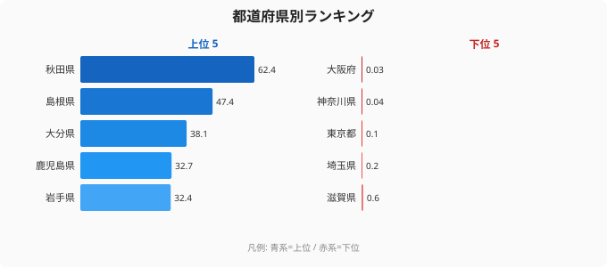

## 評価サマリ
前回blockerのチャート未生成が解消済み。`data/depopulation-medical-prefecture-rankings.svg`が配置されており、本文の「」が実体化している。`<!-- chart: ランキング図は別途 generate-article-charts で -->` コメントも消えた。前回majorのsource-link皆無も解消：`<source-link href="/category/socialsecurity">社会保障・医療の都道府県ランキング一覧</source-link>`が上位ランキングセクション内の図直下に配置されている。前回minorのデータ出典二重も解消：`## データ出典` + `<data-source>` タグの1セットのみで「本記事のデータはe-Stat…」の重複テキストは消えた。数値検証：秋田814/1304=62.4%（記述と一致）・島根467/986=47.4%（一致）。callout 2個（NOTE・WARNING）は指標の限界を正確に説明しており誠実な構成。内部リンクは /areas/05000・/category/socialsecurity・/gis-cross/depopulation-medical×2の4件。前回指摘全点が解消された。

## 指摘
- [minor] source-linkが`/category/socialsecurity`（カテゴリ一覧）への誘導のみで、過疎地域立地割合そのもののランキングページ（存在する場合）への直接リンクではない。専用ランキングページが存在しなければ現状のカテゴリ誘導で許容範囲。

## 判定理由
blocker（チャート未生成）・major（source-link皆無）・minor（出典二重）の全3点が解消された。本文分析の質は高く、指標の限界の説明も丁寧で誠実。公開可能な水準に達した。
