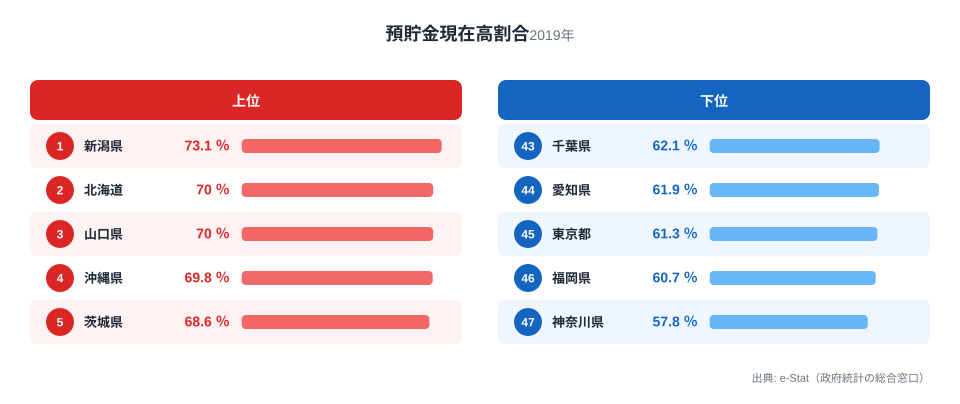
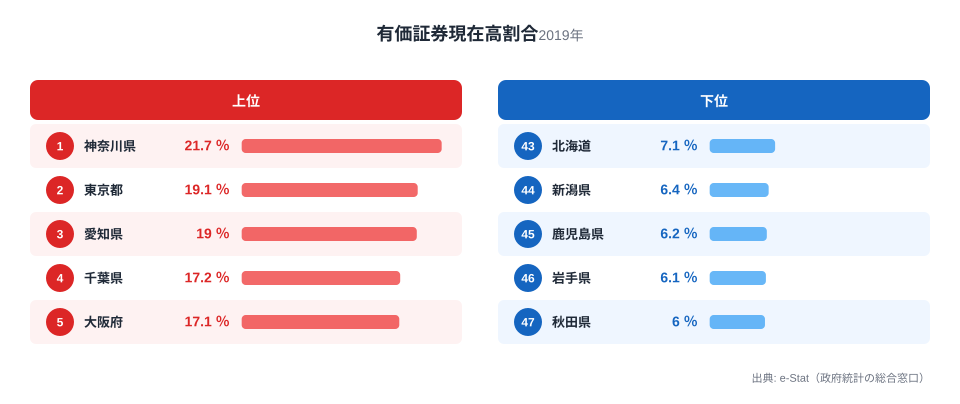
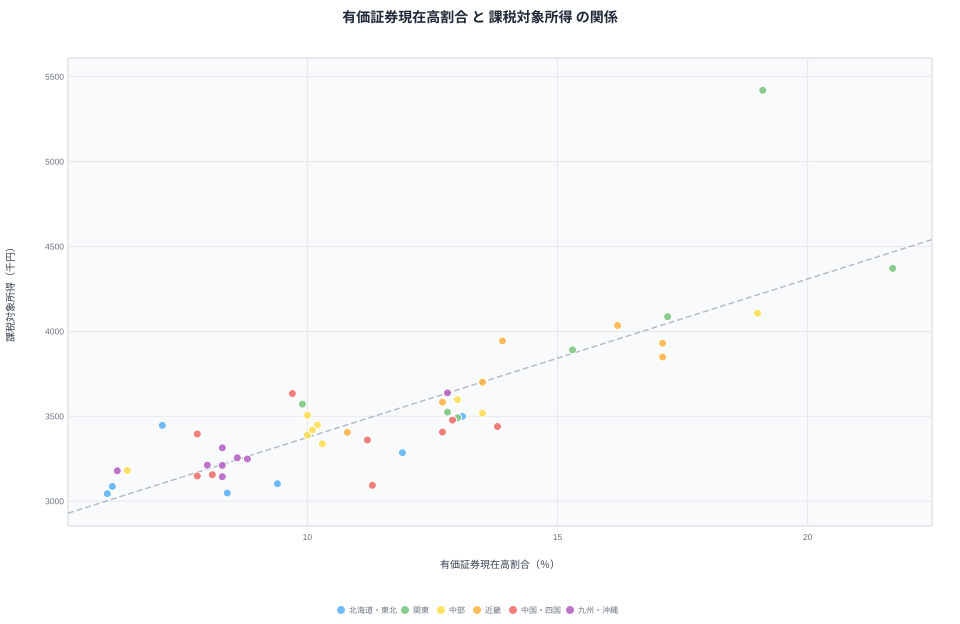
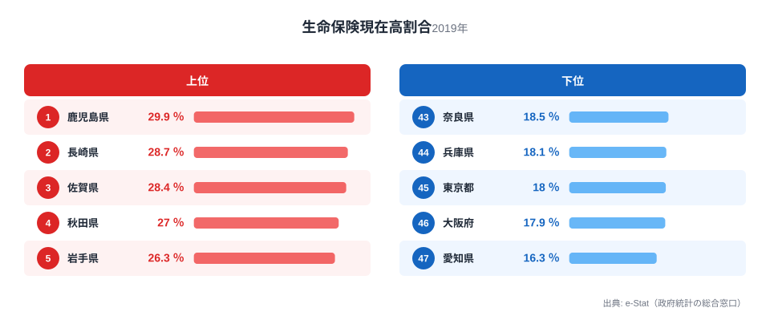

同じ「貯蓄」でも、預貯金にまわす県と有価証券にまわす県では中身がまったく違います。総務省統計局「全国家計構造調査」（2019年度、二人以上の世帯）によると、貯蓄現在高に占める預貯金の割合は新潟県が73.1%で全国1位、有価証券の割合は神奈川県が21.7%で全国1位です。逆に神奈川県の預貯金割合は57.8%で全国最下位、秋田県の有価証券割合は6.0%で全国最下位となっています。

雑誌などでは「投資家気質の県」「堅実な県」といった県民性の話としてこの差が語られることがあります。しかし実際にデータを重ねてみると、話はもう少し構造的です。有価証券比率が高い県は、課税対象所得や大学・大学院卒業率とも強く相関しており、「県民性」と呼ばれているものの正体は、所得と学歴でかなりの部分を説明できることがわかります。

この記事では、預貯金・有価証券・生命保険という3つの貯蓄手段の都道府県別データを重ね合わせ、「県民性」という説明で止めずに、その背後にある構造を数字で確認していきます。

## 預貯金現在高割合トップ5・ワースト5 ― 「堅実な県」はどこか

<source-link href="/ranking/current-deposit-balance-ratio-multi-person-households">預貯金現在高割合ランキングをもっと見る</source-link>

貯蓄に占める預貯金の割合が最も高いのは新潟県の73.1%で、北海道と山口県が70.0%で並んで2位、沖縄県69.8%、茨城県68.6%と続きます。上位には日本海側や地方圏の県が目立ちます。逆に最も低いのは神奈川県の57.8%で、福岡県60.7%、東京都61.3%、愛知県61.9%、千葉県62.1%と、三大都市圏の県が下位に集中しています。1位と最下位の差は1.3倍で、これから見る有価証券比率の差に比べるとかなり小さめです。この「小さな差」の裏側に、次に見る有価証券比率のはっきりした違いが隠れています。

> [!NOTE]
> 「預貯金現在高割合」は、貯蓄現在高（通貨性・定期性の預貯金、有価証券、生命保険、金銭信託等の合計）のうち、通貨性・定期性の預貯金が占める割合です。有価証券や生命保険とは別区分で集計されているため、預貯金・有価証券・生命保険の3比率を単純に足しても100%にはなりません（残りは金銭信託等の少額区分です）。

## 有価証券現在高割合トップ5・ワースト5 ― 「投資家の県」はどこか

有価証券比率のトップは神奈川県21.7%で、僅差で東京都19.1%、愛知県19.0%、千葉県17.2%、大阪府17.1%と続き、上位はすべて三大都市圏の県で占められています。最下位は秋田県6.0%で、岩手県6.1%、鹿児島県6.2%、新潟県6.4%、北海道7.1%と、東北・北海道・九州の非都市圏県が並びます。1位と最下位の差は3.6倍で、預貯金比率の1.3倍よりもはるかに大きな地域差です。

<source-link href="/ranking/current-securities-balance-ratio-multi-person-households">有価証券現在高割合ランキングをもっと見る</source-link>

しかも上位・下位の顔ぶれは、先ほどの預貯金比率ランキングとほぼ入れ替わっています。神奈川県は預貯金では最下位、有価証券では1位。新潟県は預貯金で1位、有価証券では下から2番目です。この綺麗な反転こそが「県民性」論の材料になっているわけですが、これが偶然の一致なのか、それとも背後に共通の要因があるのかを次に確認します。

47都道府県で預貯金比率と有価証券比率の相関係数を計算すると-0.633と、はっきりした負の相関になります。家計の貯蓄という限られたパイの中で、預貯金に回すか有価証券に回すかは、同じ家計行動のトレードオフとして表れているとみることができます。ただし、この相関だけでは「なぜ」その配分が決まるのかまではわかりません。次に、有価証券比率と所得・学歴との関係を見てみます。

## 散布図で検証 ― 有価証券比率を左右するのは所得と学歴

<source-link href="/ranking/per-taxpayer-taxable-income">課税対象所得ランキングをもっと見る</source-link>

47都道府県の有価証券比率（横軸）と1人あたり課税対象所得（縦軸）を散布図にすると、右肩上がりの関係がはっきり見て取れます。相関係数は0.83で、有価証券比率が高い県ほど所得も高い傾向があります。さらに調べると、大学・大学院卒業率との相関係数は0.86とこちらの方がわずかに強く、金融資産残高との相関係数も0.76です。つまり有価証券比率の高さは、「県民性」というより所得水準と学歴構成でかなりの部分が説明できる、ということになります。神奈川・東京・愛知・大阪・千葉という有価証券比率の上位県は、いずれも課税対象所得ランキングでも上位の常連です。

> [!WARNING]
> 有価証券比率と課税対象所得の相関係数が0.83と強くても、「有価証券を持つと所得が上がる」ことを意味するわけではありません。むしろ元手に余裕がある高所得世帯ほど株式や投資信託に配分しやすい、という逆方向の説明の方が自然です。家計調査の断面データだけでは因果の向きを断定できず、都市部への人口・産業集中という別の要因が両方を押し上げている可能性も残ります。

## 生命保険を重視する県という第三の選択

<source-link href="/ranking/current-life-insurance-balance-ratio-multi-person-households">生命保険現在高割合ランキングをもっと見る</source-link>

貯蓄現在高に占める生命保険の割合が最も高いのは鹿児島県29.9%で、長崎県28.7%、佐賀県28.4%、秋田県27.0%、岩手県26.3%と、九州・東北の県が上位を占めます。最下位は愛知県16.3%で、大阪府17.9%、東京都18.0%、兵庫県18.1%、奈良県18.5%と続きます。この並びは有価証券比率ランキングとほぼ逆で、生命保険比率と有価証券比率の相関係数は-0.715です。

> [!TIP]
> 有価証券比率と生命保険比率の相関係数は-0.715とかなり強い逆相関です。株式や投資信託で増やす県と、生命保険で将来に備える県はセットで併存しにくく、どちらの「堅実さ」を選ぶかが県ごとに分かれている、と読むことができます。鹿児島・長崎・秋田・岩手のように生命保険比率が高い県は、そろって有価証券比率が下位に入っています。

続けて金融資産残高（貯蓄現在高のうち預貯金・有価証券・生命保険等の合計）を見ると、神奈川県が1,821.8万円で1位、愛知県1,768.5万円、東京都1,756.2万円と、有価証券比率の上位県がそのまま並びます。最下位は沖縄県602.1万円で、青森県841.3万円、鹿児島県870.4万円と、有価証券比率の下位県と重なります。<source-link href="/ranking/financial-assets-balance-multi-person-households">金融資産残高ランキングを見る</source-link> 差は3.0倍で、預貯金・有価証券の配分の違いは、資産水準そのものの違いと切り離せない構造になっています。

> [!WARNING]
> 本データは「二人以上の世帯」の平均値で、単身世帯は含まれていません。単身世帯比率が高い東京都などは、実際の住民全体の資産構成がこのランキングとは異なる可能性があります。

## まとめ

- 預貯金現在高割合は新潟県73.1%が1位、神奈川県57.8%が最下位で1.3倍差です
- 有価証券現在高割合は神奈川県21.7%が1位、秋田県6.0%が最下位で3.6倍差です
- 預貯金比率と有価証券比率の相関係数は-0.633で、貯蓄の配分は表裏一体のトレードオフになっています
- 有価証券比率は課税対象所得（相関係数0.83）や大学・大学院卒業率（相関係数0.86）と強く相関し、「県民性」より所得・学歴の影響が大きいとみられます
- 生命保険現在高割合は鹿児島県29.9%が1位で、有価証券比率とは-0.715の逆相関があり、投資型と保険型の県は両立しにくい傾向です

有価証券比率・金融資産残高がいずれもトップの[神奈川県](/areas/14000)と、有価証券比率が最下位の[秋田県](/areas/05000)を見比べると、貯蓄配分の違いが所得構造の違いと重なっていることがよくわかります。所得・物価まわりの他の指標は[経済カテゴリ](/category/economy)にまとめています。

## データ出典

本記事のデータは、総務省統計局「全国家計構造調査」（2019年度、二人以上の世帯）を、政府統計の総合窓口（e-Stat）の社会・人口統計体系経由で取得したものです。相関係数は同調査の都道府県別データから算出しています。分析の着想には週刊エコノミスト「おカネと健康 都道府県ランキング」を参考にしましたが、本記事の数値検証・相関分析はstats47が独自に行ったものです。
