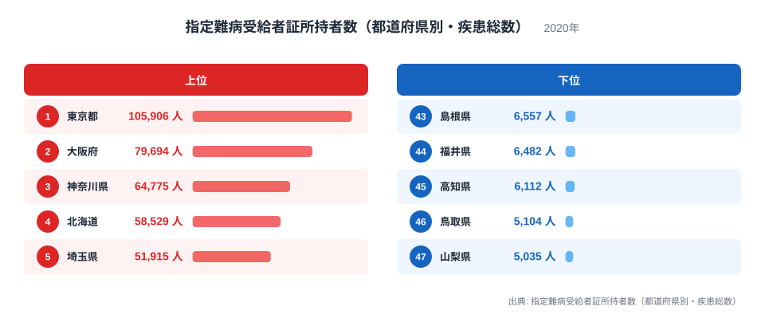
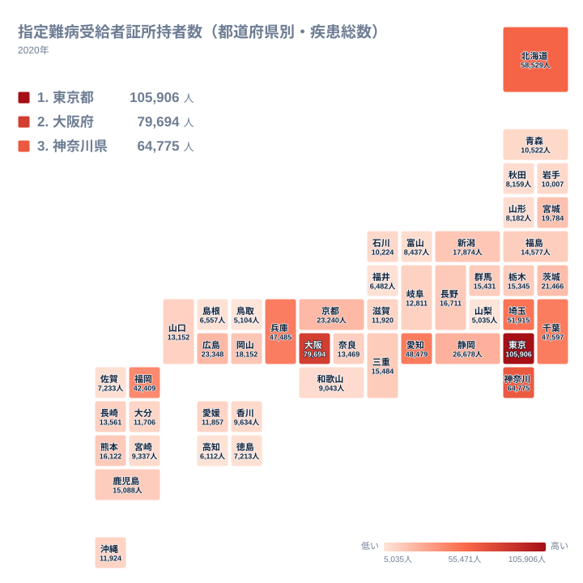

指定難病は、原因が明らかでなく治療方法が確立していない疾患のうち、国が医療費助成の対象として指定した病気を指します。対象となる患者は「指定難病受給者証」を取得することで、医療費の自己負担が軽減されます。この受給者証を持つ人の数を都道府県別に見ると、地域によって大きな差があることがわかります。

この記事では2020年の指定難病受給者証所持者数（都道府県別・疾患総数）の実データをもとに、上位と下位の都道府県を比較し、その差がどこから生まれるのかを整理します。あわせて、この統計を読み解くうえで注意すべき点も紹介します。

## 指定難病受給者証所持者数の上位と下位

<source-link href="/ranking/designated-difficult-disease">指定難病受給者証所持者数（都道府県別・疾患総数）ランキングをもっと見る</source-link>

もっとも受給者証所持者数が多いのは東京都で、10万人を超える人が指定難病の医療費助成を受けています。大阪府、神奈川県、北海道、埼玉県が続き、上位を占めるのはいずれも人口規模の大きい都道府県です。指定難病は種類が多岐にわたるため、対象となる患者の絶対数は、その地域に住む人の総数にある程度比例する傾向があります。

一方で下位を見ると、島根県、福井県、高知県、鳥取県、山梨県が並びます。これらの県はいずれも人口規模が小さく、受給者証を持つ人の絶対数も自然と少なくなります。上位県と下位県の差は、疾患のかかりやすさの違いというよりも、まず人口規模の差を反映していると考えるのが妥当です。

千葉県、愛知県、兵庫県、福岡県も上位10県に入っています。これらはいずれも県内に大都市を抱え、人口が多いだけでなく、大学病院や地域の中核医療機関が整備されている地域でもあります。指定難病の認定には専門医による診断が必須であるため、医療資源が集積している地域では、患者が診断から受給者証の取得までたどり着きやすいという側面も考えられます。

## 北海道が上位に入る背景

上位5県の中で北海道の存在は目を引きます。北海道は東京都や大阪府、神奈川県のように突出した人口密集地というわけではありませんが、道内の医療機関で指定難病の診断・登録が進んでいることが、受給者証所持者数を押し上げている一因だと考えられます。指定難病の認定には専門的な診断が必要であり、道内に大学病院や専門医療機関が整備されていることが、受給者証の取得のしやすさにつながっている可能性があります。

指定難病の認定を受けるには、都道府県が指定する医療機関で「指定難病指定医」による診断を受ける必要があります。都市部やその近郊は専門医療機関が集積しやすく、診断から認定申請までの手続きが比較的行いやすい環境にあると言えます。この点は、単純な患者数の多さだけでなく、認定を受けやすい医療体制の有無も統計の背景にあることを示しています。

## 指定難病受給者証所持者数の地理分布

地図で全国の分布を見ると、受給者証所持者数が多い都道府県は関東圏と近畿圏、そして北海道に集中していることがわかります。これらの地域はいずれも人口が多いか、あるいは専門的な医療機関が整備されている地域です。

反対に受給者証所持者数が少ない都道府県は、山陰地方や四国、甲信地方の一部に見られます。島根県、鳥取県、高知県はいずれも人口規模が小さい県であり、山梨県も同様に人口が少ない県のひとつです。福井県も人口規模が比較的小さく、これらの県では絶対数として受給者証所持者が少なくなる傾向が見て取れます。地図全体を見渡すと、この統計が人口分布とおおむね連動していることが視覚的にも確認できます。

これらの下位県に共通するのは、人口規模の小ささに加えて、県内に大規模な専門医療機関が少ないという事情もあると考えられます。指定難病の診断は一定の専門性を要するため、近隣に指定難病指定医が少ない地域では、診断や申請に時間がかかったり、隣接する都道府県の医療機関を利用したりするケースもあり得ます。こうした医療アクセスの違いも、都道府県別の数字に影響を与えている可能性があります。

## 数字を読むときに注意したいこと

この統計を見るときにもっとも注意したいのは、集計されているのが「受給者証を所持している人の数」であって、実際にその病気を発症している人の総数そのものではないという点です。指定難病であっても、まだ診断を受けていない人や、何らかの理由で受給者証の申請を行っていない人は、この統計には含まれません。

また、この数字は都道府県ごとの絶対数であるため、人口規模の大きい都道府県ほど数値が大きくなるのは自然な結果です。都道府県間で「難病にかかりやすい地域かどうか」を比較したい場合は、人口一人あたりの受給者証所持者数といった指標で見る必要があります。単純な絶対数の順位だけを見て、特定の地域で難病が多いと結論づけることは避けるべきです。

さらに、指定難病は数百種類に及ぶため、この統計は疾患ごとの内訳を示していません。ある県で受給者証所持者数が多い場合でも、それがどの疾患によるものかはこの数字だけでは判断できません。特定の疾患の地域差を知りたい場合は、疾患別に細分化された統計を別途確認する必要があります。

## まとめ

指定難病受給者証所持者数は、東京都、大阪府、神奈川県、北海道、埼玉県の順に多く、島根県、福井県、高知県、鳥取県、山梨県で少なくなっています。この差の背景には、まず都道府県ごとの人口規模の違いがあります。加えて、北海道のように専門的な医療機関が整備されている地域では、診断と認定の手続きが進みやすく、受給者証所持者数が押し上げられている可能性も考えられます。この統計はあくまで受給者証を所持している人の絶対数であり、疾患の発症率そのものを示すものではない点を踏まえたうえで読み解くことが大切です。

> [!NOTE]
> 「指定難病受給者証」は、国が指定した難病のうち、一定の重症度基準を満たす患者に対して医療費助成を行う制度に基づいて交付されます。この統計は全ての指定難病を合算した総数であり、個別の疾患ごとの分布を示すものではありません。

> [!WARNING]
> 集計対象は受給者証を実際に取得した人に限られます。診断を受けていても申請していない人や、軽症で対象外となった人はこの統計には含まれないため、実際の患者数を正確に表しているわけではない点に注意が必要です。

> [!TIP]
> 都道府県間の比較を行う際は、絶対数だけでなく人口一人あたりの受給者証所持者数もあわせて確認すると、人口規模の違いに影響されない地域差が見えやすくなります。

指定難病に関連する統計をさらに詳しく知りたい方は、[同じカテゴリの統計一覧](/category/socialsecurity)から社会保障分野の他の指標も確認できます。上位県の詳細は[東京都のデータ](/areas/13000)や[大阪府のデータ](/areas/27000)からご覧いただけます。

## データ出典

指定難病受給者証所持者数（都道府県別・疾患総数）（2020年）
