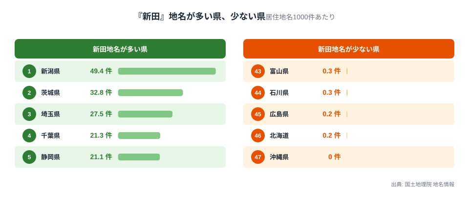
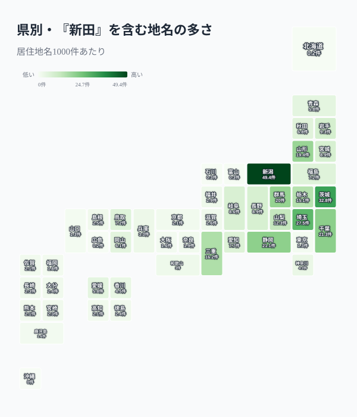
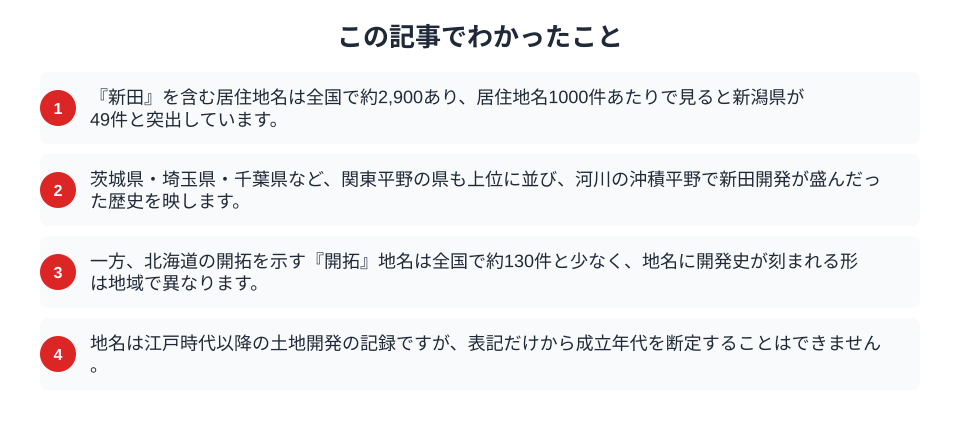

「新田」という言葉が入った地名を、一度は目にしたことがあるはずです。「〇〇新田」という住所は、江戸時代以降に田んぼを新しく切り開いた土地に付けられた名前で、その多くが今も地名として残っています。国土地理院の地名情報から、居住地名に「新田」がどれだけ含まれるかを都道府県ごとに数えると、開発の歴史が色濃く残る地域がはっきり浮かび上がりました。地名は、その土地がどうつくられてきたかを語る、最も身近な記録なのです。

## 新田地名は新潟が突出する

まず、居住地名1000件あたりに「新田」を含む地名がいくつあるかを、県ごとに比べます。

<data-source label="国土地理院 地名情報" note="居住地名1000件あたりの『新田』を含む地名数（電子国土基本図・地名情報）"></data-source>

最も多いのは新潟県で、居住地名1000件あたり49.4件に「新田」が含まれます。県内には500近い「新田」地名があり、2位以下を大きく引き離します。続くのは茨城県32.8件、埼玉県27.5件、千葉県21.3件、静岡県21.1件と、関東平野を抱える県が並びます。反対に、「新田」地名がほとんどないのは沖縄県や北海道、中国地方の県です。新田開発が盛んだった地域と、そうでなかった地域が、地名の分布としてくっきり残っているのです。

## 地図で見ると平野に集中する

「新田」地名の分布を地図にすると、その偏りが地形と結びついていることがわかります。

<data-source label="国土地理院 地名情報" note="居住地名1000件あたりの『新田』を含む地名数（電子国土基本図・地名情報）"></data-source>

色が濃いのは、新潟平野、関東平野、濃尾平野といった大きな沖積平野を持つ県です。これらの地域では、河川がもたらした低湿地を排水し、堤防を築いて田んぼを広げる新田開発が江戸時代に盛んに行われました。開いた土地には「〇〇新田」という名が付けられ、開発者や開発時期を記録しました。[日本の米作が東北・北陸に集中する](/blog/rice-harvest-volume-prefecture-gap)背景には、こうした平野の開発の歴史が横たわっています。地名の濃淡は、どこで人の手が土地を広げてきたかの地図でもあります。

新田開発は、大名や商人、村の共同体などさまざまな担い手によって進められました。開いた土地には資金を出した人や開発を率いた人の名を冠することも多く、「〇〇新田」の「〇〇」の部分には、その土地を切り開いた人々の記憶が残っています。都市化が進んだ今も、住宅地の住所として「新田」の名は使われ続けており、かつて田んぼだった場所の上に街ができていることを静かに物語っています。地名は、土地の使われ方が時代とともに変わっても、その来歴を伝え続ける器なのです。

## 北海道の開拓は別のかたちで残る

土地開発を示す地名は「新田」だけではありませんが、その残り方は地域で異なります。

> [!NOTE]
> 北海道は明治以降に大規模な開拓が進んだ土地ですが、「開拓」を含む地名は全国でも約130件と多くありません。北海道の地名にはアイヌ語に由来するものが多く、本州の平野に見られる「〇〇新田」のような開発地名とは、成り立ちが大きく異なります。同じ「土地を開く」歴史でも、それが地名に刻まれる形は一様ではないのです。

つまり「新田」地名の分布は、日本全体の土地開発の地図ではなく、主に江戸時代の本州の平野で進んだ新田開発の地図です。開発の時代や方法が違えば、地名への残り方も変わります。

## 数字を読むときの注意

地名から歴史を読むときには、いくつか気をつけたい点があります。

> [!WARNING]
> 地名の表記だけから、その土地がいつ開発されたかを正確に断定することはできません。「新田」を含んでいても、後世に名付けられた地名や、開発とは無関係な地名が混じることもあります。地名は歴史の手がかりですが、それ自体が年代を証明するものではありません。

> [!TIP]
> ここで数えたのは、住所に使われる居住地名です。山や川といった自然の地名は含んでいません。自然地名まで含めると分布は変わる可能性があり、地名研究では複数の資料を突き合わせて解釈します。

「新田」という2文字は、その土地に人が手を入れ、田んぼを広げてきた記憶をとどめています。地名の地図を眺めることは、いま暮らす土地がどうつくられてきたかを想像する入り口になります。

## まとめ

この記事でわかったことを整理します。

「新田」を含む地名は新潟県で突出し、関東平野や濃尾平野の県が続きました。これは江戸時代に大きな沖積平野で新田開発が盛んだった歴史を映しています。北海道の開拓のように、土地開発が地名に刻まれる形は地域で異なります。地名の背景にある土地と農業の歴史は、[耕作放棄地が東北に集中する](/blog/farmland-crisis-abandoned-land)現在の姿や、[人口動態のテーマページ](/themes/population-dynamics)ともつながっています。地名を通して土地の来歴を知ることは、地域を深く理解する手がかりになります。

## データ出典

- 国土地理院「電子国土基本図（地名情報）」の居住地名を使用（出典明示により商用利用可・PDL1.0）
- 居住地名（大字・町・丁目等）1000件あたりに「新田」を含む地名数を都道府県別に集計。自然地名は都道府県コードを持たないため対象外としています。
