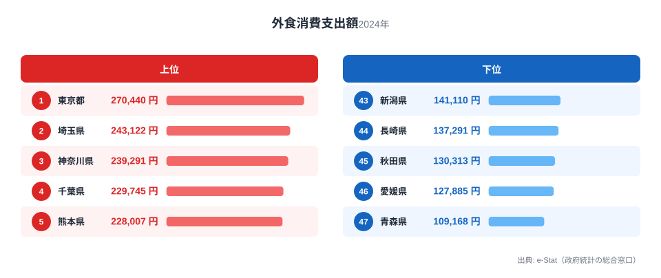
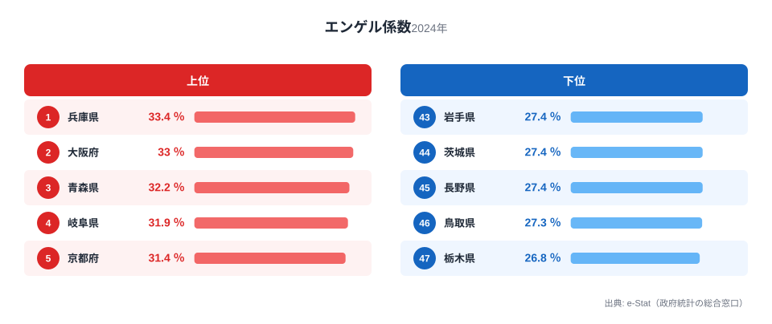
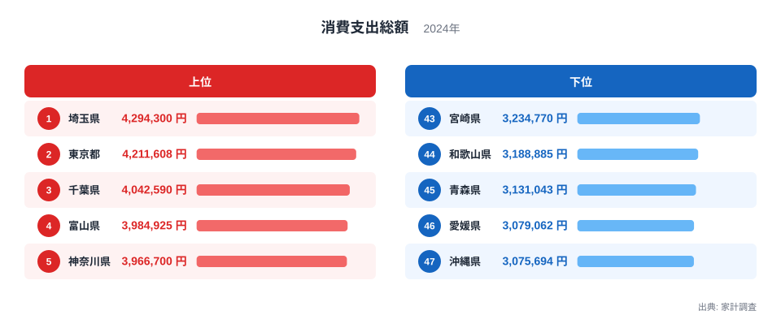

外食にどれくらいお金を使っているかは、住む場所でかなり違います。総務省「家計調査」による2024年の外食消費支出額（都道府県庁所在市の二人以上世帯・年間、一般外食＋学校給食）を見ると、1位の東京都が27万440円、最下位の青森県が10万9168円で、その差は2.5倍にのぼります。

外食は生活必需品というより、収入に余裕が出たときに増える支出だと言われることがあります。もしそうだとすれば、外食支出の多い都道府県は所得水準や都市の消費文化と結びついているはずです。今回のデータでは、上位に首都圏（東京・埼玉・神奈川・千葉）が並ぶ一方、意外にも熊本県が5位に入り、下位は東北と四国に集中しています。この記事では、外食支出の地域差がどんな構造から生まれているのかを、実際の順位から読み解きます。

> [!NOTE]
> 家計調査は都道府県庁所在市の二人以上世帯を対象とした調査であり、県全体・単身世帯を代表する値ではありません。県内でも都市部と郡部で外食機会は大きく異なるため、ここでの「県の外食支出」は厳密には「県庁所在市に住む二人以上世帯の平均的な外食支出」を意味します。

## 外食支出が多い県・少ない県

上位は東京都27万440円、埼玉県24万3122円、神奈川県23万9291円、千葉県22万9745円と、1〜4位を首都圏4都県が占めています。人口が集中し飲食店の選択肢が多い大都市圏ほど、外食に使う金額の絶対値が大きくなりやすいという傾向が表れています。

<source-link href="/ranking/dining-out-consumption-expenditure">外食消費支出額ランキングをもっと見る</source-link>

一方で5位の熊本県は22万8007円、6位の愛知県は22万6318円と、首都圏以外の県がここに入っている点は見逃せません。消費支出総額に対する外食支出の比率（外食÷消費支出総額）で見ると、熊本県は5.84%で全国5位（1位東京都6.42%、47位青森県3.49%）となり、金額の絶対値だけでなく家計に占める割合でも上位に入っています。県庁所在市の外食比率が高いという傾向は、この割合の面からも裏付けられます。同様に7位滋賀県、8位奈良県、9位京都府と近畿・東海圏の県が続き、上位10県のうち9県が三大都市圏（首都圏・中京圏・近畿圏）に属し、圏外は熊本県のみです。首都圏の一極集中というより、「大都市を抱える県ほど外食支出が伸びやすい」という見立てのほうがデータに近いといえます。

ただしこの見立てには例外もあります。三大都市圏の中核である[大阪府](/areas/27000)は外食支出で18位（18万6254円）にとどまり、熊本や滋賀より低い水準です。大阪府は消費支出総額でも47都道府県中39位（336万8838円）と、大都市圏の中では家計の消費余力自体がそれほど大きくありません。外食支出の高さは「都市かどうか」より「家計の消費支出総額がどれだけ大きいか」に近い変数で決まっている可能性がうかがえます。逆方向の例外もあります。新潟県は消費支出総額が25位、福島県は22位と全国では中位に位置しますが、外食支出はそれぞれ43位・41位まで下がっており、消費支出総額の順位だけでは説明しきれません。この2県は後段で触れる東北・北陸に共通する気候や外食機会の少なさが、消費支出総額とは別に上乗せされている可能性を示しています。

[仮説] 外食は所得や可処分所得に余裕があるほど支出が伸びる「贅沢財」的な性質を持つとされます。これが正しければ、外食支出の地域差の一部は世帯所得や家計全体の消費余力の差を反映している可能性があります。この仮説は後段でエンゲル係数と突き合わせて検証します（家計全体の消費支出額そのものが、外食支出とエンゲル係数の両方を左右する共通の変数になっているかを確認します）。

> [!TIP]
> 総務省「家計調査」を年間収入五分位階級別（年収を低い順に5グループに分けた分類）で見ると、外食は年収階級が上がるほど消費支出に占める割合がほぼ一貫して高まっていく、数少ない支出費目の一つです。食料費全体や住居費など多くの費目は年収が上がっても構成比が大きく変わらないのに対し、外食は高い年収階級ほど家計内での比重が大きくなる傾向があります。ここで言う「贅沢財」的な性質は、この全国集計の傾向を根拠にしています。ただしこれは全国の年収階級別データから読み取れる傾向であり、本記事の都道府県別ランキングとは別の切り口です。外食支出額が多い県だからといって、その県に高所得世帯が多いとは限らない点に注意してください。

## 外食支出が少ない県のパターン

最下位は青森県10万9168円で、46位の愛媛県12万7885円と比べても1万8717円少なく、全国で唯一10万円台にとどまっています。45位秋田県、44位長崎県、43位新潟県と続き、下位10県には東北から青森・秋田に加えて41位福島県も入っています（岩手県は35位、東北のなかでは中位）。

> [!WARNING]
> 外食支出が少ないことは、必ずしも「食生活が質素」を意味しません。家庭での調理・惣菜購入・冠婚葬祭での会食など、外食以外の食関連支出に振り分けられている可能性があります。この指標は「外食」という支出項目だけを切り取ったものであり、食料費全体の豊かさを測る指標ではない点に注意が必要です。

東北で外食支出が伸びにくい背景には、雪国特有の外出機会の少なさや、自宅での調理・会食を好む生活習慣が関係していると考えられます。青森県は冬季の積雪日数が多く、外食のために出かける頻度そのものが他地域より少なくなりやすい土地です。[仮説] また人口あたりの飲食店数が都市部より少ないことも、選択肢の少なさとして外食支出を押し下げている可能性があります。ただしこの気候要因は東北固有の傾向であり、44位の長崎県のように雪国ではない県が下位に入る理由は別に求める必要があります。長崎県は消費支出総額でも上位ではなく、県庁所在市の外食機会そのものが都市部より限られていることが背景にあると考えられます。

四国では46位[愛媛県](/areas/38000)のほか、34位徳島県、23位香川県、17位高知県と県内でばらつきがあり、東北ほど地域全体が下位に固まっているわけではありません。外食支出の低さは「地方だから一律に低い」という単純な構図ではなく、都市の外食文化の厚みや気候条件など複数の要因が絡んでいることがうかがえます。他の消費関連ランキングは[経済カテゴリ](/category/economy)からまとめて確認できます。

## エンゲル係数との組み合わせで見える意外な構図

外食支出が多い都道府県は、家計に占める食費の割合（エンゲル係数）も高くなりそうに思えます。しかし実際のデータを重ねると、単純にはそう言えません。

エンゲル係数の1位は兵庫県33.4%、2位大阪府33.0%、3位青森県32.2%です。外食支出が最下位だった青森県が、エンゲル係数では全国3位という高さに入っています。逆に外食支出1位の東京都はエンゲル係数16位（30.1%）にとどまり、突出して高いわけではありません。

<source-link href="/ranking/engel-coefficient">エンゲル係数ランキングをもっと見る</source-link>

この一見矛盾した組み合わせは、前段の「贅沢財」仮説と切り離さずに読むと筋が通ります。エンゲル係数は「食費 ÷ 消費支出総額」で決まる比率なので、食費が同じでも分母の消費支出総額が小さい県ほど係数は高くなります。総務省「家計調査（家計収支編）」の消費支出総額ランキングで確認すると、青森県は45位（313万1043円）と全国でも消費支出総額そのものが小さく、1位埼玉県の429万4300円の約73%にとどまります。外食は贅沢財的な性質を持つため、消費支出総額が小さい青森県では外食に回す分がまず削られ、結果として外食支出は最下位（10万9168円）まで落ち込みます。一方で食料費（自炊・食材購入を含む）は生活必需的な性質が強く、消費支出総額が縮んでも同じ比率では削れません。このため「外食という贅沢財が縮んだ分、食費という必需的支出の比率（エンゲル係数）が相対的に押し上げられる」という一つの分母効果として説明できます。

<source-link href="/ranking/consumption-expenditure-total">消費支出総額ランキングをもっと見る</source-link>

伝統的にエンゲル係数は「高いほど生活水準が低い」と説明されますが、この解釈は東京や大阪には当てはまりません。東京都は消費支出総額2位（421万1608円）と家計の消費余力が大きいため、外食に多く使ってもエンゲル係数は16位（30.1%）に収まります。大阪府はエンゲル係数2位（33.0%）と青森県に迫る高さですが、消費支出総額は39位（336万8838円）で大都市圏の中では小さく、外食支出も18位にとどまっており、青森県と同じ「消費支出総額が相対的に小さいために食費比率が押し上げられる」構図に近いと考えられます。つまりエンゲル係数の高低は生活水準そのものというより、食費と外食という2つの支出の間で消費支出総額をどう配分しているかを映す指標といえそうです。

> [!TIP]
> 外食支出額だけを見て「その県の暮らしぶりが豊かかどうか」を判断すると、消費支出総額という土台の差を見落とします。青森県のように外食支出が低い県は、食費を切り詰めているのではなく、家計全体の消費余力（消費支出総額）が小さいために贅沢財である外食から先に削られ、結果として必需的な食費の比率（エンゲル係数）が上がって見えるだけかもしれません。県の暮らしを比較するときは、外食支出やエンゲル係数を単独で見るのではなく、消費支出総額とセットで確認することをおすすめします。エンゲル係数の都道府県差そのものは[別記事](/blog/engel-coefficient-prefecture-ranking)でも詳しく取り上げています。

## まとめ

- 外食消費支出額の1位は東京都27万440円、最下位は青森県10万9168円で2.5倍の差
- 上位10県のうち9県が首都圏・中京圏・近畿圏の三大都市圏に属し、圏外は熊本県のみ（熊本県は5位で例外的に上位入り）
- 下位10県には東北勢（青森・秋田・福島）が複数入り、冬季の気候や外食機会の少なさが背景にある可能性
- エンゲル係数を重ねると、外食支出最下位の青森県がエンゲル係数3位という逆説的な組み合わせが見える
- 外食支出額だけで地域の食生活の豊かさは測れず、自炊・食材費まで含めた消費構造を見る必要がある

外食支出とあわせて、[外食消費支出額ランキング](/ranking/dining-out-consumption-expenditure)と[エンゲル係数ランキング](/ranking/engel-coefficient)の全47都道府県データも確認できます。

## データ出典

総務省統計局「家計調査（品目別）」（都道府県庁所在市および政令指定都市、2024年）を基に作成。e-Stat（政府統計の総合窓口）経由で整備したデータを利用しています。
