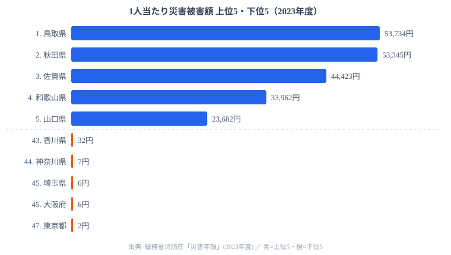

総務省消防庁「災害年報」をもとに算出した **2023年度の1人当たり災害被害額** は、同じ国の中とは思えない地域の隔たりを見せました。最も重かったのは **鳥取県の53,734円**、対して最も軽かった **東京都はわずか2円** です。その隔たりはおよそ2万6千倍に達し、stats47 が扱う 500 以上の都道府県統計のなかでも飛び抜けて大きい部類に入ります。

なぜ災害の重さが、住む県によってこれほど変わるのでしょうか。2023年度は鳥取県中部の地震、秋田県7月の記録的豪雨、佐賀県の梅雨前線豪雨、北陸の豪雪などが特定の地域に集中した年でした。この記事では上位5県と下位5県を見比べながら、格差が開く理由と、「1人当たり」という指標の落とし穴を掘り下げていきます。

## 上位と下位を分けるもの — 災害の地理と人口の分母

まず、2023年度の1人当たり災害被害額について、上位5県と下位5県を1枚の図にまとめました。上位の青いバーが数万円台に伸びるのに対し、下位の橙のバーはほとんど目盛りに現れません。同じ「災害被害額」という指標でありながら、桁が4つも5つも違うのです。

上位に並ぶのは、山陰の鳥取県・山口県、東北の秋田県、北陸の富山県・福井県・石川県、九州北部の佐賀県・大分県・熊本県、そして紀伊半島の和歌山県です。鳥取県は2023年度に中部で地震が発生し、秋田県は7月の記録的豪雨で住宅・農地・インフラが広く損なわれました。佐賀県も梅雨前線による浸水被害が深刻で、北陸3県には冬季の豪雪と融雪による被害が積み上がる地域特性があります。

上位10県に共通するのは、**いずれも人口200万人未満** という点です。被害の絶対額が同じでも、それを割る「人口」という分母が小さいほど、1人当たりの値は大きく跳ね上がります。災害が集中した年に人口の少ない県が当たると、指標は一気に押し上げられるのです。[鳥取県（人口約54万人）](/areas/31000)が首位に立ったのは、地震という大きな被害と、全国最少規模の人口という二つの条件が重なった結果でした。防災や安全に関わる他の指標とあわせて見たい場合は、[司法・安全・環境カテゴリ](/category/safetyenvironment)から横断的に確認できます。

<source-link href="/ranking/disaster-damage-amount-per-person">1人当たり災害被害額ランキングをもっと見る</source-link>

> [!NOTE]
> ここでの「災害被害額」は、消防庁「災害年報」が集計する建物・農林水産業施設・公共土木施設などの被害額を指します。年度ごとに発生した自然災害の規模をそのまま反映するため、大きな地震や豪雨があった年に該当県が急上昇する、変動の激しい指標です。

## なぜ東京は1人2円なのか — 都市部で指標が消える理由

下位5県を見ると、香川県の32円を底に、神奈川県7円、埼玉県と大阪府が6円、そして東京都の2円が並びます。香川県を除く4つはすべて三大都市圏の中核を占める都府県です。

ここで読み違えてはいけないのは、**東京都の2円は「2023年度に災害が無かった」ことを意味しない** という点です。東京都には約1,400万人という巨大な人口があり、被害の絶対額をこの分母で割ると、1人当たりではほぼゼロに近い値まで希薄化されます。逆にいえば、人口が多い都市ほど、たとえ相応の被害が出ても1人当たり指標の上では小さく見えてしまうのです。

この性質は、災害リスクそのものを評価するうえで決定的に重要です。もし首都直下地震や大規模水害が[東京都](/areas/13000)を襲えば、被害の**絶対額**では全国の頂点に立つ可能性が高いでしょう。下位に沈んでいることと、災害に強いことは別の話です。「1人当たり」は被害の密度を測る指標であって、その地域が抱える災害リスクの総量を表すものではありません。

> [!WARNING]
> 順位を「災害の起きやすさ」と取り違えないでください。下位の都市圏は被害ポテンシャルが小さいのではなく、人口という分母が大きいために希薄化されているだけです。地域の総被害リスクを比べたいときは、絶対額ベースの指標と必ず併読してください。

## 単年データの読み方 — 順位は来年も同じとは限らない

この指標を読むうえでもう一つ注意したいのが、ランキングが単年度のスナップショットだという点です。2023年度に上位だった県は、その年にたまたま大きな災害が直撃した県でもあります。地震・豪雨・豪雪がどの地域を襲うかは年ごとに変わるため、複数年を平均すれば、上位の顔ぶれや順位の構造は大きく入れ替わる可能性が高いといえます。

実際、過去の年度をさかのぼると、阪神・淡路大震災のあった1995年度は兵庫県が突出した値を記録しています。特定の巨大災害が起きた県が、その年だけ大きく順位を変えるのがこの指標の常態です。今年の上位を「災害に弱い県」と固定的に捉えるのではなく、**その年にどこで何が起きたか** を映す鏡として読むのが適切でしょう。逆にいえば、ある年に上位だったからといって、翌年も同じように被害が大きいとは限りません。順位の上下動そのものが、その年の災害の分布を物語っているのです。

> [!TIP]
> この指標は、毎年の上位を眺めることで「その年に被害が集中した地域」を一目で把握できます。防災の観点では、単年の順位よりも、複数年を通じて繰り返し上位に現れる県（豪雪地帯や地震帯に位置する県）に注目すると、地域の構造的なリスクが見えてきます。

## まとめ

- 2023年度の1人当たり災害被害額が最も重かったのは **鳥取県の53,734円**、最も軽かったのは **東京都の2円** で、隔たりはおよそ2万6千倍に及びます
- 上位は **山陰・東北・北陸・九州北部** の災害多発地帯に集中し、いずれも人口200万人未満の県です
- 2023年度は **鳥取の地震・秋田の豪雨・佐賀の豪雨・北陸の豪雪** が指標を押し上げた年でした
- 下位は三大都市圏が占めますが、**人口分母の大きさで希薄化** されているだけで、絶対的な被害ポテンシャルとは別問題です
- 「1人当たり」指標は **被害密度の比較** には有効ですが、**地域の総被害量** を測るには絶対額指標との併読が欠かせません

## データ出典

- 総務省消防庁「災害年報」(2023年度)
- データ提供：e-Stat（政府統計の総合窓口）
- 人口データ：総務省統計局「人口推計」(2023年10月1日時点)
