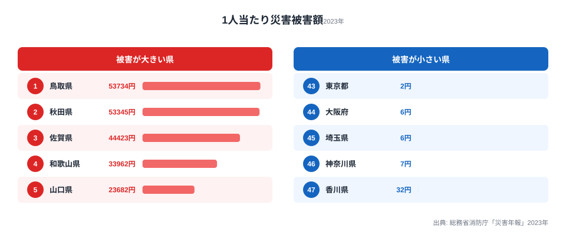

「災害が多いのは人やモノが集中する大都市のほうではないか」──多くの人がそう感じます。ところが総務省消防庁「災害年報」をもとに住民1人当たりで割り直すと、上位に並ぶのは鳥取・秋田・佐賀といった人口の少ない県でした。2023年の1人当たり災害被害額は、1位の鳥取県が53,734円。対して東京都はわずか2円にとどまります。

この記事のポイントは最初に書いてしまいます。「1人当たり」という指標は、被害額そのものの大きさではなく、被害額を住民の数で割った「密度」を測るものです。だからこそ、人口が少ない県ほど数字が跳ね上がり、人口の多い大都市ほど薄まります。順位が直感と逆転して見える正体は、この分母にあります。

## どの県が高く、どの県が低いのか

2023年の1人当たり災害被害額を、被害が大きい県と小さい県でならべると次のようになります。

被害が大きい側の顔ぶれは、**山陰の鳥取県（53,734円）・山口県（23,682円）、東北の秋田県（53,345円）、北陸の富山県（18,014円）・福井県（15,513円）・石川県（13,400円）、九州北部の佐賀県（44,423円）・大分県（22,248円）・熊本県（20,201円）、そして近畿の和歌山県（33,962円）** に集中します。鳥取県は2023年の中部地震、秋田県は7月の記録的豪雨で住宅・農地・インフラに大きな被害が出ました。佐賀県も梅雨前線による浸水被害が深刻で、北陸3県は冬季の豪雪と融雪による被害が積み上がる地域特性が表れています。

一方、被害が小さい側には香川県（32円）・神奈川県（7円）・埼玉県（6円）・大阪府（6円）・東京都（2円）が並びます。香川県を除く4つは、いずれも三大都市圏の中核を担う人口集中地域です。

このランキングは1人当たりで並べ替えたものですが、全47都道府県の順位や年次推移はランキングページで確認できます。

<source-link href="/ranking/disaster-damage-amount-per-person">1人当たり災害被害額ランキングをもっと見る</source-link>

> [!NOTE]
> ここでの「災害被害額」は、消防庁「災害年報」が集計する建物・農地・公共土木施設などの被害金額を指します。同じ災害でも人身被害（死者・負傷者数）や避難者数は別の統計で、被害金額の大小が人的被害の大小と一致するわけではありません。

## なぜ人口の少ない県が上位に来るのか

被害が大きい側に並んだ10県は、いずれも人口200万人未満です（2024年人口推計）。1人当たり額は「その年の県内被害金額 ÷ 県の人口」で計算するため、分母である人口が小さいほど、同じ規模の災害でも1人当たりの数字は大きく出ます。鳥取県の人口はおよそ54万人で、全国でもっとも人口の少ない県のひとつです。ここに地震や豪雨が直撃すれば、1人当たり額は一気に最上位まで押し上げられます。

たとえば仮に100億円規模の被害が出たとき、人口54万人の鳥取県では1人当たりおよそ1万8千円になりますが、同じ100億円が人口1,400万人の東京都で起きると1人当たり700円ほどにしかなりません。被害の絶対額が同じでも、分母の差だけで20倍以上の開きが生まれる──これが、1人当たり指標で順位が直感と逆転して見える仕組みです。

逆に言えば、被害が大きい側に並ぶことは「絶対的な被害金額が全国一」を意味しません。むしろ、人口あたりで見たときに災害の影響が住民1人に重くのしかかっている、という「被害密度」の高さを示しています。災害多発帯と人口希薄エリアが重なる県ほど、この指標は跳ね上がる構造になっています。1位となった鳥取県の人口・産業構成は[鳥取県のプロフィール](/areas/31000)から確認できます。

防災・安全に関わる他の指標とあわせて読みたい場合は、[安全・環境カテゴリのランキング一覧](/category/safetyenvironment)も参考になります。

> [!TIP]
> 同じデータでも「総被害額」で並べ替えると、被害金額の絶対値が大きい県が上位に来て、順位は大きく入れ替わります。地域の災害リスクを語るときは、1人当たり（密度）と総額（規模）の両方を見るのがコツです。片方だけでは「住民への重さ」か「被害の総量」かが取り違えられます。

## 大都市の小さな数字は「安全」を意味しない

最下位の東京都が2円である理由は、「2023年に災害が無かったから」ではありません。1,400万人という巨大な人口で被害金額を割っているため、1人当たりにすると極めて小さな値になるだけです。神奈川・埼玉・大阪も同じく、人口の大きさが数字を薄めています。

ここに「1人当たり」指標を読むうえで一番の注意点があります。大都市の小さな数字は被害密度が低いことを示すだけで、その地域が抱える災害リスクの総量を表すものではありません。仮に首都直下地震や大規模水害が発生すれば、東京の絶対被害額は全国でも突出した規模になりうると、各種の被害想定が指摘しています。1人当たり額が小さいことと、リスクが小さいことは別の話です。東京都全体の統計は[東京都のプロフィール](/areas/13000)から見比べてみてください。

> [!WARNING]
> このランキングは2023年の単年データです。災害は発生する場所と規模が年ごとに大きく変わるため、複数年を平均すると順位構造は変動します。「鳥取が常に1位」ではなく、「2023年に地震・豪雨が集中した県が上位に来た」と読むのが正確です。単年の順位を、その県の恒常的な災害リスクと混同しないよう注意してください。

## まとめ

- 2023年の1人当たり災害被害額は鳥取県が53,734円で最も大きく、東京都は2円でもっとも小さい結果でした
- 被害が大きい側は山陰・東北・北陸・九州北部の災害多発帯に集中し、上位10県はいずれも人口200万人未満です
- 2023年は鳥取の中部地震、秋田・佐賀の豪雨、北陸の豪雪が指標を押し上げた年でした
- 被害が小さい側は三大都市圏の中核で、人口の大きさが数字を薄めているだけで、絶対的なリスクが小さいわけではありません
- 「1人当たり」は被害密度の比較に有効ですが、地域の総被害量を測るには総額の指標とあわせて読む必要があります

## データ出典

- 総務省消防庁「災害年報」(2023年)
- 人口データ：総務省統計局「人口推計」(2023年10月1日時点)
- データ提供：e-Stat（政府統計の総合窓口）
