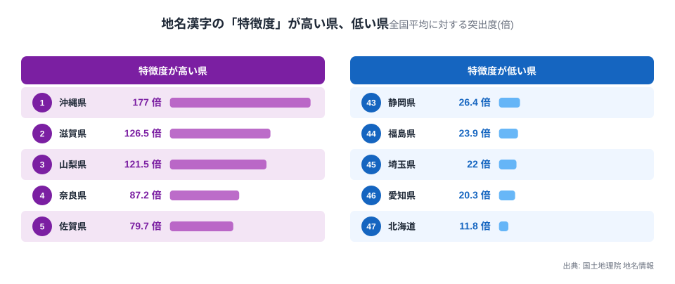
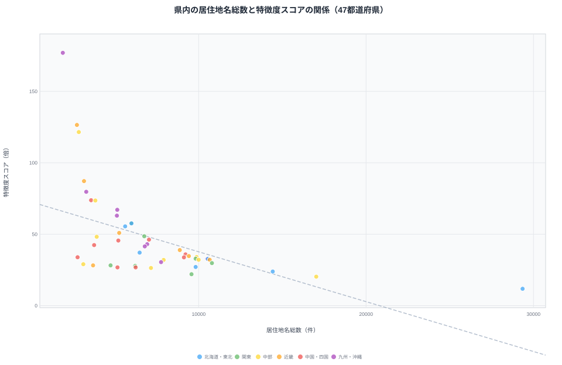
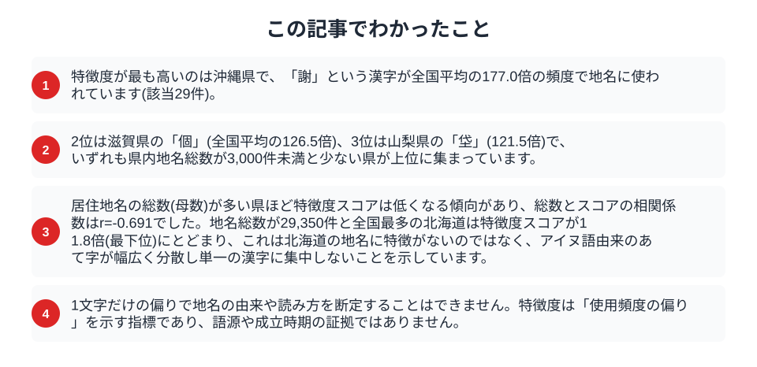

都道府県ごとに地名を眺めていると、「その県でしか見ない漢字」に出会うことがあります。ただし、単に「よく使われる漢字」を数えるだけでは、「山」「田」「川」のようにどの県でも頻出する漢字が上位を占めてしまい、県ごとの違いは見えてきません。そこで本記事では、国土地理院の地名情報から居住地名を1文字ずつ分解し、各県での出現率が全国平均よりどれだけ突出しているか(特徴度)を算出しました。結果、1位の沖縄県は全国平均の177倍という飛び抜けた数値になった一方、地名総数が多い県ほどスコアが下がりやすいという構造上の癖も見えてきました。

## 「多い」漢字と「特徴的」な漢字は違う

たとえば北海道の地名には「山」「川」を含むものが数多くありますが、これは全国どの県でも同じように多い漢字です。県の個性を測るには、単純な出現数ではなく「全国平均と比べてどれだけ突出しているか」を見る必要があります。

本記事の算出方法は次のとおりです。国土地理院の地名情報のうち、都道府県コードを持つ居住地名344,910件(大字・町・丁目など。山や川といった自然地名は都道府県コードを持たないため対象外)を対象に、各地名を構成する漢字1文字ずつに分解します(同じ地名内で同じ文字が複数回出てきても1回とカウント)。県ごとに「その漢字を含む地名の数 ÷ 県内の地名総数」で県内出現率を求め、これを「その漢字を含む地名の全国合計 ÷ 全国の地名総数」で割った値を「特徴度」とします。特徴度が10倍なら、その漢字はその県で全国平均の10倍の頻度で使われていることになります。低頻度の漢字は数件の偶然で極端な値になりやすいため、県内出現数が10件未満の漢字は集計から除外しています。

> [!NOTE]
> 「特徴度」は使用頻度の偏りを示す統計的な指標であり、その漢字の「本場」や「発祥地」を意味するものではありません。同じ漢字を含む地名が他県に少数存在していても、それらの地名の由来が同じとは限りません。また、この集計は文字コード単位で漢字を数えているため、「沢」と「澤」のような異体字は別の文字として扱われます(山梨県の特徴度2位「澤」19.8倍・15件は、「沢」とは別にカウントされたものです)。同じ地名要素が表記のゆれによって複数の「特徴的な漢字」に分かれている場合があります。

## 特徴度が最も高いのは沖縄県の「謝」

特徴度が最も高いのは沖縄県で、「謝」という漢字を含む地名が29件あり、これは全国平均の177.0倍の頻度です。沖縄県の居住地名総数は1,884件と47都道府県で最も少なく、少数の地名への漢字の偏りが極端な倍率になりやすい構造(次節で検証)も影響しています。

2位は滋賀県の「個」(全国平均の126.5倍、24件)、3位は山梨県の「垈」(121.5倍、10件)でした。滋賀県は特徴度が高い漢字の上位5つに「個」「仰」「綣」「曇」「朽」が並び、いずれも県内出現数は10〜27件と少数派です。

4位は奈良県の「榛」(87.2倍、55件)、5位は佐賀県の「搦」(79.7倍、22件)でした。

> [!TIP]
> 上位県の多くは「県内出現数が10件台〜数十件」という少数の地名が特徴度を押し上げています。これは統計的に見て、母数が小さい県ほど1つの漢字への偏りが際立ちやすいことの表れでもあります(次節で詳しく検証します)。

## 特徴度が低いのは北海道、地名総数の多さが影響

特徴度が最も低かったのは北海道で、11.8倍(「莫」「標」「沿」「蘂」「奔」の5漢字が同率首位)にとどまりました。北海道の居住地名総数は29,350件と47都道府県で最多です。これは北海道の地名に個性がないという意味ではなく、アイヌ語由来のあて字(「登別」「知床」「歌志内」など)が多様な漢字に広く分散しており、特定の1文字に集中しにくいことを示しています。

実際、県内の居住地名総数と特徴度スコアの間には負の相関があり、地名総数を対数変換した上での相関係数はr=-0.691でした(総数をそのまま使った単純な相関ではこの値にはなりません)。地名総数が最少の沖縄県(1,884件)がスコア1位、最多の北海道(29,350件)がスコア最下位という対極的な結果は、この構造上の傾向とよく一致しています。ただし例外もあり、地名総数が17,023件と多い部類の愛知県も特徴度20.3倍(「鋺」)と中位につけており、母数の大小だけで順位がすべて説明できるわけではありません。

> [!WARNING]
> 特徴度スコアは県の地名総数(母数)が小さいほど高くなりやすい構造的な性質を持ちます。「特徴度が高い県=個性的な地名が多い県」と単純に読み替えると、実際には「地名総数が少ないために統計的な偏りが出やすい県」を個性的と誤読する可能性があります。県を比較する際は、地名総数(母数)も合わせて確認してください。

## 東京・神奈川・愛知など地名総数が多い県の顔ぶれ

地名総数が多い大都市圏の県にも、それぞれ固有の特徴漢字があります。東京都は「聟」(57.8倍、10件)、神奈川県は「鵠」(48.6倍、39件)でした。愛知県は「鋺」(20.3倍、17件)ですが、実は「噴」(11件)も同じ20.3倍で並んでおり、北海道と同様に1つの漢字だけが突出しているわけではありません。兵庫県は「飾」(32.1倍、136件)で、136件という出現数は上位5県の中でも際立って多く、他県より広い範囲の地名にこの漢字が使われていることを示しています。

大阪府は「私」(34.7倍、36件)を筆頭に、上位5漢字に「螢」(28.3倍)、「彩」(26.0倍)が並びます。これらの漢字がどのような経緯で地名に使われるようになったかは本データだけでは判断できず、個別の由来調査が必要です。

## まとめ

- 特徴度1位は沖縄県の「謝」(全国平均の177.0倍、29件)、2位は滋賀県の「個」(126.5倍)、3位は山梨県の「垈」(121.5倍)
- 特徴度が最も低いのは北海道(11.8倍)で、地名総数の多さ(29,350件、全国最多)が影響している
- 県内の居住地名総数と特徴度スコア(対数変換後)には負の相関(r=-0.691)があり、地名総数が少ない県ほど1文字への偏りが際立ちやすい
- 兵庫県の「飾」(136件)は上位県の中でも出現数が際立って多く、他県より広い範囲の地名にこの漢字が使われている
- 沢/澤のような異体字は文字コード単位で別字としてカウントされるため、同じ地名要素が複数の「特徴的な漢字」に分かれることがある(山梨県「澤」19.8倍が実例)
- 特徴度は使用頻度の偏りを示す統計的指標であり、漢字の由来や成立時期を証明するものではない

地名の漢字1文字にも、県ごとの土地利用や歴史が刻まれています。同じ「かわ」でも[「川」と「河」](/blog/kawa-gawa-river-place-name-map)で使い分けがあったり、丘陵地の谷を指す[「谷戸」「谷津」](/blog/yato-yatsu-place-name-boundary)、海岸を意味する[「浜」「浦」「津」](/blog/hama-ura-tsu-coastal-place-names)、新田開発の歴史を伝える[「新田」地名](/blog/development-history-place-name-map)と合わせて読むと、地名がどれだけ多層的な歴史を刻んでいるかが見えてきます。沖縄県の地域プロフィールは[こちら](/areas/47000)から詳しく調べられます。

## データ出典

国土地理院「電子国土基本図(地名情報)」(PDL1.0、出典明示で商用可)を独自集計。都道府県コードを持つ居住地名344,910件を対象に、各地名を構成する漢字1文字ずつの県別出現率を全国出現率で除して特徴度を算出しました(県内出現数10件未満の漢字は除外)。
