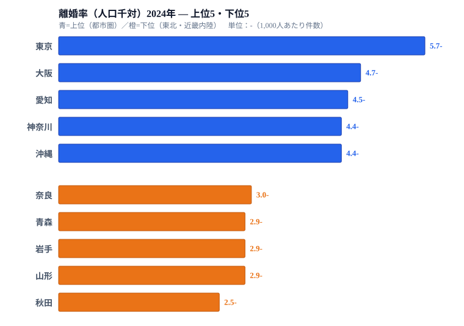

「離婚は都会の話」――そんな漠然とした印象には、実は統計的な裏づけがあります。2024年（令和6年）の人口動態統計で、東京都の離婚率は**5.7‐（人口千対）**、対して秋田県は**2.5‐**。同じ日本で**2.3倍**もの開きがあるのです。トップが東京、最下位が秋田というこの序列は2015年以降一度も入れ替わっておらず、「都市ほど離婚率が高い」という構造はすっかり固定化しています。

一方で、かつて高水準で知られた沖縄県は2015年の6.1‐から2024年の4.4‐へと9年で**28%も下落**し、現在は神奈川と並ぶ4位タイにまで後退しました。全国平均も2020〜2023年の4年間は下がり続けましたが、2024年は3.52→3.59へと微増に転じています。本記事では、この「都市型・農村型」という構造的な格差と、各地域が示す最新2024年のデータを掘り下げていきます。

> [!NOTE]
> 本データの「離婚率（‐）」は人口千対――つまり1,000人あたりの年間離婚件数を示す指標です。5.7‐とは、1,000人に対して5.7件の離婚が発生したことを意味します。出典はe-Stat「社会・人口統計体系」で、各年度末（3月31日基準）の数値です。離婚率が高い＝「離婚が多い土地」であり、婚姻中のカップルのうち何割が離婚したかを示す「離婚確率」とは別物である点に注意してください。

## 2024年 上位5県・下位5県の全体像

まずは上位・下位の顔ぶれを確認しましょう。

**上位5県（2024年）**は東京（5.7‐）・大阪（4.7‐）・愛知（4.5‐）・神奈川（4.4‐）・沖縄（4.4‐）と、三大都市圏が上位をほぼ独占しています。神奈川と沖縄は同じ4.4‐で4位タイです。一方、**下位5県**は奈良（3.0‐）・青森（2.9‐）・岩手（2.9‐）・山形（2.9‐）・秋田（2.5‐）と、東北と近畿内陸が占める構図になっています。

<source-link href="/ranking/divorces-per-total-population">離婚率ランキングをもっと見る（全47都道府県）</source-link>

上位と下位の差は、単純な数値以上に地理的な法則性を持っています。東京・大阪・愛知という三大都府県と、主要政令市を抱える神奈川・福岡などが上位を占め、東北6県のうち青森・岩手・山形・秋田の4県と、農村比率の高い近畿内陸の奈良が下位に固まっています。これは偶然の一致ではなく、以下に述べる構造的な理由があるのです。なお、人口集中そのものの全体像は[人口増加率ランキング](/ranking/population-growth-rate)と合わせて読むと立体的に見えてきます。

## なぜ都市ほど離婚率が高いのか

### 経済的自立と「離婚を選べる」環境

離婚には経済的な選択肢が必要です。仕事と収入があれば、一人でも生活を立て直せます。東京・大阪・愛知といった就業機会の豊富な大都市では、女性が離婚後も安定した収入を得やすく、「経済的に困難でも婚姻を続けざるをえない」という圧力が相対的に低くなります。

> [!TIP]
> 離婚率の高低は「婚姻の質」や「幸福度」とイコールではありません。「離婚を選択できる環境が整っている」ことの反映でもあります。共働き率・女性就業率の高い都市圏が高離婚率になりやすい構造は、他の先進国でも確認される傾向があります。高い＝悪い、低い＝良い、と単純に読まないのが正しい読み筋です。

### 地縁・親族プレッシャーの希薄さ

農村部では「離婚は家の恥」という地縁的・親族的な抑止力が、まだ機能しやすいです。同じ県内にずっと住み続けるコミュニティでは、離婚後の目線や噂が行動を制約します。東京に代表される大都市では匿名性が高く、親族との物理的距離もあります。「新天地で再出発」ができる流動性の高さが、離婚という選択のコストを下げているのです。

### 若者の流入と晩婚・早婚の混在

大都市は全国から若者を吸い込みます。その中には10代後半〜20代前半の「衝動的な婚姻」も含まれ、早婚は離婚率と正の相関を持つ傾向があります。一方、農村部は若者流出で婚姻件数自体が減り、残る婚姻は相対的に安定した関係が多くなる――という逆説も成り立ちます。

## 沖縄の「急落」：なぜ6.1‐から4.4‐へ

沖縄県の離婚率は2015年に6.1‐を記録し、当時は東京に次ぐ高さでした。それが2024年には4.4‐と1.7ポイント（-28%）下落し、現在は神奈川と並ぶ4位タイに後退しています。この急落には複数の要因が考えられます。

第一は**人口動態の変化**です。分子となる離婚件数が高止まりしていても、分母の人口が増えれば率は下がります。沖縄は全国で数少ない、出生率の高さに支えられて人口が増えてきた県です。人口千対で計算するため、人口増が離婚率を自動的に希薄化する面があります。この背景は[出生率ランキング](/ranking/total-fertility-rate)を見ると分かりやすいでしょう。

第二は**経済状況の変化**です。沖縄は長らく全国最低水準の平均所得を記録してきましたが、近年は観光業・情報サービス業などの成長が続き、若年層の就業環境が改善してきました。経済的苦境から生じる婚姻ストレスが、一定程度緩和されたとも読めます。

> [!WARNING]
> 沖縄の離婚率低下が「結婚の安定化」を直接示すとは断定できません。これは仮説段階の解釈であり、婚姻件数自体の変動、調査年次や集計基準の変更の有無、データの計測誤差なども併せて確認する必要があります。長期トレンドを読むには、婚姻件数など複数年・複数指標を組み合わせるのが不可欠です。「結ぶ」側の動きは[婚姻率ランキング](/ranking/marriages-per-total-population)と対で読むと精度が上がります。

## 東北が低い理由：「選択できない」と「選ばない」の交差

秋田・山形・岩手といった東北勢は、一貫して下位に並んでいます。ただし東北の低離婚率を「結婚が安定している」とシンプルに解釈するのは早計です。

最大の要因は**若者の流出**だと考えられます。結婚・離婚を経験する若い世代が東京・仙台へ流出し、残る人口の年齢構成が高齢化していきます。高齢者が多い人口では婚姻件数も離婚件数も絶対数が少なく、率が下がります。加えて、農村型コミュニティの維持による「離婚抑圧」も一定程度は機能している可能性があります。

ただし秋田の2.5‐は統計的に最低水準で、全国平均3.59‐との乖離はむしろ広がる傾向にあります。東京（5.7‐）と秋田（2.5‐）の格差は、2024年には2.28倍に達しました。

## 2024年：全国平均が4年ぶりに上昇

全国平均の離婚率は2020年（3.94‐）から2023年（3.52‐）まで4年連続で下がり続けました。コロナ禍に伴う婚姻件数の急減が、離婚件数も圧縮した影響があります。2022年以降、婚姻件数が若干回復し始め、2024年の全国平均は3.59‐と微増に転じました。

東京都も2024年には5.7‐と、2020〜2023年の低下局面から再び上昇しました。都市部では「コロナ後の婚姻ブーム」と「離婚件数の正常化」が重なっている可能性があります。この反転が一時的な揺り戻しなのか、長期トレンドの転換点なのかは、2025年以降のデータ推移を見るまで断定できません。

## まとめ：「都市型離婚」という構造的格差

2024年の離婚率ランキングが示す格差は、偶然や個人の事情によるものではなく、**経済的自立の容易さ・地縁プレッシャーの強度・若者人口の比率**という構造的な条件に規定されています。東京（5.7‐）と秋田（2.5‐）の2.3倍差は、日本の地域間格差の縮図の一つだといえます。

「離婚率が高い＝問題が多い」という単純な読み方は誤りで、「離婚という選択肢にアクセスしやすい社会環境」の反映でもあります。婚姻率・出生率・高齢化率と組み合わせて読むと、各地域の人口動態のパズルがより鮮明に見えてきます。最後に、両極にある[東京都の統計データ](/areas/13000)と[秋田県の統計データ](/areas/05000)を眺めると、離婚率の差が他のどんな指標と連動しているかが見えてくるはずです。

<source-link href="/ranking/divorces-per-total-population">離婚率ランキングをもっと見る（全47都道府県）</source-link>

## データ出典

e-Stat「社会・人口統計体系」離婚率（人口千対）、2024年。
