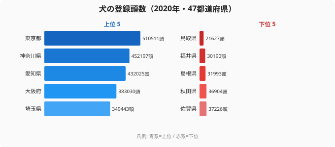

「犬を飼っている人が一番多い県はどこか?」と聞かれたら、北海道や長野のような自然豊かな県を思い浮かべる方も多いでしょう。しかし2020年の犬の登録頭数（狂犬病予防法に基づく市区町村への登録数）を都道府県別に並べると、トップは**東京都の51万511頭**です。続く神奈川県・愛知県・大阪府・埼玉県と、上位はすべて人口の多い大都市圏で占められました。

最下位の**鳥取県は2万1627頭**で、1位の東京都との差は約23.6倍です。ただし、この「差」は犬好きの県とそうでない県を本当に表しているのでしょうか。この記事では、絶対数ランキングを確認したうえで、「絶対数で犬好きを測ることの限界」と人口比で見たときの違いを整理します。

> [!NOTE]
> ここでいう「犬の登録頭数」は、狂犬病予防法に基づき各市区町村に登録された犬の数（2020年・衛生行政報告例）。飼育されていても未登録の犬は含まれず、登録率は自治体によって差があるとされています。あくまで「登録された頭数」であり、実際の飼育頭数そのものではない点に注意が必要です。

## 絶対数ランキング — 上位5と下位5

<source-link href="/ranking/dog-registration-count">犬の登録頭数ランキングをもっと見る（全47都道府県）</source-link>

上位5県（東京・神奈川・愛知・大阪・埼玉）はいずれも三大都市圏の中心部です。[東京都のプロフィール](/areas/13000)で人口を確認すると、東京都の人口は約1,400万人。一方、最下位の[鳥取県](/areas/31000)の人口は約55万人で、両者の人口差は約25倍です。このことから、23.6倍という登録頭数の差の大部分は、犬好き度の違いではなく**人口規模の差**を映していると考えるのが自然です。

> [!TIP]
> 1位の東京都（510,511頭）と最下位の鳥取県（21,627頭）の差は約23.6倍。47都道府県のなかでこれだけ開くと「犬好き度の差」に見えてしまいますが、東京都の人口は鳥取県の約25倍あります。格差の大半は人口規模の差で説明できる可能性が高いです。

## 最下位グループ — 人口の少ない県が並ぶ

最下位5県（鳥取・福井・島根・秋田・佐賀）はいずれも全国でも人口規模の小さい県です。鳥取県（21,627頭）・福井県（30,190頭）・島根県（31,993頭）・秋田県（36,904頭）・佐賀県（37,226頭）という顔ぶれは、そのまま「人口が少ない県ランキング」とほぼ一致しています。

これらの県の登録頭数が少ないのは「犬を飼う人が少ないから」というより、**そもそも飼い主になりうる世帯数が少ないから**と考えるのが適切です。絶対数のランキングは、ほぼ人口ランキングをなぞっています。

> [!WARNING]
> 絶対数のランキングは「規模の大きい県が上、小さい県が下」になりやすく、地域の特性（犬を飼う文化・住環境）を読み取りにくいという限界があります。たとえば集合住宅の多い都市部では飼育に制約がある一方、戸建て中心の地方では飼いやすいという仮説も立てられますが、絶対数だけではその差は見えません。

## 「犬好きの県」を測るなら人口比が必要

**絶対数のランキングと「住民あたりでどれだけ犬が飼われているか」は別の問いです。** 絶対数で1位の東京都は人口も全国最大なので、頭数が多いのは当然とも言えます。「住民あたりの犬の多さ」を測りたいなら、**登録頭数 ÷ 人口**で求める人口比（per-population）という指標が必要になります。

- **計算式**: 人口10万人あたり登録頭数 = 登録頭数 ÷ 人口 × 100,000
- 東京都（510,511頭）を人口で割ると、絶対数1位でも人口比では順位が大きく下がる可能性があります。逆に、絶対数では下位でも人口の少ない県が人口比で上位に浮上することもあります

[社会保障カテゴリのランキング一覧](/category/socialsecurity)では、人口比に正規化された犬の登録頭数ランキングも確認できます。

人口比（人口10万人あたり）で並べ替えると、絶対数で上位の大都市圏は順位を下げ、人口の少ない地方県が相対的に上位へ浮上する──「人口比で見える意外な犬好き県」が現れる可能性があります。この比較は、各県の登録頭数 ÷ 当該年人口 × 100,000 を計算し、絶対数順位との差（順位変動）を見ることで検証できます。

絶対数ランキングは「規模の地図」、人口比ランキングは「文化・習慣の地図」──同じデータでも、見たいものによって正しい物差しは変わります。

## まとめ

- 2020年の犬の登録頭数1位は**東京都（510,511頭）**、2位神奈川県（452,197頭）、3位愛知県（432,025頭）でした
- 最下位は**鳥取県（21,627頭）**で、1位東京都との差は約23.6倍ですが、この差の大部分は人口規模の違いで説明できます
- 上位10県は北海道（9位）を除き関東・東海・近畿・北部九州の大都市圏に集中しており、絶対数ランキングは人口規模をほぼ反映しています
- 下位は鳥取・福井・島根・秋田・佐賀と、人口規模の小さい県が並んでいます
- 「犬好きの県」を測るには、絶対数ではなく**人口比（登録頭数 ÷ 人口）**が必要で、物差しを変えると順位が逆転する可能性があります
- 「自分の住む地域でどれだけ犬が飼われているか」を確認したい場合は、ランキングページの「人口10万人あたり」正規化ビューをご利用ください

## データ出典

- 厚生労働省「衛生行政報告例」（2020年）。狂犬病予防法に基づく犬の登録頭数を、e-Stat 経由で整備したもの（統計表ID: 0004026908）
- 本記事中の登録頭数はすべて2020年の絶対数（実データ）。人口比に関する記述は計算枠組みおよび仮説であり、具体順位は正規化ビューを参照してください
