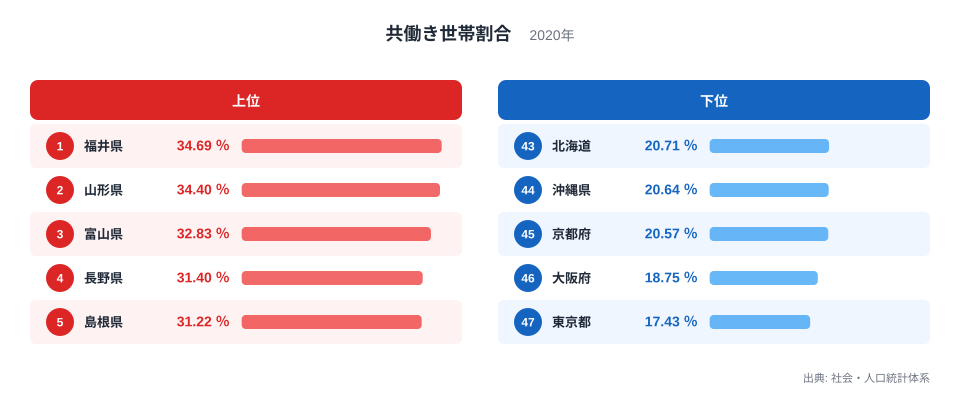
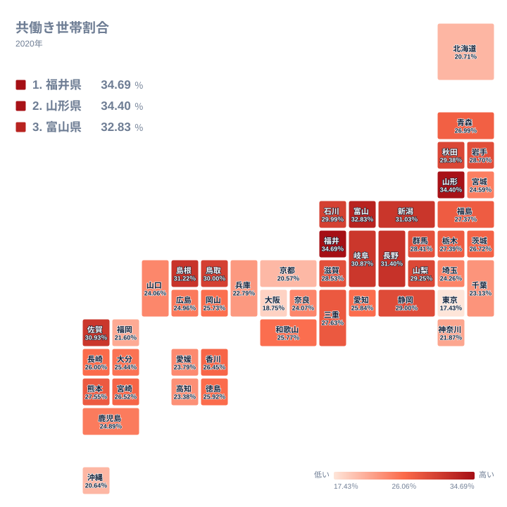
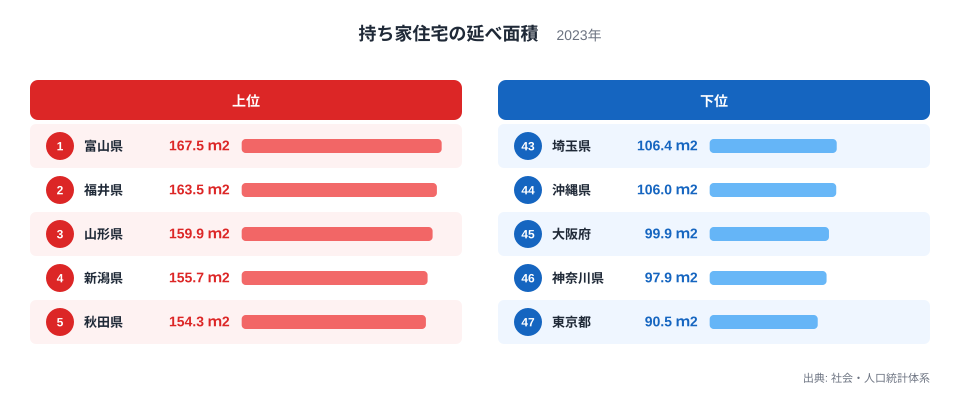
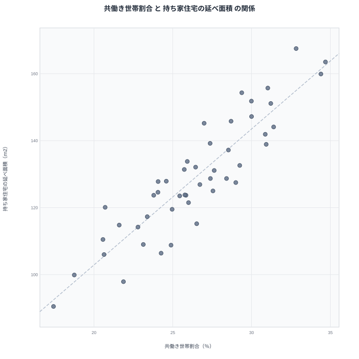

「共働きが多い県」と聞いて、どんな県を思い浮かべるでしょうか。保育園の待機児童対策が進んだ都市部を想像するかもしれませんが、データは逆を示します。共働き世帯割合の1位は福井県で34.69%、最下位は東京都で17.43%と、約2.0倍の開きがあります。

そしてもうひとつ、一見無関係に見える統計があります。持ち家住宅の延べ面積です。1位は富山県で167.5㎡、最下位は東京都で90.5㎡。この2つのランキングを並べると、上位の顔ぶれがほぼ同じであることに気づきます。実際、両者の相関係数は0.90という極めて強い値です。

なぜ「共働きの県」は「家が広い県」なのでしょうか。都市と地方の違いというだけでは説明しきれない構造を、データから読み解きます。

## 共働き世帯割合ランキング──北陸・山陰が上位を占めます

1位は福井県で34.69%です。2位は山形県で34.4%、3位は富山県で32.83%、4位は長野県で31.4%、5位は島根県で31.22%と続きます。1位から3位を北陸と東北の日本海側が占め、5位の島根県、6位の新潟県も日本海に面した県です。4位の長野県だけは内陸ですが、上位の顔ぶれが日本海側とその周辺に大きく偏っていることが分かります。

一方の下位を見ると、47位は東京都で17.43%、46位は大阪府で18.75%、45位は京都府で20.57%、44位は沖縄県で20.64%、43位は北海道で20.71%となっています。三大都市圏の中心と、北海道・沖縄が並ぶ形です。

「東京は共働きが多いはず」という直感と逆の結果に見えますが、これにはこの指標の分母が関係しています。

> [!NOTE]
> 共働き世帯割合は、共働き世帯数を一般世帯数で割った指標です（社会・人口統計体系、2020年国勢調査ベース）。分母には夫婦のいる世帯だけでなく単身世帯も含まれるため、一人暮らしが極端に多い東京都や大阪府では、夫婦の働き方に関係なく数値が低く出ます。「東京の夫婦は共働きしない」という意味ではない点に注意してください。

<source-link href="/ranking/dual-income-household-ratio">共働き世帯割合ランキングをもっと見る</source-link>

## 地図で見ると「日本海側の帯」が浮かびます

47都道府県を地図に落とすと、上位県の分布が偶然ではないことが分かります。秋田・山形・新潟・富山・石川・福井と、日本海沿いに濃い色の帯が連続しているのです。山陰でも島根県が5位、鳥取県が9位と高く、帯は本州の日本海沿岸をほぼ貫いています。内陸で唯一上位に入る長野県は、この帯に隣接する県です。

この地理的なまとまりは、単に「地方だから」では説明できません。同じ地方圏でも、太平洋側や九州・四国の多くの県は中位にとどまり、北海道は43位で20.71%と下位に沈みます。共働きの多さは「都市か地方か」という軸ではなく、「日本海側かどうか」という軸で分かれているのです。

日本海側の県には、後で見るように持ち家率や同居構造など、働き方に影響する生活基盤の共通点があります。あわせて見る: [福井県の県データ](/areas/18000) / [富山県の県データ](/areas/16000)

## 持ち家住宅の延べ面積──富山167.5㎡ vs 東京90.5㎡

次に、もうひとつの主役である住宅の広さを見ます。持ち家住宅1住宅あたりの延べ面積で、1位は富山県の167.5㎡です。2位は福井県で163.5㎡、3位は山形県で159.9㎡、4位は新潟県で155.7㎡、5位は秋田県で154.3㎡。共働きランキングとほぼ同じ顔ぶれが、順序を入れ替えて並びます。

下位は47位が東京都で90.5㎡、46位は神奈川県で97.9㎡、45位は大阪府で99.9㎡、44位は沖縄県で106㎡、43位は埼玉県で106.4㎡です。1位の富山県と最下位の東京都の差は約1.9倍。47都道府県の単純平均は129.1㎡なので、富山の持ち家は平均より約3割広く、東京の持ち家は平均より3割狭い計算になります。

なお、この指標は持ち家だけを集計した値で、借家を含む住宅全体の平均ではありません。玄関・台所・廊下・押入れなどを含む延べ面積で、共同住宅の共用廊下や別棟の物置・車庫は含まれません（2023年）。

<source-link href="/ranking/floor-area-per-dwelling-owner">持ち家住宅の延べ面積ランキングをもっと見る</source-link>

## 散布図で見る相関係数0.90

2つの指標を散布図にすると、47都道府県が右上がりの帯に沿ってきれいに並びます。相関係数は0.90で、都道府県統計の組み合わせとしてはかなり強い部類です。

右上の一角を占めるのは福井県・富山県・山形県・新潟県。左下には東京都・大阪府・京都府・沖縄県が固まります。両極端だけでなく、中位の県も概ね帯の中に収まっているのがこの相関の特徴です。

もちろん例外もあります。佐賀県は共働きでは7位で30.93%と高いものの、持ち家の広さでは14位で138.9㎡と、帯からやや下に外れます。長野県も共働き4位に対して広さは11位で144.1㎡です。逆に秋田県は、共働きでは11位で29.38%ながら、広さでは5位に入ります。相関が強いといっても、1対1の対応ではありません。

> [!WARNING]
> 相関は因果関係を意味しません。「家が広いから共働きになる」とも「共働きだから広い家を買える」とも、このデータだけからは言えません。また、共働き世帯割合は2020年の国勢調査、持ち家の延べ面積は2023年の調査に基づく値で、調査時点が3年ずれている点にも注意が必要です。

## 真因を考える──都市化だけでは説明できません

最初に思いつく説明は「都市か地方か」でしょう。都会は地価が高くて家が狭く、単身者が多いので共働き割合も低く出る。確かにこれは効いています。先ほど見たとおり、分母に単身世帯を含む指標の性質上、大都市の数値は構造的に低くなります。

しかし、それだけではないことを示すデータがあります。人口規模の影響を統計的に取り除いた偏相関係数を計算しても、0.84という強い相関が残るのです。「人口が多い県ほど家が狭く共働きが少ない」という都市化の説明だけでは、この2つの指標の結びつきは消えません。

残る説明として有力なのが、日本海側に共通する世帯構造です。北陸や山形は三世代同居や親との近居が多い地域として知られます。祖父母が育児を支える体制があれば、夫婦がともに働き続けやすくなります。同時に、複数世代が住む前提の家は必然的に大きくなります。つまり「広い家」と「共働き」は、どちらかが原因なのではなく、同居・近居という共通の生活基盤から同時に生まれている可能性が高いのです。

持ち家率や地価も同じ方向に働きます。地価が安く持ち家率が高い地域では、若い夫婦でも広い家を構えやすく、住宅費の負担が軽い分、通勤圏内で職を持ち続ける選択がしやすくなります。雪国の住宅が大きめに造られるという住文化の要素も無視できません。

> [!TIP]
> この相関の背景をさらに掘るなら、三世代同居率・持ち家率・通勤時間と合わせて見るのがおすすめです。共働き割合の高い県は、これらの指標でも特徴的な値を示す傾向があります。都道府県の暮らしの構造は、[住まいのテーマページ](/themes/living-housing)でまとめて確認できます。

「共働きの県ほど家が広い」という一見不思議な相関の正体は、日本海側の同居・持ち家構造という共通の土台でした。働き方の統計と住宅の統計は、別々の調査でありながら、地域の暮らしの形を同じ方向から映し出しています。

## データ出典

- 共働き世帯割合: 総務省統計局「社会・人口統計体系」（国勢調査報告に基づく2020年値）
- 持ち家住宅の延べ面積: 総務省統計局「社会・人口統計体系」（2023年値）
- 相関係数・偏相関係数は上記2指標の47都道府県値から算出
