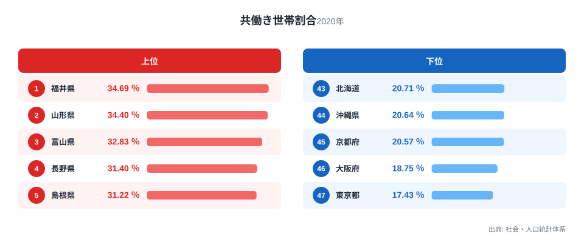
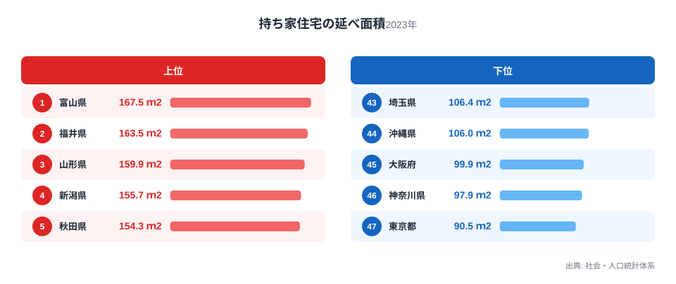

共働きで世帯収入を増やせば、より広い家に住めるはずだと考える方は多いと思います。ところが47都道府県のデータを並べてみると、共働き世帯の割合が高い県ほど持ち家の延べ面積が大きく、共働き世帯の割合が低い都市部の県ほど持ち家が狭いという関係が浮かび上がります。

一見すると意外なこの関係は、実は「共働きだから家が広い」という単純な因果関係ではありません。この記事では2つの指標をそれぞれランキングで確認したうえで、両者の関係を散布図で可視化し、その背後にある本当の理由を考えていきます。同じカテゴリの[人口・世帯統計の一覧](/category/population)もあわせてご覧ください。

## 共働き世帯が多い県、少ない県

<source-link href="/ranking/dual-income-household-ratio">共働き世帯割合ランキングをもっと見る</source-link>

共働き世帯割合が最も高いのは福井県で、34.69％です。[福井県のデータ](/areas/18000)を見ると、2位は山形県で34.4％、3位は富山県で32.83％と続きます。4位の長野県は31.4％、5位の島根県は31.22％となっており、上位はいずれも日本海側や内陸の県が並んでいます。共通しているのは、三世代同居や農業・製造業を背景とした共働き文化が根強い地域だという点です。

一方で共働き世帯割合が最も低いのは東京都で、17.43％にとどまります。46位は大阪府で18.75％、45位は京都府で20.57％、44位は沖縄県で20.64％、43位は北海道で20.71％です。大都市圏では共働きでない世帯や単身世帯の比率が高く、地方に比べて共働き世帯割合そのものが低く出る傾向があります。

## 持ち家はどのくらい広いのか

続いて[持ち家住宅の延べ面積ランキング](/ranking/floor-area-per-dwelling-owner)を見てみます。持ち家の延べ面積が最も大きいのは富山県で167.5平方メートルです。2位は福井県で163.5平方メートル、3位は[山形県のデータ](/areas/06000)によると159.9平方メートル、4位は新潟県で155.7平方メートル、5位は秋田県で154.3平方メートルとなっています。上位5県のうち富山県・福井県・山形県の3県は、先ほどの共働き世帯割合ランキングでも上位5県に入っていた県です。

延べ面積が最も小さいのは東京都で90.5平方メートルです。46位は神奈川県で97.9平方メートル、45位は大阪府で99.9平方メートル、44位は沖縄県で106平方メートル、43位は埼玉県で106.4平方メートルとなっています。下位5県のうち沖縄県・大阪府・東京都の3県は、共働き世帯割合ランキングでも下位5県に含まれていました。上位・下位ともに約6割の県が重なっているという点は、単なる偶然とは考えにくい数字です。

> [!NOTE]
> 持ち家住宅の延べ面積は「持ち家」に住む世帯だけを対象にした数値で、賃貸住宅は含まれません。都市部は賃貸住宅の比率が高いため、この数値だけでは都市部に住む世帯全体の居住スペースを表しているわけではない点に注意してください。

## 散布図で見る2つの指標の関係

47都道府県を横軸に共働き世帯割合、縦軸に持ち家住宅の延べ面積を取って散布図に落とすと、右肩上がりの傾向がはっきりと見えます。共働き世帯割合が30％を超える福井県・山形県・富山県・長野県・島根県は、いずれも持ち家の延べ面積でも上位に位置しています。反対に共働き世帯割合が20％を下回る東京都・大阪府・京都府は、持ち家の延べ面積でも下位に集中しています。

この右肩上がりの傾向は、共働き世帯割合が高いほど自動的に家が広くなるという意味ではありません。散布図が示しているのはあくまで2つの指標が同じ方向に動いているという事実だけで、一方が他方の原因になっているとは限らないからです。

散布図の中央付近を見ても同じ傾向が続いています。愛知県は共働き世帯割合が25.84％、持ち家住宅の延べ面積が123.7平方メートルで、どちらも全国のちょうど真ん中あたりに位置します。千葉県は共働き世帯割合が23.13％、延べ面積が109平方メートルとやや低めで、兵庫県は共働き世帯割合22.79％、延べ面積114.2平方メートルとこちらも低めです。両端だけでなく中央付近の県も含めて、2つの指標がほぼ同じ順序で並んでいることが分かります。

> [!WARNING]
> この記事で扱う2つの指標は相関を示していますが、因果関係を証明するものではありません。共働き世帯割合は2020年、持ち家住宅の延べ面積は2023年の数値であり、調査年も異なります。異なる時点のデータを重ねて見ている点にも留意してください。

## 見かけの相関の裏にある本当の理由

では、なぜこの2つの指標は同じ方向に動くのでしょうか。手がかりは、上位に並ぶ県と下位に並ぶ県の顔ぶれにあります。上位の福井県・山形県・富山県・長野県・島根県は、いずれも人口密度が低く地価が比較的安い地方の県です。地価が安ければ同じ予算でもより広い土地を確保でき、持ち家の延べ面積は自然と大きくなります。加えてこうした地域では、祖父母世代と同居する三世代世帯や、農業・地場産業を家族で担う世帯が多く、共働き世帯割合も高く出やすい構造があります。

反対に下位の東京都・大阪府・神奈川県・埼玉県・沖縄県は人口が集中し地価が高い地域です。地価が高い都市部では住宅を広くすること自体が難しく、持ち家の延べ面積は小さくなります。共働き世帯割合が低いのは、都市部では単身世帯や共働きでない世帯の割合が構造的に高いためで、必ずしも「都市部の夫婦は働いていない」ことを意味しません。

つまりこの相関の背後にあるのは、共働きという働き方そのものではなく、人口密度や地価、世帯構成といった地域構造だと考えられます。共働き世帯割合と持ち家の延べ面積は、どちらも同じ「地方か都市か」という土台の上で動いている、いわば兄弟のような関係にあるといえます。

中央付近に位置する愛知県のような製造業の盛んな県は、この構造をよく表しています。愛知県は共働き世帯割合・持ち家の延べ面積のどちらも全国のほぼ中間に位置しており、都市部ほど地価は高くないものの、地方の県ほど広い土地が余っているわけでもありません。地価水準と世帯構成が中間的であれば、2つの指標もそろって中間的な値に落ち着くという見方と整合的です。上位・下位・中間のいずれの位置でも同じ傾向が続いていることは、この関係が偶然ではなく地域構造に根ざしていることを裏づけています。

> [!TIP]
> この記事の2つの指標を読み解くときは、県の人口密度や地価のランキングとあわせて見ると理解が深まります。共働き世帯割合や住宅の広さの背後に、地価や世帯構成という共通の土台が隠れていないかを確認する視点が役立ちます。

## まとめ

47都道府県のデータを見比べると、次のことが分かりました。

- 共働き世帯割合は福井県が34.69％で最も高く、東京都が17.43％で最も低いです。
- 持ち家住宅の延べ面積は富山県が167.5平方メートルで最も大きく、東京都が90.5平方メートルで最も小さいです。
- 上位5県・下位5県のいずれも約6割の県が両方のランキングで重なっており、右肩上がりの関係が見られます。
- ただしこの関係は因果関係ではなく、人口密度や地価、世帯構成といった地域構造が共通の背景にあると考えられます。
- 2つの指標を見るときは、調査年が異なる点と、相関イコール因果ではない点に注意が必要です。

## データ出典

共働き世帯割合は社会・人口統計体系の2020年データ、持ち家住宅の延べ面積は社会・人口統計体系の2023年データを、e-Stat経由で取得・集計しました。
