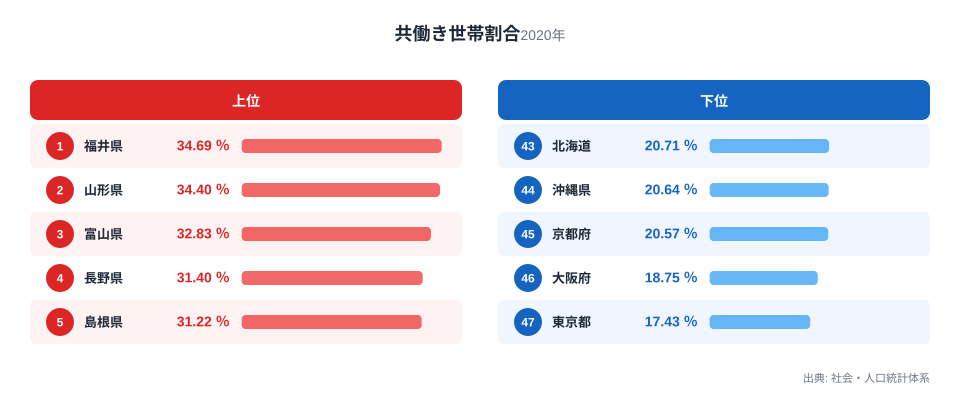
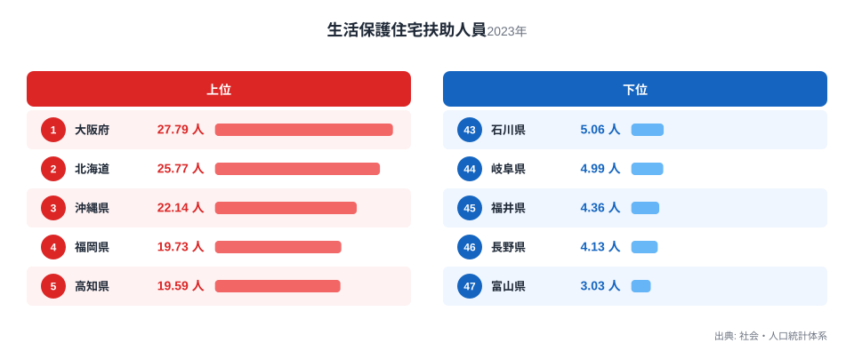

共働き世帯が多い県では、暮らしにどんな特徴が表れるのでしょうか。47都道府県の共働き世帯割合と、生活保護の住宅扶助を受けている人の数を並べてみると、ひとつの傾向が浮かび上がります。共働き世帯割合が高い県ほど、生活保護住宅扶助人員が少ない傾向があるのです。

共働き世帯割合の1位は福井県で34.69％、生活保護住宅扶助人員の1位は大阪府で27.79人です。1位どうしがまったく違う顔ぶれになっている点に、まず注目してください。この記事では2つの指標をそれぞれ見たうえで、両者を重ね合わせた散布図から見える関係と、その背後にありそうな地域構造を考えます。ただし、相関関係がそのまま因果関係を意味するわけではない点にも触れます。住宅にかかる費用の重さが世帯の働き方とどうつながっているのかを考えるヒントにもなります。

> [!NOTE]
> 共働き世帯割合は、一般世帯のうち夫婦がともに就業している世帯の割合を示す指標です。生活保護住宅扶助人員は、生活保護のなかで家賃相当額を扶助として受けている人の数を示しています。どちらも社会・人口統計体系に基づく指標ですが、集計対象や調査年が異なるため、単純に同じ土俵で比較する際には注意が必要です。

## 共働き世帯割合が高い県、低い県

<source-link href="/ranking/dual-income-household-ratio">共働き世帯割合ランキングをもっと見る</source-link>

共働き世帯割合の上位には、北陸と東北の県が並びます。福井県は34.69％で1位、山形県は34.4％で2位、富山県は32.83％で3位です。4位の長野県は31.4％、5位の島根県は31.22％で、いずれも30％を超えています。[福井県のデータ](/areas/18000)や[山形県のデータ](/areas/06000)を見ると、農業や地場産業を家族で支える世帯や、三世代同居によって子育てと就業を両立しやすい世帯が多いという地域の特徴がうかがえます。

一方で下位に並ぶのは大都市圏です。東京都は17.43％で最も低く、大阪府は18.75％で46位、京都府は20.57％で45位です。沖縄県は20.64％で44位、北海道は20.71％で43位となっています。大都市圏では単身世帯や、夫婦のどちらかだけが働く世帯の比率が高く、地価や家賃の高さが世帯の働き方に影響していると考えられます。

## 生活保護住宅扶助人員が多い県、少ない県

生活保護住宅扶助人員は、大都市圏や条件の厳しい地域で高い値になっています。大阪府は27.79人で1位、北海道は25.77人で2位、沖縄県は22.14人で3位です。4位の福岡県は19.73人、5位の高知県は19.59人と続きます。あわせて見る: [生活保護住宅扶助人員ランキング](/ranking/public-assistance-housing-beneficiaries-per-1000)。住宅費が高い都市部や、産業構造の変化で雇用機会が減った地域で、住宅扶助を受ける人が多くなる傾向がうかがえます。

反対に少ないのは北陸と甲信越です。富山県は3.03人で最も少なく、長野県は4.13人で46位、福井県は4.36人で45位です。岐阜県は4.99人で44位、石川県は5.06人で43位となっています。これらの県は、先ほどの共働き世帯割合ランキングで上位に入っていた顔ぶれとかなり重なっています。

## 共働き世帯割合と生活保護住宅扶助人員の関係

散布図で47都道府県を並べると、右下から左上へと連なるような形が見えます。共働き世帯割合が高い県ほど、生活保護住宅扶助人員が少ない側に位置する傾向です。この関係の強さを相関係数で確認すると約マイナス0.85となり、47都道府県のデータとしてはかなり強い負の相関です。富山県、福井県、長野県は共働き世帯割合が30％を超える一方で、生活保護住宅扶助人員はいずれも5人を下回っています。逆に大阪府と北海道は、共働き世帯割合が全国のなかでも低い部類に入りながら、生活保護住宅扶助人員は20人を超えています。

> [!TIP]
> 相関係数マイナス0.85は、47都道府県の統計データとしてはかなり強い部類に入ります。ただし相関係数が強いからといって、すべての県がその傾向に完全に従うわけではありません。次に見る福岡県や東京都のような例外にこそ、単純な相関だけでは説明できない地域固有の事情が表れています。

ただし、すべての県がこの傾向どおりに並ぶわけではありません。福岡県は共働き世帯割合が21.6％で42位と低いにもかかわらず、生活保護住宅扶助人員は19.73人で4位と高く、東京都は共働き世帯割合が17.43％で最も低い一方、生活保護住宅扶助人員は17.61人で7位にとどまっています。共働き世帯割合が低い都市であっても、住宅扶助を受ける人の多さには差があります。

> [!WARNING]
> 相関係数がマイナス0.85と強く出ていても、これは相関関係であって因果関係ではありません。都道府県の人口規模（総人口）の影響を統計的に取り除いた偏相関係数で確認しても約マイナス0.82とほぼ同じ強さの関係が残るため、都市か地方かという単純な違いだけでは説明しきれない要因が背後にあると考えられます。共働き世帯が増えれば住宅扶助が減る、といった直接の因果を示すものではない点に注意してください。

## 見かけの相関の背後にあるもの

共働き世帯割合が高い県で生活保護住宅扶助人員が少なくなる背景には、いくつかの要因が重なっていると考えられます。考えられる要因のひとつは、持ち家率の違いです。地方では持ち家に住む世帯の割合が高く、家賃の支払いが発生しない世帯が多いため、住宅扶助の対象になりにくいと考えられます。もうひとつは産業構造の違いです。大都市圏では非正規雇用や単身世帯が多く世帯収入が不安定になりやすい一方、地方では農業や地場産業を家族で支える共働き世帯が多く、世帯全体で収入を確保しやすい構造があると考えられます。

一方で、共働き世帯割合が低いからといって、そのまま生活保護住宅扶助人員が多くなるとは限りません。福岡県のように、共働き世帯割合はそれほど極端に低くなくても住宅扶助を受ける人が多い県もあり、高齢化率や単身高齢者世帯の多さといった、この記事では扱っていない要因が影響している可能性があります。両方の指標に共通して影響する別の要因が存在する可能性を踏まえて読む必要があります。

世帯の年齢構成も関係している可能性があります。地方では高齢の夫婦がともに農業や家業に携わり、就業を続けることで世帯収入を維持しやすい面があります。一方、大都市圏では高齢の単身世帯が増えており、就業が難しくなった高齢者が住宅扶助を必要とする場面も多いと考えられます。持ち家率、産業構造、世帯の年齢構成という複数の要因が重なり合って、共働き世帯割合と生活保護住宅扶助人員の見かけの相関を作り出していると考えるのが妥当です。詳しくは[同じカテゴリの統計一覧](/category/population)からほかの人口関連の指標もあわせて確認してみてください。

## まとめ

- 共働き世帯割合の1位は福井県で34.69％、生活保護住宅扶助人員の1位は大阪府で27.79人です。
- 共働き世帯割合の上位県は北陸・東北・甲信越に集中し、いずれも30％を超えています。
- 生活保護住宅扶助人員の上位県は大阪府、北海道、沖縄県など大都市圏や条件の厳しい地域に集中しています。
- 散布図では共働き世帯割合が高い県ほど生活保護住宅扶助人員が少ない傾向が見られますが、福岡県や東京都のように傾向から外れる県もあります。
- 2つの指標の関係は相関であり、持ち家率や産業構造など複数の要因が背景にあると考えられます。

## データ出典

共働き世帯割合は社会・人口統計体系の2020年データ、生活保護住宅扶助人員は同じく社会・人口統計体系の2023年データを用いています。
