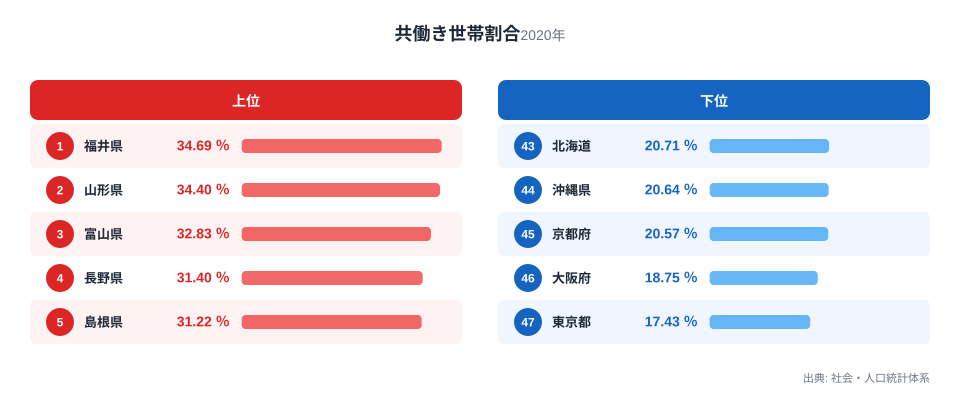
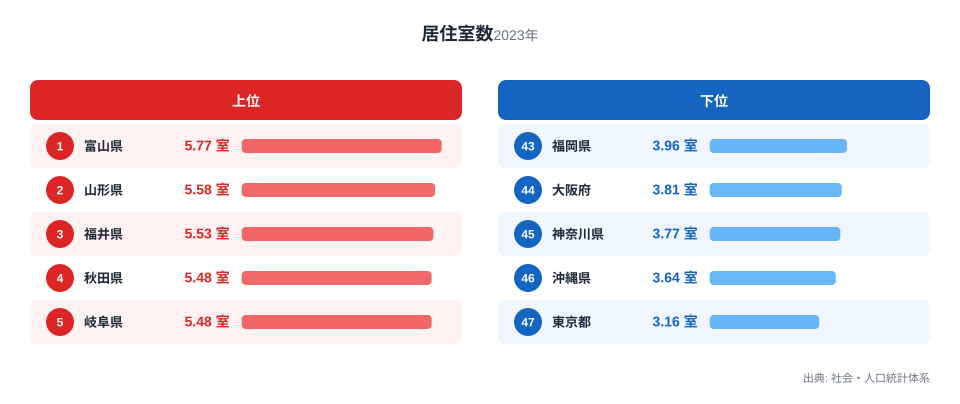

共働き世帯が多い県ほど、住まいの部屋数も多い傾向があります。47都道府県の共働き世帯割合と居住室数を並べてみると、両方の指標で上位に来る県と、両方で下位に沈む県がかなり重なっているのです。

一見すると「共働きだから広い家に住める」という単純な話に見えるかもしれません。ですが、この記事で2つの指標を重ねてみると、話はもう少し込み入っていることが分かります。部屋数の多さが共働きを後押ししているのか、それとも別の何かが両方の背景にあるのか、データから読み取れる範囲で確かめていきます。また、東京都のように両方の指標がそろって全国最下位になる県がある一方、奈良県のようにどちらか一方だけが突出する県もあり、その違いにこの記事の焦点があります。

## 共働き世帯割合の上位と下位

<source-link href="/ranking/dual-income-household-ratio">共働き世帯割合ランキングをもっと見る</source-link>

共働き世帯割合の全国1位は福井県で、34.69％です。2位は山形県の34.4％、3位は富山県の32.83％と続き、4位の長野県が31.4％、5位の島根県が31.22％です。

上位には北陸・東北・山陰の県が目立つ一方、4位の長野県、7位の佐賀県、8位の岐阜県のように、これらの地域に含まれない県も入っています。新潟県が31.03％で6位、佐賀県が30.93％で7位、岐阜県が30.87％で8位と続きます。9位の鳥取県は30％、10位の石川県は29.99％で、10位までがすべて29％台後半から34％台に収まっており、上位県どうしの水準差は比較的小さいことが分かります。

一方で最下位は東京都の17.43％です。46位は大阪府の18.75％、45位は京都府の20.57％、44位は沖縄県の20.64％、43位は北海道の20.71％と、大都市を抱える府県と沖縄・北海道が下位に集まっています。

> [!NOTE]
> 共働き世帯割合は、夫婦のいる世帯のうち妻も就業している世帯の割合を指す統計です。育児休業中や求職中の扱いは調査年によって変わることがあるため、他の年の数値と単純に並べて比較するときは注意が必要です。

## 居住室数の上位と下位

居住室数で全国1位なのは富山県で、5.77室です。2位は山形県の5.58室、3位は福井県の5.53室、4位は秋田県の5.48室、5位は岐阜県の5.48室と、共働き世帯割合の上位県がそのまま並びます。上位10県のほとんどが共働き世帯割合でも上位に入っています。

<source-link href="/ranking/rooms-per-dwelling">居住室数ランキングをもっと見る</source-link>

6位の新潟県と7位の鳥取県はともに5.4室で並び、居住室数の上位10県は5室前後に集中しています。

最下位は東京都の3.16室です。46位は沖縄県の3.64室、45位は神奈川県の3.77室、44位は大阪府の3.81室、43位は福岡県の3.96室と続き、こちらも共働き世帯割合の下位グループとほぼ同じ顔ぶれです。

とりわけ東京都は共働き世帯割合でも居住室数でも全国最下位で、住まいの規模と働き方の両面で他の道府県と際立った差があります。首都圏の住宅事情と共働き世帯の少なさが、同じ地域で同時に起きている点は注目に値します。首都圏や近畿圏の都府県で部屋数が少なくなりやすいのは、住宅地の価格や敷地の広さの違いが背景にあるという見立てもできますが、この記事のデータだけでは検証できません。

## 二つの指標を重ねると見えてくること

共働き世帯割合を横軸、居住室数を縦軸にして47都道府県をプロットすると、右上と左下に県が集まる、強い相関(相関係数は約0.88です)が見えてきます。共働き世帯割合が高い県ほど居住室数も多く、共働き世帯割合が低い県ほど居住室数も少ないという、はっきりとした右肩上がりの関係です。

新潟県はどちらのランキングでも6位につけており、両方の指標が同じ順位で並ぶ珍しい例です。福井県・山形県・富山県も、共働き世帯割合と居住室数の両方で上位5位以内に入っており、この3県が今回の関係を最もよく体現しています。三重県も共働き世帯割合で17位、居住室数で14位と順位の差が小さく、右肩上がりの並びに沿った県の一つです。

ただし、この右肩上がりの並びをそのまま「部屋数が多いから共働きしやすい」あるいは「共働きだから広い家を建てられる」と読むのは早計です。同じ方向に動いているように見える2つの指標の裏に、両方に影響する別の要因が隠れている可能性があるからです。人口規模の違いだけでこの関係が生まれているとも考えられます。人口の少ない県ほど地価が安く広い家を建てやすく、同時に人口の少ない地方ほど共働き世帯割合が高い、という間接的なつながりです。ところが、人口規模の影響を取り除いて計算し直しても、共働き世帯割合と居住室数の相関係数は約0.80と、なお強く残ります。人口規模だけではこの関係を説明しきれておらず、住宅事情や世帯構成など、ほかの要因も背景にあると考えられます。

> [!WARNING]
> ここで示した関係は、共働き世帯割合(2020年)と居住室数(2023年)という調査年が異なる2つの指標を重ねたものです。並びが似ていても、一方がもう一方の原因になっているとは限りません。持ち家率や世帯人数など、両方の指標に影響する別の要因が背景にある可能性があります。

## 相関から外れる県: 奈良県の位置

上で見た並びには、はっきりと外れる県が1つあります。奈良県です。奈良県は共働き世帯割合が24.07％で全国35位にとどまる一方、居住室数は5.21室で全国9位と、共働き世帯割合の順位と居住室数の順位のあいだに大きな開きがあります。

奈良県は大阪府や京都府への通勤者が多い住宅地としての性格を持つ県だと考えられます。持ち家が多く部屋数の多い住宅が並ぶ一方で、共働き世帯割合は上位県ほど高くありません。この記事のデータだけから理由を考えるなら、居住室数の多さが必ずしも共働き世帯割合を押し上げるわけではないことを、奈良県のケースは示しています。ただしこれは1つの見立てにすぎず、実際の理由を確かめるには世帯人数や通勤時間など、他の指標との突き合わせが必要です。

奈良県とは逆方向の乖離も見られます。静岡県は共働き世帯割合で13位と上位に位置する一方、居住室数は27位にとどまり、熊本県も共働き世帯割合18位に対し居住室数は33位です。奈良県が「居住室数は多いが共働き世帯割合は低い」県であるのに対し、静岡県と熊本県は「共働き世帯割合は高いが居住室数は伸びない」県で、乖離の向きが逆になっています。こうした県では、部屋数の多さがそのまま共働き世帯割合の高さに結びついているわけではなさそうです。

奈良県のような例外があることは、共働き世帯割合と居住室数の関係を「部屋数が理由で共働きが増える」と単純化できない証拠でもあります。共働き世帯割合が属する[人口関連の統計一覧](/category/population)には、世帯や人口に関する他の指標も並んでいるので、あわせて見ると理解が深まります。

> [!TIP]
> 共働き世帯割合も居住室数も、都道府県単位でならした平均値です。同じ県のなかでも都市部と郊外で世帯のあり方はかなり違うため、住む場所を具体的に考えるときは、[福井県のデータ](/areas/18000)や[山形県のデータ](/areas/06000)のように、県単位よりさらに細かい情報もあわせて確認すると実態に近づきます。

## まとめ

- 共働き世帯割合の全国1位は福井県の34.69％、最下位は東京都の17.43％です。
- 居住室数の全国1位は富山県の5.77室、最下位は東京都の3.16室です。
- 東京都は共働き世帯割合・居住室数のいずれも全国最下位で、両指標が同時に落ち込んでいます。
- 福井県・山形県・富山県・新潟県は両方の指標で上位に入り、右肩上がりの関係を体現しています。
- 奈良県は居住室数が全国9位と多い一方、共働き世帯割合は35位にとどまり、この関係の例外にあたります。
- 三重県や新潟県のように、共働き世帯割合と居住室数の順位の差が小さい県も多く見られます。

## データ出典

共働き世帯割合(2020年)・居住室数(2023年)はいずれも社会・人口統計体系(総務省統計局)の集計値です。e-Stat経由で取得したデータをもとに作成しています。
