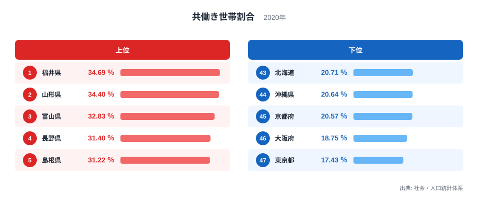
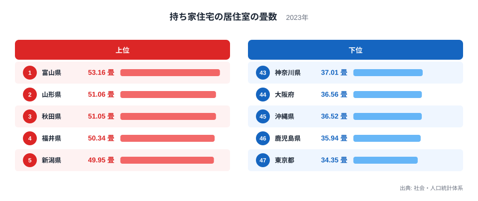
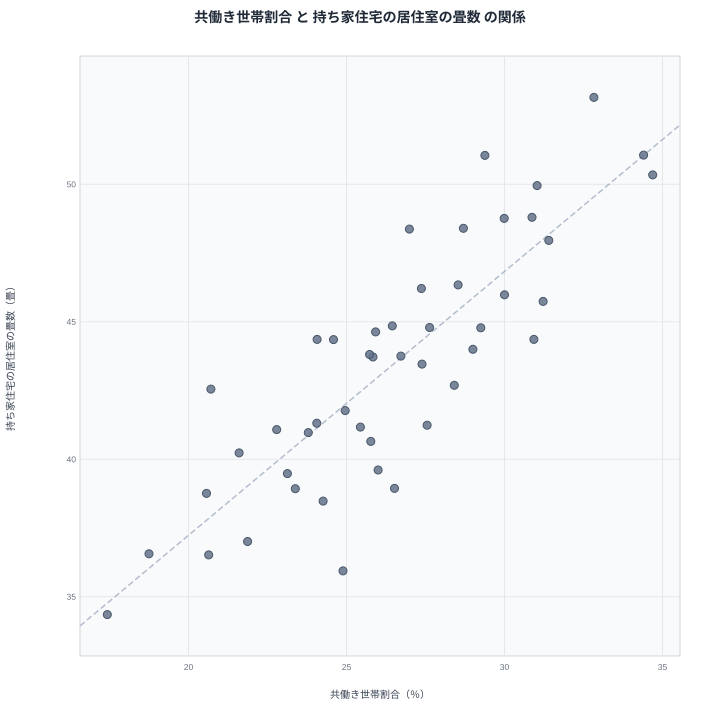

日本には、共働き世帯が多い地域ほど持ち家が広いという、ちょっとした噂のような並びがあります。実際に都道府県別のデータを並べてみると、共働き世帯割合が高い県ほど、持ち家に住む世帯の居住室の畳数も多い傾向が見えてきます。共働き世帯割合が最も高いのは福井県で34.69パーセント、最も低いのは東京都で17.43パーセントとなっており、その差はおよそ2倍に達します。一方、持ち家の居住室の畳数が最も多いのは富山県で53.16畳、最も少ないのは東京都で34.35畳と、こちらもおよそ1.5倍の開きがあります。二つの指標を重ねてみると、たしかに右肩上がりの並びが浮かび上がります。しかし、共働きをすれば家が広くなるというような直接の因果関係が本当に成り立つのでしょうか。この記事では、二つの指標をそれぞれランキングで確認したうえで、散布図で関係を可視化し、その背後にある本当の理由を探っていきます。

> [!NOTE]
> 共働き世帯割合は2020年、持ち家住宅の居住室の畳数は2023年の数値です。集計年が3年離れているため、同じ年の状況を切り取った数字ではない点に注意してください。

## 共働き世帯割合の高い県、低い県

まず共働き世帯割合から見ていきます。共働き世帯割合は、夫婦のいる世帯のうち、夫婦とも仕事に就いている世帯の割合を示す指標です。上位は北陸や東北、山陰の県が並びます。福井県が34.69パーセントで最も高く、僅差で山形県が34.4パーセント、富山県が32.83パーセントと続きます。4位の長野県、5位の島根県まで、いずれも30パーセントを超えています。福井県の詳しい統計は[福井県のデータ](/areas/18000)からも確認できます。

一方で下位に並ぶのは、東京都、大阪府、京都府、沖縄県、北海道といった大都市圏や、観光・サービス業の比重が大きい地域です。東京都は17.43パーセントで最下位、大阪府は18.75パーセントで46位、京都府は20.57パーセントで45位となっています。上位の福井県と下位の東京都を比べると、共働き世帯割合にはおよそ2倍の差があることになります。

<source-link href="/ranking/dual-income-household-ratio">共働き世帯割合ランキングをもっと見る</source-link>

上位に共通するのは、製造業や農業などの就業構造が伝統的に残り、共働きが当たり前とされてきた地域だという点です。福井県や富山県は繊維業や機械工業が盛んで、女性の労働力率が全国でも高い水準にあります。山形県や新潟県も同様に、農業や地場産業を支える形で共働き世帯が定着してきました。逆に下位の都市部では、単身世帯や、共働きでない世帯の比率が高く、産業構造もサービス業や情報通信業に偏っているため、夫婦がともに働く世帯の割合は相対的に低くなります。

## 持ち家住宅の畳数が広い県、狭い県

次に、持ち家に住む世帯の居住室の畳数を見ていきます。この指標が最も多いのは富山県で53.16畳、僅差で山形県が51.06畳、秋田県が51.05畳と続きます。4位の福井県、5位の新潟県まで、いずれも50畳前後です。北陸と東北の県が上位を占める点は、共働き世帯割合の並びとよく似ています。山形県は共働き世帯割合、畳数のどちらの指標でも上位に入っており、[山形県のデータ](/areas/06000)からあわせて確認できます。

> [!WARNING]
> 畳数の指標は持ち家に住む世帯だけを対象にしています。借家やアパートに住む世帯の住環境は含まれていないため、都道府県全体の住宅事情を表しているわけではない点に注意してください。

下位に目を向けると、東京都が34.35畳で最下位、鹿児島県が35.94畳で46位、沖縄県が36.52畳で45位となっています。大阪府も36.56畳で44位に沈んでいます。持ち家に住む世帯だけを比べても、住宅の広さには都市部と地方で大きな差があることが分かります。最も広い富山県と最も狭い東京都の差は、およそ1.5倍です。畳数の全国順位は[持ち家住宅の居住室の畳数ランキング](/ranking/tatami-per-dwelling-owner)でも確認できます。

広さの差を生む大きな要因のひとつは、地価の違いです。地方は宅地の価格が低いため、同じ予算でも敷地の広い家を建てやすくなります。都市部では土地の価格が高いために住宅が小さくならざるを得ず、集合住宅も多くなります。こうした住宅事情の違いは、共働きかどうかとは別の理由で、畳数の差を生んでいると考えられます。

## 散布図で見る相関関係

共働き世帯割合と持ち家の畳数を、都道府県ごとに散布図で重ねてみると、右肩上がりの並びがはっきりと見えます。共働き世帯割合が高い県ほど、畳数も多い傾向にあるということです。福井県や山形県、富山県、新潟県といった北陸・東北の県は、どちらの指標でも上位に固まっています。逆に東京都、大阪府、京都府は、どちらの指標でも下位に位置しています。

ただし、二つの指標の並びが完全に一致しているわけではありません。秋田県は共働き世帯割合こそ11位の29.38パーセントにとどまりますが、畳数では3位の51.05畳と大きく上位に食い込んでいます。反対に佐賀県は共働き世帯割合が7位の30.93パーセントと高いのに対して、畳数は20位の44.36畳にとどまっています。こうしたずれがあることは、共働き世帯割合だけで畳数の広さを説明しきれないことを示しています。

散布図全体を見渡すと、点はきれいな一本の線に沿っているわけではなく、ある程度の幅を持って広がっています。右肩上がりの傾向自体は読み取れるものの、二つの指標の関係にはばらつきが残っていることがわかります。

## 相関の裏にある本当の理由

見かけ上の相関があるからといって、共働き世帯が増えれば家が広くなる、あるいは家が広いから共働きになる、という直接の因果関係があるとは限りません。両者の背後には、地価や産業構造という共通の要因が隠れている可能性があります。

> [!TIP]
> 二つの指標が同じ方向に動いているのを見つけたら、片方がもう片方の原因だと決めつける前に、地価や産業構造のような共通の背景要因がないかを疑ってみると、数字の読み方が一段深くなります。

地方の県では宅地が安く、農地や工場を抱えた広い土地に住宅を構えやすいため、自然と一戸あたりの畳数が増えます。同じ地域では、農業や地場の製造業に従事する世帯が多く、夫婦がともに働く共働き世帯の割合も高くなる傾向があります。つまり、地価の安さや産業構造という共通の背景が、共働き世帯割合と持ち家の畳数の両方を同時に押し上げている可能性があるということです。これは共働き世帯割合が畳数の原因になっているのではなく、二つの指標が同じ土台の上に乗っているために似た並びになっている、という見方です。

都市部で共働き世帯割合が低く畳数も少ないのも、同じ理屈で説明できます。東京都や大阪府は地価が高いために住宅が狭くなりやすく、同時にサービス業中心の産業構造のもとで、共働きでない世帯も多く存在します。二つの指標が同時に低くなっているのは、共働きと住宅の広さが直接結びついているからではなく、都市化の度合いという共通の背景を反映しているためだと考えられます。共働き世帯割合や住宅に関する他の指標は、[同じカテゴリの統計一覧](/category/population)にまとまっています。

## まとめ

- 共働き世帯割合は福井県が34.69パーセントで1位、東京都が17.43パーセントで最下位で、差はおよそ2倍です
- 持ち家住宅の畳数は富山県が53.16畳で1位、東京都が34.35畳で最下位で、差はおよそ1.5倍です
- 散布図では共働き世帯割合が高い県ほど畳数も多い右肩上がりの傾向が見られます
- 秋田県や佐賀県のように、両指標の順位が大きくずれる県もあり、完全な相関ではありません
- 相関の背景には地価や産業構造といった共通の要因があると考えられ、共働きが家を広くするという直接の因果関係を示すものではありません

## データ出典

共働き世帯割合、持ち家住宅の居住室の畳数は、いずれも社会・人口統計体系によります。共働き世帯割合は2020年、持ち家住宅の居住室の畳数は2023年の数値です。
