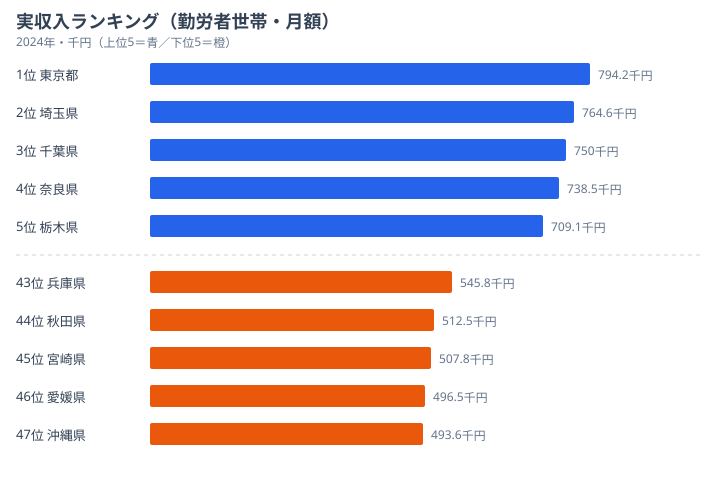
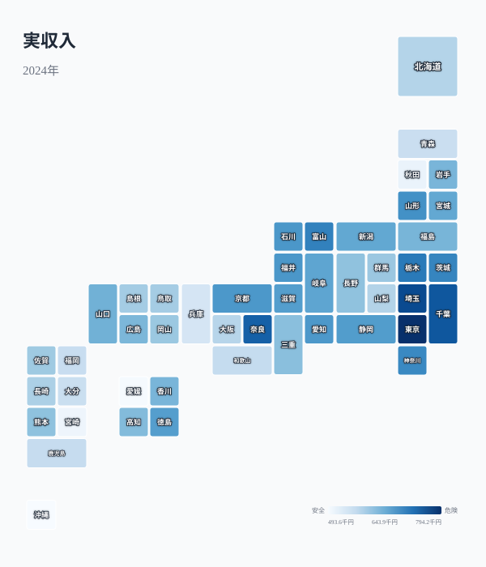
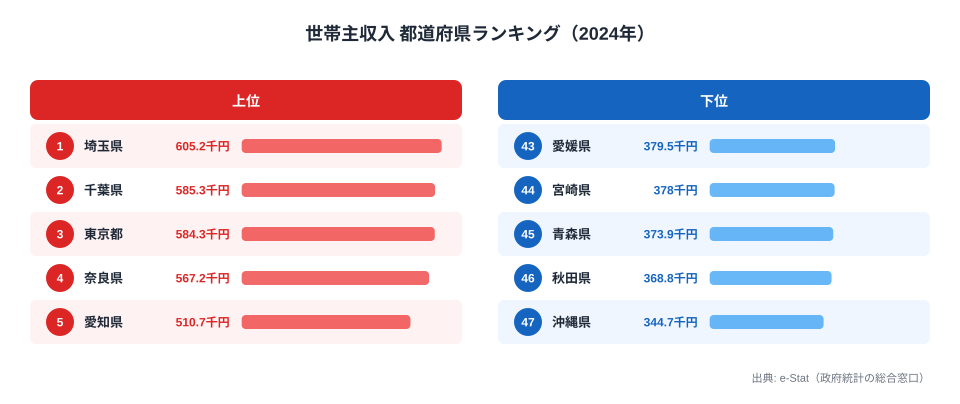
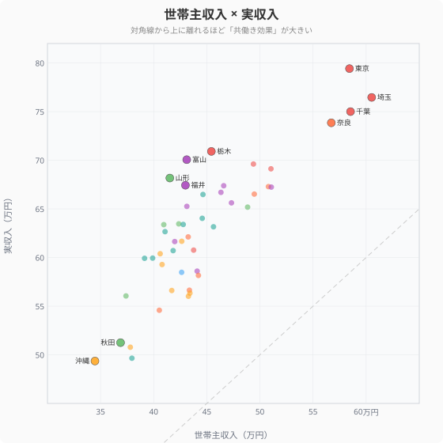
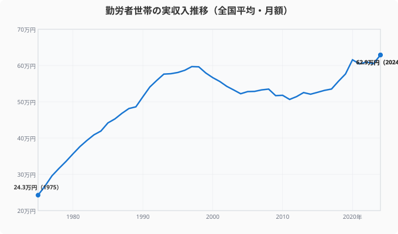
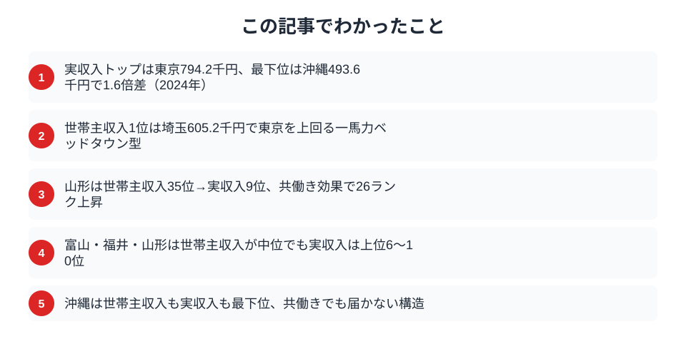

「年収が高い県」と聞くと東京を思い浮かべる人が多いでしょう。しかし世帯全体の月収で見ると、順位は意外な顔ぶれに変わります。共働き率が高い県では、世帯主の収入が中位でも世帯全体では上位に躍り出るからです。

この記事では、総務省「家計調査」の **実収入**（勤労者世帯の月収）を軸に、世帯主収入との差・共働き率・物価補正後の実質月収を重ねて、都道府県の「家計の稼ぐ力」を多角的に比較します。

## 実収入ランキング（勤労者世帯・月額）

<data-source url="https://www.e-stat.go.jp/dbview?sid=0000010212" label="e-Stat 社会・人口統計体系"></data-source>

**実収入が最も多いのは[東京都](/areas/13000)** で月額約79.4万円。[埼玉県](/areas/11000)、千葉県と首都圏が上位を占めます。

一方、**最も少ないのは[沖縄県](/areas/47000)** で約49.4万円。1位の東京との差は約30万円、**1.6倍の開き**があります。

<source-link href="/ranking/actual-income-worker-households-per-month">実収入ランキングをもっと見る</source-link>

## 都道府県マップ──月収の地域パターン

<data-source url="https://www.e-stat.go.jp/dbview?sid=0000010212" label="e-Stat 社会・人口統計体系"></data-source>

マップからは2つの特徴が読み取れます。

- **首都圏が突出して濃い色**──東京・埼玉・千葉・栃木が70万円超
- **北陸も健闘**──富山・福井が意外な上位。共働き率の高さが世帯収入を押し上げています

九州・東北は薄い色が目立ちますが、物価が低い地域も多く、「月収が低い＝生活が苦しい」とは限りません。

<ad-slot></ad-slot>

## 世帯主収入ランキング──実収入との顔ぶれの違い

世帯主の収入（月額）だけを見ると、順位は実収入とかなり異なる。1位は[埼玉県](/areas/11000)（605,200円）、2位[千葉県](/areas/12000)（585,300円）、3位は東京都（584,300円）と、首都圏の一馬力高収入ベッドタウン型が上位を占める。

注目は愛知県で、実収入では上位でないが世帯主収入では5位（510,700円）と製造業の正規雇用が底上げしている。一方、山形・富山・福井は世帯主収入では中位（40万円台前半）にとどまるが、後述の共働き効果で実収入では大きく上位に食い込む。

最下位は[沖縄県](/areas/47000)（344,700円）で、実収入でも最下位と一致する。ただし世帯主収入と実収入の差（共働き効果）は沖縄でも存在するため、世帯主の低収入だけが実収入の低さを決めているわけではない。

<source-link href="/ranking/household-head-income-worker-households-per-month">世帯主収入ランキングをもっと見る</source-link>

## 世帯主収入 vs 実収入──「共働き効果」の可視化

<data-source url="https://www.e-stat.go.jp/dbview?sid=0000010212" label="e-Stat 社会・人口統計体系"></data-source>

横軸に世帯主収入、縦軸に実収入をとると、**対角線から上に離れた県ほど「共働き効果」が大きい**ことを意味します。

- **対角線から大きく上にある県**: 山形・富山・福井──世帯主収入は40万円台前半なのに実収入は67〜70万円。共働き率が全国上位で、配偶者の収入が世帯を大きく押し上げています
- **対角線に近い県**: 埼玉・千葉──世帯主収入が高く、実収入も高い。世帯主の「一馬力」で稼ぐベッドタウン型
- **対角線の下寄り**: 沖縄・秋田──世帯主収入も実収入も低水準

山形県は世帯主収入だけなら41.5万円（全国35位）ですが、共働き率34.4%（全国2位）のおかげで実収入は68.2万円（全国9位）。**26ランクのジャンプアップ**です。

<source-link href="/ranking/household-head-income-worker-households-per-month">世帯主収入ランキングをもっと見る</source-link>

## 50年の推移──勤労者世帯の月収はどう変わったか

<data-source url="https://www.e-stat.go.jp/dbview?sid=0000010212" label="e-Stat 社会・人口統計体系"></data-source>

1975年の全国平均は約24.3万円。50年で約2.6倍に増えましたが、伸び方は一様ではありません。

- **1975〜1997年**: 高度成長の余波とバブル経済で右肩上がり。1997年に約61万円のピークに到達
- **1997〜2013年**: デフレと不況で緩やかに下降。リーマンショック（2008年）で加速
- **2013年〜現在**: 緩やかな回復基調。2024年は約62.9万円で、ようやくバブル期のピークを超えた水準に

> [!TIP]
> 名目値のため物価上昇分を含みます。実質的な購買力はこの伸びほど増えていない点に注意が必要です。

<ad-slot></ad-slot>

## まとめ

実収入・世帯主収入・共働き率・物価指数の4指標から、勤労者世帯の「稼ぐ力」の地域差を分析しました。

「月収が高い県」は必ずしも「世帯主の給料が高い県」ではありません。北陸3県のように共働き率の高さで世帯収入を底上げしている地域もあれば、首都圏のように世帯主の高収入で稼ぐ地域もあります。

転職や移住を考えるとき、「個人の年収」だけでなく 「**世帯としていくら手元に残るか**」 という視点が重要です。共働きのしやすさ、物価水準、通勤コストまで含めて比較すると、住む場所の評価はガラリと変わるかもしれません。

> [!NOTE]
> 本記事の「実収入」は総務省「家計調査」の勤労者世帯・月額実収入（都市・2人以上世帯）。サンプル数が少ない県では年次変動が大きくなる場合がある。2022年の家計調査改訂により、一部の都道府県で過去の数値と接続しない点に留意が必要。

## データ出典

本記事のデータはe-Stat（政府統計の総合窓口）を基に作成しています。
