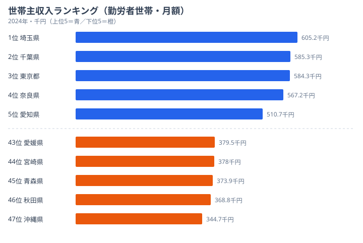

「年収が高い県」と聞くと、多くの人は東京を思い浮かべるでしょう。でも世帯全体の月収で見ると、上位の顔ぶれは少しずつ入れ替わります。世帯主の給料が中位の県でも、配偶者の収入が加われば世帯としては上位に食い込むからです。

この記事では、総務省「家計調査」をもとにした勤労者世帯の **実収入**（世帯全体の月収）と **世帯主収入**（世帯主ひとりの月収）を並べ、「世帯主が高い県」と「世帯として稼げる県」がどれだけ違うのかを見ていきます。2つのランキングを重ねると、共働きが家計に効いている県がはっきり浮かび上がります。

## 実収入ランキング──世帯全体ではどこが稼げるのか

まず、世帯全体の手取り前の月収である実収入から見ていきます。

<data-source url="https://www.e-stat.go.jp/dbview?sid=0000010212" label="e-Stat 社会・人口統計体系"></data-source>

実収入が最も多いのは [東京都](/areas/13000) で、月額約79.4万円です。[埼玉県](/areas/11000) が約76.5万円、千葉県が約75.0万円と続き、上位は首都圏が占めます。注目したいのは、奈良県が約73.9万円で4位、栃木県が約70.9万円で5位に入っている点です。首都圏のベッドタウンに加えて、地方県も上位に顔を出しています。

さらに目を引くのが、6位の富山県（約70.1万円）と10位の福井県（約67.4万円）、9位の山形県（約68.2万円）です。いずれも首都圏ではなく、東北・北陸の県が上位10に並んでいます。後で見るように、これらの県は世帯主収入だけでは中位なのに、世帯全体では大きく順位を上げています。共働きが世帯の稼ぐ力を底上げしているからです。

一方、実収入が最も少ないのは [沖縄県](/areas/47000) で約49.4万円です。愛媛県（約49.6万円）、宮崎県（約50.8万円）、秋田県（約51.3万円）が下位に並びます。1位の東京都と最下位の沖縄県の差は約30万円で、開きはおよそ1.6倍にとどまります。ただし下位の県は物価も低い地域が多く、月収の少なさがそのまま生活の苦しさを意味するわけではありません。

> [!NOTE]
> ここでの「実収入」は総務省「家計調査」の勤労者世帯・月額実収入（2人以上世帯）です。世帯主だけでなく配偶者や同居家族の収入も合算した金額なので、共働き世帯が多い県ほど大きくなる傾向があります。個人の年収ランキングとは別物である点に注意してください。

<source-link href="/ranking/actual-income-worker-households-per-month">実収入ランキングをもっと見る</source-link>

## 世帯主収入ランキング──「ひとりの給料」では顔ぶれが変わる

次に、世帯主ひとりの月収である世帯主収入を見ます。実収入とは上位の並びが変わります。

<data-source url="https://www.e-stat.go.jp/dbview?sid=0000010212" label="e-Stat 社会・人口統計体系"></data-source>

世帯主収入の1位は [埼玉県](/areas/11000) で約60.5万円、2位は [千葉県](/areas/12000) で約58.5万円です。実収入では1位だった [東京都](/areas/13000) は、世帯主収入では約58.4万円で3位に下がります。1位から3位までを首都圏のベッドタウンが占めており、世帯主ひとりの高い給料で稼ぐ「一馬力型」の構図が見えます。

5位には愛知県（約51.1万円）が入っています。実収入では上位10に届きませんが、世帯主収入では高い位置にあります。製造業の正社員雇用が世帯主の給料を底上げしていると考えられます。一方で、実収入の上位に並んでいた山形県・富山県・福井県は、世帯主収入では40万円台前半の中位にとどまります。山形県は世帯主収入では約41.5万円で、実収入9位とは対照的な位置です。

最下位は [沖縄県](/areas/47000) で約34.5万円です。秋田県（約36.9万円）、青森県（約37.4万円）が下位に並びます。沖縄県は実収入でも最下位で、世帯主収入の低さがそのまま響いています。ただし沖縄県でも世帯主収入と実収入の間には差があり、配偶者の収入が一定の役割を果たしている点は他県と共通します。

> [!WARNING]
> 実収入と世帯主収入は同じ家計調査の指標ですが、ランキングの順位は別物です。世帯主収入で上位の埼玉県・千葉県は実収入でも上位ですが、世帯主収入で中位の山形県・富山県・福井県は実収入では上位に跳ね上がります。「世帯主の給料が高い県＝世帯として稼げる県」と読み違えないよう、2つを分けて見る必要があります。

<source-link href="/ranking/household-head-income-worker-households-per-month">世帯主収入ランキングをもっと見る</source-link>

## 2つのランキングの差が示す「共働き効果」

ここまでの2つのランキングを重ねると、世帯主収入と実収入の差が県によって大きく違うことが分かります。この差こそが、配偶者や同居家族の収入、つまり共働きの効果です。

差が特に大きいのが山形県・富山県・福井県です。山形県は世帯主収入では約41.5万円で全国35位ですが、実収入では約68.2万円で全国9位まで上がります。順位にして26ランクのジャンプアップです。富山県も世帯主収入は約43.1万円（全国26位）ですが、実収入では約70.1万円（全国6位）に達します。福井県も世帯主収入約43.0万円（全国27位）から、実収入約67.4万円（全国10位）へと大きく順位を上げています。これらの県は共働き率が全国でも高い水準にあり、配偶者の収入が世帯全体を押し上げています。

反対に、世帯主収入と実収入の順位がほぼ変わらないのが埼玉県・千葉県です。世帯主収入が高く、実収入も高い「一馬力で稼ぐベッドタウン型」です。世帯主ひとりの給料が世帯収入の大半を占めるため、共働きによる上積みは相対的に小さくなります。沖縄県・秋田県のように、世帯主収入も実収入もどちらも低水準の県もあり、共働き効果だけでは底上げしきれない構図が読み取れます。

> [!TIP]
> 移住や転職で「稼げる県」を比べるときは、求人票に出る個人の年収だけでなく「世帯としていくら手元に残るか」で見ると評価が変わります。山形県・富山県・福井県のように、世帯主の給料が中位でも共働きで世帯収入が上位になる県は少なくありません。配偶者が働きやすい環境かどうかも、住む場所を選ぶ判断材料になります。

世帯主収入だけを見て「収入の高い県」を選ぶと、共働きで実際に世帯が稼いでいる県を見落とします。逆に実収入だけを見ると、世帯主ひとりの給料水準を見誤ります。2つを並べて初めて、その県が「一馬力型」なのか「共働きで稼ぐ型」なのかが見えてきます。

## まとめ

実収入と世帯主収入という2つのランキングを重ねて、勤労者世帯の「稼ぐ力」の地域差を見てきました。

- 実収入の1位は東京都（約79.4万円）、最下位は沖縄県（約49.4万円）で、差はおよそ1.6倍です。
- 世帯主収入の1位は埼玉県（約60.5万円）で、東京都は3位に下がります。世帯主ひとりで稼ぐ一馬力型の首都圏が上位です。
- 山形県は世帯主収入では全国35位ですが、共働き効果で実収入は全国9位へ。富山県・福井県も同様に大きく順位を上げます。
- 沖縄県は世帯主収入・実収入ともに最下位で、共働き効果だけでは底上げしきれません。

「月収が高い県」は、必ずしも「世帯主の給料が高い県」ではありません。共働きのしやすさや物価水準まで含めて比べると、住む場所の評価はガラリと変わります。

## データ出典

本記事のデータはe-Stat（政府統計の総合窓口）の社会・人口統計体系を基に作成しています。
