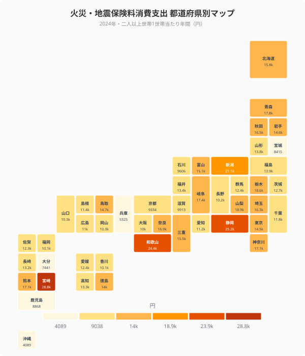
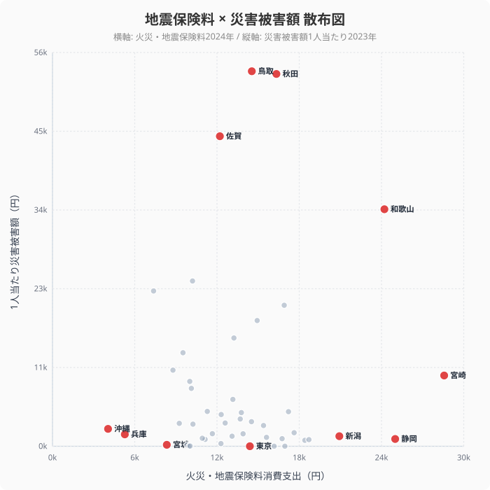
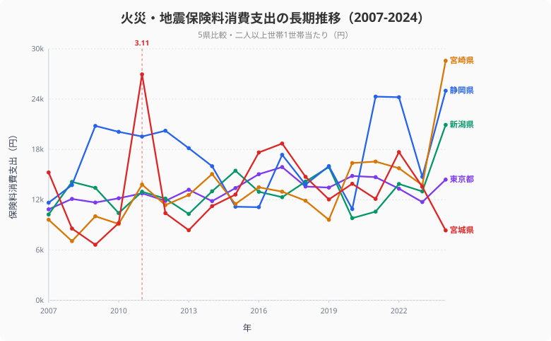

2026年5月15日、宮城県沖でマグニチュード6.3の地震が発生し、三陸沖のスロースリップ加速が報じられました。しかし家計調査を見ると、**宮城県の火災・地震保険料消費支出は全国44位**（8,415円）で、全国平均13,773円の6割にとどまります。東日本大震災の被災地が、地震保険にあまりお金を払っていない――この逆説は何を意味するのでしょうか。

47都道府県の保険料と災害被害額を重ねると、「リスクの認知」と「実際の被害」が大きくずれている地図が浮かび上がります。

## 地震保険料ランキング――宮崎・静岡・和歌山が上位

<ad-slot></ad-slot>

<data-source url="https://www.e-stat.go.jp/dbview?sid=0003348239" label="e-Stat 家計調査"></data-source>

1位は**[宮崎県](/areas/45000)の28,833円**。続いて静岡・和歌山・新潟・山梨の順で、上位5県は**南海トラフ地震・首都直下地震の想定被害地域**にほぼ重なります。

最下位は**沖縄県の4,089円**。46位の兵庫、45位の大分、**44位の宮城**、43位の鹿児島と続きます。1位と最下位の差は約7倍。年間支出としては小さく見えますが、世帯数で乗じると地域経済の規模で大きな差になります。

<source-link href="/ranking/fire-earthquake-insurance-consumption-expenditure">火災・地震保険料消費支出ランキング</source-link>

> [!NOTE]
> 火災・地震保険料は二人以上の世帯1世帯当たり年間消費支出額。家計調査（品目別）の2024年データに基づきます。火災保険と地震保険の合計で、火災保険単独の契約も含まれます。

## 宮城44位の謎――被災経験は加入率を押し上げない

東日本大震災から15年。最大の被災県である宮城が地震保険料44位にとどまる事実は、「被災経験が加入率を上げる」という直観に反します。

実は宮城県の地震保険加入率（世帯数ベース）は全国平均並みです。家計調査の支出額が低い理由は**世帯収入と家賃水準**にあります。宮城県の二人以上世帯の年間支出は全国平均比で約95%、住居費は約90%。**火災保険は家賃や住宅価値に連動**するため、首都圏や東海より自然と保険料負担が小さくなります。

加えて、**被災後に支払われた保険金で建て替えた住宅が一巡し、新規加入の伸びが鈍化**したことも背景にあります。震災直後の2011年は全国平均が前年比+10%（9,804円→10,781円）と急増しましたが、宮城県は近年は微増に留まっています。

被災地が地震保険を増やすわけではない――この事実は、地震保険のマーケティングが「次の地震」への備えとして売られる商品であることを示します。被害が起きてしまった地域ではなく、これから起きるかもしれない地域に売れるのです。

## 被害額と保険料のミスマッチ

それでは、保険料が高い県は本当に被害が大きいのでしょうか。1人当たり災害被害額（2023年）と重ねると、明確な不一致が見えます。

<data-source url="https://www.e-stat.go.jp/dbview?sid=0000010211" label="e-Stat 社会・人口統計体系"></data-source>

**1人当たり災害被害額では[鳥取県](/areas/31000)が53,734円でトップ**。秋田県（53,345円）・佐賀県（44,423円）と続きます。一方、これらの県の地震保険料消費はそれぞれ**17位・12位・29位**で、上位とは言えません。鳥取県は2023年に台風7号で甚大な被害を受けましたが、平時の地震保険料は全国平均並みです。

逆に保険料3位の和歌山県は被害額も4位で一致しています。和歌山は2011年の紀伊半島水害以降、自然災害への意識が継続的に高い特殊な県です。

**[東京都](/areas/13000)は被害額47位に対し保険料は19位**。リスクが顕在化していないのに保険料は中位というのは、首都直下地震への備えと住宅価値の高さの両方が効いています。同様に神奈川9位・埼玉13位と、首都圏は保険料が高く実被害は少ない構造です。

> [!NOTE]
> 災害被害額は2023年の社会・人口統計体系（K 安全）に基づく1人当たり値です。地震・風水害・火災等を合算しており、特定年の異常気象や大規模災害が大きく影響します。

## 南海トラフ警戒県は本当に備えているか

保険料上位5県のうち、**宮崎・静岡・和歌山は南海トラフ地震の想定震源域**に含まれます。30年以内の発生確率が70-80%とされる中で、保険加入は合理的な備えです。1位の宮崎は全国平均の約2.1倍、2位静岡で1.8倍、3位和歌山で1.8倍と、上位5県はいずれも平均を大きく上回ります。

宮崎県が1位というのは意外に思えますが、**1968年えびの地震・1996年宮崎県北部地震・南海トラフ警戒**と、地震リスクへの認識が地域文化として根付いています。県や金融機関が住宅ローン契約時に地震保険加入を強く勧める慣行も背景にあると言われます。

新潟県（4位）は2004年中越地震・2007年中越沖地震の影響が大きく、被災経験の有無というより**繰り返し被災した県の集合記憶**として保険加入が定着しています。

宮城（44位）と新潟（4位）の差は、**被災後に保険商品が変化したかどうか**――新潟は中越地震後に地震保険の見直しが地域金融機関主導で進みましたが、東北はその動きが弱かったとされます。

## 時系列――3.11後に何が変わったか

<data-source url="https://www.e-stat.go.jp/dbview?sid=0003348239" label="e-Stat 家計調査"></data-source>

全国平均で見ると、2007年の10,209円から2024年の13,773円へ約35%増加しています。2011年の東日本大震災後、2010年9,804円から2011年10,781円へ全国で+10%の急増が見られました。2020年には新型コロナ禍での生活見直しでもう一段上昇しています。

5県を抽出した時系列で見ると、**宮崎県は2007年から一貫してトップクラス**、新潟県は中越地震後に急増、静岡県も南海トラフへの警戒で着実に上昇しています。一方、**宮城県は3.11直後にいったん上昇したものの、その後は全国平均を下回って推移**しています。震災後の保険金受給と住宅復興が一巡したことで、新たな保険購入需要が伸びなかったことが示唆されます。

東京都は全期間を通じて中位安定。被害が出ないまま保険料を払い続ける首都圏型のパターンです。

## まとめ

47都道府県の地震保険料消費支出を整理します。

1位は宮崎28,833円、最下位は沖縄4,089円で約7倍差。**被災地・宮城は44位**で、被災経験が直接保険料を押し上げるわけではないことが分かります。南海トラフ警戒の宮崎・静岡・和歌山が上位を占め、保険料の地理は「次の地震への備え」を映し出しています。

ただし**保険料の高い県と災害被害額の大きい県は一致しません**。被害額トップの鳥取・2位の秋田は保険料が中位にとどまります。和歌山だけが両方上位という例外です。地震保険は「リスクの正確な反映」ではなく、**地域の集合記憶と金融機関の販売慣行で形成される文化**と言えそうです。

宮城沖でM6.3が起きた2026年5月、地震保険料の地図を改めて眺めると、「想定被害」と「実際の備え」のずれが見えてきます。三陸スロースリップ加速や南海トラフ警戒が報じられる今、自分の住む県の保険料が全国でどの位置にあるかを確認しておくことには意味があります。

<source-link href="/ranking/disaster-damage-amount-per-person">災害被害額（1人当たり）ランキング</source-link>

<site-link category="landweather"></site-link>

## データ出典

本記事のデータはe-Stat（政府統計の総合窓口）を基に作成しています。
