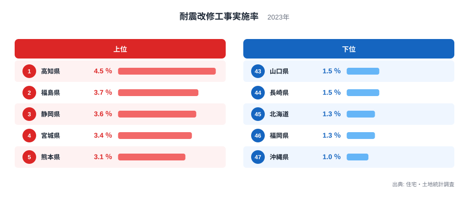
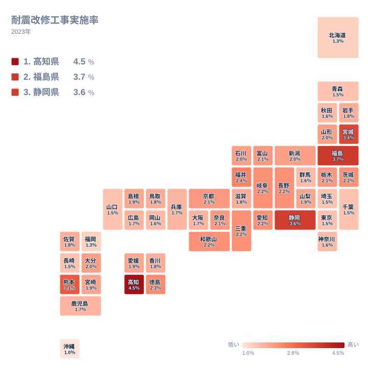

住宅の耐震改修工事実施率は、地震への備えがどれだけ生活の中に組み込まれているかを映す指標です。2023年の住宅・土地統計調査によると、この割合は都道府県によって大きく異なり、最も高い高知県と最も低い沖縄県の間には4.5倍の開きがあります。この記事では、上位と下位の県を比べながら、なぜこれほどの差が生まれるのかを、地震リスクや住宅の建て方、支援制度の違いから読み解いていきます。全国平均に近い県も含めて眺めると、地震への備えの濃淡が地図の上にどう表れているのかが見えてきます。

## 上位5県と下位5県の差

<source-link href="/ranking/earthquake-renovation-rate">耐震改修工事実施率ランキングをもっと見る</source-link>

1位の高知県は4.5％で、全国で最も高い実施率になっています。2位の福島県は3.7％、3位の静岡県は3.6％、4位の宮城県は3.4％、5位の熊本県は3.1％と続き、上位5県はいずれも南海トラフ地震や過去の大きな地震と関わりの深い地域です。高知県と静岡県は南海トラフ巨大地震の想定震源域に近く、津波と揺れの両方への備えが長く呼びかけられてきた土地です。福島県と宮城県は東日本大震災の被災地であり、震災後の住まいの再建や補強工事が実施率を押し上げていると考えられます。熊本県も2016年の熊本地震で大きな被害を受けた地域であり、震災の記憶が住民の改修への動機づけになっていると見ることができます。

一方で下位に目を向けると、47位の沖縄県は1％、46位の福岡県は1.3％、45位の北海道は1.3％、44位の長崎県は1.5％、43位の山口県は1.5％となっており、上位県との差は最大で4.5倍に達します。沖縄県は台風への備えは強く意識される一方で、本島周辺で大規模な内陸地震の記憶が比較的少なく、耐震改修への切迫感が住宅・土地統計調査の数字にそのまま表れていると読めます。北海道と長崎県、山口県については、面積の広さや積雪、離島の多さといった住まいをめぐる条件が改修の優先順位に影響している可能性がありますが、この数字だけからその因果を確かめることはできません。

全国の中央付近を見ると、6位の福井県が2.4％、18位の山形県が2％、31位の大阪府が1.7％と、ゆるやかに実施率が下がっていく様子が分かります。突出した上位県と最下位の沖縄県の間に、なだらかな階段のような分布が広がっているのがこの指標の特徴です。

## 地理的な広がりで見る耐震改修率

地図で全国を見渡すと、耐震改修工事実施率が高い県は太平洋側の中部から西日本にかけて連なっていることが分かります。愛知県、三重県、和歌山県、岐阜県はいずれも2.2％で並び、3位の静岡県とともに帯のような形をつくっています。徳島県も2.3％で7位に入っており、四国から東海にかけての太平洋側が一続きの塊として浮かび上がります。

対照的に、日本海側と北海道は色が薄くなっています。同じ内陸県でも、岐阜県が2.2％で上位に入る一方、日本海側の県は下位に沈むという分かれ方をしており、内陸か沿岸かという地形の区分では説明がつきません。地図が示しているのは、地震の被害想定が具体的に語られてきた地域とそうでない地域の境目です。

首都圏に目を移すと、また違う姿が見えます。実施率が低い県は北日本の一部と、東京都や神奈川県、埼玉県、千葉県といった首都圏に分散しています。東京都は1.5％、神奈川県は1.6％、埼玉県は1.5％、千葉県は1.5％と、いずれも全国平均を下回る水準です。首都圏は集合住宅の比率が高く、耐震改修が個人の判断だけでは完結しにくいという事情が影響している可能性があります。分譲マンションの耐震改修は管理組合での合意形成を経る必要があり、一戸建てが中心の地方に比べて着手までの時間がかかりやすい構造があります。秋田県も1.6％、群馬県も1.6％と、太平洋側から離れた内陸県でも実施率が伸び悩んでいる様子が見て取れます。

> [!NOTE]
> ここでの耐震改修工事実施率は、既存の住宅に対して耐震性を高める工事を実施した割合を指します。新築時点ですでに現行の耐震基準を満たしている住宅は、この改修工事の対象には含まれません。つまり実施率が低い県が、必ずしも住宅全体の耐震性で劣っているとは限らない点に注意してください。

## 建て方と制度が生む差

耐震改修工事実施率の差を読み解くうえで欠かせないのが、住宅の建て方と持ち家の割合です。木造の戸建て住宅は、鉄筋コンクリート造の集合住宅に比べて所有者本人の判断で改修に着手しやすく、地方に多い木造率の高さが実施率の押し上げにつながっていると考えられます。高知県や福島県、静岡県はいずれも持ち家率が高く、住宅の所有者自身が改修の意思決定を行える環境が整っている地域です。

自治体独自の補助制度の有無も見逃せない要因です。南海トラフ地震の被害想定地域では、耐震診断や改修工事に対する補助制度が早くから整備されてきた経緯があり、費用面のハードルが下がったことで実施率が押し上げられてきました。福島県や宮城県では震災後の住宅再建支援策が並行して進んだことも、改修工事の件数を増やす方向に働いたと見ることができます。反対に、実施率が中位から下位にとどまる県では、補助制度があっても対象となる住宅の年齢層や周知の度合いが異なり、同じ制度でも利用の広がり方に差が生まれやすいと考えられます。

> [!WARNING]
> 住宅・土地統計調査は抽出調査であり、対象となる住宅の年齢構成や地域の再開発状況によって数値が変動しやすい性質があります。特定の年に大規模な団地の建て替えや補助制度の締め切りが集中すると、その年の実施率が一時的に押し上げられることもあるため、単年の数値だけで地域の防災意識の高低を断定しないよう注意してください。

> [!TIP]
> この指標を読むときは、[高知県のデータ](/areas/39000)や[福島県のデータ](/areas/07000)のように、上位県のページで住宅事情や人口構成もあわせて確認すると、単なる順位以上の背景が見えてきます。[同じカテゴリの統計一覧](/category/construction)から、住宅の築年数や持ち家率など関連する指標と比べてみるのもおすすめです。

## まとめ

- 耐震改修工事実施率は高知県が4.5％で1位、沖縄県が1％で47位となっており、その差は4.5倍に達します。
- 上位5県は高知県、福島県、静岡県、宮城県、熊本県で、いずれも大きな地震との関わりが深い地域です。
- 下位5県は沖縄県、福岡県、北海道、長崎県、山口県で、地震の切迫感や住宅事情が異なる地域です。
- 南海トラフの想定震源域に近い太平洋側の県では、実施率が全国平均を上回る傾向が見られます。
- 首都圏は集合住宅の比率の高さが、改修工事の着手しやすさに影響している可能性があります。

## データ出典

住宅・土地統計調査（2023年）
