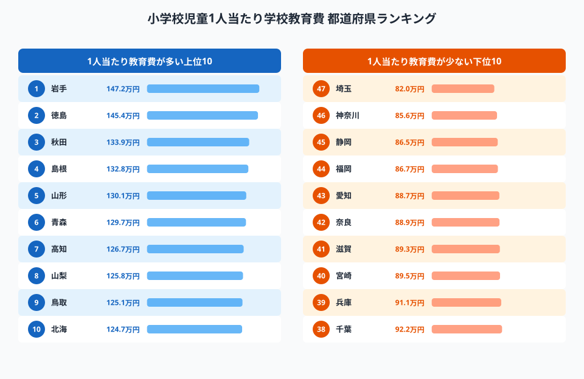
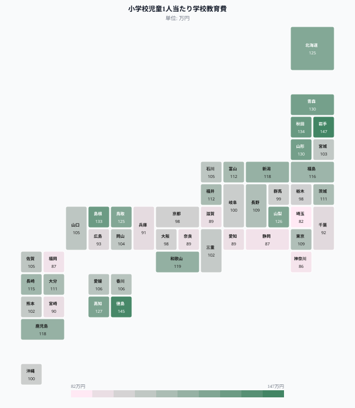
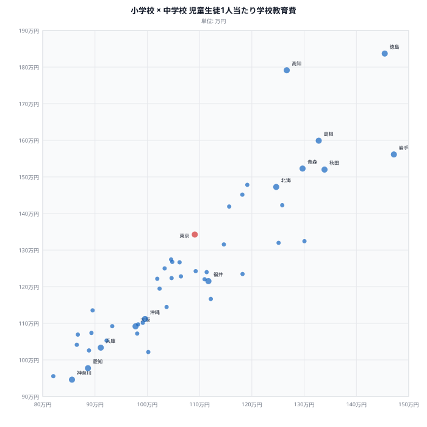
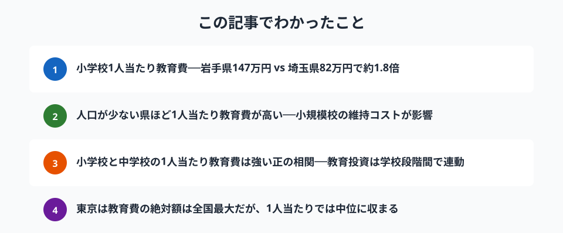

教育は都道府県の歳出で民生費に次ぐ大きな柱です。しかし、児童生徒**1人当たり**の学校教育費で見ると、都道府県間に最大**約1.8倍の格差**があります。

2022年度、小学校児童1人当たりの学校教育費が最も多いのは**岩手県の約147万円**、最も少ないのは**埼玉県の約82万円**。人口が少ない県ほど1人当たりコストが高くなる「**規模の不経済**」が教育分野にも明確に表れています。

> [!NOTE]
> **学校教育費**は、教員の人件費・施設整備費・教材費など、学校教育に直接かかる経費の総額を在学者数で割った指標です。市町村立・都道府県立を問わず、各県の児童生徒にかかる教育費を反映しています。

## 小学校1人当たり教育費ランキング──岩手147万円、埼玉82万円

<data-source url="https://www.e-stat.go.jp/dbview?sid=0000010105" label="e-Stat 社会・人口統計体系（教育）"></data-source>

**1位の[岩手県](/areas/03000)は約147万円で、最下位の[埼玉県](/areas/11000)の約82万円に対し約1.8倍**です。上位には岩手・徳島・秋田・島根・山形と、人口が少なく小規模校が多い東北・山陰・四国の県が並びます。

下位には埼玉・神奈川・静岡・福岡・愛知と、児童数が多い都市部が集中。1学級あたりの児童数が多く、教員1人あたりの担当児童も多いため、スケールメリットが効いています。

### 全国マップ

<data-source url="https://www.e-stat.go.jp/dbview?sid=0000010105" label="e-Stat 社会・人口統計体系（教育）"></data-source>

マップを見ると、**東北・山陰・四国が濃い青**（高い）で、**太平洋ベルト上の都市県が薄い色**（低い）という明確なパターンが浮かびます。人口密度が低い地域ほど、学校の統廃合が進まず複数の小規模校を維持する必要があるため、1人当たりコストが膨らみます。

<source-link href="/ranking/education-cost-per-student-elementary">小学校児童1人当たり教育費の47都道府県ランキングを見る</source-link>

## 中学校・高校でも同じ傾向──学校段階を問わず「規模の不経済」

小学校だけでなく、中学校・高校でも同様の傾向が見られます。学校段階ごとの1位（最多）と47位（最少）、その格差は次の通りです。

- **小学校**：1位 岩手県 約147万円 ／ 47位 埼玉県 約82万円（**1.8倍**）
- **中学校**：1位 徳島県 約184万円 ／ 47位 神奈川県 約95万円（**1.9倍**）
- **高校（全日制）**：1位 高知県 約191万円 ／ 47位 千葉県 約104万円（**1.8倍**）

いずれも**人口の少ない県が上位、大都市圏が下位**という構図は共通です。高校になると格差はやや縮まりますが、それでも1.8倍の開きがあります。

<ad-slot></ad-slot>

## 小学校 × 中学校──教育投資は学校段階間で連動する

<data-source url="https://www.e-stat.go.jp/dbview?sid=0000010105" label="e-Stat 社会・人口統計体系（教育）"></data-source>

小学校と中学校の1人当たり教育費を散布図にすると、**強い正の相関**が見られます。小学校の教育費が高い県は中学校も高い。これは当然の結果で、両者を規定する要因──人口規模・学校数・教員配置──が共通しているためです。

右上に位置する岩手・徳島・秋田・島根は、いずれも人口減少が著しい県です。児童生徒数の減少に対して学校数の統廃合が追いつかず、結果として1人当たりコストが高止まりしています。

左下の埼玉・神奈川・愛知は逆に、児童生徒が多く効率的な教育運営ができている県です。

## まとめ

教育費の都道府県格差から見えてきた構造を整理します。

教育費の格差は「教育の質の差」ではなく、主に**人口規模と学校配置の効率性の差**です。人口が少ない県では、過疎地域に小規模校を維持せざるを得ないため、1人当たりコストが構造的に高くなります。

少子化が進む中、小規模校の統廃合は避けられない選択ですが、通学距離の問題や地域コミュニティの維持とのバランスが求められます。教育の効率化と地域の持続性をどう両立させるかが、今後の地方行政の重要な論点です。

中学・高校段階で格差がさらに広がる点も注目です。中学校では徳島県184万円に対し神奈川県95万円と約1.9倍、高校では高知県191万円に対し千葉県104万円と約1.8倍の開きがあります。中学・高校の1人当たりコストが小学校よりも高い傾向にあるのは、専科教員・実験施設・部活動指導など、学校段階が上がるほど必要な設備・人員が増えるためです。人口が少ない県ではこのコスト増を少ない児童生徒数で分担することになり、「規模の不経済」の影響が学校段階を超えて積み重なります。

> [!TIP]
> 1人当たり教育費が高い岩手・秋田・徳島などの県は、財政支出に占める教育費の割合も高い傾向がある。財政力が弱い地方ほど、義務教育の維持に大きな負担を強いられる構造が教育費データからも読み取れる。財政力指数が低い県でも義務教育水準を維持しなければならない制度上の要請が、1人当たりコスト高止まりの根本にある。

## データ出典

本記事のデータはe-Stat（政府統計の総合窓口）を基に作成しています。

本記事の対象データ: [関連カテゴリ](/category/economy)
