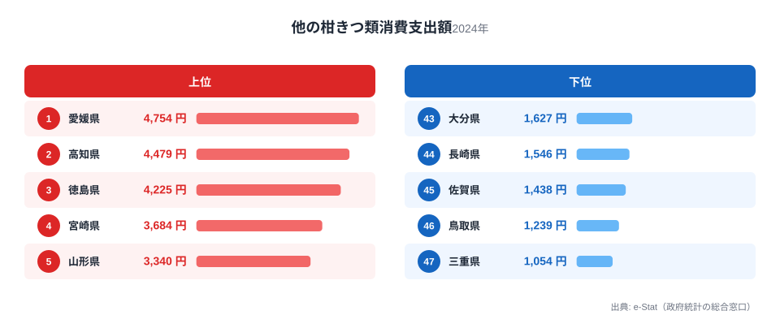
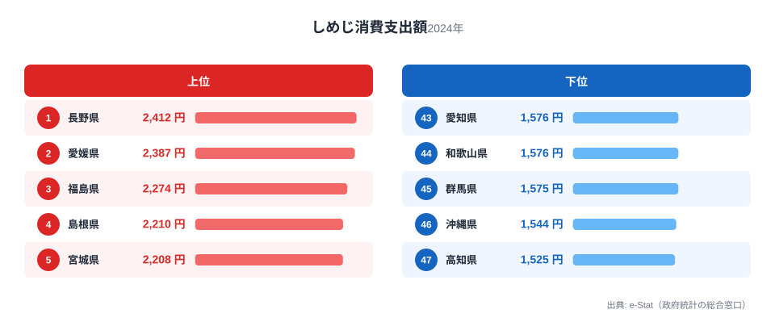
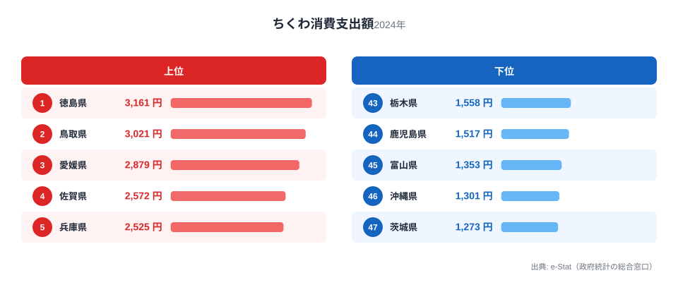

愛媛県といえば、真っ先に思い浮かぶのが「みかん」でしょう。実際、総務省の家計調査（品目別）2024年データを見ると、愛媛県庁所在市（松山市）の二人以上世帯は「他の柑きつ類」（みかんを除く柑橘類）に年間4,754円を支出しており、これは47都道府県で堂々の全国1位です。

ですが、愛媛の食卓を柑橘だけで語ってしまうと見落とすものがあります。家計調査の502品目を愛媛の視点で並べ直すと、しめじが全国2位、ちくわが全国3位と、柑橘とはまったく異なる分野でも上位に顔を出しているのです。なぜ愛媛はきのこや練り物でも高い支出額を記録するのでしょうか。この記事では3つの品目から、愛媛の家計と食文化を読み解きます。

> [!NOTE]
> 本記事の数値は総務省統計局「家計調査（品目別）」2024年、都道府県庁所在市（愛媛県は松山市）の二人以上世帯における年間支出額です。世帯の購入額を集計した統計であり、県内の生産量や消費量そのものを示すものではありません。

## 柑きつ類 — 全国1位4,754円、最下位三重の4.5倍

<source-link href="/ranking/other-citrus-consumption-expenditure">他の柑きつ類消費支出額ランキングをもっと見る</source-link>

愛媛県は他の柑きつ類消費支出額で4,754円と全国1位を獲得しています。2位の高知県（全国2位・4,479円）、3位の徳島県（全国3位・4,225円）と、上位は四国勢が独占する構図です。最下位の三重県（全国47位・1,054円）と比べると4.5倍の開きがあり、東海や関東の県は軒並み下位に沈んでいます。

愛媛県はいよかん・甘平・紅まどんな・せとかなど、温州みかん以外の柑橘品種を数多く生産する産地として知られています。「他の柑きつ類」という統計上の分類には、こうした多品種の柑橘が含まれると考えられ、地元での購入機会の多さがそのまま家計支出に反映されている可能性があります。四国3県が上位を占める背景には、瀬戸内海沿岸の温暖な気候と段々畑を活かした柑橘栽培の伝統が共通しているとみられます。

## しめじ — 全国2位2,387円、なぜ柑橘県が上位に?

<source-link href="/ranking/shimeji-consumption-expenditure">しめじ消費支出額ランキングをもっと見る</source-link>

しめじ消費支出額では、愛媛県が2,387円で全国2位につけています。1位は[長野県](/blog/nagano-food-culture)（全国1位・2,412円）で、わずか25円差での2位です。3位の福島県（全国3位・2,274円）、4位の島根県（全国4位・2,210円）、5位の宮城県（全国5位・2,208円）と続き、最下位は高知県（全国47位・1,525円）でした。

愛媛は柑橘の印象が強い県ですが、しめじの支出額が全国トップクラスという事実は意外に映るかもしれません。しめじ自体は全国的に流通する品目で、愛媛県が突出した産地というわけではありません。むしろ注目すべきは、鍋料理や炒め物できのこ類を頻繁に使う調理習慣が県全体に根付いている可能性です。柑橘のような単一産地の強みだけでなく、日々の食卓での使用頻度が高い品目でも上位に入るあたりに、愛媛の食生活の幅広さがうかがえます。

## ちくわ — 全国3位2,879円、四国の練り物文化

<source-link href="/ranking/chikuwa-consumption-expenditure">ちくわ消費支出額ランキングをもっと見る</source-link>

ちくわ消費支出額でも、愛媛県は2,879円で全国3位に入っています。1位は[徳島県](/blog/tokushima-food-culture)（全国1位・3,161円）、2位は鳥取県（全国2位・3,021円）で、愛媛はこの2県に次ぐ順位です。4位の佐賀県（全国4位・2,572円）、5位の兵庫県（全国5位・2,525円）と続き、最下位は茨城県（全国47位・1,273円）でした。

愛媛県は八幡浜市を中心に、じゃこ天をはじめとする練り物（かまぼこ類）の生産が盛んな地域です。ちくわそのものは徳島や鳥取など瀬戸内海・日本海側の複数県で消費支出が高く、四国から中国地方にかけて練り物文化が広く根付いていることがうかがえます。愛媛の練り物文化はじゃこ天が特に有名ですが、家計調査の品目区分ではちくわとして計上される消費もあり、練り製品全般への支出の高さがちくわの順位にも表れていると考えられます。

> [!WARNING]
> 家計調査は品目ごとの個別集計のため、愛媛の名物である「じゃこ天」は独立した品目としては存在せず、統計上はちくわなど近縁の練り物区分に含まれている可能性があります。県の郷土食のすべてがこの3品目に反映されているわけではない点に注意してください。

## 愛媛の食卓を貫くもの

柑きつ類・しめじ・ちくわという一見バラバラな3品目を並べると、意外な共通軸が浮かび上がります。それは「産地の強み」と「日常の調理習慣」という2つの異なる要因が、愛媛の家計を同時に押し上げているという構図です。

柑きつ類は愛媛が生産地として突出しているために全国1位となった典型例です。一方でしめじやちくわは、愛媛が突出した産地というわけではないにもかかわらず、日々の食卓での使用頻度の高さから上位に入っています。これは、他県の食文化まとめ記事と比較すると際立つ特徴です。たとえば[徳島の食卓](/blog/tokushima-food-culture)ではさつまいも・ちくわ・海苔がいずれも生産地としての強みを反映して1位を占め、[長野の食卓](/blog/nagano-food-culture)でもしめじ・すいかが県内生産の豊富さと結びついています。愛媛は「産地型の1位」（柑橘）と「習慣型の上位」（きのこ・練り物）が併存する、やや珍しいパターンといえます。

[仮説] 愛媛が瀬戸内海に面した温暖な気候で農業・漁業双方が盛んな県であることが、産地型と習慣型の両方の品目で上位に入りやすい土壌になっている可能性があります。この点は他の瀬戸内海沿岸県（広島・岡山・香川）との比較検証が必要です。

## 愛媛県の家計・経済データをもっと見る

愛媛県の家計調査データは、食品以外の分野でも特徴的な傾向を示しています。[愛媛県の地域プロフィール](/areas/38000)では人口・産業・財政など県全体の統計をまとめて確認でき、[経済カテゴリ一覧](/category/economy)では所得・物価・消費支出など愛媛を含む47都道府県の経済指標を横断的に比較できます。

> [!TIP]
> しめじの1位・2位差はわずか25円（長野2,412円 vs 愛媛2,387円）と全国トップクラスの僅差です。年によって順位が入れ替わる可能性が高く、翌年の家計調査が更新されたら再チェックする価値があります。柑橘のような産地の強みに支えられた品目と違い、こうした僅差の順位は毎年の調理習慣のわずかな変化で動きやすい点も特徴です。

## まとめ

- 他の柑きつ類消費支出額は愛媛県が4,754円で全国1位。最下位の三重県（1,054円）の4.5倍
- しめじ消費支出額は愛媛県が2,387円で全国2位。1位長野県（2,412円）とはわずか25円差
- ちくわ消費支出額は愛媛県が2,879円で全国3位。1位徳島県（3,161円）、2位鳥取県（3,021円）に次ぐ順位
- 柑きつ類は「産地の強み」、しめじ・ちくわは「日常の調理習慣」という異なる要因が上位入りを支えている
- 練り物文化は愛媛・徳島・鳥取など瀬戸内海から日本海側にかけて広く根付いている可能性がある

## データ出典

総務省統計局「家計調査（品目別）」2024年、都道府県庁所在市（愛媛県は松山市）の二人以上世帯における年間支出額。e-Stat（政府統計の総合窓口）経由で取得・整備。
