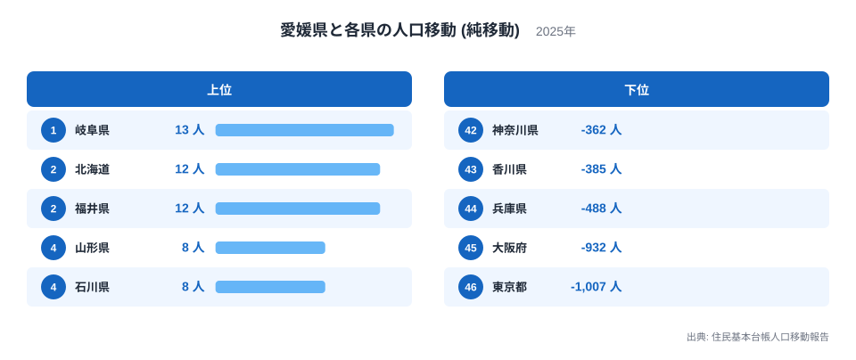
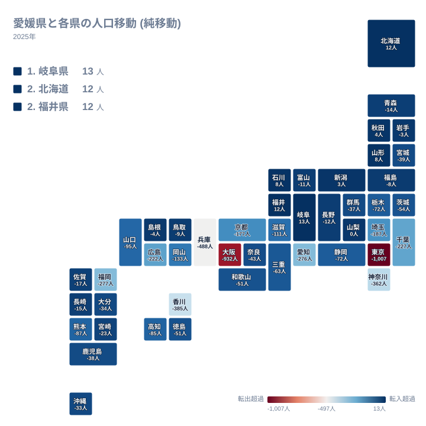
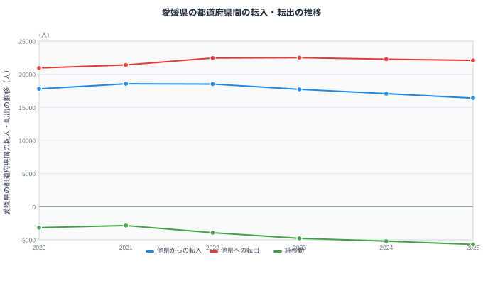

愛媛県は、住んでいる人が県境を越えてどこへ動いているのかを見ると、行き先によってはっきりとした偏りがあることが分かります。住民基本台帳人口移動報告をもとに2025年の値を都道府県別に並べると、愛媛県は46都道府県のうち39県に対して転出超過となっており、県外へ出ていく人の方が多くなっています。一方で、岐阜県や北海道など残り7県からはわずかながら転入超過となっており、人を集めている側に回っています。差し引きの大きさだけを見ると小さな数字が多く見えますが、実際には東京都への転出超過が1,007人、大阪府への転出超過が932人と、突出して大きい行き先が存在しています。さらに注目したいのは、同じ四国地方に位置する香川県への転出超過が385人にのぼり、遠く離れた大都市圏に次ぐ規模になっている点です。愛媛県の人口移動は、遠くの大都市圏だけでなく、隣り合う四国内の県との関係でも大きく動いていることが見えてきます。

## 愛媛県が人を集める県、失う県

> [!NOTE]
> ここでの純移動は、愛媛県とその都道府県との間だけの転入超過数です。値がプラスであれば愛媛県から見てその県との間で人を集めていることを、マイナスであれば人を失っていることを意味しており、都道府県ごとの人口規模の違いを調整した指標ではありません。

このグラフは、愛媛県と2025年に純移動があった46都道府県それぞれとの収支を、値の大きい順に並べたものです。上位に並ぶのは転入超過、つまり愛媛県から見てその県との間で人を集めている側の都道府県で、下位に並ぶのは転出超過、つまり人を失っている側の都道府県です。

最も転入超過が大きいのは岐阜県で13人です。次いで北海道が12人、福井県も12人となっていますが、順位は北海道が2位、福井県が3位に分かれています。続く4位は山形県で8人、5位は石川県で同じく8人です。6位の秋田県は4人、7位の新潟県は3人となっており、8位の山梨県は0人で転入超過にも転出超過にも当てはまりません。転入超過となっている7県のうち、北海道は単独の地域、山形県と秋田県は東北地方、石川県と福井県は北陸地方、岐阜県と新潟県は中部地方に位置しており、いずれも愛媛県から離れた地域です。同じ四国地方や、瀬戸内海を挟んで対岸にある中国地方の県は含まれていません。

反対に下位を見ると、転出超過の規模は一気に大きくなります。最も転出超過が大きいのは東京都で1,007人です。次いで大阪府が932人、兵庫県が488人と続きます。これら3都府県だけで、転入超過側の7県をすべて合わせた規模をはるかに上回っています。愛媛県の人口移動は、少数の県に対しては小幅な転入超過がある一方で、多くの県、特に大都市圏を抱える都府県に対しては大きな転出超過が続くという非対称な構図になっています。

> [!TIP]
> 純移動の数字だけを見ると小さく感じられますが、実際には双方向で数万人規模の人が動いた差し引きとしてこの値が出ています。愛媛県は2025年に16,400人が転入し、22,094人が転出しており、その差が純移動として表れています。

<source-link href="/ranking/moving-in-excess-rate">転入超過率ランキング</source-link>

## 純移動の地理的な広がり

この地図は、先ほどのランキングを都道府県の位置関係にあわせて塗り分けたものです。転出超過が大きい都道府県は、関東地方の東京都・神奈川県・千葉県・埼玉県と、近畿地方の大阪府・兵庫県・京都府に集中しています。加えて、愛媛県と同じ四国地方の香川県、瀬戸内海を挟んで対岸に位置する広島県も、転出超過の規模が大きい県として地図上で目立っています。

一方で転入超過となっている岐阜県、北海道、福井県、山形県、石川県、秋田県、新潟県は、地図上で特定の地域にまとまっているわけではなく、北海道・東北・北陸・中部地方に散らばっています。これらの県への転入超過は、いずれも一桁から最大でも13人という小さな数字にとどまっており、東京都や大阪府への転出超過とは規模がまったく異なります。愛媛県の人口移動を地理的に見ると、近い県ほど失いやすく遠い県からはわずかに集めるという単純な図式ではなく、近畿・関東という大都市圏と、同じ四国地方の香川県が転出超過の主な行き先になっていることが分かります。

## 東京圏との関係、四国内の近隣県との関係

愛媛県にとって、東京都・神奈川県・千葉県・埼玉県からなる東京圏との人口移動は、規模の大きさで際立っています。東京都への転出超過は1,007人で最大となっており、神奈川県への転出超過も362人、千葉県が227人、埼玉県が187人にのぼります。いずれも上位10位以内に入る規模で、東京圏全体との人口移動が愛媛県にとって大きな比重を占めていることが分かります。

これに対し、同じ四国地方に位置する香川県、徳島県、高知県との関係は、規模の面では東京圏に及びません。それでも香川県への転出超過は385人にのぼり、単独の都道府県としては神奈川県や福岡県、愛知県への転出超過を上回っています。徳島県への転出超過は51人、高知県への転出超過は85人であり、香川県への転出超過はこの2県を大きく上回っています。四国地方内で完結する移動であっても、香川県との間では神奈川県との転出超過に匹敵する規模の人口移動が生じている点は見過ごせません。

> [!WARNING]
> 住民基本台帳人口移動報告は住民票の異動をもとに集計されているため、進学や単身赴任などで住民票を移さずに生活拠点を変える人の動きは反映されません。実際の人の移動は、ここに示す数字より大きい可能性があります。

瀬戸内海を挟んで対岸にある広島県への転出超過も222人にのぼります。近畿地方に目を向けると、大阪府への転出超過が932人、兵庫県が488人、京都府が177人となっており、いずれも上位に入る規模です。[仮説] 四国から近畿地方への人口移動は、フェリーなど交通の便を通じて歴史的に活発だったと言われており、この規模の大きさに関係している可能性がありますが、この点はここに示したデータからは直接確認できません。

## 転入・転出はどう推移してきたか

このグラフは、愛媛県全体で見た他県からの転入者数、他県への転出者数、そしてその差である純移動の推移を2020年から2025年まで示したものです。他県からの転入者数は2020年の17,798人から緩やかに減り続け、2025年には16,400人となりました。2021年には18,562人まで一度増えましたが、2022年は18,520人、2023年は17,727人、2024年は17,073人と、その後は毎年減少が続いています。

他県への転出者数は逆の動きを見せています。2020年の20,952人から2022年には22,452人まで増え、2023年には22,506人とこの6年間で最も多くなりました。その後2024年は22,267人、2025年は22,094人とわずかに減っていますが、2020年と比べるとなお1,000人以上多い水準が続いています。

この結果、転入から転出を引いた純移動は、2020年の3,154人の転出超過から2021年には2,850人の転出超過へ一度縮小しました。しかしその後は、2022年に3,932人、2023年に4,779人、2024年に5,194人、2025年に5,694人と、転出超過の規模が毎年拡大し続けています。転入者数の減少と転出者数の高止まりが重なった結果、差し引きの転出超過が5年間でほぼ倍近くにまで広がったことになります。

## まとめ

- 愛媛県は2025年時点で46都道府県のうち39県に対して転出超過となっており、7県に対して転入超過となっています
- 転出超過が最も大きいのは東京都で1,007人、次いで大阪府が932人、兵庫県が488人です
- 転入超過が最も大きいのは岐阜県で13人にとどまり、転出超過が最も大きい東京都の1,007人と比べてはるかに小さい規模です
- 同じ四国地方の香川県への転出超過は385人で、神奈川県や福岡県への転出超過を上回っています
- 愛媛県全体の純移動は2020年の3,154人の転出超過から2025年には5,694人の転出超過へと拡大しています

より詳しく確認したい方は、[愛媛県のデータ](/areas/38000)や、[人口動態のテーマ](/themes/population-dynamics)、[人口カテゴリの統計一覧](/category/population)もあわせてご覧ください。

## データ出典

住民基本台帳人口移動報告（総務省、2025年）をもとに作成しています。
