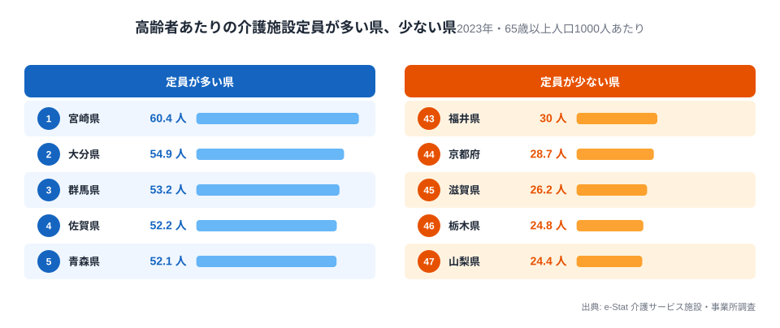
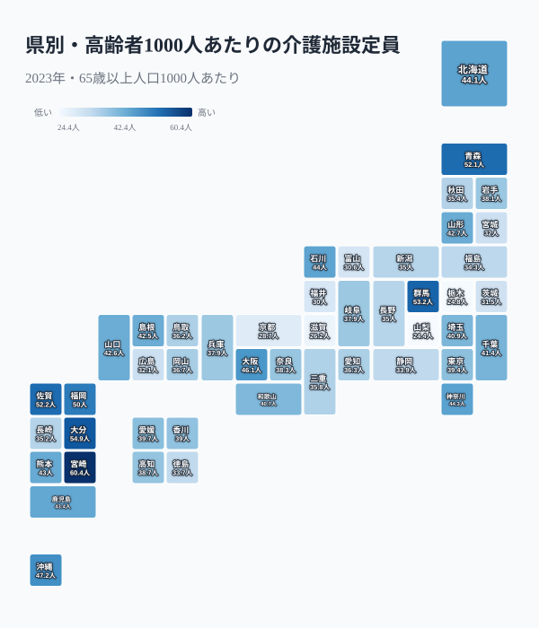
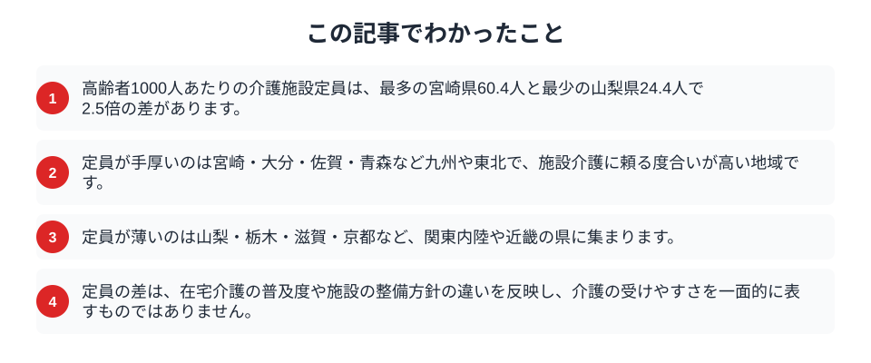

高齢者が増えれば、介護施設の必要も高まります。ただし介護施設がどれだけ整っているかは、県によって大きく違います。2023年のデータで、65歳以上の高齢者1000人あたりの介護施設定員を都道府県ごとに見ると、最も手厚い県と最も薄い県では2.5倍もの差がありました。高齢者の数が同じでも、施設に入れる余地は住む県によって変わるのです。介護の受け皿は、どこで厚く、どこで薄いのでしょうか。

## 九州で手厚く、関東内陸で薄い

まず、高齢者あたりの介護施設定員が多い県と少ない県を並べます。

<data-source label="e-Stat 介護サービス施設・事業所調査" note="65歳以上人口1000人あたりの介護施設定員（2023年）"></data-source>

最も手厚いのは宮崎県で、高齢者1000人あたり60.4人分の定員があります。続いて大分県54.9人、群馬県53.2人、佐賀県52.2人、青森県52.1人と、九州や東北の県が上位に並びます。反対に最も薄いのは山梨県の24.4人で、栃木県24.8人、滋賀県26.2人、京都府28.7人と続きます。宮崎と山梨では2.5倍の開きがあり、高齢者に対する施設の受け皿は、地域によってはっきり差がついています。同じように高齢化が進んでいても、施設で受け止める県と、そうでない県があるのです。

<source-link href="/ranking/nursing-home-capacity-per-1000-65plus">都道府県別の介護施設定員ランキングを見る</source-link>

## 定員の厚みを地図で見る

高齢者あたりの定員を地図にすると、その偏りが地域のまとまりとして現れます。

<data-source label="e-Stat 介護サービス施設・事業所調査" note="65歳以上人口1000人あたりの介護施設定員（2023年）"></data-source>

色が濃い、つまり定員が手厚いのは九州から東北にかけての県です。反対に色が薄い、定員が少ないのは関東内陸から近畿にかけての県が目立ちます。この分布は、単純に高齢化率の高さとは一致しません。高齢化が進んでいても定員が薄い県があり、逆に定員が手厚い県もあります。施設の整備は、その県が施設介護を重視してきたか、在宅介護をどこまで支えているかといった、政策や地域の事情に左右されます。定員の地図は、高齢者の数だけでなく、各県が介護をどう組み立ててきたかを映しています。施設定員が薄い県では、その分を在宅サービスや家族の支えで補っている可能性があり、逆に定員が手厚い県では施設を中心に据えた整備が進んできたと見ることができます。ただし、どちらの背景がどの県に当てはまるかは、在宅サービスの利用状況などをあわせて確かめる必要があります。同じ「介護を支える」でも、その手段は地域によって異なる組み立て方をしています。

## なぜ定員に差がつくのか

介護施設の定員は、需要だけで決まるわけではありません。

> [!NOTE]
> 施設の整備は、都道府県や市町村が策定する介護保険事業計画に基づいて進みます。施設を多く整える方針の県もあれば、在宅サービスや地域密着型のサービスを厚くして施設に頼りすぎない方針の県もあります。同じ高齢化率でも、この方針の違いが定員の差となって現れます。

つまり定員が薄いことは、必ずしも介護が受けにくいことを意味しません。在宅介護や訪問サービスが充実していれば、施設定員が少なくても地域全体で高齢者を支えられます。[2040年に介護人材69万人が不足](/blog/nursing-care-shortage-2040)するという見通しのなかで、施設と在宅のどちらに軸足を置くかは、これからの各県の選択にかかっています。

## 数字を読むときの注意

定員の多さ・少なさを、そのまま介護の充実度と結びつけるのは早計です。

> [!WARNING]
> 施設定員は介護の受け皿の一部にすぎません。訪問介護やデイサービス、[高齢者のひとり暮らし](/blog/aging-solo-living-crisis)を支える地域の見守りなど、施設以外の支えを含めて初めて、その地域の介護力が測れます。定員が少ない県が、介護が手薄な県とは限りません。

> [!TIP]
> 待機者数や実際の入所のしやすさは、定員だけでは測れません。定員が多くても希望者が多ければ入りにくく、少なくても在宅で足りていれば不足とは限りません。地域の介護を考えるときは、定員に加えて需要と供給の両面を見る必要があります。

介護施設の定員の地図は、高齢社会をどう支えるかという問いに、県ごとの答え方の違いがあることを教えてくれます。

## まとめ

この記事でわかったことを整理します。

高齢者あたりの介護施設定員は、宮崎と山梨で2.5倍の差がありました。九州や東北で手厚く、関東内陸や近畿で薄いという分布は、高齢化率だけでは説明できず、各県の介護方針を反映しています。施設と在宅のバランスは、[医療機関の多くが過疎地域に置かれている](/blog/depopulation-area-medical-facilities)状況とともに、[高齢社会のテーマページ](/themes/aging-society)から広く展望できます。定員の差を知ることは、これからの介護のかたちを考える手がかりになります。

## データ出典

- e-Stat（政府統計の総合窓口）介護サービス施設・事業所調査「65歳以上人口1000人あたり介護施設定員」（2023年）
- 定員は介護保険施設の定員を65歳以上人口で割って算出した値を使用しています。
