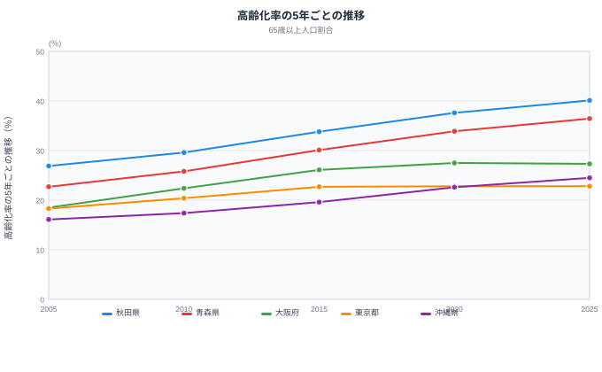
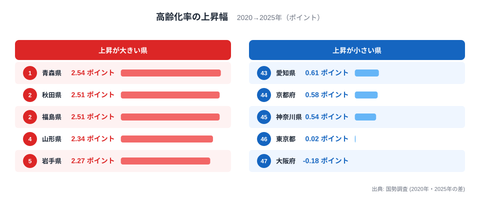
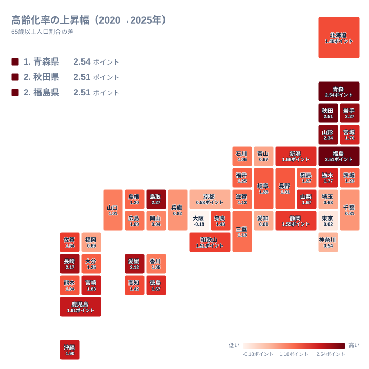
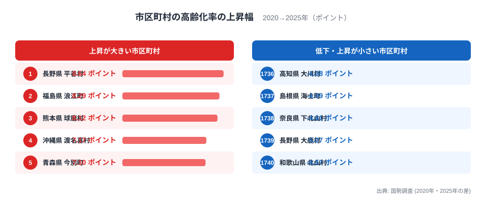

2020年から2025年の5年間で、65歳以上人口の割合(高齢化率)は大阪府を除く46都道府県で上がりました。最も上がったのは青森県の2.54ポイントで、大阪府は-0.18ポイントとただ一つ下がっています。東京都は0.02ポイントで、ほぼ横ばいです。意外なのは、上昇のペースそのものが緩んだことです。47都道府県の単純平均で見ると、前の5年は2.58ポイントだった上昇幅が、直近の5年は1.37ポイントとほぼ半分になりました。

高齢化は「どこも同じ速さで進む」わけではありません。この記事では、まず5年おきの推移で上昇ペースの変化を確かめ、次に都道府県ごとの上昇幅を比べます。そのうえで、割合が上がる仕組みを分子(65歳以上)と分母(総人口)に分けて読み解き、最後に1,740の市区町村では上昇幅が約15ポイントも開く様子を見ます。ここでいう「ポイント」は、割合どうしの差です。たとえば33.9%から36.4%になれば、2.5ポイントの上昇です。

## 5年おきの推移で見る、上昇ペースの変化

折れ線は2005年から5年おきの値で、全国の都道府県別の値は[65歳以上人口割合ランキング](/ranking/ratio-65-plus)で確認できます。秋田県は26.9%から2020年の37.6%、2025年の40.1%へと上がり、40%を超えた唯一の県になりました。青森県も22.7%から36.4%へ伸びています。一方、東京都は2015年の22.7%から2020年に22.8%、2025年に22.8%と、10年間ほとんど動いていません。大阪府は2020年の27.5%から2025年に27.3%へ下がりました。沖縄県は16.1%から24.5%まで上がっていますが、2025年でもなお46位の低さです。

47都道府県の単純平均で上昇幅を並べると、2005年から2010年は2.76ポイント、2010年から2015年は3.73ポイント、2015年から2020年は2.58ポイント、2020年から2025年は1.37ポイントでした。2010年から2015年の窓が最大で、直近が最小です。しかも47都道府県すべてで、直近の上昇幅は前の5年より小さくなっています。ただし2020年までの値は小数第1位までの公表値なので、差には最大0.1ポイント程度の丸め誤差があります。東京都の縮み幅は0.08ポイントで、この誤差の範囲に収まります。

[仮説] 2010年から2015年に上昇幅が最大になった主因は、1947年から1949年に生まれた団塊の世代が65歳になったことです。この世代が65歳に達したのは2012年から2014年で、ちょうどこの5年間に入ります。直近の5年に鈍ったのは、65歳になる1955年前後の生まれの人数が団塊の世代より少なく、加えて団塊の世代が75歳を超えて亡くなる人が増え始めたことも関係している可能性があります。この記事のデータは年齢別の内訳を持たないため、検証には国勢調査の5歳階級別人口(2020年の60〜64歳と、2025年の85歳以上など)を別に確認する必要があります。

## 都道府県の上昇幅:東北が上位を占め、大都市圏は動かない

<source-link href="/ranking/ratio-65-plus">65歳以上人口割合ランキングを見る</source-link>

65歳以上人口割合の上昇幅は、2025年の割合から2020年の割合を引いて求めました。1位は青森県の2.54ポイントで、2位は秋田県と福島県が同じ2.51ポイントで並びます。4位は山形県の2.34ポイントで、鳥取県と岩手県が2.27ポイントの同率5位です。東北6県のうち5県が上位に入り、宮城県は1.76ポイントで上位から外れました。上位には東北のほか、鳥取県の山陰、長崎県や鹿児島県などの九州、愛媛県の四国も入っています。

下位は大阪府の-0.18ポイントが最も小さく、東京都の0.02ポイント、神奈川県の0.54ポイント、京都府の0.58ポイント、愛知県の0.61ポイントと続きます。東京・大阪・名古屋の三大都市圏を中心とする府県がそろって下位に並びました。

地図にすると、濃い色は東北の日本海側から太平洋側、山陰、九州に散らばり、色が薄いのは関東南部から東海、近畿の都市圏に集まっています。上昇幅の大きさは、必ずしも「もともと高齢化率が高い県ほど速い」という形にはなっていません。2020年に37.6%で1位だった秋田県は上昇幅でも上位に入りましたが、2位の高知県は1.42ポイント、3位の山口県は1.01ポイントで、47都道府県の平均1.37ポイントと同程度か、それを下回っています。高齢化率の水準と上昇の速さは別々に見る必要があります。

水準の側でも節目を越えました。高齢化率が30%以上の県は2020年の32県から2025年の37県へ、35%以上の県は2県から10県へ増えています。40%以上は0県から、秋田県の1県になりました。

## 割合はなぜ上がるのか:高齢者が増えなくても上がる県がある

高齢化率は「65歳以上の人口 ÷ 総人口」です。上昇の理由は、分子が増える場合と、分母が縮む場合の2通りあります。[総人口](/ranking/total-population)に高齢化率を掛けて65歳以上人口を概算し、5年間の増減を調べたところ、総人口が減った都道府県は46もありました。増えたのは東京都だけです。65歳以上人口の概算が減った都道府県は23で、そのうち大阪府を除く22都道府県では、高齢者が減ったのに割合は上がっています。

青森県は総人口が7.96%減り、65歳以上は概算で1.06%減にとどまりました。65歳未満は11.50%も減っています。秋田県も総人口が8.13%減で、65歳以上が2.01%減に対し、65歳未満は11.82%減です。この2県では「お年寄りが増えた」のではなく「若い世代が高齢者よりずっと速く減った」ことが、割合を押し上げています。福島県は65歳以上が0.65%増えましたが、65歳未満は10.14%減っており、やはり分母の縮みが大きく効いています。

対照的なのが沖縄県です。総人口はほぼ横ばい(0.06%減)ですが、65歳以上が8.35%増え、65歳未満は2.52%減りました。沖縄県の1.90ポイントの上昇は、高齢者が実際に増えた分が中心です。東京都は総人口が1.35%増え、65歳以上が1.45%増、65歳未満も1.32%増と、分子と分母がそろって同じように増えたため、割合はほとんど動きませんでした。大阪府は65歳以上が1.54%減、65歳未満が0.64%減で、高齢者のほうが速く減ったことで割合が下がっています。

> [!NOTE]
> 65歳以上人口は「高齢化率 × 総人口」から求めた概算です。高齢化率は年齢が不詳の人を除いた人口で計算するため、実際の65歳以上人口とはわずかに数字がずれます。増減の向き(増えたか減ったか)を見るための目安として読んでください。

## 市区町村では約15ポイントの開き:小さな町村ほど大きく振れる

2020年と2025年の両方に値がある1,740の市区町村で見ると、上昇幅の中央値は2.23ポイントでした。1,654団体で上昇し、84団体(全体の約4.8%)で低下しています。最も上がったのは長野県平谷村の8.64ポイントで、福島県浪江町が8.29ポイント、熊本県球磨村が8.12ポイント、沖縄県渡名喜村が7.17ポイント、青森県今別町が7.10ポイントで続きます。最も下がったのは和歌山県北山村の-6.57ポイントで、長野県大鹿村が-5.07ポイント、奈良県下北山村が-4.81ポイントです。最大と最小の差は約15ポイントに達します。

上位と下位に共通するのは、人口の少ない町村が多いことです。2020年の人口が5,000人未満の290団体では、上昇幅の標準偏差が2.25ポイントありました。人口10万人以上の283団体では1.00ポイントで、半分以下です。5,000人未満の団体は全体の約17%ですが、上昇幅の上位50団体のうち28団体、下位50団体のうち26団体を占めています。人口353人の平谷村で65歳以上が9人増えれば、それだけで割合は約2.5ポイント動きます。数十人の出入りで大きく振れる小規模団体は、上にも下にも極端な値が出やすいのです。

> [!WARNING]
> 小規模な町村の上昇幅は、数人から数十人の増減で大きく動きます。順位が高い、あるいは低いことは、その地域の高齢化が構造的に速い、遅いことを直ちに意味しません。平谷村の総人口は2020年の387人から2025年の353人に減っており、浪江町の総人口は1,923人から2,574人に増えています。

浪江町は、上昇幅が2位でありながら総人口が増えている点が目立ちます。[仮説] 東日本大震災後の避難指示の解除で戻った住民に高齢者が多かった可能性があります。分母が縮んだ結果として説明できないため、年齢階級別の人口(国勢調査)で帰還者と新規転入者の年齢構成を確認する必要があります。

人口の多い都市に目を向けると、人口30万人以上の団体では愛媛県松山市の4.28ポイント、東京都八王子市の3.80ポイント、鹿児島県鹿児島市の3.58ポイントが上位でした。東京23区では、9区で低下しました。台東区が-1.93ポイント、北区が-1.79ポイント、墨田区が-1.58ポイントと大きく、千代田区も-0.04ポイントとわずかに下がりました。都道府県の東京都の値がほぼ横ばいの裏に、都心部で割合が下がる区と、郊外の八王子市のように3ポイント以上上がる市が混在しています。

高齢化率が50%を超える団体の数については、[半数が高齢者の市町村の記事](/blog/half-population-elderly-municipalities)で扱っています。また、秋田県と沖縄県を軸に水準そのものの差を見たい方は、[秋田県と沖縄県の高齢化率の比較](/blog/aging-rate-akita-vs-okinawa)も参考になります。青森県の詳しいデータは[青森県のページ](/areas/02000)、大阪府は[大阪府のページ](/areas/27000)で確認できます。

## データについて

高齢化率は、国勢調査の年齢別人口をもとに、年齢が不詳の人を除いた人口で65歳以上を割って求めた値です。2020年と2025年はどちらもこの原数値で、同じ定義です。報道などで使われる全国29.4%という値は、年齢不詳を補完して算出した数字で、この記事の県別の値とは小数点以下が異なります。

上昇幅は「2025年の割合 − 2020年の割合」を小数第2位で丸めたものです。2020年の都道府県別の値は小数第1位まで、2025年は小数第5位まで公表されており、都道府県の差には最大でおよそ0.05ポイントの誤差が入ります。青森県2.54、秋田県2.51、福島県2.51といった近い値の順位は、この誤差の範囲で入れ替わる可能性があります。

市区町村の件数は、政令指定都市を1団体として数え、その区は除きました。東京23区は区ごとに数えています。全体では1,740団体で、福島県双葉町は2020年の値がないため除いています。規模別の集計は、2020年の総人口を基準にしました。

## まとめ

- 2020年から2025年の高齢化率の上昇幅は、青森県が2.54ポイントで最大、大阪府が-0.18ポイントで最小でした。
- 47都道府県の平均上昇幅は、前の5年の2.58ポイントから1.37ポイントに縮み、全県で前の5年より小さくなりました。
- 上位は東北5県などで、下位は東京・大阪・名古屋の三大都市圏を中心とする府県でした。東京都は0.02ポイントとほぼ横ばいです。
- 青森県や秋田県では65歳以上が減っても、若い世代がさらに速く減って割合が上がりました。沖縄県は高齢者が実際に増えた影響が中心です。
- 市区町村では最大8.64ポイントの上昇から-6.57ポイントの低下まで約15ポイントの開きがあり、人口5,000人未満の小規模団体ほど極端な値が出やすくなります。
