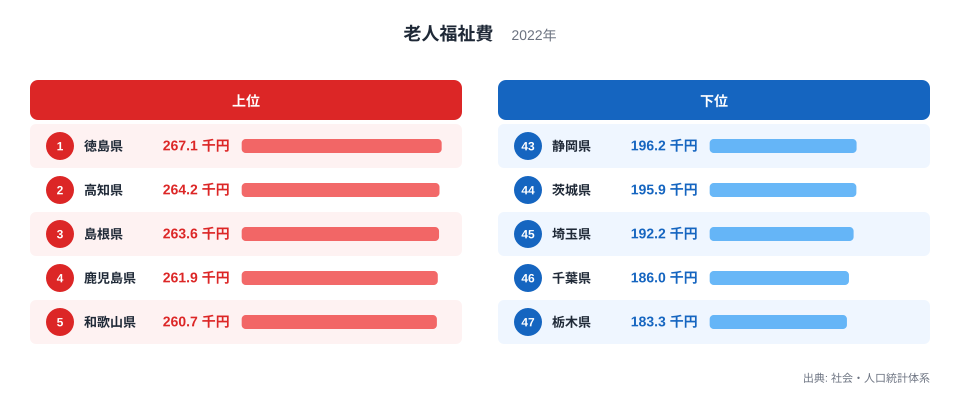
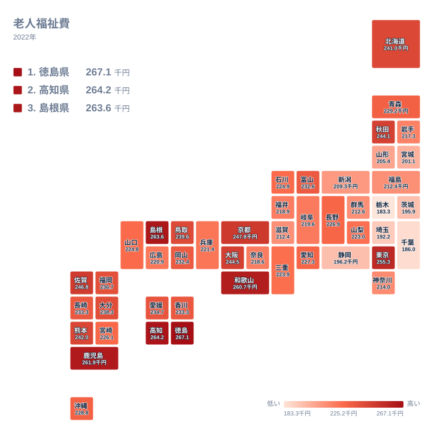

「老後はどこに住むか」を考えるとき、医療や介護へのアクセスと並んで気になるのが、自治体がどれだけ高齢者福祉にお金をかけているかです。都道府県と市町村が高齢者のために支出する「老人福祉費」を65歳以上人口1人あたりに換算すると、2022年度で最も多い県と最も少ない県の間には約1.5倍の差がありました。

最も多いのは徳島県の267.1千円、最も少ないのは栃木県の183.3千円です。上位には地方部の県が並ぶ一方、栃木県のほか千葉県・埼玉県・茨城県という関東の県と、東海の静岡県が軒並み下位に沈んでいます。ところが同じ首都圏でも東京都だけは255.3千円で全国6位と上位に食い込んでおり、単純な「都市は薄い・地方は厚い」という構図では説明できません。この記事では、老人福祉費が県ごとにどう分布し、なぜ東京近郊の県だけが薄くなるのかを見ていきます。

> [!NOTE]
> 老人福祉費は、都道府県と市町村の決算に計上された老人福祉関係の歳出合計を、その県の65歳以上人口で割った値です。特別養護老人ホームなどの施設整備費、在宅福祉サービスの委託費、老人クラブへの補助金などを含む行政支出であり、高齢者個人が受け取る年金や現金給付とは別物です。

## 老人福祉費ランキング―地方の県が上位、東京近郊は下位

<source-link href="/ranking/per-capita-elderly-welfare-expenditure-65plus-pref-municipal">老人福祉費の都道府県別ランキングをもっと見る</source-link>

1位は[徳島県](/areas/36000)の267.1千円で、2位高知県264.2千円、3位島根県263.6千円、4位鹿児島県261.9千円、5位和歌山県260.7千円です。四国（徳島・高知）、中国（島根）、九州（鹿児島）に近畿の和歌山を加えた、西日本の県が上位5位を占めています。これらの県はいずれも高齢化率が高く、施設介護や在宅福祉サービスの整備を早くから進めてきた地域です。人口規模が小さい分、行政サービスが手薄になりやすいと思われがちですが、実際には高齢者1人あたりで見ると手厚い支出をしている県が多いことが分かります。

一方、下位に目を移すと様相が変わります。43位静岡県196.2千円、44位茨城県195.9千円、45位埼玉県192.2千円、46位千葉県186千円、そして47位[栃木県](/areas/09000)183.3千円です。東海の静岡県を除く4県はいずれも関東に位置します。首都圏に近く人口も多いこれらの県では、高齢者1人あたりの老人福祉費が全国平均を下回っている状態です。財政規模が小さいわけではないのに支出が薄いという点が、地方の県との対比で際立ちます。

## なぜ千葉・埼玉は最下位争いなのか

千葉・埼玉・茨城の3県に共通するのは、高度経済成長期以降に東京への通勤圏として人口が急増した「ベッドタウン」型の県だという点です。こうした自治体はもともと若い子育て世代の流入を前提にまちづくりを進めてきたため、保育や教育への予算配分が優先されやすく、高齢者福祉の基盤整備は後回しになりがちでした。栃木県や東海の静岡県も、四国・九州の上位県ほど高齢化率が高くないという共通点があり、老人福祉費という行政サービスへの投資圧力が相対的に弱かったことが背景にあると考えられます。

もう一つの要因は同居・近居の家族構成です。ベッドタウンでは核家族化が進む一方で、子世代と同じ市内、あるいは隣接自治体に住み続けるケースも多く、家族による支えが公的サービスの代替として機能してきた面があります。地方の県では若い世代が都市部へ流出し、高齢者だけの世帯や一人暮らし世帯が増えた結果、行政が担う役割が相対的に大きくなったという構図です。

> [!WARNING]
> 老人福祉費が多い県ほど高齢者福祉サービスが手厚いとは限りません。特別養護老人ホームの新設・改修など施設整備費は単年度で大きく変動するため、その年にたまたま大型工事があった県は数値が跳ね上がることがあります。また人口の少ない県は1人あたりに換算した際の振れ幅が大きくなりやすい点にも注意が必要です。

## 地図で見る老人福祉費の地域差―東京だけが例外

地図にすると、老人福祉費が多い県は四国・中国・九州に近畿の一部を加えた西日本にまとまって分布し、関東から東海にかけて薄い帯ができていることが視覚的に分かります。この帯の中で唯一色が濃いのが東京都です。埼玉・千葉・茨城という隣接3県に囲まれながら、東京都だけ例外的に色が濃く、地図上でも周囲から浮き上がって見えます。単純な「大都市は薄い」という予想は東京都には当てはまらず、首都圏の中でも23区を抱える東京都と、その外側に広がるベッドタウン県とでは事情が大きく異なることが読み取れます。

## 東京都はなぜ例外的に高いのか

東京都が上位に入る背景には、物価や人件費の水準の違いがあります。同じ内容の介護サービスや施設運営であっても、東京都内は地代・賃金ともに地方より高く、同水準のサービスを提供するだけで支出額が膨らみやすい構造です。加えて東京都は独自の高齢者福祉施策を長年積み重ねてきた経緯があり、区市町村と都が重層的に予算を投じてきたことも、1人あたりの支出額を押し上げている一因と考えられます。人口密度が高く単身高齢世帯の割合も大きいため、施設サービスへの需要そのものが多いことも影響しているとみられます。

> [!TIP]
> 老人福祉費の多さは、その県の行政がどれだけ高齢者福祉に予算を配分しているかを示す指標であり、老後の暮らしやすさそのものを保証するものではありません。移住先を検討する際は、この指標に加えて医療機関へのアクセスや住居費、交通の便など複数の要素を合わせて確認することをおすすめします。

実際、東京都の高齢者福祉施策は老人福祉費という統計項目だけでは全体像をつかみにくい面があります。都内在住の高齢者向けに交通機関の運賃を補助する「シルバーパス」のような独自施策が長年運用されており、その財源の一部は老人福祉費とは別枠で計上されています。統計上の数値だけを見て「東京都が突出して手厚い」と結論づけるのではなく、制度の中身まで確認したうえで比較することが大切です。

## まとめ

- 老人福祉費（65歳以上1人あたり、2022年度）の1位は[徳島県](/areas/36000)の267.1千円
- 最下位は[栃木県](/areas/09000)の183.3千円で、1位との差は約1.5倍
- 上位5県は徳島・高知・島根・鹿児島・和歌山で、四国・中国・九州に近畿の和歌山を加えた西日本の県が並ぶ
- 下位5県は静岡・茨城・埼玉・千葉・栃木で、東海の静岡を除く4県は東京への通勤圏にあたる関東の県
- 例外は東京都で、隣接する千葉・埼玉・茨城が下位に沈む中、東京都だけが全国6位の高水準

老人福祉費の分布は、高齢化率の高さだけでなく、その地域がどのような形で高齢者を支えてきたかという歴史的な経緯を映し出しています。関連して、[高齢者1000人あたりの介護施設定員の記事](/blog/elderly-population-care-capacity-gap)では、施設という受け皿の側から同じテーマを掘り下げています。老後の住まいを考えるうえでは、こうした複数の指標を組み合わせて地域を見比べることが欠かせません。

## データ出典

総務省「社会・人口統計体系」の老人福祉費データ（都道府県・市町村決算合計、2022年度）をもとに、e-Stat経由で作成しています。あわせて見る: [社会保障カテゴリの関連ランキング](/category/socialsecurity)
