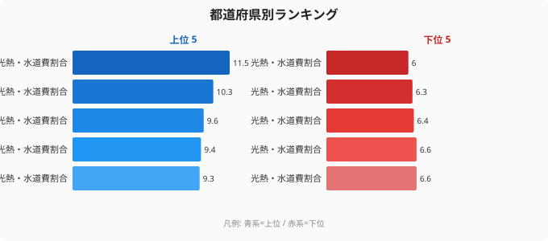
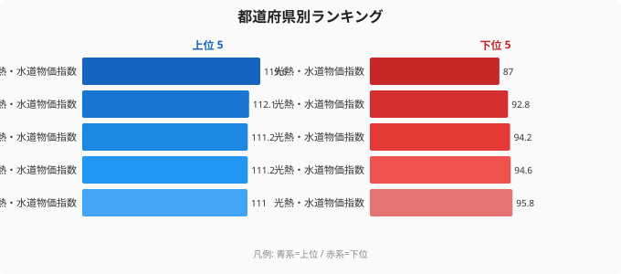
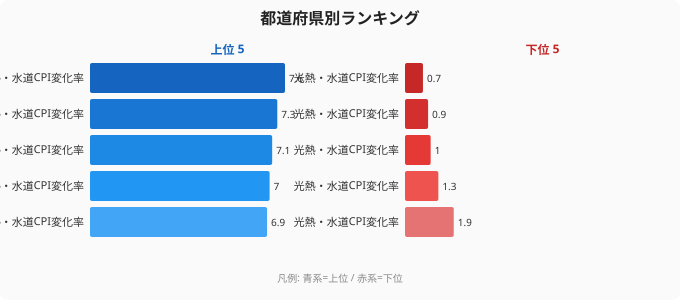

2026年4月、大手電力10社が電気代を一斉値上げします。政府の補助金が終了したためです。

しかし、値上げの「痛み」は全国一律ではありません。**光熱費が家計を圧迫する度合いは、都道府県によって最大2倍の差**があります。

本記事では、総務省の家計調査と消費者物価地域差指数のデータを使い、電気代値上げで最も打撃を受ける県を特定します。

## 光熱費の家計負担、最大は青森の11.5%

家計に占める光熱・水道費の割合を都道府県別に見ると、**1位は青森県の11.5%**、2位は秋田県の10.3%、3位は島根県の9.6%です。

一方、最も低いのは**東京都の6.0%**。千葉県6.4%、熊本県6.3%と続きます。

<source-link href="/ranking/utilities-expenditure-ratio-multi-person-households">47都道府県の光熱・水道費割合ランキングをもっと見る</source-link>

青森と東京の差は5.5ポイント。同じ月収30万円の世帯なら、青森は月3.45万円、東京は月1.8万円が光熱費に消えます。**電気代が10%上がれば、青森の世帯は月3,450円、東京は1,800円の負担増**──約2倍の差です。

> [!NOTE]
> 光熱・水道費割合のデータは総務省「家計調査」をもとに算出しています。二人以上世帯の年平均値で、単身世帯や季節変動は反映されていません。[青森県](/areas/02000)は冬季の暖房費が特に大きく、年間平均でも1位になっています。

## 光熱費の「物価」も北海道が突出

消費者物価地域差指数（光熱・水道）を見ると、**北海道が119.6で全国最高**。岩手県112.1、山形県111.2が続きます。

最も安いのは大阪府87.0で、北海道との差は32.6ポイント。

<source-link href="/ranking/consumer-price-difference-index-utilities">47都道府県の光熱費物価指数ランキングをもっと見る</source-link>

北海道の光熱費が高い背景には、厳寒による暖房需要の多さに加え、電力供給の構造的要因があります。北海道電力は他の電力会社と送電線が細くつながっているため、電力の融通が制約されています。

<ad-slot></ad-slot>

## 光熱費の値上がり幅にも地域差

消費者物価指数の光熱・水道の変化率を見ると、**愛媛県+7.6%、香川県+7.3%、沖縄県+7.1%**が上位に並びます。

一方、**広島県+0.7%、鳥取県+0.9%**と、値上がり幅が小さい県もあります。

<source-link href="/ranking/cpi-change-rate-utilities">47都道府県の光熱費変化率ランキングをもっと見る</source-link>

四国・沖縄の上昇率が高いのは、島嶼・半島部の電力供給コストが高いことに加え、燃料費調整額の反映タイミングの違いも影響しています。

> [!WARNING]
> 消費者物価指数の変化率は調査の基準時点や対象品目により解釈に注意が必要です。[愛媛県](/areas/38000)や[沖縄県](/areas/47000)の高い上昇率は、基準年の水準が低かった側面もあります。「上昇率が大きい＝絶対水準が高い」とは限らない点に留意してください。

## 寒冷地×高物価の「二重苦」

最も厳しいのは、**光熱費の家計負担が高く、かつ光熱費の物価水準も高い県**です。**青森県**は家計負担11.5%（1位）で物価水準も107.9と高い「二重苦」。**秋田県**（10.3%・107.5）、**岩手県**（9.0%・112.1）も同様です。**北海道**は家計負担こそ8.6%と中位ですが、物価水準119.6は全国最高。一方、**東京都**は家計負担6.0%（47位）・物価水準98.2と両方低く、値上げの痛みが最も軽い地域です。

東北・北海道の寒冷地は、暖房需要が多い上に光熱費の物価水準も高い「二重苦」の構造にあります。[北海道](/areas/01000)や[秋田県](/areas/05000)の状況は、消費支出全体の地域差とあわせて[家計消費ランキング](/ranking/household-expenditure)でも確認できます。

寒冷地の光熱費負担が重い根本原因は、冬季の暖房エネルギー需要の大きさにある。青森・秋田・岩手では、冬の暖房費が年間の光熱費総額を大きく引き上げており、同じ月収30万円の世帯でも青森と東京では年間で20万円以上の差が生じる計算になる。電力補助金終了後の値上げはこの格差をさらに拡大させる方向に作用する。

> [!TIP]
> 光熱費負担が特に重い東北・北海道の住民にとって、断熱リフォームの費用対効果は全国平均を大きく上回る。国の「子育てエコホーム支援事業」や各県の省エネ補助制度を活用することで、断熱工事費の一部を補助金でカバーできる場合がある。自分の県の補助制度は[都道府県エネルギー施策](/category/energy)から確認してほしい。

<ad-slot></ad-slot>

## 電気代値上げへの対策

家計への影響が大きい地域ほど、以下の対策が重要になります。

- **住宅の断熱性能向上**: 寒冷地では断熱リフォームの費用対効果が高い
- **電力契約の見直し**: 新電力・プラン変更で年間数千円〜1万円の節約が可能
- **再生可能エネルギーの活用**: 太陽光パネルの導入コストは年々低下

データで見ると、電気代値上げの「痛み」は都道府県で大きく異なります。自分の県の光熱費負担を把握し、対策を考える参考にしてください。

## データ出典

本記事のデータはe-Stat（政府統計の総合窓口）を基に作成しています。

本記事の対象データ: [関連カテゴリ](/category/energy)
