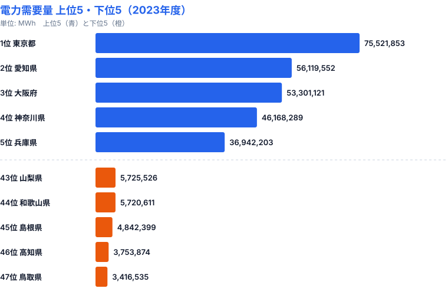
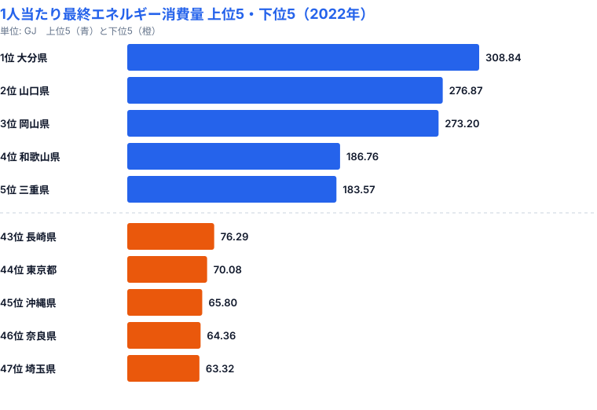
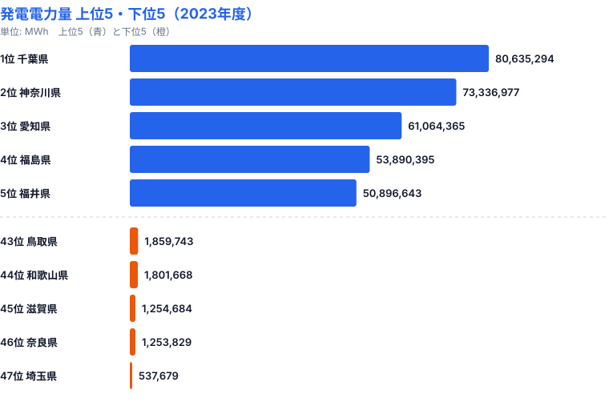

電気代の値上げが続く2026年。けれど電力の使われ方は、全国どこでも同じではありません。都道府県別の[電力需要量](/ranking/electricity-demand)を見ると、1位の東京都と47位の鳥取県では約22倍もの開きがあります。そしてこの差を「1人当たり」に直すと、上位に並ぶ県の顔ぶれがまるごと入れ替わります。総量で見える格差と、1人当たりで見える格差は別物なのです。この記事では、需要量・1人当たり消費量・発電量という3つの角度から、エネルギー消費の地域格差がどんな構造で生まれているのかを読み解きます。

## 電力需要量は東京と鳥取で22倍｜大都市圏と産業集積地が上位を独占

電力需要量の1位は東京都で75,521,853MWh。2位の愛知県（56,119,552MWh）を大きく引き離します。3位は大阪府（53,301,121MWh）、4位は神奈川県（46,168,289MWh）、5位は兵庫県（36,942,203MWh）と、首都圏・中京圏・関西圏という三大都市圏と、そこに重なる産業集積地が上位を占めています。

下位を見ると、47位の鳥取県は3,416,535MWh、46位の高知県は3,753,874MWh、45位の島根県は4,842,399MWhと続きます。1位の東京都と47位の鳥取県の差は約22倍にのぼります。なぜここまで開くのでしょうか。電力需要量は「そこに住む人の数」と「そこで動いている工場・オフィスの規模」の合計だからです。人口が集中し、かつ製造業の事業所が密集する都府県では、家庭・業務・産業の三部門すべてが上乗せされて需要が膨らみます。逆に鳥取・高知・島根のように人口が少なく、大規模なエネルギー多消費型の工場も少ない県では、三部門のいずれも積み上がらず、総量が小さくとどまります。つまり需要量ランキングは、人口規模と産業集積という2つの要因が掛け算で効いた結果を映しているのです。

> [!NOTE]
> 電力需要量は、その県内で消費された電力量の合計です。発電された場所ではなく「使われた場所」で集計されるため、大規模発電所がある県でも、その電気が他県に送られていれば需要量には計上されません。需要量と発電量は別の指標として扱う必要があります。

<source-link href="/ranking/electricity-demand">47都道府県の電力需要量ランキングをもっと見る</source-link>

## 1人当たりに直すと主役が交代｜なぜ大分・山口が上位なのか

総量ランキングでは東京・愛知・大阪が上位でしたが、[1人当たり最終エネルギー消費量](/ranking/final-energy-consumption-per-capita)に切り替えると景色が一変します。

1位は大分県（308.84GJ）、2位は山口県（276.87GJ）、3位は岡山県（273.20GJ）。いずれも石油化学コンビナートや製鉄所を擁する、重厚長大型の工業県です。4位は和歌山県（186.76GJ）、5位は三重県（183.57GJ）と続き、上位はエネルギー多消費型の素材産業が集積する県で占められています。一方、最下位は埼玉県（63.32GJ）、46位は奈良県（64.36GJ）、45位は沖縄県（65.80GJ）。これらは大都市のベッドタウンとして住宅都市の性格が強く、域内にエネルギーを大量に使う産業が乏しいため、人口で割ると数値が低くなります。

なぜ総量の主役だった東京都が、1人当たりでは44位（70.08GJ）まで沈むのでしょうか。総量が大きいのは人口が突出して多いからであって、住民1人あたりが特別に多く使っているわけではないからです。逆に大分県は人口が少なくても、製鉄・石油化学といった巨大プラントが消費するエネルギーを少ない人口で割るため、1人当たりが跳ね上がります。大分県と埼玉県の差は約4.9倍にのぼります。この開きは「人口の多さ」ではなく「どんな産業が立地しているか」という産業構造そのものによって生まれているのです。総量ランキングと1人当たりランキングで上位の顔ぶれが入れ替わるのは、両者が測っている対象が違うことを示しています。

> [!TIP]
> ランキングは「総量」と「1人当たり」のどちらで見るかで結論が逆転します。省エネを考えるとき、総量が大きい県は人口対策・都市機能の効率化が、1人当たりが大きい県は産業部門の効率化が、それぞれ効きどころになります。同じ指標でも割り方を変えると優先課題が変わる点に注意して読む必要があります。

<source-link href="/ranking/final-energy-consumption-per-capita">47都道府県の1人当たり最終エネルギー消費量ランキングをもっと見る</source-link>

<ad-slot></ad-slot>

## 発電量で見る「電力輸出県」｜千葉・神奈川が首都圏を支える

需要量とは別に、各県でどれだけ電気が「作られているか」を示すのが[発電電力量](/ranking/electricity-generation-capacity)です。需要量が消費の地図なら、発電量は供給の地図にあたります。

1位は千葉県で80,635,294MWh、2位は神奈川県（73,336,977MWh）、3位は愛知県（61,064,365MWh）、4位は福島県（53,890,395MWh）、5位は福井県（50,896,643MWh）。下位は47位の埼玉県（537,679MWh）、46位の奈良県（1,253,829MWh）、45位の滋賀県（1,254,684MWh）です。

この発電量を、それぞれの県の需要量と並べると「自給度」が見えてきます。千葉県は発電80,635,294MWhに対して需要は34,532,289MWhで、発電が需要の約2.3倍。神奈川県も発電73,336,977MWhに対して需要46,168,289MWhと約1.6倍で、いずれも作った電気の余剰を県外へ送り出す「電力輸出県」です。東京湾岸に並ぶ大規模火力発電所が、自県だけでなく首都圏全体の電力を支えている構図が浮かび上がります。逆に最大消費地の東京都は、発電がわずか5,734,852MWhしかなく、需要75,521,853MWhの1割にも届きません。需要のほとんどを域外からの供給に頼っているのです。最下位の埼玉県に至っては発電量が537,679MWhで、需要のほぼ全量を他県の発電所に依存しています。発電量ランキングの上位に並ぶのは、人口や工場が集まる消費地ではなく、湾岸や原子力立地など「電気を作って送り出す役割」を担う県だという点が、需要量ランキングとの決定的な違いです。

> [!WARNING]
> 発電電力量と電力需要量は順位が一致しません。千葉県は発電1位でも需要は中位、東京都は需要1位でも発電は下位というように、消費地と発電地はむしろ分離しているのが日本の電力構造です。発電量ランキングを「電気をたくさん使う県」と読み違えないよう注意が必要です。発電量は供給側、需要量は消費側の指標であり、両者は別々に見る必要があります。

<source-link href="/ranking/electricity-generation-capacity">47都道府県の発電電力量ランキングをもっと見る</source-link>

<ad-slot></ad-slot>

## まとめ

3つの角度から、エネルギー消費の地域格差の構造を整理します。

- 電力需要量の1位は東京都（75,521,853MWh）、47位は鳥取県（3,416,535MWh）で、約22倍の開きがあります。人口規模と産業集積の掛け算が需要量を決めています。
- 1人当たり最終エネルギー消費量に直すと主役が交代し、1位は工業県の大分県（308.84GJ）、47位は住宅都市の埼玉県（63.32GJ）で約4.9倍の開き。格差の正体は人口ではなく産業構造です。
- 発電電力量の1位は千葉県（80,635,294MWh）で、神奈川県とともに首都圏へ電気を送る「電力輸出県」。最大消費地の東京都は発電が需要の1割にも届かず、域外供給に依存しています。

日本のエネルギー政策は「省エネ」を全国一律の目標として掲げがちですが、実際の消費構造は都道府県ごとに大きく異なります。工業県では産業部門の効率化が、住宅県では家庭部門の省エネが、それぞれ優先課題になります。さらに消費地と発電地が分離している以上、送電網の維持と地域間の電力融通も欠かせません。地域ごとの産業構造と消費・供給のパターンを踏まえた政策設計が求められています。

## データ出典

- 社会生活統計指標（e-Stat、政府統計コード 0000010108）
- 電力需要量・発電電力量（2023年度）
- 1人当たり最終エネルギー消費量（2022年）
