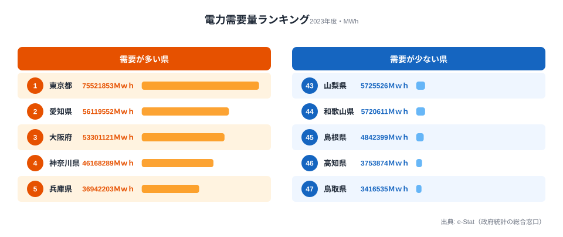
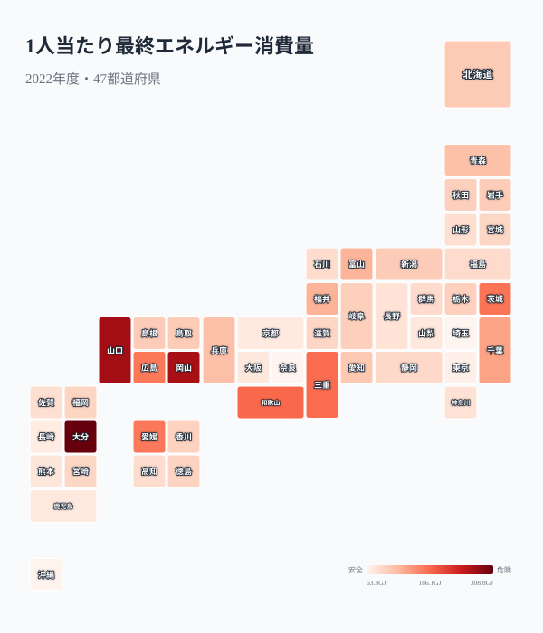
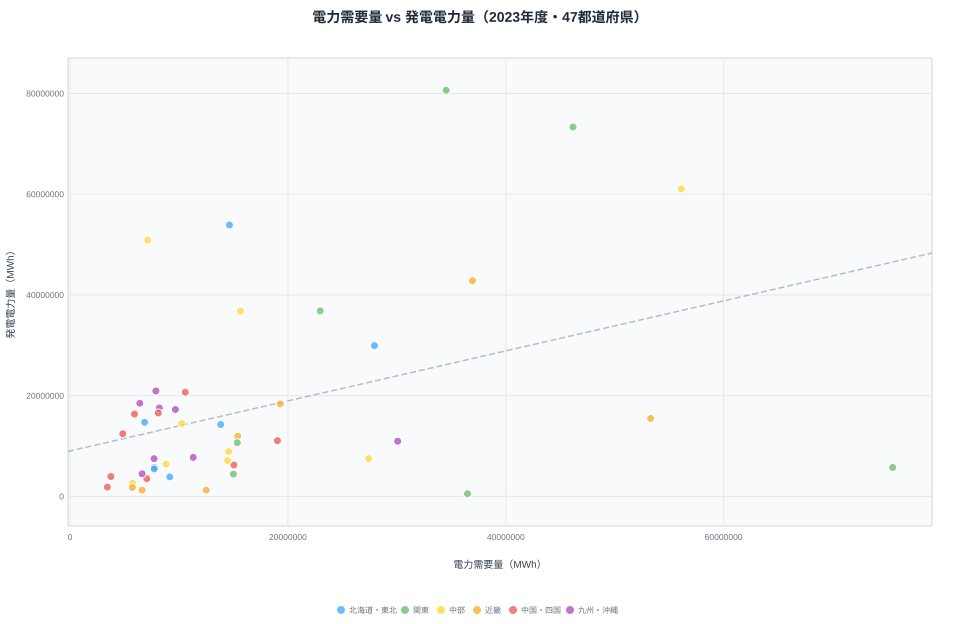
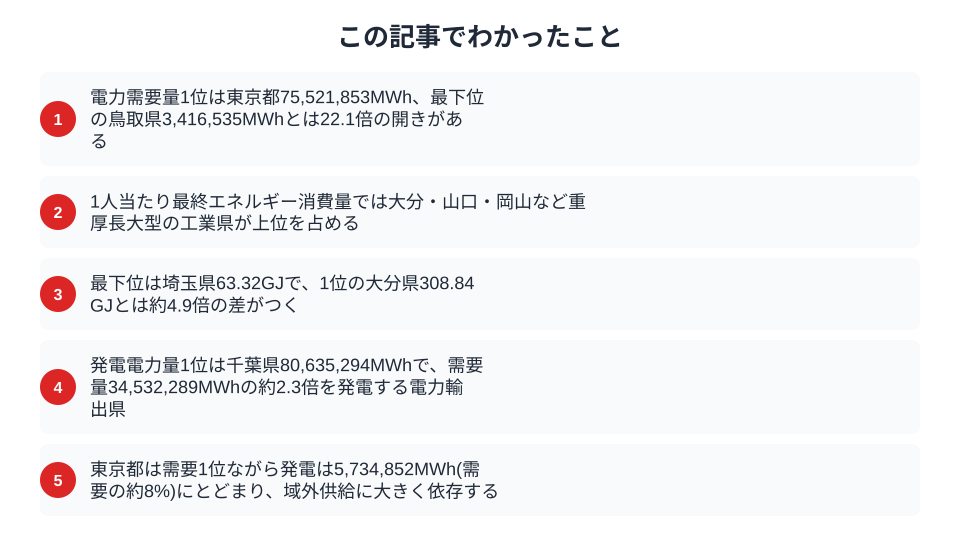

電気代の値上げが続く2026年。けれど、電力をどれだけ消費しているかは全国一律ではありません。都道府県別の電力需要量を見ると、1位の東京都と最下位の鳥取県では22倍近い開きがあります。さらに不思議なのは、需要が日本一の東京都が、自前ではほとんど発電していないという事実です。なぜ電力はこれほど大きく県をまたいで動くのか──その背景にある産業構造と発電立地の違いを、データで読み解いていきます。

> [!NOTE]
> 本記事の電力需要量・発電電力量は社会・人口統計体系（2023年度）の値です。「需要量」は域内で消費された電力、「発電電力量」はその県の発電所が生み出した電力を指し、両者は一致しません。電力は送電網を通じて県境を越えて供給されるため、需要と発電が別の県に分かれて立地するのが日本の電力システムの特徴です。

## 電力需要量ランキング — 産業県・大都市圏が上位を独占

電力需要量の1位は東京都で75,521,853MWh。2位の愛知県（56,119,552MWh）を大きく引き離します。3位は大阪府（53,301,121MWh）、4位は神奈川県（46,168,289MWh）、5位は兵庫県（36,942,203MWh）と、産業集積地と大都市圏が上位を占めています。

なぜ上位がこの顔ぶれになるのかは、需要を押し上げる二つの要素で説明できます。一つは人口、もう一つは工場やデータセンターなどの産業需要です。東京都は人口が突出して多く、オフィス・商業施設の業務用需要が積み上がります。愛知県は自動車をはじめとする製造業の集積が、大阪府・兵庫県は人口と工業の両方が需要を押し上げています。神奈川県は首都圏の人口と京浜工業地帯が重なる典型です。

下位に目を向けると、47位の鳥取県は3,416,535MWh、46位の高知県は3,753,874MWh、45位の島根県は4,842,399MWh。1位の東京都と47位の鳥取県の差は約22倍に達します。これらの県は人口規模が小さく、エネルギー多消費型の大規模工場も限られるため、需要の総量が抑えられます。人口規模と産業集積の差が、そのまま電力需要に反映されているのです。

<source-link href="/ranking/electricity-demand">47都道府県の電力需要量ランキングをもっと見る</source-link>

## 1人当たりで見ると景色が変わる — 工業県が浮上する理由

総量ランキングでは東京・愛知・大阪が上位でしたが、1人当たり最終エネルギー消費量に切り替えると景色が一変します。

1位は大分県（308.84GJ）、2位は山口県（276.87GJ）、3位は岡山県（273.20GJ）。いずれも石油化学コンビナートや製鉄所を擁する重厚長大型の工業県です。4位は和歌山県（186.76GJ）、5位は三重県（183.57GJ）と続き、上位には臨海部にエネルギー多消費型の素材産業を抱える県が並びます。人口あたりに直すと、人口が少なくても大規模なプラントを抱える県の数値が跳ね上がるためです。

一方、最下位は埼玉県（63.32GJ）、46位は奈良県（64.36GJ）、45位は沖縄県（65.80GJ）。住宅都市として大都市のベッドタウン機能を担う県は、域内にエネルギー多消費型産業が少ないため、1人当たりの数値が低くなります。働く場所は隣県にあり、住む場所だけが県内にある構造が、消費量を小さく見せています。

大分県と埼玉県の差は約4.9倍。この格差は「人口規模」ではなく「産業構造」によって生まれている点が、総量ランキングとの決定的な違いです。県ごとに消費の中身がどう変わってきたかは、[エネルギー消費の地域差](/blog/energy-consumption-structure-shift)でさらに詳しく整理しています。

> [!TIP]
> 総量と1人当たりは「どちらが正しい」ではなく「何を見たいか」で使い分けます。電力会社の供給計画や送電網の負荷を考えるなら総量が、産業構造やエネルギー効率の県ごとの性格を比べるなら1人当たりが手がかりになります。同じ「エネルギー消費」でも、見る角度を変えると上位県がまるごと入れ替わります。

<source-link href="/ranking/final-energy-consumption-per-capita">47都道府県の1人当たり最終エネルギー消費量ランキングをもっと見る</source-link>

<ad-slot></ad-slot>

## 電力の「自給度」散布図 — 発電量が需要を上回る県はどこか

横軸に電力需要量、縦軸に発電電力量をとった散布図を見ると、対角線より上に位置する県は「発電量 > 需要量」の電力輸出県です。需要と発電がきれいに一致しないのは、発電所が需要地ではなく立地条件（用地・冷却水・燃料搬入のしやすさ）で選ばれてきたためです。

千葉県は発電電力量80,635,294MWhで全国1位ですが、域内の電力需要量は34,532,289MWhにとどまり、発電が需要の約2.3倍に達します。神奈川県も発電73,336,977MWh（全国2位）に対し需要46,168,289MWhで、京葉・京浜の湾岸に並ぶ大規模火力発電所が首都圏の電力を支える構図が浮かび上がります。

逆に東京都は、需要75,521,853MWh（全国1位）に対して発電はわずか5,734,852MWh。自県で生み出す電力は需要の約8%しかなく、残りの大半を域外からの供給に頼っています。さらに極端なのが埼玉県で、発電電力量は537,679MWhと47都道府県中最下位。需要のほぼ全量を他県の発電に依存しています。大都市圏が「消費」を、その周辺の臨海県が「発電」を分担する、日本の電力地図の縮図がここに表れています。

> [!WARNING]
> この散布図は「県内で発電した量」と「県内で消費した量」を比べたものであり、各県が電力自給できているかを厳密に示すものではありません。送電網は広域で運用され、発電された電力は電力会社のエリアをまたいで融通されます。「発電量＞需要量」の県がそのまま他県を支えているとは限らない点に注意してください。

<source-link href="/ranking/electricity-generation-capacity">47都道府県の発電電力量ランキングをもっと見る</source-link>

## まとめ

電力需要量と1人当たりエネルギー消費量のデータから、エネルギー消費の地域格差の構造を整理します。

日本のエネルギー政策は「省エネ」を全国一律の目標として掲げがちですが、実際の消費構造は都道府県ごとに大きく異なります。工業県では産業部門の効率化が、住宅県では家庭部門の省エネが、それぞれ優先課題になります。さらに、需要地と発電地が分かれている現実を踏まえれば、送電網の整備や広域での電力融通も欠かせません。地域ごとの産業構造と消費・発電パターンを踏まえた政策設計が求められています。発電側の偏りに関心がある方は[再エネが届く県、届かない県](/blog/renewable-energy-regional-gap)を、エネルギー消費の地域差を広く見たい方は[エネルギーカテゴリの統計一覧](/category/energy)も参考にしてください。

## データ出典

- [社会生活統計指標（e-Stat）](https://www.e-stat.go.jp/dbview?sid=0000010108) — 電力需要量（2023年度）・発電電力量（2023年度）・1人当たり最終エネルギー消費量（2022年度）。総務省統計局「社会・人口統計体系」を e-Stat 経由で整備しています。
