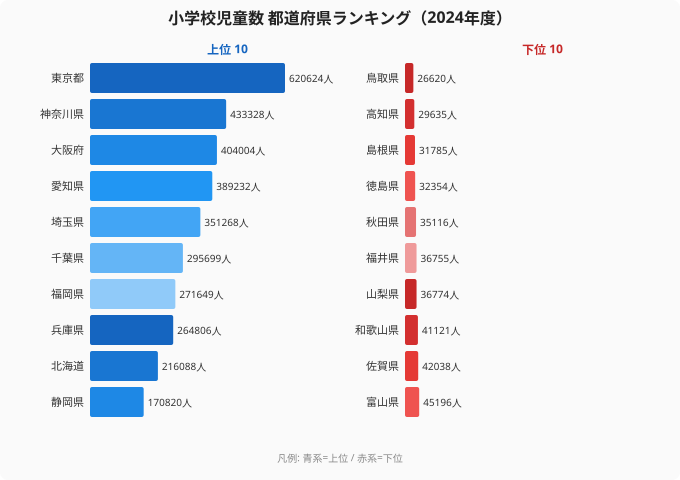

少子化は全国で同時に進む現象です。しかし「子どもがどこにいるか」という分布を見ると、その姿はまったく均一ではありません。2024年度の文部科学省「学校基本調査」によれば、小学校児童数が最も多いのは東京都の620,624人です。最も少ない鳥取県は26,620人で、両者の開きは23.3倍にもなります。

同じ日本でありながら、なぜここまで子どもの数に差が生まれるのでしょうか。そして「子どもが多い県」と「子どもの比率が高い県」は、実は同じではありません。この記事では、都道府県別の小学校児童数を手がかりに、少子化下で進む「子どもの都市集中」という構造を読み解いていきます。

> [!NOTE]
> 本記事のデータは文部科学省「学校基本調査」2024年度の小学校在籍児童数（国立・公立・私立の合計）。都道府県全体の値であり、市区町村別の偏りは含みません。在籍児童数は「その県に住み、その県の小学校に通う子ども」の規模を示し、出生率の高低そのものを表す指標ではない点に注意してください。

## 全体像 — 上位と下位で23.3倍の開き

まず全体の分布を確認します。上位5県と下位5県を並べると、子どもの集中ぶりがはっきりと見えてきます。

上位は東京都（620,624人）・神奈川県（433,328人）・大阪府（404,004人）・愛知県（389,232人）・埼玉県（351,268人）と続きます。下位は島根県（31,785人）・高知県（29,635人）・鳥取県（26,620人）で、最大の東京都と最小の鳥取県では23.3倍の開きがあります。グラフの青い帯（上位）が画面いっぱいに伸びるのに対し、橙の帯（下位）はごくわずかしか伸びません。同じ「県全体の小学生」を数えているとは思えないほどの差です。

なぜここまで開くのでしょうか。鍵は、子どもの数が「出生率」ではなく「子育て世代がどれだけ多く住んでいるか」で決まる点にあります。総人口が大きい都市部ほど、たとえ一世帯あたりの子どもが少なくても、生まれてくる子どもの絶対数は積み上がります。逆に、もともと人口の少ない山陰・四国・東北の県では母数が小さく、児童数も小さくとどまります。この「母数の差」が23.3倍という開きの正体です。

<source-link href="/ranking/elementary-school-children-count">47都道府県の小学校児童数ランキングを詳しく見る</source-link>

全国の小学校児童数を合計するとおよそ594万人です。このうち上位5県（東京・神奈川・大阪・愛知・埼玉）だけで約220万人を占め、全国の約37%にあたります。わずか5つの都府県に、全国の子どものほぼ4割が集まっている計算です。一方、下位5県（島根・高知・鳥取・徳島・秋田）の合計は約15.6万人で、全国のわずか2.6%にとどまります。このコントラストこそが、本記事のテーマである「都市集中」の正体です。

> [!TIP]
> 児童数の「絶対数」と、子どもの「比率」は別の軸であることに注意してください。東京都は児童数こそ全国1位ですが、総人口に占める年少人口（15歳未満）の割合でみると全国でも低い水準にあります。都市は総人口が桁違いに大きいため児童数の絶対数は積み上がる一方、人口に占める子どもの「濃度」は必ずしも高くありません。この記事で扱うのはあくまで「絶対数」のランキングです。「割合」を知りたいときは[合計特殊出生率ランキング](/ranking/total-fertility-rate)など別の指標と併せて見てください。

## 大都市への集中 — 三大都市圏が上位を独占

上位を占めるのは、見事なまでに大都市圏の府県です。トップの東京都（620,624人）を筆頭に、神奈川県（433,328人）、埼玉県（351,268人）、千葉県（295,699人）と、首都圏（南関東）が上位に4県を送り込んでいます。この南関東4都県だけで合計約170万人に達し、全国の約29%を占めます。さらに大阪府（404,004人）と兵庫県（264,806人）の関西圏、愛知県（389,232人）と静岡県（170,820人）の東海圏が続きます。

つまり上位は、東京・大阪・名古屋という三大都市圏とその周辺で固められています。背景にあるのは、就職・進学を機に若い世代が大都市圏へ移動し、そこで家庭を持ち子どもを育てるという人口移動のパターンです。出生率そのものは都市部で必ずしも高くないものの、子育て世代の母数が圧倒的に大きいため、生まれてくる子どもの絶対数も多くなります。都市の児童数の多さは「子だくさんな県だから」ではなく「人が集まっている県だから」なのです。[人口密度ランキング](/ranking/population-density)を見ると、児童数上位の府県が高密度帯と重なることがよくわかります。

福岡県（271,649人）と北海道（216,088人）も上位に入ります。これらは地方ブロックの中心都市（福岡市・札幌市）を抱え、周辺県から人口を吸い寄せる「地方の拠点」として機能している点が共通します。子どもの集中は首都圏・関西・東海の三大都市圏だけでなく、地方ブロック単位でも中心都市へと向かっているのです。九州なら福岡、北海道なら札幌へと、より小さなスケールでも同じ吸引力が働いていることがうかがえます。

> [!NOTE]
> 上位県の児童数の多さは「出生率の高さ」ではなく「人口集積」の結果である点を強調しておきます。子育て世代が物理的に多く住む県ほど、児童数の絶対数は積み上がります。東京都の総人口に占める子どもの比率は低い水準にありますが、母数の大きさが順位を押し上げています。人口集積の頂点である[東京都のエリア統計](/areas/13000)を見ると、児童数だけでなく多くの教育・人口指標で全国上位に位置することがわかります。

## 地方の小規模化 — 下位県が抱える統廃合の現実

一方、下位に並ぶのは人口減少が著しい地方県です。最も少ない鳥取県（26,620人）に続き、高知県（29,635人）、島根県（31,785人）、徳島県（32,354人）、秋田県（35,116人）と並びます。下位5県はいずれも児童数が3.6万人以下にとどまります。

これらの県に共通するのは、山陰・四国・東北といった人口流出が続く地域に属していることです。若年層が進学・就職で都市圏へ流出し、地元に残る子育て世代が減ったことで、生まれてくる子どもの数そのものが縮小しています。鳥取県の児童数は東京都の約23分の1にすぎず、神奈川県・大阪府といった上位県の1つの市にも満たない規模の子どもしか県全体にいない計算になります。県という単位の大きさは同じでも、その中身は驚くほど違うのです。

子どもの絶対数が小さいことは、学校現場に直接的な影響を及ぼします。児童数の少ない県では1学年あたりの人数が少なく、複数学年を1クラスにまとめる「複式学級」を導入する小規模校が相対的に多くなります。学校統廃合が地域の現実的な課題となり、通学距離の長期化やコミュニティの拠点喪失といった問題にもつながっています。子どもが減ることは、単に教室が空くだけでなく、地域の暮らしの形そのものを変えていきます。

> [!WARNING]
> ただし「児童数が少ない＝教育環境が悪い」と短絡するのは誤りです。少人数学級には一人ひとりにきめ細かく対応できる利点もあり、学力面でのメリットを指摘する研究もあります。下位県の課題は「人数の少なさ」そのものではなく、子どもの減少が急速かつ将来も続く見通しにある点です。統廃合をどう進めるか、地域の学びの場をどう維持するかが問われています。最も児童数が少ない[鳥取県のエリア統計](/areas/31000)や[秋田県のエリア統計](/areas/05000)では、人口構造の全体像を確認できます。

## 都市と地方で「減り方」が違う構造

ここで本記事の核心に立ち返ります。少子化は全国共通の現象ですが、その「減り方」は都市と地方でまったく異なります。

地方県では、出生数の減少に加えて若年層の都市部への流出が重なります。つまり「生まれる子が減る」と「育つ場所が地元でなくなる」という二重の縮小が同時に進みます。これが下位県で児童数が急減する理由です。生まれた子どもが成人する頃には地元を離れ、その子どもたち（次の世代の児童）は都市部で生まれ育ちます。世代をまたぐたびに地方から子どもが抜けていく構造が、下位県の縮小を加速させています。

対して大都市圏は、地方からの若年層の流入によって子育て世代の母数が維持され、出生数の減少を一定程度カバーしています。少子化そのものは進んでいても、児童数の「順位」は安定して上位に留まります。結果として、全国の子どもがますます大都市圏へ偏っていきます。上位と下位で23.3倍に達する開きは、この偏りが年々強まっていることの表れといえるでしょう。

> [!TIP]
> 注目すべき例外が沖縄県です。沖縄県は児童数99,638人で、人口規模（全国25位前後）から想定される以上に児童数の順位が高い県です。これは全国トップクラスの出生率を背景に、人口に占める子どもの比率が高いためです。「絶対数」では大都市に及ばないものの、「子どもの濃度」という別の軸では沖縄が突出しています。絶対数と比率という2つの軸を分けて見ることの重要性が、ここに表れています。出生率という別の指標で都道府県を比較したい場合は[合計特殊出生率ランキング](/ranking/total-fertility-rate)を参照してください。

教育という観点でこの構造を捉え直すと、子どもが大都市に集中するほど、地方の学校維持と都市の学校の過密という正反対の課題が同時に生まれます。地方では校舎が余り教員配置に苦しむ一方、都市部では教室不足や待機児童に近い問題が起きます。同じ少子化という言葉の下で、正反対の対策が同時に必要になるのです。関連する教育・スポーツの指標は[教育・スポーツのカテゴリ一覧](/category/educationsports)からまとめて確認できます。

## データ出典

- 文部科学省「学校基本調査」2024年度（e-Stat 経由）

数値は2024年度（令和6年度）の小学校在籍児童数（国立・公立・私立の合計）。全国合計（約594万人）や上位・下位の構成比は、本データの都道府県別値から算出した概算。

## まとめ

- 小学校児童数が最も多いのは東京都（620,624人）、最も少ないのは鳥取県（26,620人）で、開きは23.3倍にのぼります
- 上位5県（東京・神奈川・大阪・愛知・埼玉）だけで全国の約37%、ほぼ4割の児童が集中しています
- 上位は三大都市圏とその周辺、福岡・北海道などの地方拠点で固められ、「人口集積＝高出生率」ではなく「子育て世代の母数の大きさ」が児童数を押し上げています
- 下位は鳥取・高知・島根・徳島・秋田など人口流出地域で、3.6万人以下に縮小し統廃合が現実の課題になっています
- 「児童数の絶対数」と「子どもの比率」は別の軸であり、沖縄（99,638人）は出生率の高さで人口規模以上の順位を保つ例外です

少子化という共通の現象の中で、出生率の地域差と若者の一方向的な流出が重なることで、人口規模と子ども数の乖離は固定化しつつあります。都市で子どもの絶対数が維持される一方、地方では「減少の加速」が止まらない構造は、学校統廃合・教員配置・地域コミュニティの維持という複合的な課題として現れています。人口の観点からは[人口ランキングカテゴリ一覧](/category/population)、教育の観点からは[教育・スポーツのカテゴリ一覧](/category/educationsports)で関連指標を確認できます。
