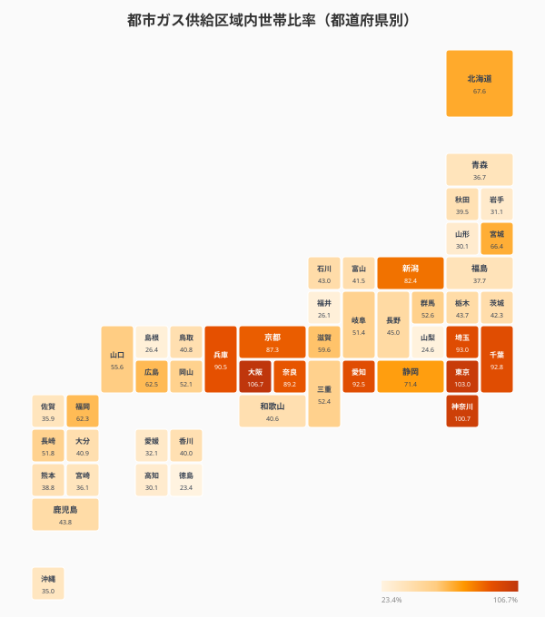
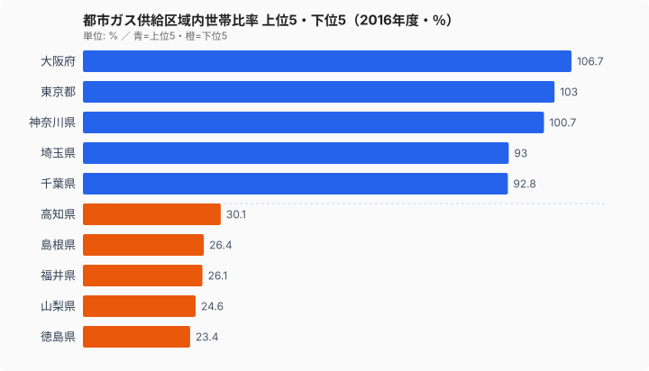
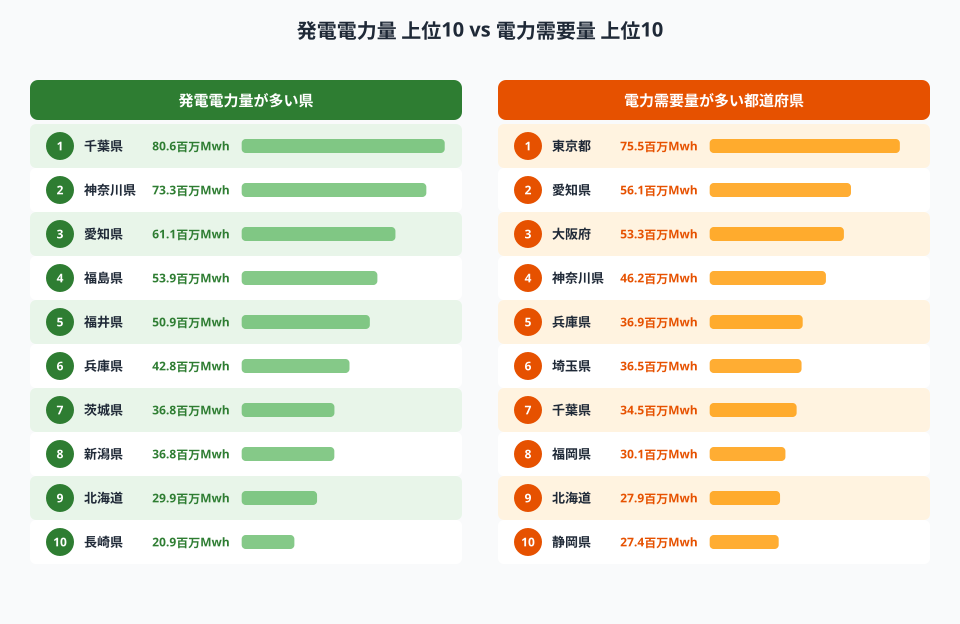
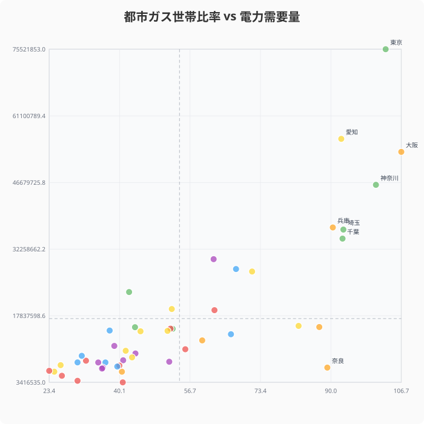
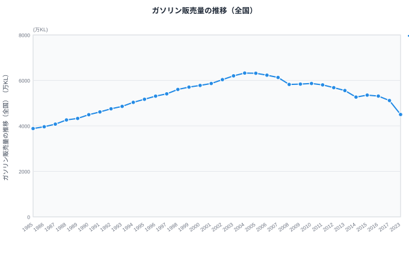
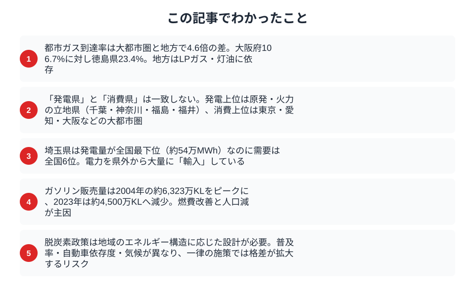

IHコンロ、ガスコンロ、灯油ストーブ。暮らしの「熱源」は住む県によって大きく異なる。都市ガスの供給区域内世帯比率は[大阪府](/areas/27000)で100%を超える一方、[徳島県](/areas/36000)は23.4%にすぎない。全国平均で見ても都市ガスが届く世帯は約半数にとどまる。エネルギーインフラの地域差をデータで検証する。

## 都市ガスが届く県・届かない県

タイルグリッドマップを見ると、三大都市圏（東京・大阪・名古屋）は都市ガスの供給率が高い暖色で塗られ、四国・山陰・東北の一部は薄い色が目立つ。

上位は大阪府（106.7%）、[東京都](/areas/13000)（103.0%）、神奈川県（100.7%）、埼玉県（93.0%）、千葉県（92.8%）。100%を超えるのは、供給区域内の世帯数と自治体の総世帯数の定義の差によるもので、実質的に全世帯に都市ガスが届いていることを意味する。

下位は徳島県（23.4%）、山梨県（24.6%）、福井県（26.1%）、島根県（26.4%）、高知県（30.1%）。これらの地域ではLPガス（プロパンガス）や灯油が主要な熱源となっている。

> [!NOTE]
> 都市ガスデータは2016年時点のものです。近年の変動は反映されていない点にご留意ください。

都市ガスは管路のネットワークが必要なインフラであり、人口密度が低い地域への敷設はコスト面で採算が合わない。そのためLPガスが「最後の砦」として地方のエネルギー供給を支えている。LPガスは配送方式で管路不要だが、料金は都市ガスより割高になりやすい。

> [!WARNING]
> 都市ガス世帯比率が23%台の徳島県・山梨県では、残る約75%の世帯がLPガス・灯油・電気などに依存している。都市ガス料金よりLPガス料金が割高になりやすく、エネルギーコスト格差が家計に直結する。

<source-link href="/ranking/city-gas-supply-area-household-ratio">47都道府県の都市ガス世帯比率ランキングをもっと見る</source-link>

## 発電県 vs 消費県

電力のインフラにも大きな地域差がある。発電電力量と電力需要量を比較すると、「発電する県」と「消費する県」の顔ぶれが大きく異なることがわかる。

発電上位は千葉県（約8,064万MWh）、神奈川県（約7,334万MWh）、愛知県（約6,106万MWh）、福島県（約5,389万MWh）、福井県（約5,090万MWh）。千葉県・神奈川県は湾岸部の火力発電所が集中し、福井県は原子力発電所の稼働が寄与している。

一方、需要上位は東京都（約7,552万MWh）、愛知県（約5,612万MWh）、大阪府（約5,330万MWh）、神奈川県（約4,617万MWh）、兵庫県（約3,694万MWh）。東京都は需要1位だが発電では上位10に入らない。大量の電力を他県から「輸入」している構造だ。

注目すべきは埼玉県で、発電電力量が約54万MWhと全国最下位。7,552万MWhの東京都に次ぐ需要を持つ地域でありながら、県内にはほとんど発電設備がない。隣接する群馬県や新潟県の水力・火力に依存している。

<source-link href="/ranking/electricity-demand">47都道府県の電力需要量ランキングをもっと見る</source-link>

<ad-slot></ad-slot>

## ガソリン消費量が映す自動車依存

人口当たりのガソリン販売量は、その地域の自動車依存度を映す代理指標になる。

散布図では、都市ガス世帯比率が高い県（右上）は概ね電力需要も大きい。これは人口規模と都市化度が両者に共通する説明変数であるためだ。ただし愛知県のように、都市ガス比率はやや低めでも製造業が集中するため電力需要が突出して高い県もある。

## ガソリン販売量の推移

全国のガソリン販売量は2004年前後の約6,000万KLをピークに減少傾向が続いている。2020年にはコロナ禍で大幅に落ち込み、その後やや持ち直したものの、2023年時点で約4,500万KLとピーク時の約75%にとどまる。

要因は複合的だ。人口減少と高齢化によるドライバーの減少、燃費性能の向上、そしてハイブリッド車・EVの普及。ただしEVの保有台数は2024年時点でまだ乗用車全体の1%未満であり、ガソリン消費減少の主因は燃費改善と人口動態にある。

地方部では公共交通の縮小に伴い自動車が唯一の移動手段となっている地域が多く、ガソリン価格の変動が家計に直結する。EV転換は脱炭素の切り札とされるが、充電インフラの整備（2024年度末で約6.8万口、2030年目標30万口）が地方に行き届くかが課題だ。

<source-link href="/ranking/gasoline-sales-volume">47都道府県のガソリン販売量ランキングをもっと見る</source-link>

<ad-slot></ad-slot>

## まとめ

エネルギーインフラのデータから、以下のポイントが浮かび上がった。

エネルギーインフラは地域の産業構造・気候・人口密度と密接に結びついている。都市部と地方で熱源も電力供給構造もまったく異なる中で、一律の脱炭素政策を適用すれば、既にインフラが脆弱な地域の負担がさらに増すリスクがある。GX2040ビジョン（10年間で150兆円規模の投資）が掲げる目標を達成するには、地域ごとのエネルギー実態に即した計画設計が不可欠だ。

**データ出典:**
- [社会生活統計指標（e-Stat）](https://www.e-stat.go.jp/dbview?sid=0000010208) -- 都市ガス供給区域内世帯比率（2016年）、電力需要量（2023年）、発電電力量（2023年）、ガソリン販売量（2023年・時系列1985〜2023年）

## データ出典

本記事のデータはe-Stat（政府統計の総合窓口）を基に作成しています。
