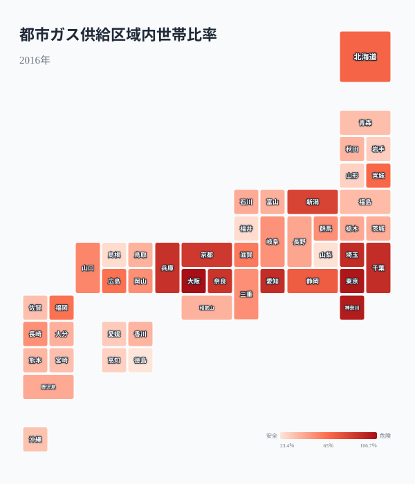
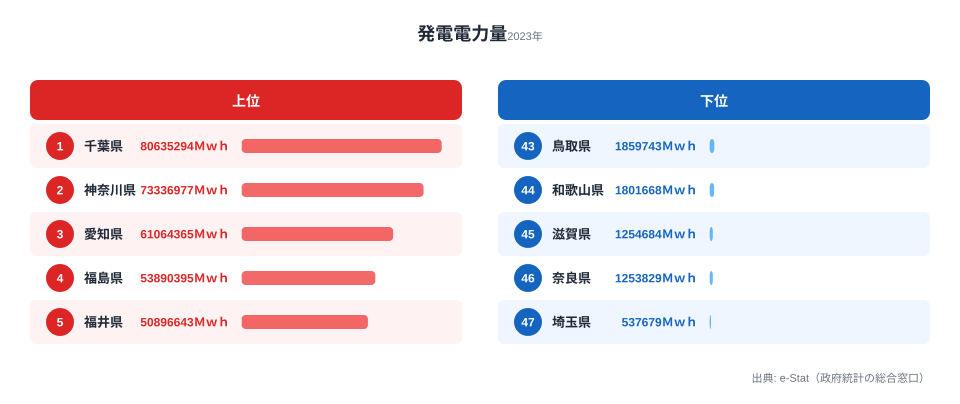

IHコンロ、ガスコンロ、灯油ストーブ。暮らしの「熱源」は、住む県によって大きく異なります。都市ガスの供給区域内世帯比率は[大阪府](/areas/27000)で100%を超える一方、[徳島県](/areas/36000)は23.4%にすぎません。同じ日本でありながら、片方では蛇口をひねればガスが届き、もう片方では各戸にプロパンボンベが運ばれる。この記事では、都市ガス・電力・ガソリンという3つのエネルギーインフラの地域差をデータで検証し、「発電する県」と「使う県」が一致しない構造まで掘り下げます。

## 都市ガスが届く県・届かない県

タイルグリッドマップを見ると、三大都市圏（東京・大阪・名古屋）は都市ガスの供給率が高い濃色で塗られ、四国・山陰・東北の一部は薄い色が目立ちます。上位は大阪府（106.7%）、[東京都](/areas/13000)（103.0%）、神奈川県（100.7%）、埼玉県（93.0%）、千葉県（92.8%）。100%を超えるのは、供給区域内の世帯数と自治体の総世帯数の定義の差によるもので、実質的に全世帯に都市ガスが届いていることを意味します。

下位は徳島県（23.4%）、山梨県（24.6%）、福井県（26.1%）、島根県（26.4%）、高知県（30.1%）です。1位の大阪府と最下位の徳島県では到達率に約4.6倍の開きがあります。なぜここまで差が開くのでしょうか。都市ガスは管路（パイプライン）のネットワークが前提のインフラであり、人口密度が低い地域への敷設は1世帯あたりのコストが跳ね上がって採算が合いません。三大都市圏が高いのは、世帯が密集していて敷設効率がよいからです。逆に四国・山陰・山梨のように山がちで集落が点在する地域では、管路を引くより各戸配送のLPガス（プロパンガス）が現実的な選択肢になります。LPガスは管路不要で災害復旧も早い反面、配送・容器コストが料金に乗るため都市ガスより割高になりやすく、ここに家計負担の地域差が生まれます。

> [!NOTE]
> 「都市ガス供給区域内世帯比率」は、都市ガス事業者の供給区域に含まれる世帯の割合です。区域内でも実際に契約していない世帯やオール電化世帯は含まれるため、この数値は「都市ガスを使える環境にある世帯」の上限値と読むのが正確です。

> [!WARNING]
> 都市ガス比率が23%台の徳島県・山梨県では、残る約75%の世帯がLPガス・灯油・電気に依存しています。経済産業省の小売価格調査でもLPガスは都市ガスより割高な傾向があり、熱源の選択肢が地理条件で決まってしまう点に注意が必要です。普及率の低さは「選んだ」結果ではなく「届かなかった」結果である場合が多いのです。

<source-link href="/ranking/city-gas-supply-area-household-ratio">47都道府県の都市ガス世帯比率ランキングをもっと見る</source-link>

## 「発電する県」と「使う県」は一致しない

電力のインフラには、都市ガス以上にくっきりとした地域差があります。まず、発電電力量の上位・下位を見てみましょう。

発電上位は千葉県（約8,064万MWh）、神奈川県（約7,334万MWh）、愛知県（約6,106万MWh）、福島県（約5,389万MWh）、福井県（約5,090万MWh）です。千葉県・神奈川県は東京湾岸に大規模な火力発電所が集中し、福島県は太平洋岸の火力群、福井県は若狭湾の原子力発電所が量を稼いでいます。共通するのは「大消費地のすぐ外側に立地し、送電線で都市へ電気を送る」という役割です。最下位は埼玉県の約54万MWhで、1位千葉県とは実に約150倍もの差があります。山に囲まれず大河川にも乏しい内陸県は、水力にも火力にも適地が少なく、発電量が極端に小さくなります。

<source-link href="/ranking/electricity-generation-capacity">47都道府県の発電電力量ランキングをもっと見る</source-link>

一方で、電力を「使う」側の需要量を見ると顔ぶれが入れ替わります。需要上位は東京都（約7,552万MWh）、愛知県（約5,612万MWh）、大阪府（約5,330万MWh）、神奈川県（約4,617万MWh）、兵庫県（約3,694万MWh）。東京都は需要が全国1位ですが、発電では上位5に入りません。大量の電力を周辺県から「輸入」する構造です。最も象徴的なのが埼玉県で、発電量は全国最下位なのに需要は全国6位（約3,649万MWh）。県内にほとんど発電設備を持たず、隣接する群馬県・新潟県の水力・火力や、東京湾岸の電源に依存しています。電気が「作る場所」と「使う場所」で分かれているからこそ、長距離送電網の維持が日本のエネルギー安全保障の要になっているのです。

<source-link href="/ranking/electricity-demand">47都道府県の電力需要量ランキングをもっと見る</source-link>

<ad-slot></ad-slot>

## 都市ガスと電力需要は連動するのか

熱源と電力という2つのインフラは、別々の話に見えて実は共通の背景を持っています。両者の関係を散布図で確かめます。

散布図では、都市ガス世帯比率が高い県（右側）ほど電力需要も大きい（上側）という緩やかな右肩上がりの傾向が読み取れます。これは「人口規模」と「都市化の度合い」が、都市ガスの敷設効率と電力消費量の両方を同時に押し上げる共通の説明変数になっているためです。世帯が密集すれば管路も引きやすく、オフィスや商業施設も集まって電気もよく使われる、という構図です。

ただし例外もあります。愛知県は都市ガス比率が92.5%と全国上位ながら、電力需要は東京に次ぐ全国2位まで突き抜けています。これは製造業の集積が効いているためで、住宅向けインフラの普及率だけでは説明できません。逆に北海道のように面積が広く都市ガス比率が中位（67.6%）の県は、需要も比率の割に伸びにくくなります。つまり「都市ガスが普及している＝電力も多く使う」は人口の効果であって、産業構造が乗ると関係はぶれます。

> [!TIP]
> インフラ指標を比べるときは、人口規模という「隠れた共通要因」を意識すると読み違いを防げます。2つの指標がきれいに相関していても、それは互いに影響し合っているのではなく、どちらも人口に引っ張られているだけ、というケースが多くあります。

## ガソリン販売量が映す自動車依存とその転換

最後に、移動のエネルギーであるガソリンを見てみましょう。全国のガソリン販売量の推移には、日本のモータリゼーションの盛衰がそのまま現れています。

全国のガソリン販売量は2004年の約6,323万KLをピークに、減少傾向が続いています。2023年時点では約4,500万KLと、ピーク時の約71%まで縮みました。減少の要因は複合的です。人口減少と高齢化によるドライバーの減少、自動車の燃費性能の向上、そしてハイブリッド車の普及。とくに燃費改善のインパクトは大きく、同じ距離を走ってもガソリン消費は世代を追うごとに減っています。EV（電気自動車）の保有はまだ乗用車全体の1%未満にとどまるため、ここまでの減少の主因はEVではなく、燃費改善と人口動態だと言えます。

この減少傾向は、地方ほど切実な意味を持ちます。公共交通が縮小した地域では自動車が唯一の移動手段となっており、ガソリン価格の変動が家計を直撃します。EVへの転換は脱炭素の切り札とされますが、充電インフラは2024年度末で全国約6.8万口、2030年の政府目標は30万口です。この整備が、都市ガスと同じく「人口が密集していて採算の合う都市部」から進みやすく、車が生活必需品である地方部に行き渡るかどうかが、今後のエネルギー転換の公平性を左右します。

<source-link href="/ranking/gasoline-sales-volume">47都道府県のガソリン販売量ランキングをもっと見る</source-link>

<ad-slot></ad-slot>

## まとめ

エネルギーインフラのデータから浮かび上がったポイントを整理します。

都市ガス・電力・ガソリンのいずれも、地域の人口密度・産業構造・気候と密接に結びついていました。都市部では蛇口をひねればガスが届き、電気は他県から大量に輸入し、移動は公共交通も選べます。一方で地方部では、LPガスや灯油に頼り、車が手放せず、発電設備も乏しい。同じ「脱炭素」という旗印を一律に掲げても、すでにインフラが脆弱な地域ほど転換コストの負担が重くのしかかります。GX2040ビジョンが掲げる10年間で150兆円規模の投資を実りあるものにするには、全国一律ではなく、地域ごとのエネルギー実態に即した計画設計が欠かせません。各県の置かれた条件は、[インフラ関連のランキング](/category/infrastructure)から横断的に確かめられます。

## データ出典

本記事のデータはe-Stat（政府統計の総合窓口）を基に作成しています。

- [社会生活統計指標（e-Stat）](https://www.e-stat.go.jp/dbview?sid=0000010208) -- 都市ガス供給区域内世帯比率（2016年）、発電電力量（2023年度）、電力需要量（2023年度）、ガソリン販売量（1985〜2023年）
