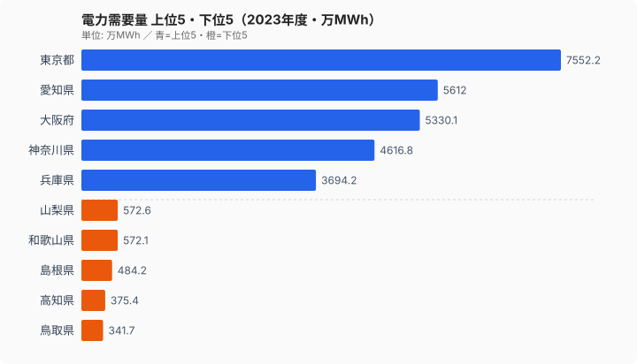
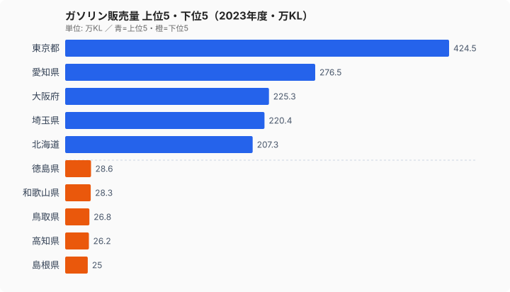

IHコンロ、ガスコンロ、灯油ストーブ。台所や暖房の「熱源」は、住む県によって大きく異なります。都市ガスが供給区域として届く世帯の比率は[大阪府](/areas/27000)で100%を超える一方、[徳島県](/areas/36000)では23.4%にとどまります。約4.6倍の開きです。同じ日本でも、ガス管が当たり前に通っている県と、ほとんどの家がプロパンガスや灯油に頼っている県があるのです。

この記事では、都市ガスの普及率・電力の需要量・ガソリンの販売量という3つの指標から、エネルギーインフラの地域差を読み解いていきます。共通して見えてくるのは、「人口密度の高い都市部にインフラが集まり、地方は別の手段で暮らしを支えている」という構造です。

## 都市ガスが届く県・届かない県

まず都市ガスの普及状況です。供給区域内世帯比率の上位5県と下位5県を並べると、対比が一目で分かります。

上位は大阪府（106.7%）、[東京都](/areas/13000)（103.0%）、神奈川県（100.7%）、埼玉県（93.0%）、千葉県（92.8%）と、三大都市圏が占めます。下位は徳島県（23.4%）、山梨県（24.6%）、福井県（26.1%）、島根県（26.4%）、高知県（30.1%）と、四国・山陰・中部山間部が並びます。最上位の大阪府と最下位の徳島県では、都市ガスが届く世帯の割合に約4.6倍の差があります。

なぜここまで差がつくのでしょうか。都市ガスは地下に管路のネットワークを張り巡らせて初めて成立するインフラです。人口密度が高い地域なら1本の管に多くの世帯がぶら下がり採算が取れますが、世帯が散在する地域では同じ距離の管を敷いても接続できる家が少なく、コストが見合いません。だからこそ都市ガスは大都市圏に集中し、地方では別の熱源が主役になります。上位5県がすべて三大都市圏なのは偶然ではなく、人口の集積そのものが普及率を押し上げているのです。

> [!NOTE]
> 「供給区域内世帯比率」は、ガス会社が供給区域として設定したエリアの世帯数を自治体の総世帯数で割った値です。区域設定と総世帯数の集計基準がずれるため、大阪府・神奈川県のように100%をわずかに超える県が出ます。これは「全世帯に都市ガスが届いている」という意味で、誤りではありません。

下位県では、都市ガスの代わりにLPガス（プロパンガス）や灯油が暮らしを支えています。LPガスはボンベを各戸に配送する方式で管路が不要なため、世帯が散在する地方でも供給できます。地方のエネルギー供給を最後に支える「砦」と言えますが、その分だけ料金は都市ガスより割高になりやすいのが弱点です。

> [!WARNING]
> 普及率が低い県ほど、残りの世帯がLPガス・灯油・電気に頼っている割合が高くなります。徳島県では約4分の3の世帯が都市ガス以外の熱源です。割高になりやすいLPガス中心の地域では、同じ暮らしをしていても光熱費が膨らみやすく、エネルギーコストの差が家計に直結します。普及率の数字は、そのまま「割安なインフラを使えているか」の地図でもあるのです。

<source-link href="/ranking/city-gas-supply-area-household-ratio">47都道府県の都市ガス世帯比率ランキングをもっと見る</source-link>

## 電力は「使う県」と「作る県」が一致しない

次に電力です。都市ガスが都市部に偏るのと同じく、電力の需要も人口と産業の集まる地域に集中します。電力需要量の上位5県と下位5県を見てみましょう。

需要の上位は東京都（約7,552万MWh）、愛知県（約5,612万MWh）、大阪府（約5,330万MWh）、神奈川県（約4,617万MWh）、兵庫県（約3,694万MWh）。下位は鳥取県（約342万MWh）、高知県（約375万MWh）、島根県（約484万MWh）、和歌山県（約572万MWh）、山梨県（約573万MWh）です。需要1位の東京都と最下位の鳥取県では、消費する電力量に20倍以上の開きがあります。

注目したいのは、需要の大きい県が必ずしも電力を「作っている」県ではない点です。東京都は需要で全国1位ですが、都内に大規模な発電所はほとんどありません。大量の電力を、湾岸に火力発電所が集中する千葉県・神奈川県や、原子力を抱える地域から「輸入」して成り立っています。愛知県のように製造業が集積する県は、家庭よりも工場の消費が需要を押し上げています。つまり電力需要量は、人口の多さと工業の集積度の両方を映す鏡なのです。

> [!TIP]
> 需要量と発電量はセットで読むと構造が見えてきます。都市部は「消費はするが発電はしない」消費県、湾岸や原子力立地は「自県の需要を超えて発電する」供給県です。電力インフラの議論では、この需給のズレ（送電で県をまたいで運ぶ前提）を意識すると、なぜ送電網の増強が地方の論点になるのかが理解しやすくなります。

<source-link href="/ranking/electricity-demand">47都道府県の電力需要量ランキングをもっと見る</source-link>

<ad-slot></ad-slot>

## ガソリン販売量に映る都市と地方の違い

最後にガソリンです。販売量の総量は人口の多い都市部が上位を占めますが、ここにも地域構造が表れます。

上位は東京都（約425万KL）、愛知県（約277万KL）、大阪府（約225万KL）、埼玉県（約220万KL）、北海道（約207万KL）。下位は島根県（約25万KL）、高知県（約26万KL）、鳥取県（約27万KL）、和歌山県（約28万KL）、徳島県（約29万KL）です。総量では東京都が島根県の約17倍を販売しています。

ただし総量の順位は人口規模をほぼなぞるため、これだけでは「車社会かどうか」までは読めません。都市部は人口が多くても1人が公共交通を使う比率が高く、地方は人口が少なくても1人が日常的に車を運転します。販売の総量は都市が大きくても、1人当たりに直すと地方が上位に来やすいのが自動車依存の実態です。下位に並ぶ島根・高知・鳥取・徳島は、いずれも都市ガスの普及率でも下位だった県と重なります。インフラの整わない地域ほど、移動も暖房も「個別の手段」に頼る姿が、3つの指標を通して一貫して浮かび上がります。

> [!NOTE]
> ここで示しているのは県ごとの販売「総量」です。人口の多い県ほど数字が大きくなるため、自動車依存の強さそのものを比べたい場合は人口当たりに換算する必要があります。総量ランキングの順位を、そのまま「車社会度の順位」と読み替えないよう注意してください。

<source-link href="/ranking/gasoline-sales-volume">47都道府県のガソリン販売量ランキングをもっと見る</source-link>

<ad-slot></ad-slot>

## まとめ

3つのエネルギー指標から見えてきたポイントを整理します。

- 都市ガス供給区域内世帯比率は大阪府106.7%・徳島県23.4%で、上位5県はすべて三大都市圏、下位5県は四国・山陰・中部山間部に偏ります。
- 普及率が低い県ほどLPガスや灯油への依存が高く、割高になりやすい熱源のぶん光熱費が膨らみやすくなります。
- 電力需要量は東京都が最大ですが、需要の大きい県と発電する県は一致せず、都市部は他県から電力を輸入する構造です。
- ガソリン販売量の総量は都市部が上位ですが、下位に並ぶ島根・高知・鳥取・徳島は都市ガス下位とも重なり、地方ほど個別の手段に頼る姿が共通します。
- エネルギーインフラは人口密度・産業構造と密接に結びついており、一律の脱炭素政策は、もともとインフラが脆弱な地域の負担を重くするおそれがあります。

都市部と地方で、熱源も電力の供給構造もまったく異なります。脱炭素やGX（グリーントランスフォーメーション）を進めるうえでは、全国一律ではなく、地域ごとのエネルギー実態に即した計画づくりが欠かせません。住む場所によって「使えるインフラ」が違うという事実こそ、データが教えてくれる出発点です。

## データ出典

本記事のデータはe-Stat（政府統計の総合窓口）の社会生活統計指標を基に作成しています。

- 都市ガス供給区域内世帯比率 — 2016年度
- 電力需要量 — 2023年度
- ガソリン販売量 — 2023年度
