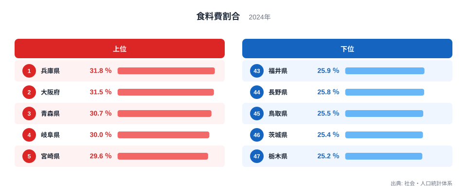
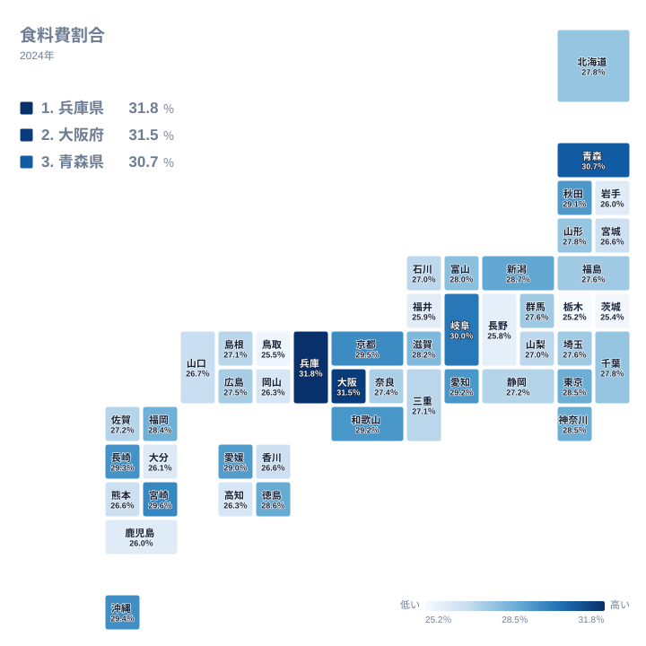
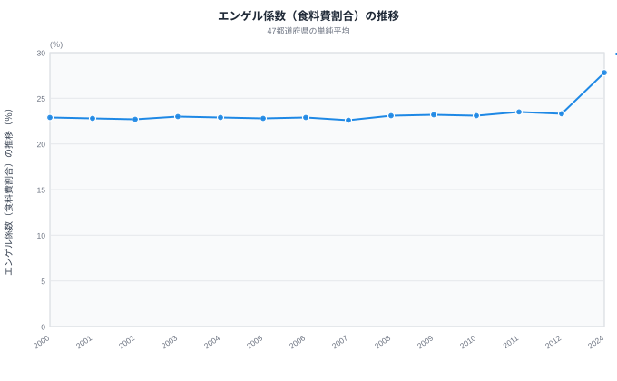

「食費が家計を圧迫している」と感じる人が増えています。その実感を裏付けるように、47都道府県の単純平均でみたエンゲル係数（食料費の割合）は近年上昇を続けています。

エンゲル係数とは、消費支出に占める食料費の割合を示す指標です。19世紀にドイツの統計学者エルンスト・エンゲルが発見した「所得が低いほど食費の割合が高くなる」という法則にもとづき、一般に値が低いほど生活にゆとりがあるとされてきました。この法則は、食料が生活必需品であり、所得が増えても食費の割合はそれほど増えないという前提の上に成り立っています。

しかし現代の日本では、この前提がそのまま当てはまるとは限りません。外食や高級食材への支出も食料費に含まれるため、所得が高い都市部の世帯ほど、必要に迫られてではなく選んで食にお金をかける傾向があり、その結果としてエンゲル係数が押し上げられることがあります。「係数が高い＝生活が苦しい」と決めつける前に、まずはデータで地域差の実態を見ていきましょう。

この記事では、総務省「家計調査」の2024年データ（二人以上の世帯）をもとに、47都道府県のエンゲル係数をランキング・タイルマップ・時系列の3つの視点で分析します。

## エンゲル係数の都道府県ランキング（2024年）

この指標は家計調査で「食料費割合」として集計されており、一般には「エンゲル係数」の名で広く知られています。

<source-link href="/ranking/food-expenditure-ratio-multi-person-households">食料費割合ランキングを都道府県別に見る</source-link>

**エンゲル係数が最も高いのは兵庫県**で、31.8%です。僅差の2位は大阪府の31.5%で、近畿の2府県が30%を超えて頭一つ抜けています。3位には青森県が入り30.7%、4位の岐阜県は30.0%と、上位4県がそろって30%台です。

一方、**最も低いのは栃木県**で25.2%です。次いで茨城県が25.4%、鳥取県が25.5%、長野県が25.8%と続きます。1位の兵庫県と47位の栃木県の間には6.6ポイントもの差があり、食費の「重さ」は住む場所によって大きく異なることが分かります。

注目すべきは**愛知県が9位**で29.2%に入っていることです。名古屋圏の喫茶店文化やモーニング文化に代表される「食への投資」が、食料費の割合を押し上げている可能性があります。

> [!NOTE]
> エンゲル係数は「二人以上の世帯」の消費支出に対する食料費の割合です。単身世帯は含まず、外食・中食も食料費に計上されます。世帯人数の違いが値に影響する点にご注意ください。また、この値は都道府県庁所在市（東京都は区部）の二人以上世帯を対象としたもので、県全域を対象とした平均ではありません。

## 食料費割合の地域マップ

タイルマップで47都道府県を俯瞰すると、3つの地域パターンが浮かびます。

**近畿は京都・和歌山を含めて面として濃い色**が広がっています。京都は29.5%、和歌山は29.2%と、兵庫・大阪の高さが近畿圏全体に共通する傾向であることが地図から読み取れます。大阪の「食い倒れ」に象徴される食文化の厚みが、統計にもはっきりと現れています。

**北関東は栃木・茨城に加え群馬まで含めて薄い色の帯**になっています。群馬は27.6%で、栃木・茨城と同様に低い水準です。これらの値は宇都宮市・水戸市・前橋市（県庁所在市）の二人以上世帯によるもので、食料費以外への支出配分が相対的に大きいことが、エンゲル係数を押し下げる要因と考えられます。

**九州は南北で分かれている**のも地図ならではの発見です。宮崎は29.6%、長崎は29.3%と上位に入る一方、鹿児島は26.0%、熊本は26.6%と下位グループに入ります。同じ九州でも消費構造にかなりの違いがあることが見えてきます。

<ad-slot></ad-slot>

## エンゲル係数の推移（47都道府県の単純平均）

2000年代のエンゲル係数は22〜23%台で安定していました。デフレ経済のもと食料品の価格競争が激しく、PB商品の普及や外食チェーンの低価格化が進んだ時代です。

> [!NOTE]
> このグラフのもとになる社会・人口統計体系の統計は、この指標を2000年から2012年までと2024年しか公表しておらず、2013年から2023年のデータは存在しません。グラフの2012年から2024年への線は年ごとの変化を示すものではなく、公表されている両端の値を結んだだけである点にご注意ください。

公表が再開された2024年のエンゲル係数は27.8%で、2000年の22.9%と比べて約4.9ポイントの上昇です。仮に消費支出が月30万円の世帯であれば、食料費だけで月1.5万円、年間では18万円多く支出している計算になります。この間には共働き世帯の増加による中食・外食支出の拡大、高齢化に伴う世帯人数の減少、そして食料品価格の上昇など複数の要因が重なったと考えられますが、年ごとにどの要因がどれだけ効いたかはこのデータからは追えません。

> [!WARNING]
> エンゲル係数の上昇は「生活水準の低下」を直ちに意味するわけではありません。高齢化に伴う世帯人数の減少、健康志向による食の高品質化、中食・デリバリーの普及など、構造的な変化も含まれています。2013年から2023年のデータが欠けているため、どの要因がどの時期にどれだけ影響したかを本データだけで特定することはできません。

## なぜ地域で差が出るのか

エンゲル係数の高低は、単純に「暮らし向きの良し悪し」を映しているわけではありません。県ごとの家計構造を見ていくと、少なくとも2つの異なるパターンがあることが分かります。

### 食への支出配分が大きい地域: 近畿

兵庫県が1位、大阪府が2位、京都府が6位と、近畿の3府県がそろって上位に入っています。食料費の割合が高いのは、次のような要因が考えられます。

- **外食・中食文化の厚み** -- 大阪・京都を中心とした食の多様性が、食料費を押し上げている
- **商店街・市場の存在** -- 小売の多様性が購買機会を増やし、結果的に食費が膨らむ傾向

「エンゲル係数が高い＝生活が苦しい」という単純な図式ではなく、むしろ食への支出配分が大きい地域と読むほうが実態に近いといえます。

### エンゲルの法則が典型的に表れる地域: 青森・宮崎

一方で、青森県は3位で30.7%、宮崎県は5位で29.6%です。これらの地域は、19世紀にエンゲルが発見した「所得が低いほど食費の割合が高くなる」という法則が典型的に表れている例と考えられます。所得水準が相対的に高くない地域では食費を削る余地が小さく、結果として食費の割合が高くなりやすいためです。同じ「エンゲル係数が高い」でも、背景にある家計の事情は地域によってまったく異なっているのです。

### 食料費以外への配分が大きい地域: 栃木・茨城・長野・福井

**栃木県と茨城県の北関東2県がワンツー**を占めました。栃木県は25.2%、茨城県は25.4%です。長野県は25.8%、福井県は25.9%と、こちらも低いグループに入ります。これらの県で食料費の割合が低いのは、教養娯楽費や交通費など、食料費以外への支出配分が相対的に大きい家計構造によるものと考えられます。

エンゲル係数と同じ発想で「削りにくい固定費」の重さを測れる指標に、通信料や放送受信料が消費支出に占める割合を示す情報通信係数があります。食費と違って通信費の水準は食文化の豊かさでは説明できないため、家計の固定費負担をより素直に映す指標になり得ます。[情報通信係数ランキング](/ranking/information-communication-coefficient)と合わせて見ると、同じ都市がどちらの指標でも高いのか、それとも別の顔を見せるのかが分かります。

<ad-slot></ad-slot>

## まとめ

- 47都道府県の単純平均（2024年）は27.8%
- 最高は兵庫県で31.8%
- 最低は栃木県で25.2%
- 最大格差は6.6ポイント
- 2000年比の変化は+4.9ポイント

2024年のエンゲル係数は大きく上昇し、食費が家計に与える負担は確実に大きくなっています。ただし、その「重さ」は住む場所によって大きく異なり、必ずしも生活水準の高低をそのまま映しているわけではありません。近畿圏では食への支出配分の大きさが数字を押し上げ、栃木・茨城などの北関東では食料費以外への配分の大きさが数字を抑えています。

家計を見直す際は、47都道府県の単純平均との比較だけでなく、**自分の住む地域の消費構造**を理解した上で、食費・教養娯楽費・交通費のバランスを考えることが大切です。

> [!TIP]
> エンゲル係数を下げるには「食費を減らす」だけでなく、「消費支出全体を見直す」視点も重要です。固定費（通信費・保険料・サブスク）の削減で消費支出の構造を変えれば、食費の割合は相対的に下がります。

## データ出典

本記事の統計は総務省統計局「家計調査」（社会・人口統計体系 経由）にもとづきます。二人以上の世帯を対象とした都道府県別データを使用し、時系列の推移は各年の47都道府県値を単純平均して算出しています。

あわせて見る: [食料費割合ランキング](/ranking/food-expenditure-ratio-multi-person-households) / [消費支出ランキング](/ranking/consumption-expenditure-multi-person-households-per-month)

エンゲル係数と消費支出の関係が気になる場合は、下記から都道府県別の相関を確認できます。相関が見られたとしても、それだけで因果関係があるとは言い切れない点にご注意ください。

<source-link href="/correlation?x=food-expenditure-ratio-multi-person-households&y=consumption-expenditure-multi-person-households-per-month">エンゲル係数 × 消費支出の相関を都道府県別に見る</source-link>
