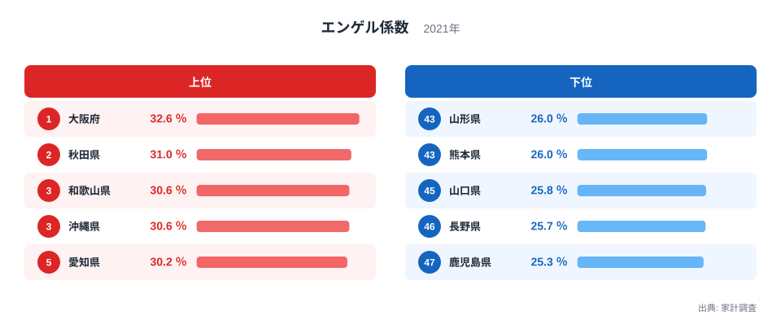
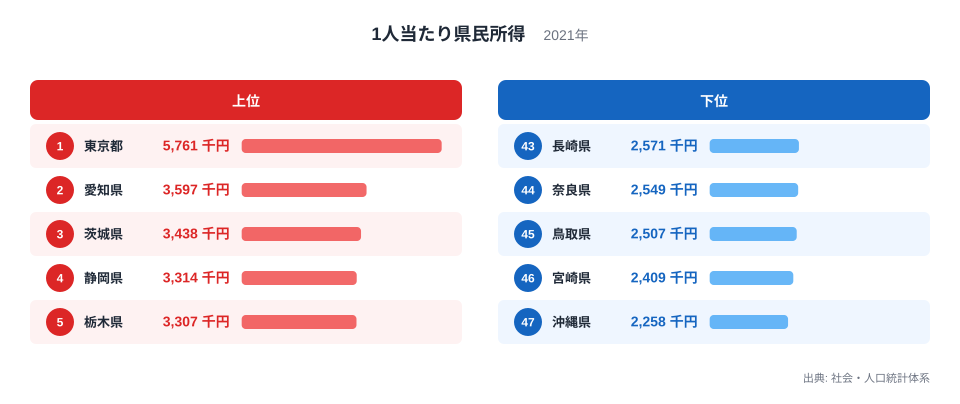
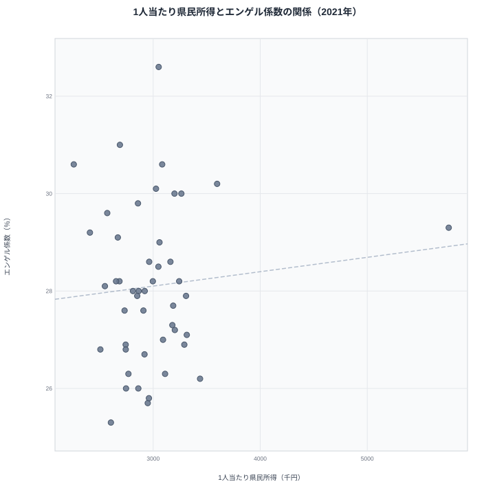
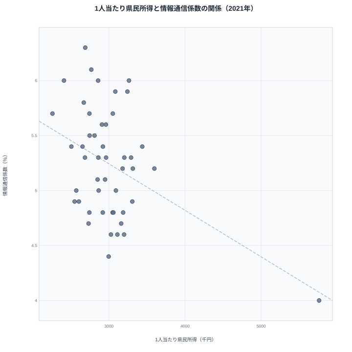

消費支出に占める食料費の割合を示すエンゲル係数は、「値が低いほど生活にゆとりがある」指標として、学校の授業でもおなじみです。では、この係数が高い都道府県は、本当に所得が低いのでしょうか。1人当たり県民所得と重ね合わせて散布図を描くと、意外な事実が見えてきます。所得が全国で最も高い東京都は、エンゲル係数では上位グループに入り込み、逆に所得が最も低い沖縄県も食料費の割合はかなり高い側に位置しているのです。この記事では、47都道府県のエンゲル係数と1人当たり県民所得を突き合わせ、両者の関係がどれほど弱いか、そしてなぜ弱くなるのかをデータで確かめます。1人当たり県民所得の最新値が2021年度のため、この記事ではエンゲル係数も2021年の値に揃えて比較します。

## エンゲル係数の都道府県ランキング（2021年）

上位5県には、1位の大阪府32.6%から、2位秋田県31.0%、30.6%で並ぶ3位の和歌山県・沖縄県、5位愛知県30.2%までが入ります。近畿の府県だけでなく、東北の秋田県や中部の愛知県も並んでおり、地域ブロックの偏りだけでは説明しきれない顔ぶれです。大阪府や愛知県は消費支出の総額自体が大きい都市圏で、外食や中食など食への支出配分が膨らみやすい一方、秋田県は人口減少と高齢化が進み、地元産の食材が家計の食費に占める比重が大きい、という異なる事情が同じ「エンゲル係数が高い」という結果に集約されていると考えられます。

下位側は、26.0%で並ぶ43位の山形県・熊本県から、45位山口県25.8%、46位長野県25.7%、47位鹿児島県25.3%までで、最高値の大阪府と最低値の鹿児島県の差はおよそ7.3ポイント、比率にすると1.3倍ほどの開きにとどまります。所得の差に比べればこの開きは小さく、エンゲル係数だけで暮らし向きの豊かさを言い当てるのはそもそも難しそうだと予感させます。

> [!NOTE]
> エンゲル係数は総務省「家計調査」の**都道府県庁所在市**（二人以上の世帯）を対象にした値です。県内のどの地域を代表市が反映しているかによって、県全体の実態とはズレが生じる場合があります。

<source-link href="/ranking/engel-coefficient">エンゲル係数ランキングをもっと見る</source-link>

## 1人当たり県民所得ランキング（2021年度）

1人当たり県民所得で見ると、順位の顔ぶれはまったく異なります。上位は1位東京都576万1千円、2位愛知県359万7千円、3位茨城県343万8千円、4位静岡県331万4千円、5位栃木県330万7千円で、東京都は2位以下と大きく水を空けた突出した水準です。

下位は43位長崎県257万1千円、44位奈良県254万9千円、45位鳥取県250万7千円、46位宮崎県240万9千円、47位沖縄県225万8千円で、最高値と最低値の差はおよそ2.6倍です。エンゲル係数の開き（1.3倍）と比べると、開きの大きさが2倍ほど違います。もし所得とエンゲル係数が強く結びついているなら、東京都のエンゲル係数は全国で最も低い側、沖縄県は最も高い側にくるはずです。

<source-link href="/ranking/per-capita-prefectural-income-h27">1人当たり県民所得ランキングをもっと見る</source-link>

## 散布図で見る相関の弱さ

47都道府県の所得とエンゲル係数を1つずつ点にして重ねると、点はほぼ一様にばらけていて、右下がり（所得が高いほどエンゲル係数が低い）の傾向はほとんど読み取れません。実際に相関係数を計算すると0.09という小さな値になります。符号はわずかにプラスですが、所得が突出した東京都を除いて計算し直すとマイナス0.0017とほぼ完全にゼロになるため、これは東京都という単一の外れ値でほぼ決まる程度の値で、向きを読み取れるものではありません。統計学では相関係数の絶対値が0.2を下回ると「ほぼ無相関」と見なすのが一般的で、0.09はその範囲にすっぽり収まります。

個別の県を見ると、この無相関ぶりがより具体的になります。所得が全国1位の東京都は、エンゲル係数では47都道府県中11番目に高い29.3%で、低い側には入っていません。対して所得が全国2位の愛知県は、エンゲル係数でも5番目に高い30.2%と、高所得かつ高エンゲル係数という組み合わせです。逆に、所得が全国38位で下位に近い秋田県はエンゲル係数が31.0%で2番目に高く、所得の低さとエンゲル係数の高さが一致するように見えます。ところが所得が全国最下位の沖縄県はエンゲル係数が3番目に高い30.6%（和歌山県と同値）にとどまり、所得42位の鹿児島県はエンゲル係数が47位、つまり全国で最も低い25.3%になっています。所得が低いのにエンゲル係数も低い県、所得が高いのにエンゲル係数も高い県が入り交じっていて、「所得が低いほど食費の割合が高い」という単純な図式には当てはまりません。

> [!WARNING]
> ここで確認できるのはあくまで統計的な相関の弱さであり、エンゲル係数と所得のどちらか一方がもう一方の原因になっていることを示すものではありません。また、エンゲル係数は2021年（暦年）の家計調査、県民所得は2021年度の県民経済計算と、集計期間の区切り方が異なる点にも注意してください。

## なぜエンゲル係数は生活水準の物差しにならないのか

エンゲル係数が食料費の「割合」である以上、値を押し上げるのは食費の絶対額が高い場合だけではありません。外食や高級食材への支出が多い都市では、生活水準そのものが低いわけではなくても、食への支出配分が大きくなりやすく、結果としてエンゲル係数が高く出ます。大阪府や愛知県のように消費支出全体が大きい都市圏でエンゲル係数も高いのは、この「食への投資」の側面が働いていると考えられます。反対に、持ち家率が高く住居費の負担が軽い地域や、地元産の食材で食費を抑えやすい地域では、所得の水準にかかわらずエンゲル係数が低めに出ることがあります。

つまりエンゲル係数は、食費が「切り詰められない必需品への支出」であることを前提にした指標です。ところが現代の家計では、食費の中に趣味や娯楽に近い性質の支出が混じっており、この前提が崩れています。所得が低いから食費の割合が高いのではなく、食文化や住居費の構造が違うから食費の割合が変わる、という別の因果が働いている可能性が高いのです。

では、切り詰めにくい必需品への支出に近く、所得との関係が見えやすい品目は他にないのでしょうか。ここで手がかりになりそうなのが、通信関係の支出です。

## 代わりの指標「情報通信係数」は使えるか

固定電話・携帯電話・NHK放送受信料・ケーブルテレビ受信料など、通信・放送にまつわる支出（インターネット接続料を除く）が消費支出に占める割合を「情報通信係数」と呼びます。この指標も47都道府県で観測でき、2021年の値で1人当たり県民所得との相関係数を計算すると、マイナス0.42という中程度の負の相関になります。エンゲル係数の0.09と比べるとはっきり強く、しかも「所得が高いほど比率が低い」という向きも直感に合っています。

散布図で見ても、右下がりの傾向がエンゲル係数の散布図よりはっきり読み取れます。実際の値を見ると、2021年の情報通信係数は所得が全国1位の東京都で4.0%と47都道府県中もっとも低く、通信関係費の負担が軽いことが確認できます。逆に所得が下位に近い秋田県は6.3%で全国1位、宮崎県・大分県・福井県・青森県も6.0%前後と高い水準に並びます。携帯電話料金は所得が上がってもそれほど支出額が伸びない傾向があり、通信費が家計に占める重さは所得の低い世帯ほど相対的に大きくなりやすいと考えられます。

<source-link href="/ranking/information-communication-coefficient">情報通信係数ランキングをもっと見る</source-link>

> [!TIP]
> ただし情報通信係数を万能の物差しにはできません。47都道府県の単純平均は2020年の5.4%をピークに2024年には4.2%まで下がっており、通信サービスの料金体系や契約プランの変化によって、時代をまたいだ比較には向きません。**[仮説]** 格安SIMの普及や通信料金の見直しが影響している可能性がありますが、この記事のデータだけでは検証できていません。同じ年の都道府県間比較に限って使うのが安全です。

## まとめ

- エンゲル係数が最も高いのは大阪府で32.6%、最も低いのは鹿児島県で25.3%、その差は1.3倍
- 1人当たり県民所得が最も高いのは東京都で576万1千円、最も低いのは沖縄県で225万8千円、その差は2.6倍
- エンゲル係数と1人当たり県民所得の相関係数は0.09で、統計的にはほぼ無相関
- 東京都のエンゲル係数は全国11位、愛知県は全国5位と、高所得県でもエンゲル係数が高い例が目立つ
- 通信関係費の割合を示す情報通信係数は所得との相関係数がマイナス0.42と強く、同一年での都道府県比較にはエンゲル係数より向いている可能性がある

エンゲル係数の地域差そのものをもう少し詳しく見たい方は、[エンゲル係数の都道府県ランキング（2024年のデータで見る）](/blog/engel-coefficient-prefecture-ranking)の記事もあわせてご覧ください。家計・物価に関する他の指標は[家計・物価テーマ](/themes/consumer-prices)、経済分野の指標一覧は[経済カテゴリ](/category/economy)からたどれます。

## データ出典

- 総務省統計局「家計調査」（二人以上の世帯、都道府県庁所在市、2021年）
- 内閣府「県民経済計算」（1人当たり県民所得、2021年度、H27年基準）

いずれもe-Stat（政府統計の総合窓口）経由で取得したデータをもとにstats47が集計・可視化しています。
