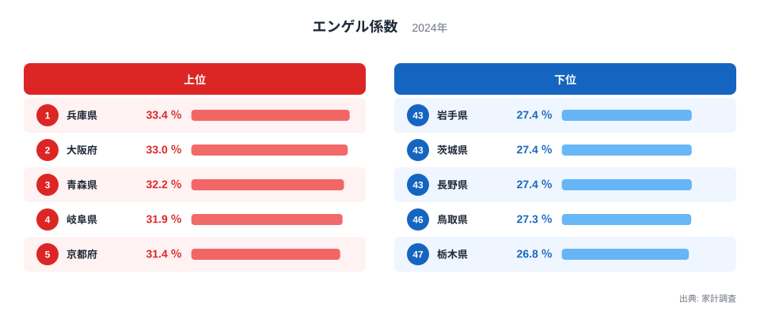
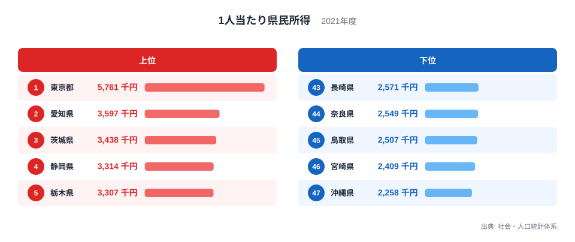
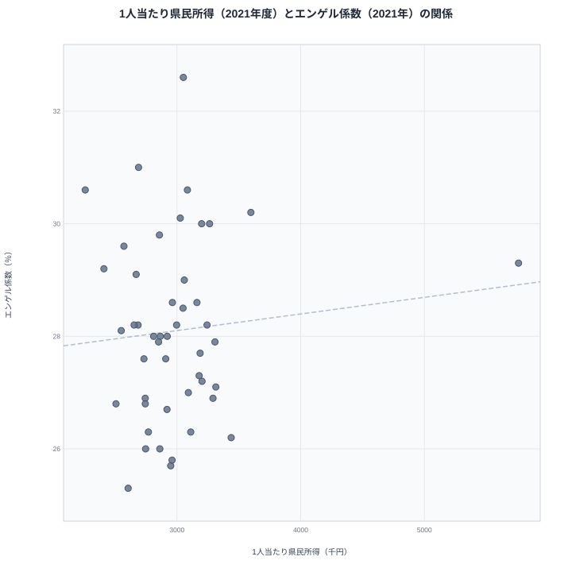
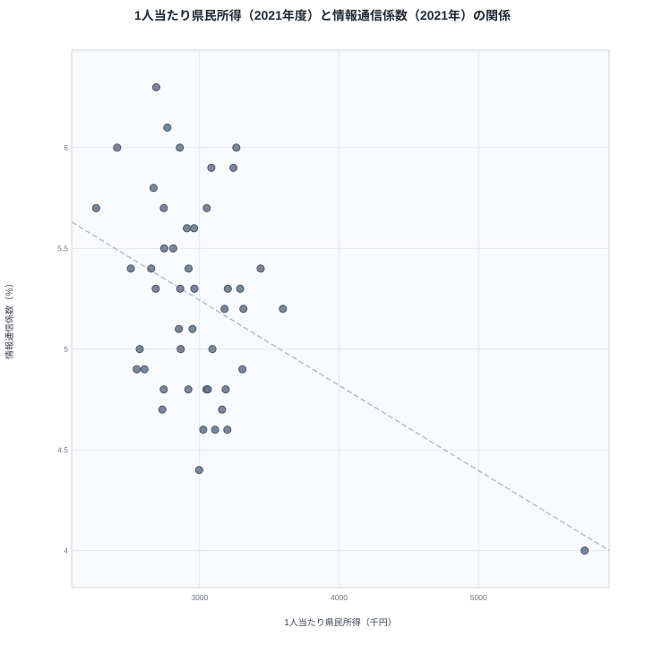

エンゲル係数が高い県は、本当に所得が低いのでしょうか。消費支出に占める食料費の割合を示すエンゲル係数は、一般に「低いほど生活にゆとりがある」とされ、学校の授業でもおなじみの指標です。ところが1人当たり県民所得と47都道府県で重ね合わせると、県民所得との関係では「そうとは言えない」という結果でした。2021年のデータで相関係数を計算すると0.09で、直線的な関係はほとんどありません。2021年は、1人当たり県民所得が全国1位の東京都でもエンゲル係数は47都道府県中11番目に高く、全国最下位の沖縄県は3番目に高いという具合に、所得の順番とエンゲル係数の順番はそろいません。

この記事では2つの指標を突き合わせて関係の弱さを確かめ、なぜ弱くなるのかをデータで検討します。年は先に断っておきます。エンゲル係数の最新は2024年ですが、1人当たり県民所得（H27年基準）は2021年度までしかありません。ランキングは指標ごとの最新年（エンゲル係数は2024年、県民所得は2021年度）で示し、2つを重ねる散布図だけは両方がそろう2021年で描いています。

## エンゲル係数の都道府県ランキング（2024年）

2024年のエンゲル係数が最も高いのは兵庫県の33.4%で、2位は大阪府の33.0%、3位は青森県の32.2%、4位は岐阜県の31.9%、5位は京都府の31.4%です。宮崎県も京都府と同じ31.4%で並んでいます。上位5件のうち3件を近畿の府県（兵庫県・大阪府・京都府）が占めており、近畿への偏りは確かにあります。

ただし、地方のくくりだけで決まるわけではありません。北海道・東北・関東・中部・近畿・中国・四国・九州沖縄の8地方に分け（三重県は近畿、新潟県は中部に含めます）、各県の値を単純に平均すると、近畿が31.0%で最も高く、最も低い中国の28.2%とは2.7ポイントの差があります。一方で近畿の中でも三重県は28.9%で、兵庫県との間に4.5ポイントの開きがあり、上位には東北の青森県と中部の岐阜県も入っています。

下位は、最下位の栃木県が26.8%、その上の鳥取県が27.3%で、岩手県・茨城県・長野県が27.4%で並びます。最高値の兵庫県と最低値の栃木県の差は6.6ポイント、比率では約1.2倍です。

> [!NOTE]
> このランキングは総務省「家計調査」の**都道府県庁所在市**に住む二人以上の世帯が対象で、県全体の平均ではありません。集計は暦年（1〜12月）です。県庁所在市とそれ以外の地域で食生活が違えば、県全体の実態とはずれる場合があります。
>
> 姉妹記事の[エンゲル係数の都道府県ランキング](/blog/engel-coefficient-prefecture-ranking)は、同じ「エンゲル係数」の名前で社会・人口統計体系の食料費割合を使っているため、同じ2024年でも数値が一致しません。47都道府県のすべてで本記事の値の方が高く、差は1.0〜2.3ポイントで、単純平均は本記事が29.5%、姉妹記事が27.8%です。たとえば兵庫県は33.4%に対して31.8%、栃木県は26.8%に対して25.2%です。差の原因は確認中で、どちらの定義が正しいかは断定しません。本記事が家計調査の食料費と消費支出から計算した値を使うのは、姉妹記事の系列には2000〜2012年度と2024年度しかなく、2021年の散布図が描けないためです。

<source-link href="/ranking/engel-coefficient">エンゲル係数ランキングをもっと見る</source-link>

## 1人当たり県民所得ランキング（2021年度）

県民所得は、雇用者報酬・財産所得・企業所得の合計で、企業の利益も含みます。1人当たり県民所得はこの県民所得を県の人口で割った値で、県民の給与や手取りの平均ではありません。

1人当たり県民所得では、顔ぶれがまったく異なります。上位は1位の東京都が576万1千円、2位の愛知県が359万7千円、3位の茨城県が343万8千円、4位の静岡県が331万4千円、5位の栃木県が330万7千円です。東京都は2位の愛知県の約1.6倍で、突出しています。

下位は43位の長崎県が257万1千円、44位の奈良県が254万9千円、45位の鳥取県が250万7千円、46位の宮崎県が240万9千円、47位の沖縄県が225万8千円で、最高値と最低値の差は約2.6倍です。上位5件は関東と中部の県が占め、下位5件のうち3件が九州・沖縄です。

もし所得とエンゲル係数が強く結びついているなら、東京都のエンゲル係数は低い側、沖縄県は高い側に並ぶはずです。次の散布図で確かめます。

<source-link href="/ranking/per-capita-prefectural-income-h27">1人当たり県民所得ランキングをもっと見る</source-link>

## 散布図で見る相関の弱さ（2021年）

この散布図は、所得が2021年度までしかないため、エンゲル係数も同じ2021年に合わせて描いています。エンゲル係数は暦年（1〜12月）、県民所得は年度（2021年度は2021年4月〜2022年3月）なので、集計期間は3か月ずれています。

47都道府県の所得とエンゲル係数を1つずつ点にして重ねると、点は広くばらけ、右下がり（所得が高いほどエンゲル係数が低い）の傾向は読み取れません。図の点線は回帰直線で、わずかに右上がりです。相関係数も0.09とわずかにプラスですが、これを向きの手がかりにはできません。所得が突出している東京都を除いた46都道府県で計算し直すと、マイナス0.0017とほぼゼロになるからです。

関係の弱さは、計算の仕方を変えても同じでした。値ではなく順位どうしで計算するスピアマンの順位相関係数は、外れ値の影響を受けにくい方法ですが、0.04です。エンゲル係数を最新の2024年の値に替えて2021年度の所得と組み合わせても、相関係数は0.03です。

この図には県名の目印がないので、本文で名前を挙げる県の位置を先に示します。東京都は右端の点、愛知県は右から2番目の点、沖縄県は左端の点、鹿児島県は最も下の点、秋田県は上から2番目の点です。2021年、所得が576万1千円で全国1位の東京都のエンゲル係数は29.3%で、47都道府県中11番目に高く、低い側には入っていません。所得が359万7千円で全国2位の愛知県は30.2%で5番目に高く、高所得で高エンゲル係数という組み合わせです。逆に所得が268万9千円で全国38位の秋田県は31.0%で2番目に高く、所得の低さとエンゲル係数の高さが一致しています。ところが所得が225万8千円で全国最下位の沖縄県は30.6%で、和歌山県と並んで3番目にとどまり、所得が260万5千円で全国42位の鹿児島県は25.3%と47都道府県で最も低くなっています。所得が低くてもエンゲル係数が低い県、所得が高くてもエンゲル係数が高い県が入り交じっており、「所得が低いほど食費の割合が高い」という単純な図式には当てはまりません。

2021年の地方別に単純平均しても、所得の順にはなりません。所得が最も高い関東（東京都を含む）のエンゲル係数は28.4%で8地方のうち3番目、所得が最も低い九州・沖縄は27.7%で下から2番目です。エンゲル係数が最も低いのは、所得が中位の中国で26.9%です。

> [!WARNING]
> 相関係数が示すのは、2つの指標が直線的にそろって動く度合いだけです。どちらかがもう一方の原因だという意味でも、関係がまったく無いという意味でもありません。また、都道府県ごとの平均値どうしの関係が、個々の世帯にそのまま当てはまるわけでもありません。

## なぜエンゲル係数と県民所得は結びつかないのか

関係が見えにくくなる理由として、少なくとも3つ考えられます。

第一に、県民所得は世帯の所得ではなく、2つの指標が見ている集団も違います。エンゲル係数は都道府県庁所在市に住む二人以上世帯の家計調査で、1人当たり県民所得は企業の利益も含む県全体の所得を県の人口で割った値です。同じ県名で並べても、前者は県庁所在市の世帯の食料費の割合、後者は県全体の所得水準であり、世帯が受け取る給与や手取りをそろえて比べているわけではありません。

第二に、エンゲル係数は割合なので、分母の消費支出に左右されます。食料費が増えても消費支出全体がそれ以上に増えれば割合は下がり、食料費が変わらなくても消費支出全体が減れば割合は上がります。割合だけを見ても、食料費が多いのか消費支出が少ないのかは区別できません。

第三に、単年の値は入れ替わりが大きく、1年の順位で県の豊かさを語るのは危ういことです。2021年に28.2%だった兵庫県は2024年に33.4%で1位になり、5.2ポイント上がりました。一方、福井県は30.0%から27.6%へ2.4ポイント下がっています。47都道府県の2021年と2024年の値の相関係数は0.57にとどまり、3年で順位は相当入れ替わります。この変動が標本調査のぶれによるのか、実際の食費の変化によるのかは、このデータだけでは確かめられません。

大阪府や兵庫県で高く出る背景に、外食など食への支出が多い食文化や、住居費など食以外の支出の大小が関わっている可能性はあります。ただし、このデータだけでは確かめられません。本記事のデータで言えるのは、エンゲル係数と1人当たり県民所得の関係が弱いところまでです。

では、食料費と同じように家計の中で一定の割合を占める支出で、所得との関係が見えやすいものはないのでしょうか。手がかりになりそうなのが、通信関係の支出です。

## 代わりの指標「情報通信係数」は使えるか

固定電話・携帯電話の通信料や、NHK・ケーブルテレビなどの放送受信料にかかる支出（インターネット接続料を除く）が消費支出に占める割合を「情報通信係数」と呼びます。エンゲル係数と同じ家計調査（都道府県庁所在市・二人以上世帯）の値で、2021年の値と1人当たり県民所得の相関係数を計算すると、マイナス0.42になります。エンゲル係数の0.09より強く、「所得が高いほど割合が低い」という向きも自然ですが、強いとまでは言えない水準です。

散布図では、右下がりの傾向がエンゲル係数の場合よりは見えます。ただし東京都の影響が大きく、東京都を除く46都道府県で計算し直すとマイナス0.22まで下がります。順位どうしのスピアマンの順位相関係数でもマイナス0.27で、所得が高い県ほど情報通信係数が低い傾向はあるものの、弱い関係にとどまります。

この図でも県名の目印がないので、本文で挙げる県の位置を示します。東京都は右端で最も下の点、秋田県は最も上の点です。実際の値を見ると、2021年の情報通信係数は所得が576万1千円で全国1位の東京都で4.0%と47都道府県で最も低く、最も高いのは所得が268万9千円で全国38位の秋田県の6.3%です。一方、福井県は所得が326万3千円で全国7位ながら6.0%で、青森県・宮崎県と並んで3番目に高く、所得が高くても情報通信係数が高い例外になっています。

つまり、所得との関係はエンゲル係数より見えやすいものの、情報通信係数も強い物差しではなく、代わりの指標として使えるとは言い切れません。

<source-link href="/ranking/information-communication-coefficient">情報通信係数ランキングをもっと見る</source-link>

> [!TIP]
> 割合の指標なので、通信費が同じでも消費支出が小さい県ほど高く出ます。県どうしを比べるときは、同じ年の値でそろえて使うのが安全です。

## まとめ

- 2つのランキングの差はどちらも大きく、エンゲル係数は2024年に兵庫県の33.4%から栃木県の26.8%まで約1.2倍、1人当たり県民所得は2021年度に東京都の576万1千円から沖縄県の225万8千円まで約2.6倍です。
- 2021年のエンゲル係数と1人当たり県民所得の相関係数は0.09で、東京都を除くとマイナス0.0017、2024年のエンゲル係数に替えても0.03と、ほぼ無相関です。
- 所得との関係が見えやすい代わりの指標として試した情報通信係数も、東京都を除くと関係が弱まり、強い物差しとは言えませんでした。

家計・物価に関する他の指標は[家計・物価テーマ](/themes/consumer-prices)、経済分野の指標一覧は[経済カテゴリ](/category/economy)からたどれます。

## データについて

- 総務省統計局「家計調査」（二人以上の世帯、都道府県庁所在市）。エンゲル係数は食料費÷消費支出×100、情報通信係数は情報通信関係費÷消費支出×100で、いずれも暦年の値です。ランキングは2024年、散布図は2021年を使っています。
- 県民経済計算年報の1人当たり県民所得（H27年基準、2021年度）。総務省統計局「社会・人口統計体系」に収録された値を使っています。出典の項目名は「1人当たり県民所得（平成27年基準）」で、名目か実質かの区別は書かれていないため、本記事では都道府県どうしの比較にだけ使い、年をまたぐ推移は扱いません。
- 相関係数は47都道府県の値から計算したピアソンの積率相関係数で、スピアマンの順位相関係数は同順位を平均順位として計算しています。地方別の平均は、各県の値を人口や世帯数で重み付けせずに単純平均した値です。

いずれもe-Stat（政府統計の総合窓口）経由で取得したデータをもとにstats47が集計・可視化しています。
