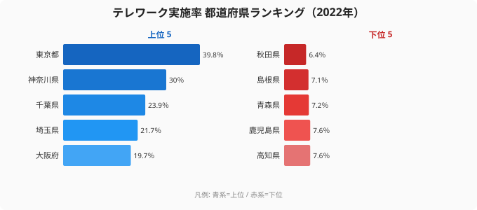

「リモートワークはもう当たり前になった」——コロナ禍を経て、多くの人がそう感じているでしょう。けれども、その実感は住んでいる場所によって大きく変わります。2022年のテレワーク実施率は、最も高い東京都が39.8%、最下位の秋田県はわずか6.4%でした。トップと最下位の差は約6.2倍にもなります。この記事では、なぜ都市部と地方でここまで差がつくのか、そしてその差がエンジニアのキャリアにとって何を意味するのかを考えていきます。

> [!NOTE]
> ここでいうテレワーク実施率は、就業者に占めるテレワーク（在宅勤務・モバイルワーク等）実施者の割合（％）です。各県の産業構成や調査方法によって数値は動くため、絶対的な水準そのものよりも、都道府県間の相対的な差に注目して読み解くのがおすすめです。

## テレワーク実施率ランキングの全体像 — 東京と秋田で約6倍

<source-link href="/ranking/telework-rate">都道府県別テレワーク実施率ランキングを詳しく見る</source-link>

上位は東京都（39.8%）、神奈川県（30.0%）、千葉県（23.9%）、埼玉県（21.7%）、大阪府（19.7%）と、首都圏・大都市圏がそのまま並びます。一方の下位は秋田県（6.4%）、島根県（7.1%）、青森県（7.2%）、鹿児島県（7.6%）、高知県（7.6%）と、東北・山陰・南九州・四国の県が連なります。上位5県のうち4県が首都圏（東京・神奈川・千葉・埼玉）で占められている点が、この指標の最大の特徴です。

なぜ上位がここまで都市圏に偏るのでしょうか。テレワークが成立するかどうかは、その地域に「パソコンとネット環境があれば完結する仕事」がどれだけ集まっているかで決まります。[東京都](/areas/13000)を頂点とする首都圏には情報通信業や専門サービス業の本社・拠点が密集しており、職種の構成そのものが在宅勤務と相性の良い形になっています。だからこそ東京都だけが39.8%と突出し、2位の神奈川県（30.0%）にすら約10ポイントの差をつけているのです。

逆に下位の顔ぶれを見ると、製造業の現場・農林水産業・対人サービスが地域経済の柱になっている県が並びます。これらの仕事は「その場にいること」が価値の中心にあり、在宅では完結しにくいものです。[秋田県](/areas/05000)の6.4%という数字は、就業者の意識が低いからではなく、そもそも在宅で成立する仕事の母数が地元に少ないことの裏返しと考えられます。

分布の偏りも見逃せません。中位にあたる24位の長野県は10.5%で、上位の都市圏を除けば、多くの県が1割前後にぎゅっと集まっています。つまりテレワークが「当たり前」と言えるのは一部の都市圏だけで、全国の大多数の県では今なお例外的な働き方にとどまっているのが実態です。

> [!WARNING]
> ここで「地方はテレワークに向いていない」「地方は意識が遅れている」と結論づけるのは早計です。実施率の低さは、その県の就業者の能力や姿勢ではなく、「地元企業にリモート可能な求人がどれだけあるか」という供給側の事情を映しています。実施率が低い県の在住者がリモートで働けないのは、職種や能力の問題ではなく、勤務先の選択肢が地理的に限られているからだと読むべきです。

## 京都・沖縄もリモートでは中位 — 「稼げる県」と「在宅で働ける県」は別の地図

地方の中核都市はどうでしょうか。[京都府](/areas/26000)は8位（17.5%）、沖縄県は13位（14.1%）と、全国の中位は上回るものの、トップの東京都とは2倍以上の開きがあります。さらに同じカテゴリの他指標と見比べると、働き方の地域差はより立体的に見えてきます（[労働・賃金カテゴリのランキング一覧](/category/laborwage)）。観光業やサービス業のウエイトが高い県では、たとえ本人がIT人材であっても、リモートを前提とした職場に地元で出会いにくいという構造が残っています。

ここで、別のデータと並べると興味深い対比が見えてきます。ソフトウェア作成者の平均年収（2023年）で全国トップに立つのは京都府で、608.4万円です。「稼げる県」の代表格でありながら、テレワーク実施率では8位の中位にとどまっています。つまり年収の高さとリモートのしやすさは必ずしも一致せず、年収の地図とリモートの地図は重なりません。高い報酬を出せる企業が集まっていることと、その働き方が在宅前提であることは、別々の条件なのです。

<source-link href="/ranking/software-engineer-annual-income">ソフトウェアエンジニアの年収ランキングと比べてみる</source-link>

## 問われるのは「出社頻度」より「制度の有無」

地方在住のエンジニアにとって本当に重要なのは、週に何日出社するかという頻度ではなく、フルリモートという選択肢が「制度として」存在する企業に身を置けているか、という一点です。制度さえあれば、結婚・育児・介護といったライフイベントに合わせて、出社と在宅の比率を自分で調整できます。逆に制度がなければ、どれだけ望んでも在宅勤務は例外的な特例にとどまってしまいます。

テレワーク率という数字の裏にあるのは、そうした制度を備えた企業が各県にどれだけ立地しているかの差です。だからこれは「地元の労働市場の制約」であって、「自分自身の制約」ではありません。フルリモートの求人は地理的な境界を持たないため、勤務地を全国に広げて探せば、この約6倍の地域差は個人の選択で乗り越えられます。住んでいる県の実施率が6.4%であっても、応募先を全国に広げた瞬間、その数字は自分の働き方を縛る前提ではなくなるのです。

> [!TIP]
> 自分の県の実施率が低くても落ち込む必要はありません。エンジニアに特化した転職エージェントを使えば、「フルリモート可」「居住地不問」といった条件で求人を絞り込めます。住む場所を変えずに働き方だけを変える——という発想の転換が、いまや現実的な選択肢になっています。実施率ランキングは「自分が動ける範囲」ではなく「地元市場の現状」を示す地図として読むのがコツです。

## まとめ

- 1位は東京都で39.8%、最下位の秋田県6.4%とは約6.2倍の差があります
- 上位は東京・神奈川・千葉・埼玉・大阪と首都圏・大都市圏に集中し、下位は秋田・島根・青森・鹿児島・高知と東北・山陰・南九州・四国が並びます
- 中位にあたる24位の長野県は10.5%で、上位の都市圏を除く多くの県は1割前後に集まっています
- 京都8位（17.5%）・沖縄13位（14.1%）と、地方の中核都市でも東京とは2倍以上の開きがあります
- 差の正体は産業構成、すなわち「リモート可能な仕事が地元にどれだけあるか」です。本人の能力差ではなく、勤務地を全国に広げれば個人の選択で外せる地域差だと言えます

## データ出典

- 総務省「通信利用動向調査」ほか（e-Stat 統計データ、2022年）
- テレワーク実施率は就業者に占めるテレワーク実施者の割合。全国平均水準や定義は集計方法により変動
