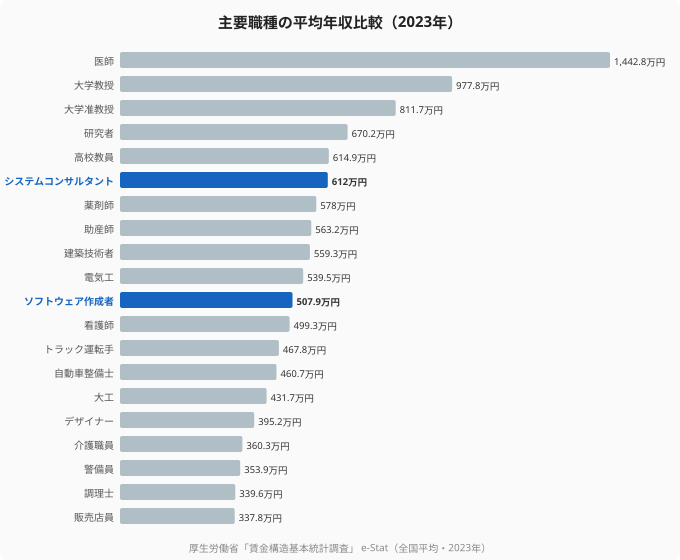

「ITエンジニアは稼げる職業だ」——そう言われることは多い。だが、他の専門職と横並びで比べると、その位置づけは少し違って見える。厚生労働省「賃金構造基本統計調査」の2023年データで主要な専門職の平均年収を並べると、最も高いのは医師の1,442.8万円。次いで大学教授977.8万円、大学准教授811.7万円と続く。ソフトウェア作成者（システムエンジニア・プログラマ等）の平均年収は507.9万円で、主要20職種の中ではちょうど中位にあたる。

同じ「専門スキルを要する仕事」でも、職種によって年収帯はこれほど違う。本記事では、職種別の年収序列を可視化し、エンジニアの年収が「職種という壁」の中でどこに位置するのか、そしてその壁をどう越えるのかを考える。

> [!NOTE]
> データは厚生労働省「賃金構造基本統計調査」の職種別平均年収（2023年・全国平均、推計値）です。きまって支給する現金給与額×12＋年間賞与から算出。職種区分や集計対象により水準は変動します。

## 職種別の年収序列 — 医師を頂点に大きな開き

まず全体像を押さえる。上位は医師（1,442.8万円）、大学教授（977.8万円）、大学准教授（811.7万円）、研究者（670.2万円）、高校教員（614.9万円）。これに続くのがシステムコンサルタント（612.0万円）、薬剤師（578.0万円）、助産師（563.2万円）、建築技術者（559.3万円）、電気工（539.5万円）だ。

ソフトウェア作成者（507.9万円）は看護師（499.3万円）やトラック運転手（467.8万円）の少し上、20職種中11番目に位置する。最上位の医師とは約2.8倍の開きがある。

<source-link href="/ranking/software-engineer-annual-income">ソフトウェア作成者の都道府県別年収ランキングを見る</source-link>

## なぜ職種で年収帯が決まるのか — 参入障壁と希少性

職種による年収差の背景にあるのは、参入障壁と希少性だ。医師・薬剤師のように国家資格と長期の養成課程が必要な職種は、供給が制限されるため高い年収が維持される。大学教授・研究者は高度な専門性と長いキャリア形成が前提になる。

> [!WARNING]
> ただし職種の平均年収は「天井」ではなく「中心」を示すにすぎない。ソフトウェア作成者の平均は508万円だが、上流職や高需要領域に移れば年収帯は大きく変わる。実際、同じIT領域でもシステムコンサルタントの平均は612万円で、開発職より100万円以上高い。

つまりエンジニアの年収は、「IT＝高年収」と一括りにできるものではなく、IT領域内のどのポジションに立つかで大きく変わる。

## エンジニアが「職種の壁」を越える道筋

職種別の年収序列を見ると、エンジニアが年収を上げる道筋が見えてくる。ひとつは、開発職からシステムコンサルタント・アーキテクト・PMといった上流職へシフトすること。もうひとつは、高需要・高単価の技術領域（クラウド・データ・セキュリティ等）に専門性を寄せることだ。

<source-link href="/ranking/system-consultant-annual-income">システムコンサルタントの年収ランキングと比べてみる</source-link>

> [!TIP]
> 自分のスキルが「どの職種・どのポジションで、いくらで評価されるか」は、市場に当ててみないとわからない。エンジニア専門の転職エージェントを使えば、現職のスキルセットから狙える上位ポジションと想定年収レンジを具体的に把握できる。年収アップの第一歩は、自分の市場価値を知ることだ。

## 住む場所より「職種・ポジション」が年収を決める

職種別の比較が示すのは、年収を最も大きく左右するのは住む場所ではなく「職種・ポジション」だという事実だ。県による年収差が1.5倍前後なのに対し、職種による差は2〜3倍に及ぶ。

エンジニアにとって重要なのは、いまのポジションに安住せず、より評価される職種・領域へ意識的に移っていくことだ。エンジニア・IT職に強い転職エージェントを活用すれば、年収帯の高いポジションへの道筋を具体的に描ける。「職種の壁」は、動くことで越えられる。

## 資格職と非資格職、エンジニアの立ち位置

職種別の年収序列を眺めると、上位を占めるのは医師・薬剤師・大学教授など、国家資格や長期の養成課程を要する職種が多い。これらは参入に高い壁がある分、供給が絞られ、高い年収が維持されやすい。一方、エンジニアは原則として資格を必要とせず、誰でも参入できる。それゆえ供給が増えやすく、平均年収は中位にとどまる。

ただし、資格がないことは弱みであると同時に強みでもある。資格職は年収の天井が制度的に決まりやすいのに対し、エンジニアはスキルと市場価値次第で年収帯を大きく動かせる。実際、同じIT領域でも開発職とシステムコンサルタントでは平均で100万円以上の差があり、専門領域や役割の選び方で報酬は大きく変わる。

つまりエンジニアの年収は「資格で守られていない」代わりに「努力と選択で伸ばせる」。平均値に甘んじるのではなく、高単価の領域・上流のポジションへ意図的に移っていくことが、非資格職であるエンジニアが年収を引き上げる王道になる。

この点で、エンジニアは自分のキャリアを能動的にデザインできる数少ない職種だといえる。資格という固定的な天井がないぶん、学び続け、より評価される領域へ移動し続けることで、年収の上限を自分で押し上げられる。職種の平均という一点に縛られず、分布の上位を目指す姿勢こそが、非資格職の最大の武器になる。年収序列のどこに自分を置くかは、生まれ持った資格ではなく、これからの学びと選択によって自分自身で決められるのだ。

## 「資格がない」ことの両面性

医師や薬剤師のような資格職は、参入障壁が高い分だけ安定するが、年収の上限も制度や報酬体系である程度決まってしまう。対してエンジニアは、資格に守られていないぶん下限は低くなりがちだが、その代わり上限が大きく開いている。スキルの伸ばし方、専門領域の選び方、所属する企業の選び方しだいで、同じ「ソフトウェア作成者」という区分のなかでも年収は大きく変わる。これは不安定さであると同時に、努力と選択で分布の右側へ動ける自由度でもある。職種別ランキングの中位という位置は固定された宿命ではなく、これからの学習と移動で書き換えられる出発点にすぎない。だからエンジニアにとっての問いは「どんな資格を取るか」ではなく「市場でどう評価される実績を積むか」だ。その答えは、遠い場所ではなく、いまの現場での日々の選択の積み重ねの中にある。

### 関連記事・次に読むデータ

- [ソフトウェアエンジニアの年収は県で何倍違うか](/ranking/software-engineer-annual-income) — 開発職の地域格差
- [システムコンサルタントの年収ランキング](/ranking/system-consultant-annual-income) — 上流IT職の年収
- [医師の平均年収ランキング](/ranking/doctor-annual-income) — 最上位職種の年収水準
- [大学教授の平均年収ランキング](/ranking/university-professor-annual-income) — 研究職の年収
- [労働・賃金カテゴリの統計一覧](/category/laborwage) — 職業・賃金の関連ランキング

## データ出典

- 厚生労働省「賃金構造基本統計調査」（e-Stat 統計データ、2023年）
- 各職種の平均年収は、きまって支給する現金給与額×12＋年間賞与から算出した全国平均の推計値（企業規模10人以上）
