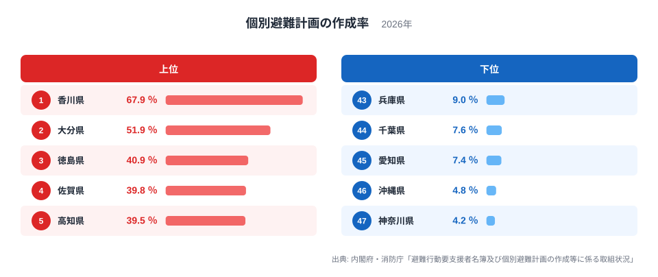
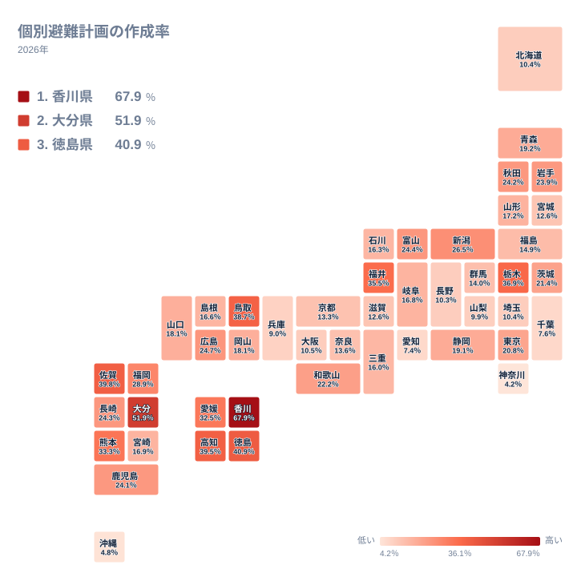
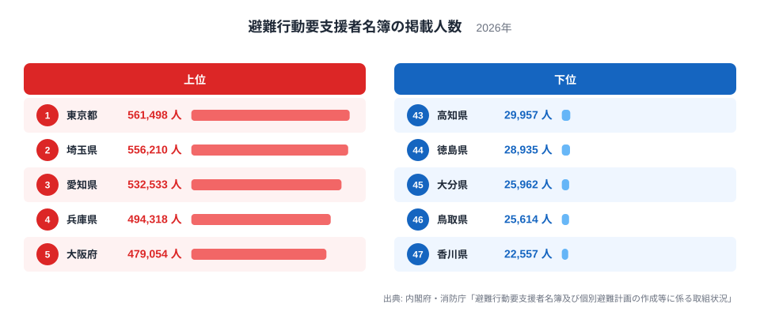

住む場所を選ぶとき、家賃や通勤時間と並んで気になるのが災害への備えです。特に地震や水害が起きたとき、自力で避難できない高齢者や障害のある人をどう避難させるかをあらかじめ決めておく「個別避難計画」の作成状況は、その自治体の災害対応力を映す指標のひとつです。

内閣府と消防庁が2026年4月1日時点でまとめた集計によると、都道府県別の個別避難計画の作成率は最も高い香川県が67.9％、最も低い神奈川県は4.2％で、その差は16.2倍に達します。ここで見えてくるのは意外な構図です。人口が集中し、産業やインフラが集積する大都市圏ほど、要支援者の避難計画づくりが遅れているのです。

2024年1月の能登半島地震では、石川県奥能登地域を中心に土砂崩れや道路の寸断によって集落が孤立し、支援が届くまでに時間を要した地域がありました。一方、東京湾や大阪湾の沿岸に広がる海抜の低い市街地では、水害や高潮が起きたとき短時間で多数の要支援者を安全な場所へ移す体制が問われます。孤立と密集、リスクの形は違っても「支援が必要な人をどう避難させるか」という課題は共通しています。この記事では、個別避難計画の作成率の地域差と、その背景にある構造を数字から読み解きます。

## 作成率トップは香川67.9％、最下位は神奈川4.2％

<data-source url="https://www.bousai.go.jp/taisaku/hisaisyagyousei/pdf/r8chosa1.pdf" label="内閣府・消防庁「避難行動要支援者名簿及び個別避難計画の作成等に係る取組状況」" year="2026年4月1日現在"></data-source>

上位に並ぶのは[香川県](/areas/37000)、大分県、徳島県、佐賀県、高知県で、6位の鳥取県まで含めると四国・九州・山陰の県が目立ちます。とりわけ四国は香川・徳島・高知・愛媛の4県すべてが全国トップ10入りしており、地域ぐるみで計画づくりが進んでいることがうかがえます。［仮説］人口や世帯数が少ない自治体ほど、福祉担当者が要支援者一人ひとりの状況を把握しやすく、計画づくりが進みやすい可能性がありますが、担当者数や事務体制のデータを合わせて検証する必要があります。

一方、下位に並ぶのは兵庫県、千葉県、愛知県、沖縄県、そして最下位の[神奈川県](/areas/14000)です。兵庫県から神奈川県までの下位5県のうち4県は、東京圏・名古屋圏・大阪圏という三大都市圏に含まれます。大都市圏では自治体の担当者一人が抱える要支援者の数が桁違いに多く、名簿の整備だけでも大きな事務負担になっていることがうかがえます。

> [!NOTE]
> 個別避難計画の作成率は、避難行動要支援者名簿に掲載された人のうち計画が作成された人の割合です。名簿への掲載基準は自治体ごとに異なり、高齢者や障害のある人すべてが対象になるわけではありません。作成率だけで住民全体の避難体制を測ることはできない点に注意してください。

<source-link href="/ranking/individual-evacuation-plan-coverage-rate">個別避難計画の作成率ランキングをもっと見る</source-link>

## 地図で見ると四国4県がそろって上位に入る

<data-source url="https://www.bousai.go.jp/taisaku/hisaisyagyousei/pdf/r8chosa1.pdf" label="内閣府・消防庁「避難行動要支援者名簿及び個別避難計画の作成等に係る取組状況」" year="2026年4月1日現在"></data-source>

タイルマップにすると、作成率が高い県が瀬戸内海周辺にまとまっているのが一目でわかります。四国4県がそろって濃い色になっている一方、関東・中京・近畿の三大都市圏は軒並み薄い色です。都道府県単位で見ると「地方ほど進んでいる、都市ほど遅れている」という傾向がかなり明確な形で表れています。

ただし例外もあります。東北地方では青森県が22位、福島県が32位、宮城県が36位にとどまり、必ずしも地方全体が高いわけではありません。人口規模だけでなく、自治体ごとの取り組み方の差も反映されていると考えられます。

## 大都市ほど遅れる理由は名簿登録者の桁違いの多さ

<data-source url="https://www.bousai.go.jp/taisaku/hisaisyagyousei/pdf/r8chosa1.pdf" label="内閣府・消防庁「避難行動要支援者名簿及び個別避難計画の作成等に係る取組状況」" year="2026年4月1日現在"></data-source>

避難行動要支援者名簿の登録者数を見ると、作成率の順位はほぼ逆転します。登録者数が最も多いのは東京都の561,498人で、埼玉県556,210人、愛知県532,533人、兵庫県494,318人、大阪府479,054人、神奈川県418,089人、千葉県315,775人と続きます。作成率が下位だった兵庫県、愛知県、神奈川県、千葉県の4県は、いずれもこの登録者数上位7県に入っています。

一方、作成率が上位だった香川県、大分県、徳島県、佐賀県、高知県、鳥取県の6県は、登録者数の下位6県、つまり47位の香川県から42位の佐賀県までをそのまま占めています。全国計では名簿登録者数6,696,718人のうち、個別避難計画が作成された人数は1,014,017人で、全国の作成率は15.1％にとどまります。大都市圏は登録者数の絶対的な多さが、作成率を押し下げる構造的な要因になっていると考えられます。

> [!WARNING]
> 作成率が高い県で災害時の避難がすべて成功するとは限りません。能登半島地震では、個別避難計画の有無にかかわらず、土砂崩れや道路の寸断で集落そのものが孤立し、支援が届くまでに時間を要したケースがありました。個別避難計画は避難を助ける仕組みのひとつであり、道路の代替性や地域の孤立リスクとあわせて見る必要があります。

ただし沖縄県はこの構図に当てはまらない例外です。名簿登録者数は107,487人で19位と中位ですが、作成率は4.8％で全国46位まで沈んでいます。［仮説］沖縄県は離島が多く、本島と離島で防災担当の体制整備に差がある可能性がありますが、この記事のデータだけでは検証できません。検証には市区町村別の作成率データが必要です。

<source-link href="/ranking/individual-evacuation-plan-listed-persons">避難行動要支援者名簿の掲載人数ランキングをもっと見る</source-link>

## 住む場所を選ぶときに確認したいこと

> [!TIP]
> 個別避難計画の作成率は都道府県や市区町村の防災担当窓口の公表資料で確認できます。あわせて重ねるハザードマップで洪水・高潮・土砂災害の想定区域を確認し、避難路が複数あるかどうかも見ておくと、住む場所を選ぶ判断材料になります。

引っ越し先を検討するとき、家賃や利便性だけでなく、その自治体が要支援者の避難体制をどれだけ整えているかも一つの目安になります。人口が少ない自治体は個別避難計画の作成率が高い傾向にありますが、それは避難所までの距離が短いことを意味するとは限りません。逆に大都市圏は作成率が低くても、避難所や医療機関へのアクセスは相対的に整っている場合があります。作成率はあくまで行政の準備状況を示す一つの指標であり、[洪水浸水想定区域に住む人口の推移](/blog/2050-population-flood-exposure)のような地形リスクのデータ、[司法・安全・環境カテゴリ](/category/safetyenvironment)の他の指標とあわせて総合的に判断することが大切です。

## まとめ

- 個別避難計画の作成率は香川県が67.9％で全国1位、神奈川県が4.2％で全国47位、その差は16.2倍です
- 上位は香川県、大分県、徳島県、佐賀県、高知県、鳥取県など、四国・九州・山陰の県が中心で、四国4県は全国トップ10にそろって入っています
- 下位は兵庫県、千葉県、愛知県、沖縄県、神奈川県で、三大都市圏が目立ちます
- 避難行動要支援者名簿の登録者数は東京都、埼玉県、愛知県で多く、大都市圏ほど作成率を押し下げる構造的な要因になっています
- 全国計の作成率は15.1％にとどまり、沖縄県のように名簿登録者数が中位でも作成率が低い例外もあります

## データ出典

- 内閣府・消防庁「避難行動要支援者名簿及び個別避難計画の作成等に係る取組状況」（2026年4月1日現在）
