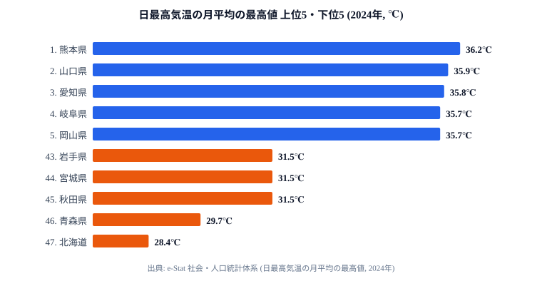

「猛暑日」とは、日最高気温が **35℃以上** を記録した日のことです。温暖化に伴い、35℃超えが珍しくない地域と、ほぼ発生しない地域の差は年々はっきりしてきました。同じ日本の夏でも、住んでいる県によってピーク気温には大きな開きがあります。

本記事では、e-Stat に登録されている **「日最高気温の月平均の最高値」(2024年)** をもとに、47都道府県のうち「夏のピーク気温が最も高い県」を読み解きます。1位の **熊本県 36.2℃** と最下位の **北海道 28.4℃** では、実に **7.8℃** もの差があります。先に結論を言ってしまうと、上位を埋めるのは派手な大都市ではなく、**西日本の内陸盆地と瀬戸内沿岸**でした。鍵を握るのは「フェーン現象」と「盆地の熱だまり」という、2つの地形の働きです。

> [!NOTE]
> この指標は「猛暑日の日数」そのものではなく、**1年で最も暑い月の、毎日の最高気温を平均した値**です。県を代表する観測点1地点の値なので、浜松市の41.1℃のような「点としての極値」は順位には直接反映されません。猛暑日の頻度とほぼ同じ並びになりますが、日数ランキングとは別物として読んでください。

## なぜ熊本・山口・岐阜が「猛暑常連県」なのか

ランキングを見ると、上位は西日本の内陸寄り・盆地・瀬戸内沿岸に集中しています。これは偶然ではなく、地形と風の通り道が生み出す **フェーン現象** と **盆地特有の熱だまり** が主な理由です。

群馬の館林、埼玉の熊谷、岐阜の多治見など、夏になるとニュースで「最高気温」として登場する地名は、いずれも **山を越えた風が乾燥・昇温して吹き下ろす場所** か、**周囲を山で囲まれた盆地** です。海風が届きにくく、夜になっても気温が下がりにくいという共通点があります。だからこそ、人口や経済規模ではなく地形が順位を決めるのです。

## 都道府県別 最高気温ランキング 上位5・下位5 (2024年)

e-Stat「社会・人口統計体系」より、各都道府県の **日最高気温の月平均の最高値** を抽出しました。年間で最も暑い月の、毎日の最高気温の平均値です。猛暑日 (35℃以上) の頻度と強い相関を持つ指標になります。

上位5は **熊本県 36.2℃・山口県 35.9℃・愛知県 35.8℃・岐阜県 35.7℃・岡山県 35.7℃** と、すべて西日本です。月平均で **35℃を超える** 県が10県もあるという数字は、10年前であれば異常事態でした。今は「夏のピーク月の毎日が猛暑日に近い」状態が、西日本の標準になりつつあります。なぜ上位がここまで西日本に偏るのかというと、九州山地・中国山地を越えた南西の気流がフェーン現象を起こし、さらに瀬戸内や濃尾平野・盆地で熱がこもるという、**風と地形のダブルパンチ**が効いているからです。

下位5は **北海道 28.4℃・青森県 29.7℃・秋田県 31.5℃・宮城県 31.5℃・岩手県 31.5℃** と、北日本が並びます。緯度が高く、夏でも海からの冷たい空気や偏西風の影響を受けやすいため、ピーク月でも最高気温が伸び切りません。とりわけ太平洋側の東北は、夏に冷たく湿った北東風(やませ)が入ると気温が抑えられ、猛暑日の頻度そのものが低くなります。冬の寒さの底を示す[最低気温ランキング](/ranking/lowest-temperature)と並べて見ると、北日本は夏の上限が低く冬の下限も低い「年較差の大きい気候」だと分かります。上位と下位を分けているのは「暑くなる仕組みの有無」であり、単純な南北の位置関係だけではない点が読みどころです。

<source-link href="/ranking/maximum-temperature">最高気温ランキングの全47都道府県をもっと見る</source-link>

関東勢では **埼玉県(11位, 35.0℃)** が最上位です。熊谷の異常高温で知られる埼玉ですが、観測点全体の平均では西日本の盆地・瀬戸内には届きません。「**点としての記録的高温**」と「**面としての平均高温**」は別物だと、この順位がよく示しています。

> [!WARNING]
> この順位は「県を代表する観測点1地点の月平均」で決まります。県内のどこかで41℃を記録しても、代表観測点が海沿いなら平均は伸びません。「自分の県は上位ではないから安全」と読み違えないでください。観測点が内陸か沿岸かで順位は大きく変わります。

## 内陸盆地とフェーン現象が生む「ピーク気温」

ランキング上位を細かく見ると、**地形効果** がいかに強いかが分かります。

**フェーン現象** は、湿った風が山を越えるときに雨を降らせて水分を失い、反対側を **乾燥した高温の風** として吹き下りる現象です。九州山地を越える風が熊本・佐賀の高温を、中国山地を越える風が山口・岡山の高温を生む、というように、夏の南西気流が山地と組み合わさることで西日本側に高温域が広がります。つまり、上位県の暑さは「太陽が強い」だけでなく「山を越えた風が乾いて熱くなる」ことで底上げされているのです。

**盆地の熱だまり** は、もう1つの要因です。岐阜県多治見市や京都盆地は、周囲を山に囲まれており、日中に温められた空気が逃げにくい構造になっています。夜間も気温が下がらず、翌日のピークがさらに上振れする悪循環が起きます。風が抜けにくいことが、そのまま「冷めない夜」と「より暑い昼」につながるわけです。

逆に **海風の恩恵を受けやすい県** は、ピーク気温が伸び切りません。例えば沖縄県は緯度が低いにもかかわらず **33.9℃(27位)**、神奈川県は東京湾の海風で **33.7℃(31位)** と、上位陣には及びません。海の **熱容量** が日中の気温上昇を抑える効果は、想像以上に大きいのです。南に行くほど暑いとは限らない、というのがこの指標の面白いところで、暑さを決めるのは緯度よりも「海との距離と山の配置」だと言えます。年間を通した平均で見たい場合は[平均気温ランキング](/ranking/average-temperature)も合わせて確認すると、ピーク気温との違いがよく分かります。

> [!TIP]
> 自分の県の順位を見るときは、「代表観測点が内陸か沿岸か」「近くに山を越える風の通り道があるか」を一緒に確認すると、なぜその順位なのかが腑に落ちます。沿岸の県が思ったより低いのは、海風によるブレーキが効いているサインです。

## 北海道の異常高温化トレンド

ランキング最下位は **北海道 28.4℃** ですが、注目すべきは過去15年の推移です。

2009年の **25.3℃** から2024年の **28.4℃** へ、15年で **+3.1℃** 上昇しました。同じ期間の熊本県は33.8℃から36.2℃へ **+2.4℃** の上昇です。気温上昇幅の絶対値だけを見れば、**北海道のほうが大きい** という結果になります。順位は最下位でも、変化のスピードという観点ではむしろ北海道のほうが速いのです。

涼しさを売りにしてきた北海道で、夏のピーク月の毎日の最高気温が **28℃台** に達するようになったことは、農業(酪農・畑作の作物選択)・観光(避暑地のマーケティング)・住宅(エアコン普及率)のすべてに影響します。「夏は北海道に避難」という常識が、データ上は少しずつ崩れ始めています。最下位の県だからこそ、温暖化の影響が暮らしの前提を変えてしまう度合いは大きいと言えるでしょう。

> [!WARNING]
> 「北海道が最下位」という今の順位だけを見て涼しいと判断するのは危険です。上昇幅で見れば北海道のほうが大きく、順位の固定が将来の安全を保証するわけではありません。順位(現在の水準)と変化幅(これからの方向)は分けて読む必要があります。

## データの出典と読み方

本記事のデータはすべて **e-Stat (政府統計の総合窓口)** の「社会・人口統計体系」から取得しています。指標名は **「日最高気温の月平均の最高値」** で、各都道府県の代表観測点における、1年のうち最も暑い月の毎日の最高気温の平均値です。

「猛暑日日数」(35℃以上の日数) そのものではない点に注意してください。ただし、月平均の最高値が35℃を超える県では、その月の半数以上が猛暑日に該当する計算になります。「**ピーク気温の高さ**」と「**猛暑日頻度**」は、ほぼ同じ並びになります。

観測点が1県1地点である都合上、**点としての極値**(例: 静岡県浜松市の41.1℃)は順位に直接反映されません。県内最高気温ではなく、**県を代表する観測点の月平均最高気温** という前提で読んでください。なお e-Stat の最新登録年は2024年で、本記事も2024年データに統一しています。気象・国土に関する他の指標は[気象・国土カテゴリの一覧](/category/landweather)からたどれます。

## データ出典

- e-Stat (政府統計の総合窓口)「社会・人口統計体系」より整備
- 指標: 日最高気温の月平均の最高値 (2024年)
