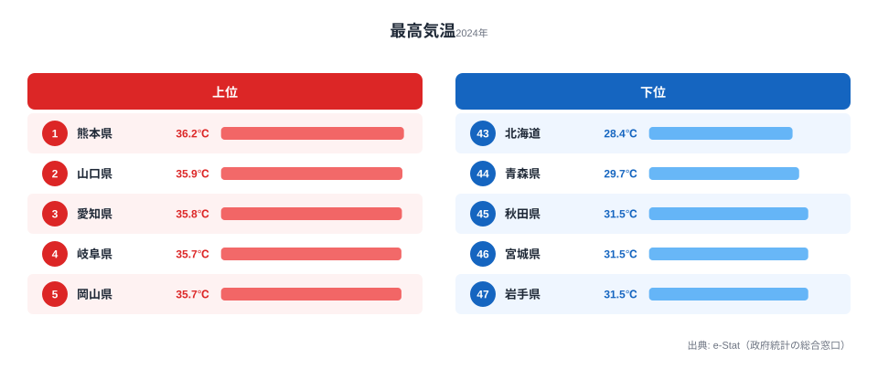
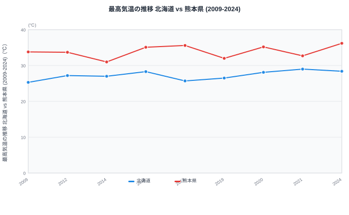

「猛暑日」とは、日最高気温が **35℃以上** を記録した日のことです。気象庁の定義では、近年の温暖化に伴い、35℃超えが珍しくない地域と、ほぼ発生しない地域の差が広がり続けています。同じ日本列島にいながら、夏のピーク気温が県によってここまで違うのかと驚く人も多いはずです。

本記事では、e-Stat に登録されている **「日最高気温の月平均の最高値」(2024年)** をもとに、47都道府県のうち「夏のピーク気温が最も高い県」をランキング形式で整理しました。1位の **熊本県 36.2℃** と最下位の **北海道 28.4℃** では **7.8℃** もの差があります。

先に結論をお伝えすると、上位を独占するのは「西日本の内陸盆地・瀬戸内沿岸」で、その正体は **フェーン現象** と **盆地の熱だまり** という地形の力です。そして見落とされがちなのが、最下位である **北海道の気温上昇幅が、実は熊本県より大きい** という事実です。この2つの軸でデータを読み解いていきます。

> [!NOTE]
> このランキングが使う「日最高気温の月平均の最高値」は、各県の代表観測点で **1年のうち最も暑い月の、毎日の最高気温を平均した値** です。特定の日の極値(例:浜松の41.1℃)ではなく「ピーク月がどれだけ暑いか」を表す指標で、猛暑日の頻度とほぼ同じ並びになります。

## なぜ熊本・山口・岐阜が「猛暑常連県」なのか

ランキングを見ると、上位は西日本の内陸寄り・盆地・瀬戸内沿岸に集中していることが分かります。これは偶然ではなく、地形と風の通り道が生み出す **フェーン現象** と **盆地特有の熱だまり** が主な原因です。

群馬の館林、埼玉の熊谷、岐阜の多治見など、夏になるとニュースで「最高気温」として登場する地名は、いずれも **山を越えた風が乾燥・昇温して吹き下ろす場所** か、**周囲を山で囲まれた盆地** です。海風が届かず、夜になっても気温が下がりにくいのが共通する特徴です。

## 都道府県別 最高気温ランキング (2024年)

e-Stat「社会・人口統計体系」より、各都道府県の **日最高気温の月平均の最高値** を抽出しました。年間で最も暑い月の、毎日の最高気温の平均値です。次の図は上位5県と下位5県を並べたものです。

平均値で **35℃を超える** 県が複数あるという数字は、10年前であれば異常事態でした。現在は「夏のピーク月の毎日が猛暑日に近い」が西日本の標準になりつつあります。上位は熊本(36.2℃)・山口(35.9℃)・愛知(35.8℃)と続き、岐阜・岡山・佐賀が同率4位(35.7℃)で並びます。九州内陸・瀬戸内・濃尾平野という、海から離れた高温地帯が顔を揃えているのが分かります。

下位を見ると、北海道(28.4℃)・青森(29.7℃)に続いて、岩手・宮城・秋田が揃って **31.5℃**(43〜45位)で並びます。緯度が高く海に囲まれた東北・北海道は、夏のピーク月でも31℃前後にとどまり、上位とは5℃前後の開きがあります。

<source-link href="/ranking/maximum-temperature">最高気温ランキングの全47都道府県を見る</source-link>

関東勢では **埼玉県 (11位, 35.0℃)** が最上位です。熊谷の異常高温で知られる埼玉ですが、観測点全体の平均では西日本の盆地・瀬戸内には届きません。「**点としての記録的高温**」と「**面としての平均高温**」は別物だと、このランキングは教えてくれます。

> [!TIP]
> 「自分の県は何位だろう」と気になったら、観測点が県内のどこにあるかも合わせて確認すると理解が深まります。同じ県でも沿岸の観測点と内陸の観測点では、夏のピーク気温が数℃変わることが珍しくありません。

## 内陸盆地 + フェーン現象が生む「ピーク気温」

ランキング上位を細かく見ると、**地形効果** がいかに強いかが分かります。

**フェーン現象** とは、湿った風が山を越えるときに雨を降らせて水分を失い、反対側を **乾燥した高温の風** として吹き下りる現象です。九州山地を越える東風が熊本・佐賀の高温を、中国山地を越える南風が山口・岡山の高温を生みます。夏の南西気流が山地と組み合わさることで、西日本側に高温域が広がっていきます。

**盆地の熱だまり** はもう1つの要因です。岐阜県多治見市や京都盆地は、周囲を山に囲まれているため、日中に温められた空気が逃げにくい構造になっています。夜間も気温が下がらず、翌日のピークがさらに上振れする悪循環が起きます。

逆に **海風の恩恵を受けやすい県** は、ピーク気温が伸び切りません。例えば[沖縄県](/areas/47000)は緯度が低いにもかかわらず **33.9℃ (26位)**、神奈川県は東京湾の海風で **33.7℃ (31位)** と、上位陣には及びません。海の **熱容量** が日中の気温上昇を抑える効果は、想像以上に大きいのです。緯度の高さよりも「海が近いかどうか」が、夏のピーク気温を左右していることが読み取れます。

この「海から離れた高温」と「降水量の少なさ」は表裏一体の関係にあります。フェーン現象で乾いた風が吹き下りる県では雨が降りにくく、その構造は[年間降水量ランキング](/blog/precipitation-snow-regional-gap)でも確認できます。また年間を通した平均気温の差は[年平均気温ランキング](/blog/temperature-extremes-map)に整理しています。

> [!WARNING]
> 観測点が1県あたり1地点である都合上、**県内の極値**(例:静岡県浜松市の41.1℃)はこのランキングに直接反映されません。「県内で最も暑かった地点」ではなく「県を代表する観測点の月平均最高気温」という前提で読んでください。県内に高温地帯があっても、観測点が沿岸にあれば順位は下がります。

## 北海道の異常高温化トレンド

ランキング最下位は **北海道 28.4℃** ですが、注目すべきは過去15年の推移です。次の図は、最下位の北海道と1位の熊本県を並べた時系列です。

2009年の **25.3℃** から2024年の **28.4℃** へ、北海道は15年で **+3.1℃** 上昇しています。同じ期間の熊本県は33.8℃ → 36.2℃で **+2.4℃** の上昇です。気温上昇幅の絶対値だけを見れば、**北海道の方が大きい** のです。順位は最下位のままでも、上がり方は誰よりも速い県だと言えます。

涼しさを売りにしてきた北海道が、夏のピーク月の毎日の最高気温が **28℃台** に達するようになったことは、農業(酪農・畑作の作物選択)・観光(避暑地としてのマーケティング)・住宅(エアコン普及率)のすべてに影響します。「夏は北海道に避難」という常識が、データ上は静かに崩れ始めています。

<source-link href="/ranking/maximum-temperature">年次ごとの最高気温の変化を確認する</source-link>

## データ出典

本記事のデータはすべて **e-Stat (政府統計の総合窓口)** の「社会・人口統計体系」より取得しています。指標名は **「日最高気温の月平均の最高値」** で、各都道府県の代表観測点における、1年のうち最も暑い月の毎日の最高気温の平均値です。集計年は2024年で、e-Stat 経由で整備されたデータを用いています。

「猛暑日日数」(35℃以上の日数) そのものではない点に注意してください。ただし、月平均の最高値が35℃を超える県では、その月の半数以上が猛暑日に該当する計算になります。「**ピーク気温の高さ**」と「**猛暑日頻度**」は、ほぼ同じ並びになると考えてよいでしょう。

気候は暮らしのあらゆる側面に波及します。気温・降水・日照を合わせて見ることで、「西日本のフェーン+盆地」「北海道の温暖化トレンド」という2つの軸の中で、自分の県がどこに位置するかが見えてきます。気象や国土に関する他の指標は[気象・国土カテゴリ](/category/landweather)からも辿れます。
