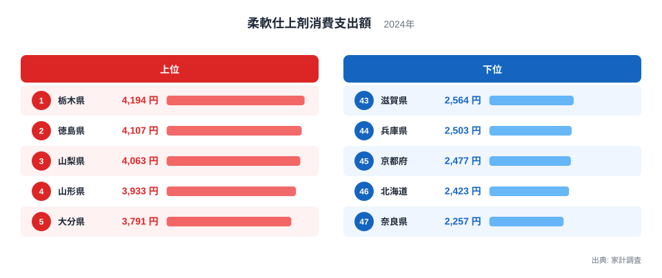
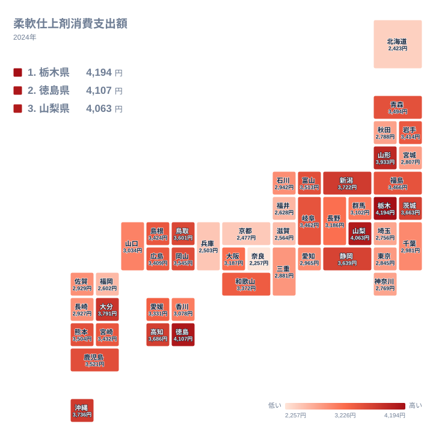

柔軟仕上剤は、洗濯物をふんわり仕上げ、香りをつけるための家庭用品です。総務省の家計調査によりますと、2024年の都道府県庁所在市における1世帯あたりの柔軟仕上剤消費支出額は、1位の栃木県で4,194円、47位の奈良県で2,257円となっており、その差は約1.9倍にのぼります。

同じ日本の家庭でありながら、なぜこれほどの開きが生まれるのでしょうか。この記事では、上位と下位の顔ぶれを地理的な視点で読み解きながら、気候や洗濯習慣、世帯構成との結びつきを探っていきます。単純な好みの違いでは片づけられない、地域ごとの暮らし方の違いが見えてきます。

## 上位5県と下位5県にみる大きな開き

<source-link href="/ranking/fabric-softener-consumption-expenditure">柔軟仕上剤消費支出額ランキングをもっと見る</source-link>

上位を見ますと、栃木県が4,194円で1位、徳島県が4,107円で2位、山梨県が4,063円で3位、山形県が3,933円で4位、大分県が3,791円で5位という順になっています。関東の栃木県、四国の徳島県、中部の山梨県、東北の山形県、九州の大分県というように、上位5県は特定の地方に集中せず、日本各地にまたがっているのが特徴です。異なる気候帯や地形を持つ県が並んでいる点が目を引きます。

一方、下位を見ますと、奈良県が2,257円で47位、北海道が2,423円で46位、京都府が2,477円で45位、兵庫県が2,503円で44位、滋賀県が2,564円で43位となっています。北海道を除く4県、すなわち奈良県、京都府、兵庫県、滋賀県は、いずれも近畿地方に属しています。下位5県のうち4県が同じ地方に集まっているという点は、上位5県が広く分散しているのとは対照的です。

奈良県と栃木県を比べますと、消費支出額には約1.9倍の開きがあります。この差は単なる誤差の範囲では説明しにくく、暮らし方の違いを反映していると考えられます。次の章では、この分布を地図で確認しながら、地理的な傾向をさらに掘り下げます。

## 地理的分布から見える傾向

タイルマップで全国の分布を確認しますと、栃木県や山形県のほか、新潟県や鳥取県のように日本海側や内陸部に位置する県で消費支出額が高い傾向が見えます。新潟県は7位で3,722円、鳥取県は11位で3,601円となっており、日本海側の県が上位に複数入っています。これらの地域は冬季に降雪や曇天が続く期間が長く、洗濯物を屋外に干しにくい季節を持つという共通点があります。

対照的に、近畿地方は奈良県、京都府、兵庫県、滋賀県がそろって下位に位置しており、比較的温暖な太平洋側の気候を持つ地域が下位に集まっている様子がうかがえます。ただし北海道は冷涼な気候でありながら46位と低い水準にあり、気候の寒暖だけでこの指標のすべてを説明できるわけではないことも、この地図から読み取れます。

地図全体を眺めますと、上位県は一つの地方だけに固まっているわけではなく、複数の地方にまたがって分布しています。その一方で、近畿地方という特定のまとまりが低い側に偏っているという、部分的ではありますがはっきりとした地域性が見えてきます。この非対称な分布こそが、この指標を読み解くうえでの出発点になります。

## なぜ差が生まれるのか——気候と暮らし方

[仮説] 柔軟仕上剤の使用量には、洗濯物の乾かし方が関係している可能性があります。降雪や曇天が多く洗濯物を屋外に干しにくい地域では、部屋干しの機会が増えます。部屋干しは屋外干しに比べて乾燥に時間がかかりやすく、生乾き特有のにおいが発生しやすいため、その対策として柔軟仕上剤を多めに使う家庭が増えるかもしれません。栃木県や山形県、新潟県といった上位に入る県の一部は、冬季の日照時間が短く降雪や曇天の日が多い地域と重なっており、この仮説と整合的な面があります。ただし、この記事のデータだけでは各県の部屋干しの実際の頻度までは確認できないため、あくまで一つの仮説として受け止めてください。

[仮説] 世帯構成の違いも影響している可能性があります。家計調査は二人以上の世帯を対象としており、子育て世帯の割合が高い地域では洗濯物の量そのものが多く、柔軟仕上剤の消費量が増える傾向があるかもしれません。反対に、単身世帯の割合が高い都市部やコインランドリーの利用が多い地域では、柔軟仕上剤を使わない、あるいは使用量が少ない家庭が相対的に多くなる可能性があります。近畿地方の下位県には大阪府に近い都市近郊のベッドタウンが含まれており、都市型の生活様式が関係している可能性は否定できません。

このほかにも、水の硬度や地域ごとの生活文化、店頭での商品の露出度合いといった要因が影響している可能性がありますが、いずれも本データだけでは検証できません。地域差の背景には複数の要因が重なっている可能性が高く、単一の原因に絞り込んで説明することは慎重に避けるべきでしょう。

## 洗濯用品全体の中での柔軟仕上剤

柔軟仕上剤は、洗濯用洗剤と並ぶ、洗濯用品の代表的な支出項目の一つです。洗剤が汚れを落とすことを主目的とするのに対して、柔軟仕上剤は仕上げの工程で使われる、いわば付加的な支出という性格を持っています。そのため、洗剤の消費支出額に見られる地域差と、柔軟仕上剤の消費支出額に見られる地域差が、必ずしも同じ傾向を示すとは限りません。洗濯そのものを行う頻度が高い地域と、柔軟仕上剤を積極的に使う地域は、重なる部分もあれば異なる部分もあると考えられます。

家計における洗濯関連の支出を横断的に見る際には、柔軟仕上剤単体の順位だけでなく、洗剤や漂白剤など関連する品目の支出傾向もあわせて確認しますと、その地域の洗濯習慣の全体像がより立体的に見えてきます。[同じカテゴリの統計一覧](/category/economy) では、家計に関する他の品目のランキングも確認できますので、あわせてご覧いただくことをおすすめします。

## まとめ

- 柔軟仕上剤消費支出額の1位は栃木県で4,194円、47位は奈良県で2,257円であり、その差は約1.9倍です。
- 上位5県は栃木県、徳島県、山梨県、山形県、大分県と、特定の地方に偏らず日本各地に分布しています。
- 下位5県のうち奈良県、京都府、兵庫県、滋賀県の4県は近畿地方に集中しており、北海道のみが例外的に加わっています。
- [仮説] 部屋干しの頻度の違いや世帯構成の違いが、地域差の一因になっている可能性があります。
- この指標の地域差は単一の要因では説明しきれない、複合的な背景を持つと考えられます。

上位県・下位県それぞれの他の統計指標については、[栃木県のデータ](/areas/09000) や [徳島県のデータ](/areas/36000) でもあわせて確認いただけます。

## データ出典

出典: 総務省統計局「家計調査」（2024年、都道府県庁所在市における二人以上の世帯を対象とした集計）

> [!NOTE]
> この数値は都道府県庁所在地の市に住む二人以上の世帯を対象とした平均消費支出額であり、県内全域の平均値ではありません。県庁所在市以外の地域では、実際の傾向が異なる場合がある点にご注意ください。

> [!WARNING]
> 柔軟仕上剤は毎月必ず購入するとは限らない品目であり、家計調査は標本調査であるため、特定の月にまとめ買いをした世帯の有無によって年間の消費支出額が変動しやすいという性質があります。年による振れ幅がある可能性を踏まえたうえで数値を読んでください。

> [!TIP]
> 順位の数字だけでなく、上位と下位がそれぞれどの地方に分布しているかを地図で確認しますと、単なる数字の比較以上に地域の暮らし方の違いが見えてきます。特に、近畿地方の県が下位にまとまっている点は、この指標を読み解くうえで押さえておきたいポイントです。
