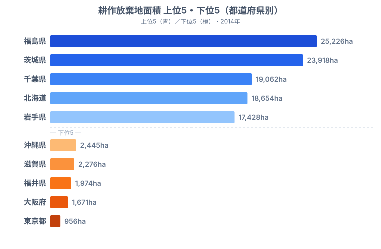
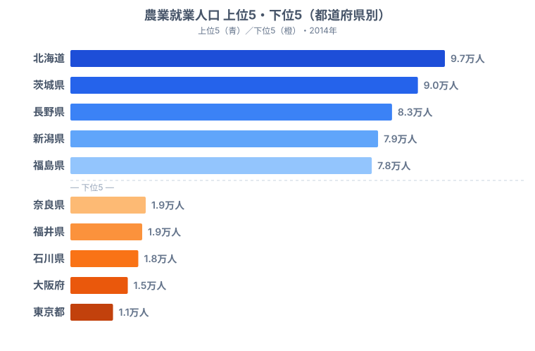
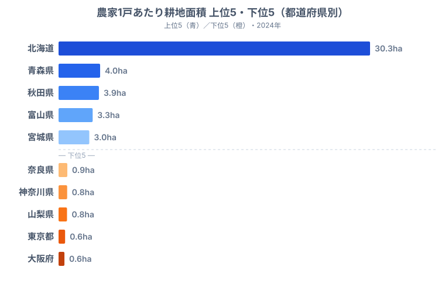

「農地が足りない」のではなく「農地を耕す人がいない」──日本の農業は、静かに、しかし確実に縮小しています。

農林業センサス（2015年）によると、全国の耕作放棄地面積は **42.3万ha** に達しました。これは埼玉県の面積に匹敵する広さの農地が、耕す人がいないまま放置されていることを意味します。農業就業人口（販売農家）は約 **210万人** まで減少し、その多くが65歳以上の高齢者です。

本記事では、耕作放棄地面積・農業就業人口・農家1戸あたり耕地面積という3つの指標から、農地がどこで、なぜ消えつつあるのかを都道府県別に読み解きます。先に結論を言えば、農地を失っているのは「農業が衰えた県」ではなく、むしろ「農地が広く、担い手が多いはずの県」だという逆説が見えてきます。

## どの県で耕作放棄地が広がっているのか

耕作放棄地面積の上位5県と下位5県を並べると、放棄が「面積規模の大きい県」に偏っていることがはっきりします。

上位は福島県（25,226ha）、茨城県（23,918ha）、千葉県（19,062ha）、北海道（18,654ha）、岩手県（17,428ha）と続きます。トップの[福島県](/areas/07000)は、東京電力福島第一原子力発電所の事故による避難区域の影響が大きく、耕す人が戻れないまま放置された農地が積み上がりました。2位の茨城県、3位の千葉県は、関東平野に広大な農地を抱えるがゆえに、放棄面積の絶対値も大きくなっています。

ここで読み違えやすいのが、[北海道](/areas/01000)が4位に入っている点です。北海道は耕地面積そのものが全国最大であるため、ごく一部の農地で担い手が見つからないだけでも、面積としては大きく積み上がります。つまり上位常連の多くは「農業が崩壊した県」ではなく「もともと農地の母数が大きい県」なのです。一方、下位の東京都（956ha）、大阪府（1,671ha）、福井県（1,974ha）、滋賀県（2,276ha）、沖縄県（2,445ha）は、そもそも農地面積が小さいため放棄面積も小さくなります。放棄が少ない＝農業が元気、という単純な読み方はできません。

> [!NOTE]
> 耕作放棄地とは「以前耕作していたが過去1年以上作付けされず、数年内に再び耕作する意思のない土地」を指します。農林業センサスの定義で、休耕（一時的に作付けを止めた農地）とは区別されます。本データは2014年（センサス2015年公表）時点のもので、2020年センサスでは集計区分が見直されたため、年をまたいだ単純比較には注意が必要です。

<source-link href="/ranking/abandoned-cultivated-land-area">47都道府県の耕作放棄地面積ランキングをもっと見る</source-link>

<ad-slot></ad-slot>

## 担い手が多い県ほど、放棄地も多いという逆説

農地を耕す人がいなければ、放棄地は増え続けます。そこで農業就業人口（販売農家）の上位5県と下位5県を見てみましょう。

上位は北海道（約9.7万人）、茨城県（約9.0万人）、長野県（約8.3万人）、新潟県（約7.9万人）、福島県（約7.8万人）です。下位には東京都（約1.1万人）、大阪府（約1.5万人）、石川県（約1.8万人）、福井県（約1.9万人）、奈良県（約1.9万人）が並びます。全国合計は約 **210万人** ですが、これは2010年センサスの約261万人から5年間で約50万人も減った結果です。

注目したいのは、就業人口の上位に並ぶ茨城県・福島県・北海道が、前章の耕作放棄地でも上位に顔を出していることです。「担い手が多いのに放棄地も多い」というのは一見矛盾しますが、答えは農地のスケールにあります。もともと農地面積が大きい県ほど、高齢化で一部の農家が離農したときに、引き受け手の見つからない農地が面積として目立って現れるのです。逆に下位の東京都・大阪府は農地が少ないため、就業人口も放棄地も小さく収まります。農地の消失は「農業が弱い県」ではなく「農業が大きい県」で先に顕在化する、という構造がここから読み取れます。

> [!WARNING]
> 上位・下位を「絶対量」で比べている点に注意してください。耕作放棄地も農業就業人口も面積・人口の母数に強く引っ張られるため、ランキングの順位がそのまま「農業の健全度」を表すわけではありません。県の深刻度を比べたいときは、後述の集約度のように母数で割った相対指標を併読する必要があります。

<source-link href="/ranking/agricultural-employment-population">47都道府県の農業就業人口ランキングをもっと見る</source-link>

## 放棄地を抑える鍵は「1戸あたりの広さ」

担い手不足への処方箋のひとつが、農地の集約化です。少ない農家でより広い面積を効率的に耕す「規模拡大」が進めば、離農した農地の引き受け手が現れやすくなります。その進み具合を映すのが、農家1戸あたりの耕地面積です。

北海道は1戸あたり約30.4haと、2位の青森県（約4.1ha）の7倍以上で突出しています。大規模畑作・酪農経営が集約を牽引しているためです。続く秋田県・富山県・宮城県も、水田農業の大規模化が進む地域です。一方、下位の大阪府（約0.6ha）や東京都（約0.6ha）、山梨県・神奈川県・奈良県は1戸あたりの面積が極端に小さく、都市農業が小規模な市民農園型であることや、中山間地で区画がまとまらないことを反映しています。

ここに前章までの逆説を解く鍵があります。北海道は耕作放棄地・就業人口とも上位でしたが、1戸あたり面積が圧倒的に広いため、離農があっても残った大規模経営が農地を吸収しやすい構造を持っています。逆に、集約が進まない県では、高齢農家が離農するたびに小さな農地が宙に浮き、引き受け手が見つからないまま放棄地化していきます。全国平均は約2.4haですが、北海道を除くと約1.8haで、EU諸国（平均17ha前後）やアメリカ（平均180ha前後）と比べても依然として零細な構造が続いています。

> [!TIP]
> 農家1戸あたり耕地面積は「集約化の進展度」の代理指標として読むと示唆的です。耕作放棄地面積のランキングと重ねて見ると、面積が広い県では放棄が表面化しにくく、零細な県では小さな離農がそのまま放棄に直結しやすい、という対照が浮かびます。1指標だけでなく「規模 × 担い手」の組み合わせで地域を見る視点が役立ちます。

<source-link href="/ranking/cultivated-land-area-per-household">47都道府県の農家1戸あたり耕地面積ランキングをもっと見る</source-link>

<source-link href="/ranking/cultivated-land-area-ratio">47都道府県の耕地面積比率ランキングをもっと見る</source-link>

<ad-slot></ad-slot>

## 転用された農地は二度と戻らない

耕作放棄と並行して、農地の「転用」も農地減少の大きな要因です。2022年度の農地転用面積は全国で **1万5,414ha** に達し、宅地や商業用地などへ姿を変えました。上位は茨城県（1,025ha）、北海道（876ha）、埼玉県（679ha）、長野県（631ha）、愛知県（602ha）で、都市近郊県でインフラ開発や宅地化の圧力が強く出ています。

転用は農地法で規制されているものの、年間1.5万haペースで農地が恒久的に失われている事実は重く受け止める必要があります。耕作放棄地は手を入れれば再び農地に戻せる可能性がありますが、宅地やショッピングセンターに転用された農地は二度と農地には戻りません。「いったん放棄された農地」と「転用で消えた農地」では、回復可能性がまったく違うのです。

## まとめ：農地消失は「規模 × 担い手」で読む

耕作放棄地・農業就業人口・集約度のデータが示すのは、日本農業の構造的な縮小です。要点を整理します。

- 耕作放棄地は福島県（2万5,226ha）が最も広く、上位には茨城県・千葉県・北海道・岩手県という農地規模の大きい県が並びます。
- 放棄地の多さは「農業の弱さ」ではなく「農地の母数の大きさ」を映しており、担い手が多い県ほど放棄地も多いという逆説が見られます。
- 1戸あたり面積では北海道が約30.4haと2位青森県の7倍以上で、集約が進んだ県ほど離農した農地を吸収しやすい構造を持ちます。
- 転用面積は2022年度で全国1万5,414haに上り、転用された農地は耕作放棄地と違って二度と戻りません。
- 農地を守るには、規模（集約度）と担い手の両面から地域ごとに対策を組み立てる必要があります。

耕作放棄地42.3万haは、単なる「使われていない土地」ではありません。担い手がいないために地域の景観が荒廃し、鳥獣害が増え、防災機能が低下するという複合的な問題を引き起こします。北海道のような大規模集約型は一つの解ですが、中山間地域ではそもそも集約が困難です。スマート農業やシェアリング型の経営、新規就農支援など、地域の実情に合った処方箋が求められています。あわせて[農林水産業の各種ランキング](/category/agriculture)から、耕地面積比率や生産額の地域差も読み解いてみてください。

## データ出典

本記事のデータはe-Stat（政府統計の総合窓口）「社会・人口統計体系」を基に作成しています。

- 耕作放棄地面積・農業就業人口: 農林業センサス（2014年・2015年公表）
- 農家1戸あたり耕地面積: 2024年時点の集計値
- 農地転用面積: 2022年度の集計値
