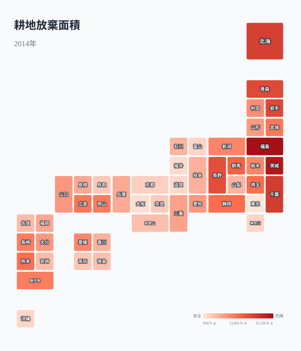
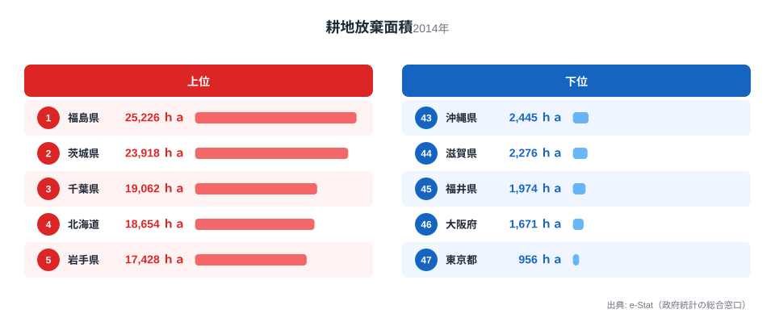
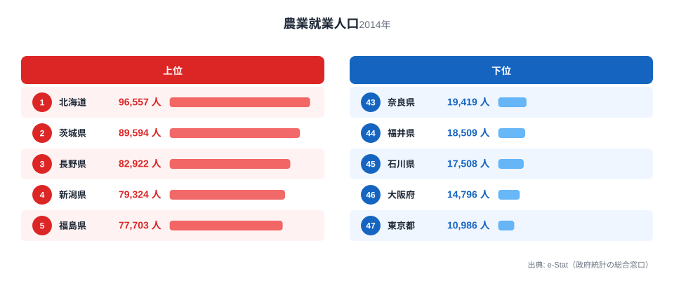
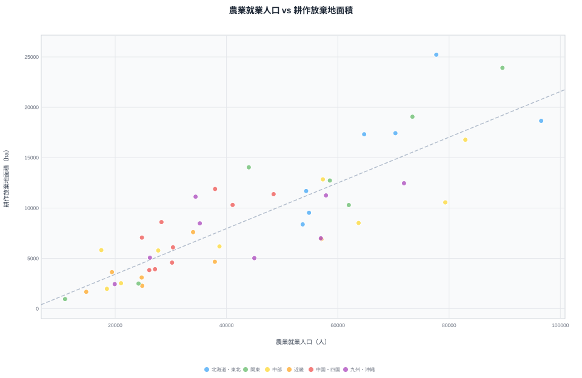
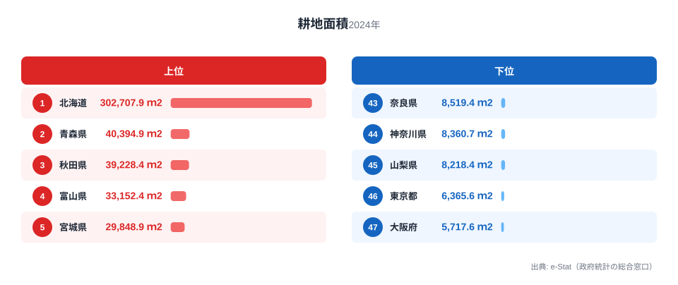
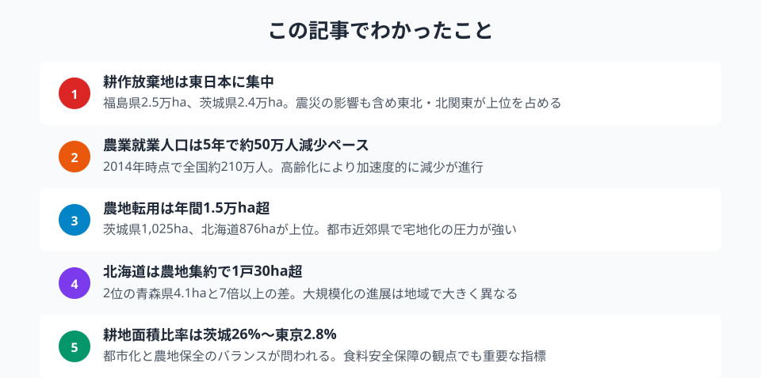

日本の農業は、静かに、しかし確実に縮小している。

農林業センサス（2015年）によると、全国の耕作放棄地面積は**42.3万ha** に達した。これは埼玉県の面積に匹敵する広さの農地が、耕す人がいないまま放置されていることを意味する。農業就業人口（販売農家）は約**210万人** まで減少し、その多くが65歳以上の高齢者だ。

本記事では、耕作放棄地面積・農地転用面積・耕地面積比率・農業就業人口・農家1戸あたり耕地面積の5つの指標から、都道府県ごとの農地消失の実態を可視化する。

## 耕作放棄地面積マップ

まず、47都道府県の耕作放棄地面積を一覧できるタイルマップを見てみよう。色が濃いほど放棄面積が大きい。

<data-source url="https://www.e-stat.go.jp/dbview?sid=0000010103" label="e-Stat 社会・人口統計体系"></data-source>

東日本、とりわけ東北・北関東に濃い色が集中していることが読み取れる。福島県は**2万5,226ha** で全国1位。東京電力福島第一原子力発電所の事故による避難区域の影響が大きい。2位の茨城県（2万3,918ha）、3位の千葉県（1万9,062ha）も関東平野の広大な農地を抱えるがゆえに、放棄面積の絶対値も大きくなっている。

## 耕作放棄地面積 上位15道県

<data-source url="https://www.e-stat.go.jp/dbview?sid=0000010103" label="e-Stat 社会・人口統計体系"></data-source>

上位5道県（福島・茨城・千葉・[北海道](/areas/01000)・岩手）で全体の約24%を占める。福島県と茨城県はいずれも2万haを超えており、突出している。

注目すべきは、北海道が4位に入っている点だ。北海道は耕地面積そのものが全国最大であるため、放棄面積の絶対値も大きくなる。一方で6位の青森県（1万7,320ha）や7位の長野県（1万6,776ha）は、高齢化と中山間地の条件不利が放棄の主因と考えられる。

<source-link href="/ranking/abandoned-cultivated-land-area">47都道府県の耕作放棄地面積ランキングをもっと見る</source-link>

<ad-slot></ad-slot>

## 農業就業人口の現状

農地を耕す人がいなければ、放棄地は増え続ける。農業就業人口（販売農家）の都道府県別データを見てみよう。

<data-source url="https://www.e-stat.go.jp/dbview?sid=0000010103" label="e-Stat 社会・人口統計体系"></data-source>

北海道が約9.7万人でトップ、次いで茨城県（約9.0万人）、長野県（約8.3万人）が続く。全国合計は約**210万人** だが、この数字は2010年センサスの約261万人から5年間で約50万人も減少した結果である。

農業就業人口が多い県は、耕作放棄地も多い傾向がある。これは一見矛盾するようだが、もともと農地面積が大きい県ほど、一部の農地で担い手が見つからないケースが増えるためだ。

<source-link href="/ranking/agricultural-employment-population">47都道府県の農業就業人口ランキングをもっと見る</source-link>

## 農業就業人口と耕作放棄地の関係

この関係を散布図で確認する。

<data-source url="https://www.e-stat.go.jp/dbview?sid=0000010103" label="e-Stat 社会・人口統計体系"></data-source>

右上に位置する茨城県・福島県・北海道は、就業人口が多いにもかかわらず放棄面積も大きい。農地のスケールが大きいため、高齢化による離農の影響が面積として現れやすいことを示している。

一方、左下の[東京都](/areas/13000)・[大阪府](/areas/27000)・石川県・福井県などは、もともと農地が少ないため放棄面積も小さい。福島県は就業人口のわりに放棄面積が突出して大きく、原発事故の影響が統計にも明確に表れている。

> [!NOTE]
> 耕作放棄地面積と農業就業人口のデータはいずれも2014年（農林業センサス2015年公表）時点のものです。2020年センサスでは「耕作放棄地」の定義が変更されたため、時系列比較には注意が必要です。

<ad-slot></ad-slot>

## 農地集約化の進捗

担い手不足に対する処方箋のひとつが、農地の集約化だ。少ない農家でより広い面積を効率的に耕す「規模拡大」は、日本農業の持続可能性を左右する重要なテーマである。

農家1戸あたりの耕地面積を見ると、集約化の進展に大きな地域差があることがわかる。

<data-source url="https://www.e-stat.go.jp/dbview?sid=0000010203" label="e-Stat 社会・人口統計体系"></data-source>

北海道は1戸あたり**約30.4ha** と、2位の青森県（約4.1ha）の7倍以上。大規模畑作・酪農経営が集約を牽引している。東北地方が上位を占めるのは、水田農業の大規模化が進んでいるためだ。

一方、都市部の大阪府（約0.6ha）や東京都（約0.6ha）は極端に小さい。これは都市農業が小規模な市民農園型であることを反映している。

全国平均は約**2.4ha** だが、北海道を除くと約1.8haとなり、EU諸国（平均17ha前後）やアメリカ（平均180ha前後）と比べると依然として零細な構造が続いている。

> [!TIP]
> 農家1戸あたり耕地面積は「集約化の進展」の代理指標になる。北海道約30.4haは2位青森県の約4.1haの7倍超。集約化が進んでいる地域ほど担い手不足への耐性が高く、農地の放棄面積の相対的な抑制につながる。

<source-link href="/ranking/cultivated-land-area-per-household">47都道府県の農家1戸あたり耕地面積ランキングをもっと見る</source-link>

<source-link href="/ranking/cultivated-land-area-ratio">47都道府県の耕地面積比率ランキングをもっと見る</source-link>

## 農地転用の圧力

耕作放棄と並行して、農地の「転用」も農地減少の大きな要因だ。2022年度の都道府県別農地転用面積を見ると、全国で**1万5,414ha** が宅地や商業用地などに転用されている。

上位は茨城県（1,025ha）、北海道（876ha）、埼玉県（679ha）、長野県（631ha）、愛知県（602ha）。都市近郊県でインフラ開発や宅地化の圧力が強い。

転用は法律（農地法）で規制されているものの、年間1.5万haペースで農地が恒久的に失われている事実は重い。耕作放棄地は再び農地に戻せる可能性があるが、宅地やショッピングセンターに転用された農地は二度と農地には戻らない。

<ad-slot></ad-slot>

## まとめ

耕作放棄地と農業就業人口のデータが示すのは、日本農業の構造的な縮小である。

耕作放棄地42.3万haは、単なる「使われていない土地」ではない。農業の担い手がいないために、地域の景観が荒廃し、鳥獣害が増加し、防災機能が低下するという複合的な問題を引き起こしている。

北海道のような大規模集約型の農業は一つの解ではあるが、中山間地域ではそもそも集約が困難な場合が多い。スマート農業やシェアリング型の農業経営、新規就農支援など、地域ごとの実情に合った対策が求められる。

## データ出典

本記事のデータはe-Stat（政府統計の総合窓口）を基に作成しています。
