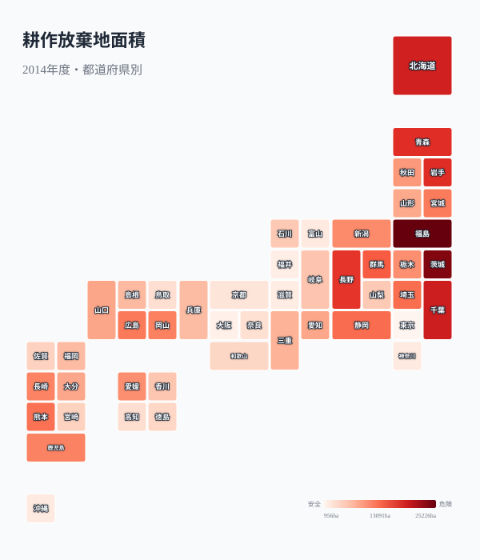
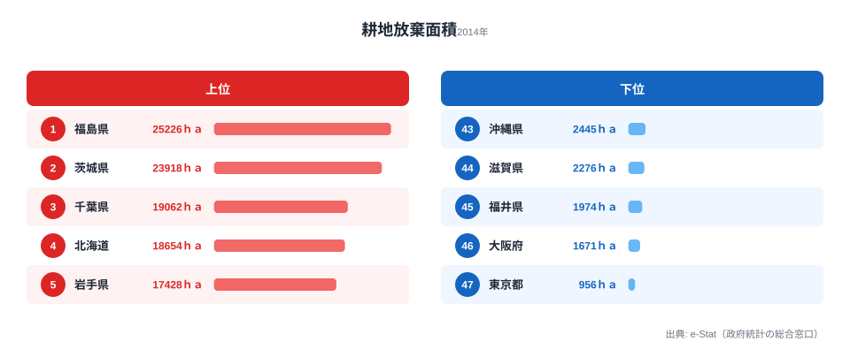
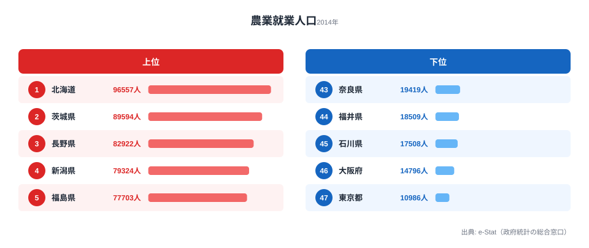
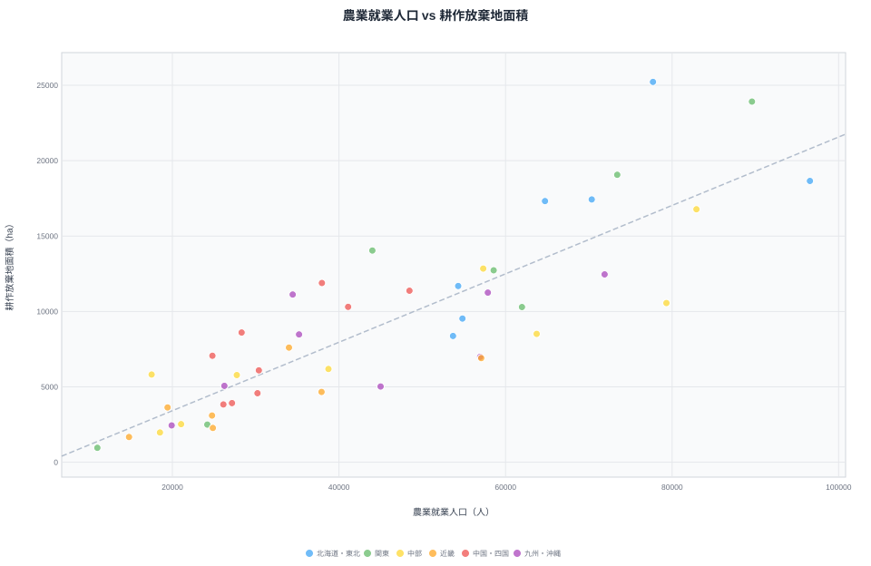
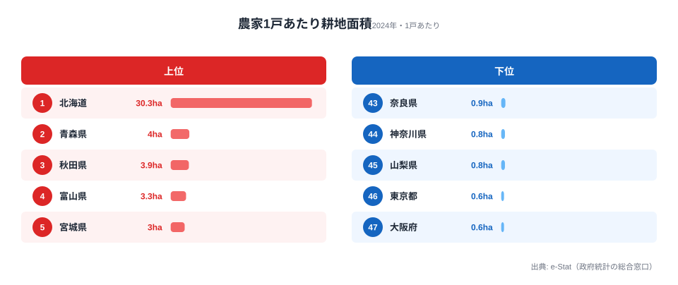
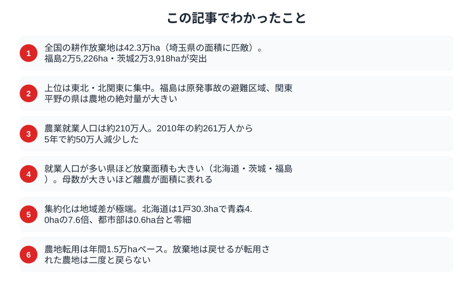

「埼玉県とほぼ同じ広さの農地が、耕す人のいないまま放置されている」──そう言われても、すぐには実感が湧かないかもしれません。けれども、それが日本の農地でいま起きていることです。

農林業センサス（2015年公表）によると、全国の耕作放棄地面積は **42.3万ha** に達しました。これは埼玉県の面積に匹敵する広さの農地が、誰にも耕されないまま眠っていることを意味します。農業就業人口（販売農家）は約 **210万人** まで減り、その多くが65歳以上の高齢者です。担い手が消え、農地が荒れ、それがさらに担い手を遠ざける──この連鎖がどの県で深刻なのかを、本記事では4つの指標から地図と数字で追っていきます。

> [!NOTE]
> ここで言う「耕作放棄地」とは、過去1年以上作付けされず、数年のうちに再び耕す予定もない農地を指します。荒れていても農地として登録されている点が、後述する「農地転用」（宅地などへ用途を変える）とは決定的に異なります。放棄地は条件が整えば再び耕作できますが、転用された農地は二度と農地に戻りません。

## 耕作放棄地はどの県に集中しているか

まず、47都道府県の耕作放棄地面積を一覧できるタイルマップを見てください。色が濃いほど放棄面積が大きい県です。

<data-source url="https://www.e-stat.go.jp/dbview?sid=0000010103" label="e-Stat 社会・人口統計体系"></data-source>

東日本、とりわけ東北・北関東に濃い色が集中していることが読み取れます。1位は福島県の **2万5,226ha**。東京電力福島第一原子力発電所の事故にともなう避難区域の影響が、放棄面積を大きく押し上げています。続く茨城県（2万3,918ha）、千葉県（1万9,062ha）は、関東平野の広大な農地を抱えるがゆえに、放棄される絶対量も大きくなりやすい県です。

このマップで重要なのは、「西高東低」ではなく「東高西低」という向きです。西日本の中山間地でも離農は進んでいますが、もともとの農地スケールが小さいため、放棄"面積"としては東日本ほど目立ちません。面積の絶対値で見ると、課題の重心は東日本にあると言えます。

## 上位5県と下位5県──26倍の開き

順位を上位5県・下位5県のかたちで見比べてみましょう。

<data-source url="https://www.e-stat.go.jp/dbview?sid=0000010103" label="e-Stat 社会・人口統計体系"></data-source>

<source-link href="/ranking/abandoned-cultivated-land-area">47都道府県の耕作放棄地面積ランキングをもっと見る</source-link>

1位の福島県（2万5,226ha）と最下位の東京都（956ha）では、放棄面積に約26倍の開きがあります。上位は福島・茨城・千葉・[北海道](/areas/01000)・岩手と東日本が並び、下位には東京・大阪・福井・滋賀・沖縄といった、農地そのものが小さい県や都市部が並びます。

注目したいのは、[北海道](/areas/01000)が4位（1万8,654ha）に入っている点です。北海道は耕地面積が全国最大であるため、たとえ放棄率が低くても放棄"面積"の絶対値は大きく出ます。一方、5位の岩手県（1万7,428ha）、6位の青森県（1万7,320ha）、7位の長野県（1万6,776ha）は、高齢化と中山間地という条件不利が放棄の主因になっていると見られます。同じ「上位」でも、北海道型（規模の大きさ）と東北型（条件不利）では背景が異なるのです。

## 農地を耕す人が消えていく

放棄地が増える根っこには、耕す人がいなくなる現実があります。農業就業人口（販売農家）の都道府県別データを見てみましょう。

<data-source url="https://www.e-stat.go.jp/dbview?sid=0000010103" label="e-Stat 社会・人口統計体系"></data-source>

<source-link href="/ranking/agricultural-employment-population">47都道府県の農業就業人口ランキングをもっと見る</source-link>

1位は北海道（約9万6,557人）、次いで茨城県（約8万9,594人）、長野県（約8万2,922人）が続きます。全国合計は約 **210万人** ですが、これは2010年センサスの約261万人から、わずか5年で約50万人も減った結果です。下位の東京都（約1万986人）・大阪府（約1万4,796人）は、そもそも農業が産業として小さい都市部であることを反映しています。

注意したいのは、「就業人口が多い県ほど放棄面積も大きい」という一見矛盾した傾向です。北海道・茨城・福島はいずれも就業人口が多いのに放棄面積も大きい県でした。これは矛盾ではなく、もともと農地面積が大きい県ほど、その一部で担い手が見つからないケースが面積として大きく表れるためです。

## 就業人口と放棄面積の関係を散布図で読む

この関係を散布図で確かめます。横軸が農業就業人口、縦軸が耕作放棄地面積です。

<data-source url="https://www.e-stat.go.jp/dbview?sid=0000010103" label="e-Stat 社会・人口統計体系"></data-source>

右上に位置する茨城県・福島県・北海道は、就業人口が多いにもかかわらず放棄面積も大きい県です。農地のスケールが大きいぶん、高齢化による離農が面積として表れやすいことを示しています。一方、左下に集まる[東京都](/areas/13000)・[大阪府](/areas/27000)・福井県などは、もともと農地が少ないため放棄面積も小さくなります。

なかでも福島県は、就業人口のわりに放棄面積が突出して大きく、回帰の傾向線から大きく上振れしています。これは原発事故の避難区域という、他県にはない特殊要因が統計に明確に表れたものです。散布図は「全体の傾向（就業人口と放棄面積の正の相関）」と「外れ値（福島）」を同時に見せてくれます。

> [!WARNING]
> 耕作放棄地面積と農業就業人口は、いずれも2014年（農林業センサス2015年公表）時点のデータです。2020年センサスでは「耕作放棄地」の集計が「荒廃農地」へと定義変更されたため、最新値との単純な時系列比較はできません。原発事故の避難区域を抱える福島県は、この統計を読むうえで例外として扱う必要があります。

## 担い手不足への処方箋──農地集約の地域差

担い手不足に対する処方箋のひとつが、農地の集約化です。少ない農家で、より広い面積を効率的に耕す「規模拡大」は、日本農業が生き残れるかどうかを左右するテーマです。

農家1戸あたりの耕地面積を見ると、集約化の進み具合に大きな地域差があることがわかります。

<data-source url="https://www.e-stat.go.jp/dbview?sid=0000010203" label="e-Stat 社会・人口統計体系"></data-source>

<source-link href="/ranking/cultivated-land-area-per-household">47都道府県の農家1戸あたり耕地面積ランキングをもっと見る</source-link>

北海道は1戸あたり **約30.3ha** と、2位の青森県（約4.0ha）の実に7.6倍。大規模な畑作・酪農経営が集約を牽引しています。東北勢が上位に並ぶのは、水田農業の大規模化が進んでいるためです。逆に都市部の大阪府・東京都は約0.6haと極端に小さく、市民農園型の小規模な都市農業を反映しています。

全国平均は約2.4haですが、北海道を除くと約1.8haまで下がり、EU諸国（平均17ha前後）やアメリカ（平均180ha前後）と比べると、依然として零細な構造が続いています。集約が難しい中山間地ほど、放棄リスクが高いまま取り残されやすいのが現実です。

> [!TIP]
> 「農家1戸あたり耕地面積」は集約化の進み具合を測る代理指標として読めます。北海道の約30.3haは突出していますが、これは平地に恵まれた畑作・酪農だからこそ可能な数字です。中山間地の多い県でこの数字だけを追うと現実と合わなくなるため、地形条件とセットで読むのがコツです。集約が進んでいる地域ほど、担い手不足への耐性が高い傾向があります。

<source-link href="/ranking/cultivated-land-area-ratio">47都道府県の耕地面積比率ランキングをもっと見る</source-link>

## もう一つの農地減少──「転用」という不可逆の喪失

耕作放棄と並行して、農地の「転用」も農地減少の大きな要因です。2022年度には、全国で約 **1万5,414ha** の農地が宅地や商業用地などへ転用されました。転用の圧力は都市近郊の県で強く、インフラ開発や宅地化が農地を削っていきます。

転用は農地法によって規制されてはいるものの、年間1.5万haというペースで農地が恒久的に失われている事実は重いものです。冒頭の[!NOTE]で触れたとおり、耕作放棄地は条件が整えば再び農地に戻せますが、ショッピングセンターや住宅地に変わった農地は二度と農地には戻りません。放棄地が「眠っている農地」だとすれば、転用は「失われた農地」なのです。

[農業カテゴリ](/category/agriculture)では、こうした農地・農業の指標を横断して比較できます。

<ad-slot></ad-slot>

## まとめ

耕作放棄地と農業就業人口のデータが映し出すのは、日本農業の構造的な縮小です。要点を整理します。

- **全国の耕作放棄地は42.3万ha**（埼玉県の面積に匹敵）。1位福島2万5,226ha・最下位東京956haで約26倍の開きがあります。
- **上位は東北・北関東に集中**。福島は原発事故の避難区域、関東平野の県は農地の絶対量が背景にあります。
- **農業就業人口は約210万人**で、2010年の約261万人から5年で約50万人減少しました。
- **就業人口が多い県ほど放棄面積も大きい**（北海道・茨城・福島）。母数が大きいほど離農が面積に表れます。
- **集約化は地域差が極端**。北海道は1戸30.3haで青森4.0haの7.6倍、都市部は0.6ha台と零細です。
- **農地転用は年間約1.5万haペース**。放棄地は戻せても、転用された農地は戻りません。

42.3万haの耕作放棄地は、単に「使われていない土地」ではありません。担い手がいないために景観が荒れ、鳥獣害が増え、防災機能が落ちるという複合的な問題を引き起こします。北海道型の大規模集約は一つの解ですが、そもそも集約が困難な中山間地では通用しません。スマート農業やシェアリング型の経営、新規就農支援など、地域の実情に合った処方箋を組み合わせていく必要があります。

## データ出典

本記事のデータは e-Stat（政府統計の総合窓口）の社会・人口統計体系を基に作成しています。耕作放棄地面積・農業就業人口は農林業センサス2015年公表（2014年時点）、農家1戸あたり耕地面積は2024年時点の値です。
