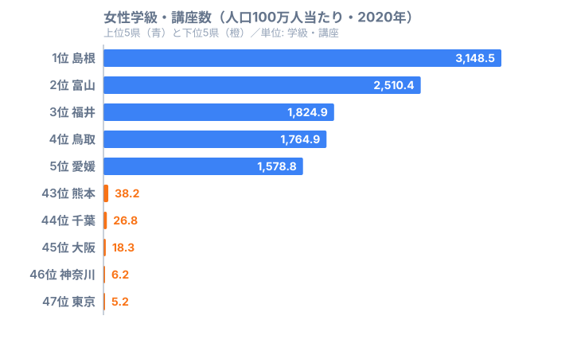

「島根県は東京都の600倍以上」──これは人口密度でも経済規模でもなく、2020年の**女性学級・講座数（人口100万人当たり）**のランキングです。文部科学省「社会教育調査」によると、島根県の3,148.5に対し東京都はわずか5.2。女性学級・講座とは、主に公民館などで開催される女性向けの生涯学習プログラムを指します。なぜ島根や北陸が突出して多く、首都圏が著しく少ないのか、公民館文化と都市部の民間講座代替という2つの仮説から読み解いていきます。

> [!NOTE]
> 「女性学級・講座数（人口100万人当たり）」は、文部科学省「社会教育調査」で計上される公民館・図書館・博物館等が主催する女性向け生涯学習プログラムの件数を人口100万人で割った指標です。民間カルチャースクールや大学公開講座、自治体外郭団体の講座は**対象外**となっています。

## 上位5・下位5 — 山陰・北陸 vs 首都圏

<source-link href="/ranking/female-class-lecture-count-per-million-female">女性学級・講座数ランキングをもっと見る（全47都道府県）</source-link>

上位5県（島根・富山・福井・鳥取・愛媛）は山陰・北陸・四国のいわゆる「地方コンパクト県」が独占しています。島根県の3,148.5は2位富山県（2,510.4）の約1.25倍、3位福井県（1,824.9）の約1.7倍と、頭一つ抜けた水準です。愛媛県（5位・1,578.8）は四国の中心的な都市を抱えながらも高水準で、地域の女性団体・公民館ネットワークが活発な県として知られています。

一方、下位5県（東京・神奈川・大阪・千葉・熊本）には首都圏と大阪が並びます。最下位の[東京都（5.2）](/areas/13000)と上位の[島根県（3,148.5）](/areas/32000)の差は実に**605倍**に達します。熊本県が大都市圏でないにもかかわらず下位5に入っているのは、熊本市という政令指定都市を中心とした都市化が進み、公民館型講座より民間の学習チャネルが浸透していることが一因と考えられます。

これらの上位地域は公民館の設置密度が高く、地域コミュニティが学級・講座運営の担い手として根付いています。とくに北陸三県は持ち家率や三世代同居率の高さでも知られており、地域の女性が日中に集まりやすい生活基盤が講座開催の土壌を形成していると考えられます。

> [!WARNING]
> 本データは社会教育調査が捕捉する公民館等の枠内の数字です。「東京都が最下位=都市部の女性は学んでいない」ではありません。民間カルチャースクール・大学公開講座・オンライン講座などの代替チャネルは計上されていないため、**「公民館型」の生涯学習の少なさ**を示している点に留意が必要です。

## なぜ東京都は最下位なのか — 民間代替仮説

東京都の女性学級・講座数（5.2）は島根県のわずか0.16%です。ただしこれは「都市部の女性が学んでいない」ことを意味しません。

都市部では以下のような代替チャネルが発達しているためです。

- 民間カルチャースクール（朝日カルチャーセンター・NHK文化センター等）
- 大学公開講座・生涯学習センター
- 自治体外郭団体の女性センター
- オンライン講座・動画学習サービス

これらは社会教育調査の対象外であるため、数値に反映されていません。つまり605倍という数値は「公民館主催の女性学級というフォーマットの地理的分布」を示しているものであり、総合的な学習機会そのものの差を表しているとは限りません。

下位5県の顔ぶれを見ると、最下位の東京都（5.2）から神奈川県（6.2）・大阪府（18.3）・千葉県（26.8）と、人口集中度が高い大都市圏が並んでいます。これらの地域は人口100万人当たりに換算する分母が大きいため、公民館講座が一定数開催されていても指標上は小さくなりやすい構造を持っています。加えて、政令指定都市を抱える熊本県（43位・38.2）が大都市圏でないにもかかわらず下位に沈んでいる事実は、「公民館型講座の少なさ」が単なる人口の多寡だけでなく、都市化に伴う学習チャネルの民間移行と結び付いていることを示唆しています。首都圏では1つの講座が広域から受講者を集めやすく、少ない開催数でも需要を吸収できる点も、件数ベースの指標を押し下げる要因と考えられます。

> [!TIP]
> 仮説の検証として、民間カルチャースクール市場規模や大学公開講座受講者数を都道府県別に重ねてみると、合算で見たときの学習機会の都市・地方格差は大幅に縮まる可能性があります。[教育・スポーツカテゴリ](/category/educationsports)では関連する社会教育指標も掲載しています。

## 発見 — 「学びの場の地理的分業」

この605倍という格差が浮かび上がらせているのは、生涯学習の**チャネル選択の地理的分業**です。

**公民館文化の根付き方**を考えると、山陰・北陸が上位を独占する背景には3つの構造的要因が重なっています。第一に、これらの地域は人口密度が低い「コンパクト市町村」が多く、公民館が地域の唯一の集会・学習拠点として機能してきました。第二に、島根・鳥取・富山・福井は全国でも持ち家率と三世代同居率が高い県として知られており、地域に根を下ろした女性が公民館活動の担い手になりやすい生活基盤があります。第三に、これらの県は市町村あたりの公民館設置数が多く、物理的な「学びの場」へのアクセスが整備されています。

一方で都市部の低水準については、以下の3つの仮説が立てられます。
- **[仮説A]** 山陰・北陸の上位は公民館の設置密度と地域コミュニティの担い手層の厚さが主因。市町村あたりの公民館数や女性団体の組織率との相関で検証できます
- **[仮説B]** 都市部の最下位は需要不足ではなくチャネル代替。民間サービスを含めた合算では、学習機会の都市・地方格差は大幅に縮まる可能性があります
- **[仮説C]** 男女別データを比較すると、男性学級・講座数とは異なる地理パターンが現れる可能性があります。女性に特化したテーマ（家庭教育・健康・地域活動）と公民館機能の親和性が高い県ほど数値が伸びる構造的仮説です

## まとめ

- 女性学級・講座数（人口100万人当たり）は島根3,148.5 vs 東京5.2で**605倍**の都道府県格差があります
- 上位は山陰・北陸・四国のコンパクト県が独占しており、地方公民館文化の厚みを示しています
- 最下位は首都圏と大阪府ですが、これは学習意欲の差ではなく民間代替チャネルへの移行で説明できます
- 公民館発の生涯学習というフォーマットが地方で残り都市で薄れた「学びの場の地理的分業」が浮かび上がります

## データ出典

- 文部科学省「社会教育調査」（2020年）
- e-Stat（政府統計の総合窓口）より取得
- 指標: 女性学級・講座数（人口100万人当たり、単位: 学級・講座）
